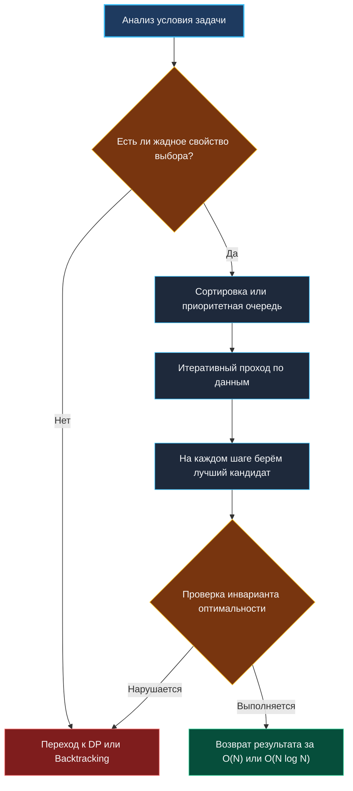

> *«Жадность хороша лишь тогда, когда локальная выгода математически гарантирует глобальное процветание».*  
> — Эдсгер Дейкстра

## Философия жадных алгоритмов: локальный оптимум, глобальная гарантия

Жадные алгоритмы (Greedy Algorithms) строятся на интуитивно простом принципе: на каждом шаге выбирать локально оптимальное решение в надежде, что это приведёт к глобально оптимальному результату. В отличие от динамического программирования или backtracking, жадность не откатывает решения и не исследует дерево состояний. Она принимает выбор бесповоротно.

Именно поэтому жадные решения работают за $O(N)$ или $O(N \log N)$, потребляют $O(1)$ дополнительной памяти и идеально ложатся на критические пути высоконагруженных бэкенд-систем: планировщики задач, распределение ресурсов, маршрутизация пакетов и алгоритмы сжатия данных.



На собеседованиях жадные алгоритмы проверяют не умение писать циклы, а способность формально доказывать корректность, отличать истинную жадность от эвристики и предвидеть компромиссы между скоростью, памятью и детерминированностью.

---

## Математический фундамент: как доказать оптимальность

Жадный алгоритм математически корректен только при наличии двух свойств:
1. **Жадное свойство выбора (Greedy Choice Property):** локально оптимальный выбор можно безопасно включить в глобальное решение без риска потери оптимальности.
2. **Оптимальная подструктура (Optimal Substructure):** оптимальное решение задачи содержит внутри себя оптимальные решения подзадач.

Доказательство корректности на интервью обычно строится на двух методах:

### 1. Greedy Stays Ahead (Жадный всегда впереди)
По индукции показываем, что после $k$ шагов жадное решение всегда «не хуже» любого альтернативного. Например, в задаче выбора непересекающихся интервалов: если жадный алгоритм выбрал интервал с самым ранним окончанием, он оставляет максимальное «свободное время» для последующих выборов. Любой другой выбор сужает пространство вариантов раньше, следовательно, жадный подход не может проиграть.

### 2. Exchange Argument (Аргумент обмена)
Берём произвольное оптимальное решение и шаг за шагом заменяем его элементы жадными выборами. Если после каждой замены целевая функция не ухудшается, а количество жадных шагов растёт, значит, жадное решение также является оптимальным. Этот метод универсален для задач на расписания, кодирование Хаффмана и минимальные остовные деревья.

> [!NOTE]
> **Под капотом: Академическая строгость на интервью**  
> На алгоритмической секции фраза «это интуитивно очевидно» часто ведет к отказу. Интервьюер ожидает формальную структуру: *«Пусть $S^*$ — гипотетическое оптимальное решение, а $S_g$ — жадное. Докажем по индукции методом Exchange Argument...»*. В продакшене доказательство трансформируется в гарантию соблюдения SLA: жадность без доказательства — это скрытый баг под нагрузкой.

---

## Механическая симпатия: CPU, кэш и сортировка в рантайме Go

Подавляющее большинство жадных алгоритмов начинается с сортировки данных по ключевому признаку (время завершения, дедлайн, удельная стоимость). Это доминирующая стадия сложности $O(N \log N)$.

```go
package main

import (
	"cmp"
	"fmt"
	"slices"
)

type Interval struct {
	Start int
	End   int
}

// ScheduleIntervals жадно выбирает максимальное число непересекающихся интервалов.
func ScheduleIntervals(intervals []Interval) ([]Interval, error) {
	if len(intervals) == 0 {
		return nil, fmt.Errorf("empty input")
	}

	// Сортировка по времени окончания: O(N log N)
	slices.SortFunc(intervals, func(a, b Interval) int {
		return cmp.Compare(a.End, b.End)
	})

	result := make([]Interval, 0, len(intervals)/2)
	result = append(result, intervals[0])
	lastEnd := intervals[0].End

	for i := 1; i < len(intervals); i++ {
		if intervals[i].Start >= lastEnd {
			result = append(result, intervals[i])
			lastEnd = intervals[i].End
		}
	}

	return result, nil
}
```

> [!NOTE]
> **Внутреннее устройство `slices.SortFunc` в Go:**  
> Рантайм Go использует алгоритм **PDQSort** (Pattern-Defeating Quicksort). Он комбинирует быстрый Quicksort, защиту HeapSort от худшего случая $O(N^2)$ и InsertionSort для малых фрагментов ($\le 24$ элементов). Все операции происходят in-place, что минимизирует аллокации. В Go 1.22+ дженерик-компараторы инлайнятся компилятором, устраняя dynamic dispatch.

### Кэш-локальность и предсказание ветвлений
Цикл жадного выбора `for i := 1; i < len(intervals); i++` читает срез `intervals` последовательно. Это идеальный сценарий для аппаратного блока Hardware Prefetcher: процессор заблаговременно подгружает следующие 64 байта в L1 Data Cache. Ветвление `if intervals[i].Start >= lastEnd` обладает высокой предсказуемостью на отсортированных данных, сводя сбросы конвейера CPU (Pipeline Flushes) к минимуму.

---

## Когда жадность терпит крах: границы применимости

Жадные алгоритмы работают только тогда, когда локальный выбор на шаге $i$ не ограничивает допустимость шага $i+1$. Как только появляется зависимость между состояниями или дискретный неделимый ресурс, жадность ломается.

| Задача | Жадность применима? | Причина | Альтернатива |
|---|---|---|---|
| **Размен монет (USD: 1, 5, 10, 25)** | Да | Каноническая система номиналов (делимость) | Жадный алгоритм |
| **Размен монет (1, 3, 4) для суммы 6** | Нет | Жадный: $4 + 1 + 1$ ($3$ монеты). Оптимум: $3 + 3$ ($2$ монеты) | Динамическое программирование |
| **Рюкзак 0-1 (дискретные неделимые предметы)** | Нет | Жадный выбор по удельной стоимости оставляет пустоты | Динамическое программирование |
| **Непрерывный рюкзак (можно брать дробные доли)** | Да | Дробное заполнение устраняет дискретность | Жадный алгоритм |

---

## Резюме: Чек-лист для проектирования жадных решений

1. **Доказывайте корректность:** используйте Greedy Stays Ahead или Exchange Argument.
2. **Контролируйте сортировку:** используйте `slices.SortFunc` с типизированными компараторами (`cmp.Compare`).
3. **Минимизируйте аллокации:** сортируйте in-place, предвыделяйте срез результата `make([]T, 0, cap)`.
4. **Проверяйте зависимости:** если локальный выбор уменьшает допустимость последующих шагов, переходите к динамическому программированию.

Далее мы применим жадные принципы к интервальным задачам: [[2. Интервальные задачи]].