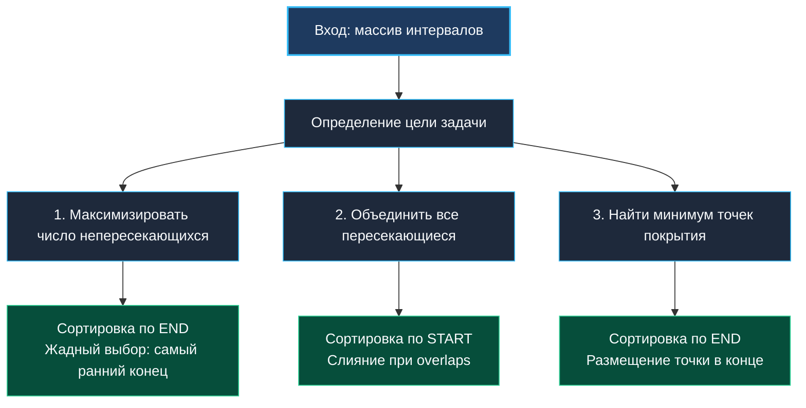

> *«Время линейно, и тот, кто раньше освобождает ресурс, оставляет больше свободы для будущего».*  
> — Брайан Керниган

## Введение: почему интервалы — полигон для жадных алгоритмов

Задачи на интервалы (Interval Problems) моделируют ключевые бэкенд-сценарии: планирование cron-задач, управление блокировками в СУБД, rate-limiting по скользящим окнам, агрегацию метрик и распределение слотов CPU в кластерах.  
Каждый объект задается парой `(start, end)`, а коллизия определяется фактом пересечения отрезков.

Жадные алгоритмы здесь доминируют благодаря **доказуемой жадной структуре**: выбор правильного критерия сортировки позволяет принимать локальные решения, которые гарантированно ведут к глобальному оптимуму за $O(N \log N)$ времени и $O(1)$ дополнительной памяти.



---

## 1. Паттерн: Максимизация непересекающихся интервалов

Требуется выбрать максимальное подмножество попарно непересекающихся интервалов.

**Жадная стратегия:** сортируем интервалы по **времени окончания (`End`)**. Выбираем интервал, который заканчивается раньше всех: он оставляет максимальное окно возможностей для последующих задач.

```go
package intervals

import (
	"cmp"
	"slices"
)

type Interval struct {
	Start int
	End   int
}

// MaxNonOverlapping возвращает максимальное количество непересекающихся интервалов.
func MaxNonOverlapping(intervals []Interval) int {
	if len(intervals) <= 1 {
		return len(intervals)
	}

	// Сортировка по времени окончания
	slices.SortFunc(intervals, func(a, b Interval) int {
		return cmp.Compare(a.End, b.End)
	})

	count := 1
	currentEnd := intervals[0].End

	for i := 1; i < len(intervals); i++ {
		if intervals[i].Start >= currentEnd {
			count++
			currentEnd = intervals[i].End
		}
	}

	return count
}
```

---

## 2. Паттерн: Слияние пересекающихся интервалов (Merge Intervals)

Требуется объединить все пересекающиеся или соприкасающиеся отрезки в единые непрерывные блоки.

**Жадная стратегия:** сортируем интервалы по **времени начала (`Start`)**. Это гарантирует, что любой потенциально пересекающийся отрезок будет рассмотрен строго после того, с которым он может слиться.

```go
package intervals

import (
	"cmp"
	"slices"
)

// Merge объединяет пересекающиеся интервалы.
func Merge(intervals []Interval) []Interval {
	if len(intervals) <= 1 {
		return intervals
	}

	// Сортировка по времени начала (Start)
	slices.SortFunc(intervals, func(a, b Interval) int {
		return cmp.Compare(a.Start, b.Start)
	})

	merged := make([]Interval, 0, len(intervals))
	current := intervals[0]

	for i := 1; i < len(intervals); i++ {
		if intervals[i].Start <= current.End {
			// Расширяем правую границу
			if intervals[i].End > current.End {
				current.End = intervals[i].End
			}
		} else {
			merged = append(merged, current)
			current = intervals[i]
		}
	}

	merged = append(merged, current)
	return merged
}
```

---

## 3. Паттерн: Минимальное число точек покрытия (Arrows to Balloons)

Требуется найти минимальное число точек, чтобы пробить все отрезки.

**Жадная стратегия:** сортируем по `End`. Стреляем в крайнюю правую точку первого доступного интервала. Эта стрела автоматически покроет максимум интервалов, начинающихся до этой точки.

```go
package intervals

import (
	"cmp"
	"slices"
)

func MinArrows(points []Interval) int {
	if len(points) <= 1 {
		return len(points)
	}

	slices.SortFunc(points, func(a, b Interval) int {
		return cmp.Compare(a.End, b.End)
	})

	arrows := 1
	point := points[0].End

	for i := 1; i < len(points); i++ {
		if points[i].Start > point {
			arrows++
			point = points[i].End
		}
	}

	return arrows
}
```

---

## Mechanical Sympathy: Структуры значений против указателей

Структура `type Interval struct { Start, End int }` занимает ровно $16$ байт.  
Одна кэш-линия процессора ($64$ байта) вмещает ровно $4$ таких интервала.  
При линейном обходе среза `[]Interval` аппаратный префетчер CPU подгружает данные целыми линиями, обеспечивая нулевые накладные расходы на чтение.

Если хранить срез указателей `[]*Interval`:
- Каждый указатель занимает $8$ байт.
- Сами структуры разбросаны по разным участкам кучи.
- Каждое обращение к полям `Start/End` превращается в Cache Miss.
- Сборщик мусора Go вынужден сканировать миллионы указателей в фазе Mark.

> [!TIP]
> **Золотое правило работы со структурами в Go:**  
> Всегда передавайте и храните легковесные интервальные структуры **по значению (`[]Interval`)**, а не по указателю (`[]*Interval`).

---

## Резюме: Правила выбора критерия сортировки

1. **Максимизация количества интервалов:** сортировка строго по **`End`**.
2. **Слияние пересекающихся интервалов:** сортировка строго по **`Start`**.
3. **Минимизация точек покрытия:** сортировка строго по **`End`**.
4. **Сравнение границ:** используйте `cmp.Compare` вместо вычитания `a.End - b.End` для защиты от переполнения целочисленных типов.

В следующей статье мы разберем задачу о прыжках по массиву: [[3. Jump Game]].