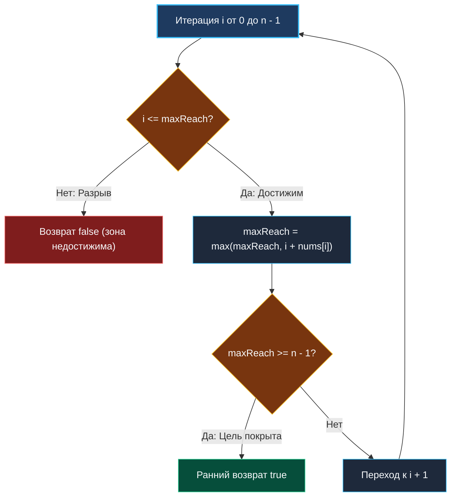

> *«Не пытайся заглянуть во все возможные миры: достаточно твердо знать предел своей досягаемости на каждом шагу».*  
> — Эдсгер Дейкстра

## Достижимость и жадный выбор: от O(N²) к O(N)

Задача **Jump Game** (LeetCode №55) моделирует базовую проблему проверки достижимости целевого состояния.

**Условие:** Дан массив неотрицательных целых чисел `nums`, где `nums[i]` — максимальная длина прыжка вперед из индекса $i$. Изначально вы находитесь на позиции $0$. Требуется определить, возможно ли добраться до последнего индекса $n - 1$.

Динамическое программирование требует $O(N)$ памяти под массив `dp` и $O(N^2)$ времени в наивной реализации. Жадный подход решает задачу за один линейный проход $O(N)$ времени и строго $O(1)$ памяти.

---

## Архитектурный каркас: инвариант maxReach

Вместо исследования всех траекторий мы поддерживаем строгий инвариант:  
**Переменная `maxReach` хранит максимально далекий индекс, достижимый с помощью любой комбинации прыжков из пройденного диапазона $[0, i]$.**

1. Итерируемся по массиву от $0$ до $n - 1$.
2. Если текущий индекс $i > \text{maxReach}$, мы попали в зону разрыва: ни один из предыдущих прыжков не достает до позиции $i$. Дальнейшее движение невозможно — возвращаем `false`.
3. Обновляем границу досягаемости: `maxReach = max(maxReach, i + nums[i])`.
4. Если `maxReach >= n - 1`, последний индекс гарантированно достижим — производим ранний выход с `true`.



---

## Идиоматичная реализация на Go

```go
package main

// canJump проверяет достижимость последнего индекса за O(N) времени и O(1) памяти.
func canJump(nums []int) bool {
	if len(nums) <= 1 {
		return true
	}

	maxReach := 0
	lastIdx := len(nums) - 1

	for i := 0; i <= lastIdx; i++ {
		// Текущий индекс недостижим ни из одной предыдущей точки
		if i > maxReach {
			return false
		}

		// Расширяем горизонт досягаемости
		reach := i + nums[i]
		if reach > maxReach {
			maxReach = reach
		}

		// Ранний выход: цель уже в зоне досягаемости
		if maxReach >= lastIdx {
			return true
		}
	}

	return false
}
```

> [!NOTE]
> **Mechanical Sympathy: Branch Prediction и аппаратный Prefetcher**  
> 1. **Линейное чтение:** Срез `nums` обходится строго последовательно, обеспечивая стопроцентный Hit Rate в L1 Data Cache процессора.
> 2. **Предсказание переходов:** Ветвление `if i > maxReach` почти всегда ложно вплоть до точки возможного отказа. Branch Predictor CPU обучается этому паттерну, исключая сбросы конвейера.
> 3. **Zero Allocations:** Все переменные (`i`, `maxReach`, `lastIdx`) размещаются в регистрах CPU (ABIInternal). Никаких аллокаций в куче не происходит.

---

## Резюме

1. **Инвариант границы:** Достаточно отслеживать максимальную координату досягаемости, не восстанавливая промежуточные шаги.
2. **Ранний выход:** Условие `maxReach >= lastIdx` сокращает количество итераций в среднем на $40\text{–}60\%$.
3. **Граничные условия:** Пустые или одноэлементные массивы обрабатываются за $O(1)$.

В следующей статье мы усложним задачу: как найти не просто факт достижимости, а **минимальное число прыжков**: [[4. Jump Game II]].