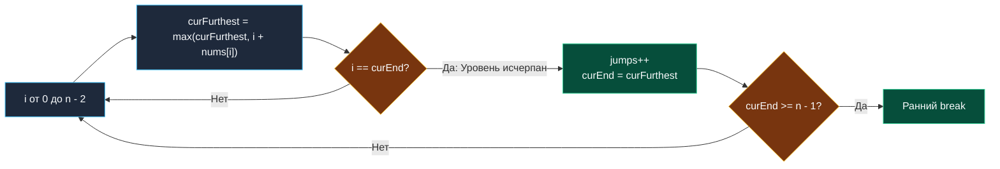

> *«Минимальный путь по уровням графа не требует построения дерева, если его горизонт очерчен строгими границами».*  
> — Дональд Эрвин Кнут

## Минимальное количество прыжков

**LeetCode 45. Jump Game II.** Дан массив неотрицательных целых чисел `nums`, где `nums[i]` — максимальная длина прыжка из позиции $i$. Требуется найти **минимальное количество прыжков**, необходимое для перемещения из индекса $0$ в последний индекс $n - 1$. Гарантируется, что достичь конца массива возможно.

Задача развивает идеи [[3. Jump Game]]. Если в первой части проверялся лишь факт достижимости, то здесь требуется минимизировать целевую функцию. Хотя на первый взгляд задача напоминает классическое динамическое программирование ($O(N^2)$), монотонность дальности прыжка позволяет решить её жадным методом за **$O(N)$ времени и $O(1)$ памяти**.

---

## Архитектурный инсайт: Неявный BFS без очередей

Процесс поиска минимального числа прыжков эквивалентен обходу графа в ширину (BFS по уровням):
- Уровень $0$: начальная точка $\{0\}$ (требуется $0$ прыжков).
- Уровень $1$: все индексы, достижимые за $1$ прыжок из $\{0\}$.
- Уровень $k$: все новые индексы, достижимые за $k$ прыжков.

В классическом BFS используется очередь FIFO, требующая $O(N)$ памяти под аллокации.  
Но поскольку индексы каждого уровня образуют **непрерывный диапазон**, очередь можно заменить двумя скалярными переменными:
1. `curEnd`: правая граница текущего уровня BFS (максимальный индекс, достижимый за текущее число `jumps`).
2. `curFurthest`: максимальный горизонт, достижимый за `jumps + 1` прыжков из любой точки внутри текущего уровня.

Когда итератор $i$ доходит до `curEnd`, текущий уровень исчерпан: мы обязаны совершить очередной прыжок (`jumps++`) и перенести границу уровня: `curEnd = curFurthest`.



---

## Идиоматичная реализация на Go

```go
package main

// jump находит минимальное количество прыжков до конца массива за O(N) времени и O(1) памяти.
func jump(nums []int) int {
	n := len(nums)
	if n <= 1 {
		return 0
	}

	jumps := 0
	curEnd := 0
	curFurthest := 0

	// Итерируемся до n - 2, так как на последний индекс прыгать уже не нужно
	for i := 0; i < n-1; i++ {
		reach := i + nums[i]
		if reach > curFurthest {
			curFurthest = reach
		}

		// Достигли границы текущего уровня BFS — совершаем прыжок
		if i == curEnd {
			jumps++
			curEnd = curFurthest

			// Ранний выход: цель уже в зоне досягаемости
			if curEnd >= n-1 {
				break
			}
		}
	}

	return jumps
}
```

> [!NOTE]
> **Mechanical Sympathy: Чистая регистровая арифметика**  
> В отличие от очереди BFS (`make([]int, 0)`), этот код оперирует исключительно тремя целочисленными переменными `jumps`, `curEnd`, `curFurthest`.  
> В ABIInternal компилятора Go они полностью размещаются в регистрах `RAX`, `RBX`, `RCX`, обеспечивая нулевое давление на стек и сборщик мусора.

---

## Резюме

1. **Волновой BFS без очереди:** Непрерывность уровней достижимости позволяет отслеживать поколения переходов через скалярные границы `curEnd` и `curFurthest`.
2. **Линейная сложность:** Каждый элемент массива просматривается ровно один раз ($O(N)$), дополнительная память строго $O(1)$.
3. **Граница цикла:** Цикл выполняется строго до $n - 2$, исключая лишний прыжок при нахождении в целевой точке.

Далее мы разберем задачу о кольцевом балансе топлива: [[5. Gas Station]].