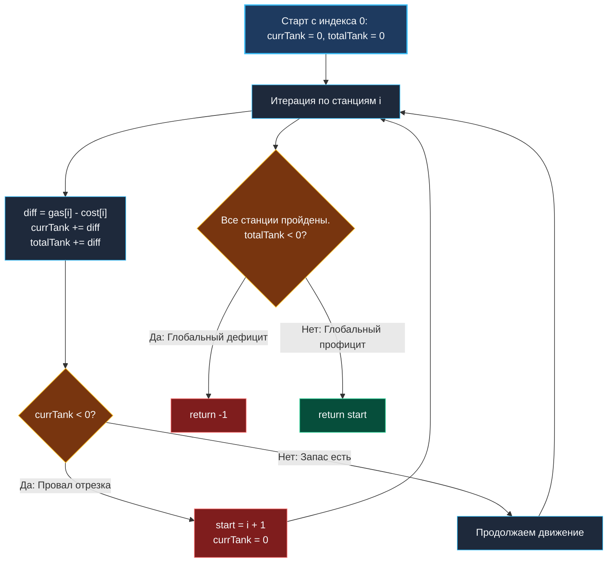

> *«Если сумма всех ресурсов достаточна, кольцо всегда можно замкнуть, начав сразу после самого глубокого провала».*  
> — Брайан Керниган

## Кольцевой маршрут: Задача о заправочных станциях

Задача **Gas Station** (LeetCode №134) — классический представитель кольцевых оптимизационных задач, где интуиция часто подталкивает к симуляции, а математический анализ дает линейный однопроходный алгоритм.

**Условие:** На кольцевой трассе расположено $N$ АЗС. На станции $i$ можно заправить `gas[i]` литров топлива, а переезд до станции $i + 1$ требует `cost[i]` литров.  
Требуется найти индекс начальной станции, стартовав с которой с пустым баком, можно совершить полный круг по часовой стрелке ровно один раз. Если такого маршрута нет, вернуть `-1`. Гарантируется, что решение единственно (если оно существует).

В распределенных системах эта модель описывает балансировку трафика в кольцевых топологиях (Consistent Hashing rings) и выравнивание скорости продюсера и консьюмера в кольцевых буферах (Ring Buffers).

---

## Математический инсайт: Разрыв кольца за один проход

Наивная симуляция со всех стартовых позиций дает $O(N^2)$ времени. Чтобы решить задачу за **$O(N)$ за один проход без модульной арифметики**, докажем две леммы:

1. **Глобальный баланс:** Если общее количество топлива на всех станциях меньше суммарных затрат на переезд ($\sum gas < \sum cost$), завершить полный круг невозможно ни из какой точки. Ответ строго `-1`.
2. **Локальный провал:** Если мы стартовали со станции $S$ с нулевым баком и топливо закончилось на станции $K$ (бак стал $< 0$), то **ни одна станция между $S$ и $K$ не может быть стартовой**.  
   *Доказательство:* На любом отрезке от $S$ до промежуточной станции $P < K$ бак был неотрицательным. Значит, к станции $P$ мы прибывали с некоторым запасом $\ge 0$. Если даже с этим запасом мы не смогли перешагнуть станцию $K$, то стартуя из $P$ с нулевым баком, мы гарантированно исчерпаем топливо еще раньше.  
   Следовательно, новым кандидатом на старт может быть только станция $K + 1$.



---

## Идиоматичная реализация на Go

```go
package main

// canCompleteCircuit находит индекс начальной станции за один проход O(N).
func canCompleteCircuit(gas []int, cost []int) int {
	totalTank := 0
	currTank := 0
	start := 0

	for i := 0; i < len(gas); i++ {
		diff := gas[i] - cost[i]
		totalTank += diff
		currTank += diff

		// Если текущий бак ушел в минус, отрезок [start, i] не подходит
		if currTank < 0 {
			start = i + 1
			currTank = 0
		}
	}

	// Если суммарный баланс по всей трассе отрицательный — решения нет
	if totalTank < 0 {
		return -1
	}

	return start
}
```

> [!NOTE]
> **Mechanical Sympathy: Отказ от инструкции Modulo (`%`)**  
> В наивных решениях разработчики обращаются к станциям через `(i + 1) % n`. Инструкция целочисленного деления `IDIV` на архитектурах x86-64 занимает до $30\text{–}40$ тактов CPU.  
> Жадный алгоритм выполняет строго последовательный линейный проход без ветвлений по остатку от деления: все операции сводятся к регистрам и инструкциям сложения `ADD`/`SUB` за $1$ такт.

---

## Резюме

1. **Глобальный фильтр:** `totalTank >= 0` — строгое математическое условие существования маршрута.
2. **Жадный сдвиг:** Локальный дефицит исключает весь пройденный отрезок, сдвигая курсор на $i + 1$.
3. **Отсутствие второго круга:** Если общий баланс положителен, накопленный профицит второй половины гарантированно покроет дефицит первой.

В следующей статье мы перейдем к фундаментальной задаче планирования задач во времени: [[6. Interval Scheduling]].