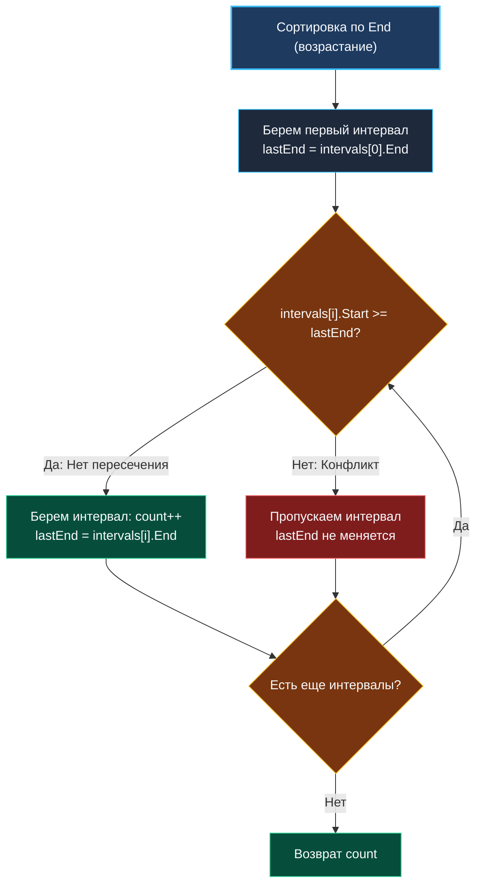

> *«Чтобы успеть сделать как можно больше дел, беритесь за то, что освободит вас раньше всего».*  
> — Чарльз Энтони Ричард Хоар

## Планирование интервалов: Максимизация пропускной способности

Задача **Interval Scheduling** (планирование непересекающихся интервалов) — канонический фундамент жадных алгоритмов, лежащий в основе LeetCode №435 и №452.

**Формулировка:** Задан набор интервалов $[start, end]$. Требуется выбрать **максимальное количество взаимно непересекающихся интервалов**.

В бэкенде эта математическая модель управляет распределением CPU-квантов в планировщиках, шардированием временных рядов (Time-series data) в TSDB (Prometheus, InfluxDB), блокировками коммит-окон в базах данных и алгоритмами очистки устаревших сессий (TTL eviction).

---

## Ключевой инсайт: Сортировка по времени окончания

Частая ошибка начинающих разработчиков — сортировка интервалов по времени начала (`Start`).  
*Контрпример:* интервал $[0, 100]$ начинается раньше всех. Если выбрать его, он заблокирует все остальные встречи на целый день. При этом два коротких интервала $[1, 2]$ и $[3, 4]$ позволяют провести вдвое больше встреч.

**Жадный инвариант:**  
Мы обязаны сортировать интервалы по **времени окончания (`End`)**. Освобождая ресурс как можно раньше, мы оставляем максимально возможное окно для всех последующих интервалов (принцип *Greedy Stays Ahead*).



---

## Идиоматичная реализация на Go

```go
package main

import (
	"cmp"
	"slices"
)

type Interval struct {
	Start int
	End   int
}

// maxNonOverlappingIntervals возвращает максимальное число непересекающихся интервалов.
func maxNonOverlappingIntervals(intervals []Interval) int {
	if len(intervals) <= 1 {
		return len(intervals)
	}

	// Сортируем по правому краю (End) через дженерик cmp.Compare
	slices.SortFunc(intervals, func(a, b Interval) int {
		return cmp.Compare(a.End, b.End)
	})

	count := 1
	lastEnd := intervals[0].End

	for i := 1; i < len(intervals); i++ {
		if intervals[i].Start >= lastEnd {
			count++
			lastEnd = intervals[i].End
		}
	}

	return count
}
```

> [!NOTE]
> **Mechanical Sympathy: Структуры значений против среза срезов**  
> Срез структур `[]Interval` занимает один непрерывный блок памяти. На $1000$ интервалов выделяется всего $16\text{ КБ}$, что целиком помещается в кэш L1d современного процессора ($32\text{–}64\text{ КБ}$).  
> Представление через `[][]int` (слайс слайсов) порождает тысячи разрозненных аллокаций в куче и деградирует производительность в разы из-за промахов кэша.

---

## Резюме

1. **Критерий жадности:** Сортировка по `End` — единственно верный критерий максимизации количества непересекающихся интервалов.
2. **Безопасность типов:** Использование `cmp.Compare` защищает от целочисленного переполнения при вычитании больших временных меток.
3. **Локальность данных:** Передавайте интервалы структурами по значению для ускорения сортировки и обхода.

В следующей статье мы рассмотрим инверсию этой задачи — минимизацию удаляемых отрезков: [[7. Non-overlapping Intervals]].