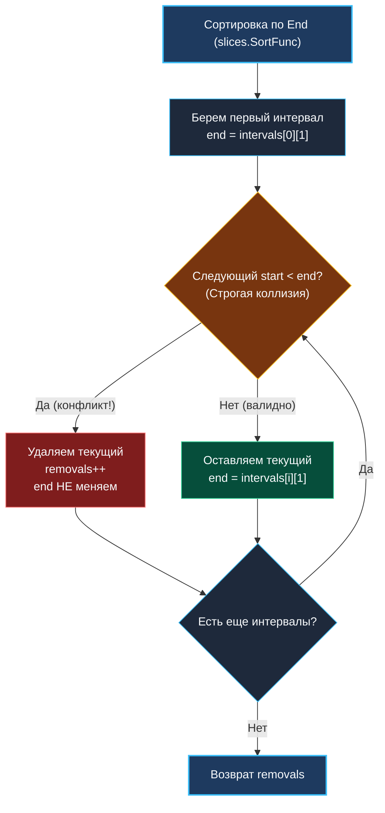

> *«Удаление лишнего — самое продуктивное действие, которое только может совершить программист».*  
> — Брайан Керниган

Задача **Non-overlapping Intervals** (LeetCode 435) — это прямое продолжение и логическая инверсия [[6. Interval Scheduling]]. В задаче о планировании интервалов мы искали *максимальное подмножество*, которое можно выполнить без накладок. Здесь же постановка развернута зеркально: какое *минимальное количество* интервалов нужно выбросить из расписания, чтобы устранить все конфликты?

С точки зрения теории графов и комбинаторики это две стороны одной медали. Но для бэкенд-инженера смена оптики кардинальна: от пассивного составления расписания мы переходим к активному **разрешению конфликтов (Conflict Resolution)** в высоконагруженных распределенных системах.

---

## 1. Постановка задачи и системная модель

**Условие:**  
Дан массив интервалов `intervals`, где `intervals[i] = [start_i, end_i]`. Верните минимальное число интервалов, удаление которых сделает оставшиеся непересекающимися.  
*Примечание:* интервалы, соприкасающиеся в одной точке (например, `[1, 2]` и `[2, 3]`), **не считаются** пересекающимися.

```
Вход:  intervals = [[1, 2], [2, 3], [3, 4], [1, 3]]
Выход: 1
Пояснение: удалив [1, 3], мы получаем идеальную цепочку [1, 2] -> [2, 3] -> [3, 4].
```

В распределенных системах это точная модель конкурентного разрешения коллизий:
1. **Календарное планирование:** если два пользователя забронировали переговорку или слот курьера с перекрытием, отмена минимального числа броней спасает бизнес-метрики.
2. **OCC (Optimistic Concurrency Control) в СУБД:** при фиксации транзакций с перекрывающимися диапазонами блокировок (Range Locks) движок прерывает (откатывает) минимальное число транзакций, чтобы остальные завершились успешно.
3. **CRDT и совместное редактирование:** разрешение конфликтов версий документов при одновременном редактировании.

---

## 2. Математическая инверсия: Всего − Максимум = Минимум удалений

Интуитивный порыв новичка — искать интервалы, которые «больше всего пересекаются с другими», и удалять их по одному. Но подсчет пересечений для каждого отрезка требует $O(N^2)$ времени и быстро запутывается в частных случаях.

Senior-инженер мгновенно применяет математическую инверсию:

$$\text{Min Removals} = N - \text{Max Non-Overlapping Intervals}$$

Где $N$ — общее количество интервалов.

Чтобы минимизировать число удалений, достаточно **максимизировать число совместимых интервалов**, которые мы оставим! А это в точности классический жадный алгоритм выбора заявок (Interval Scheduling Greedy):
1. Сортируем интервалы по времени окончания (`end`).
2. Первым берем интервал, завершающийся раньше всех — он оставляет максимальный временной ресурс для будущих событий.
3. Проходим слева направо: если следующий отрезок не пересекается с предыдущим оставленным — берем его; если пересекается — объявляем его кандидатом на удаление.

---

## 3. Алгоритм и визуализация



---

## 4. Реализация на Go 1.22+

Нам даже не нужно вычитать результат из $N$. Мы можем считать удаления прямо на лету: если текущий интервал начинается строго раньше, чем закончился последний сохраненный (`intervals[i][0] < end`), мы инкрементируем `removals` и **не сдвигаем** `end`. Почему? Потому что из двух конфликтующих отрезков мы жадно сохраняем тот, чей `end` меньше!

```go
package intervals

import (
	"cmp"
	"slices"
)

// EraseOverlapIntervals возвращает минимальное число интервалов для удаления.
// Сложность по времени: O(N log N) из-за сортировки.
// Дополнительная память: O(1) при сортировке in-place.
func EraseOverlapIntervals(intervals [][]int) int {
	if len(intervals) <= 1 {
		return 0
	}

	// Жадный выбор требует сортировки по правой границе (End).
	// В Go 1.22+ slices.SortFunc инлайнится компилятором без накладных расходов.
	slices.SortFunc(intervals, func(a, b []int) int {
		return cmp.Compare(a[1], b[1])
	})

	removals := 0
	// end отслеживает правую границу последнего принятого интервала
	end := intervals[0][1]

	for i := 1; i < len(intervals); i++ {
		if intervals[i][0] < end {
			// Обнаружено пересечение!
			// Жадный закон: текущий интервал заканчивается НЕ раньше, чем 'end'
			// (так как массив отсортирован по b[1]). Значит, чтобы минимизировать
			// будущие конфликты, мы виртуально "удаляем" именно текущий интервал.
			// Значение 'end' оставляем прежним.
			removals++
		} else {
			// Конфликта нет: интервал начинается в момент завершения предыдущего или позже.
			// Продвигаем границу вправо.
			end = intervals[i][1]
		}
	}

	return removals
}
```

> [!WARNING] Ловушка на собеседовании: строгое или нестрогое неравенство?
> Обратите внимание на условие коллизии: `intervals[i][0] < end`.  
> Если `[1, 2]` и `[2, 3]` соприкасаются, то `start == end`. По условию задачи касание **не является** пересечением!  
> Если поставить `<=`, алгоритм сочтет касающиеся отрезки конфликтом и насчитает лишние удаления. Всегда уточняйте у интервьюера граничные условия замкнутости интервалов.

---

## 5. Mechanical Sympathy: Виртуальное удаление vs Реальное копирование

Обратите внимание на строку `removals++` без физической модификации слайса.

В наивных реализациях часто можно встретить:
```go
// АНТИПАТТЕРН: Физическое удаление элемента из слайса в цикле
intervals = append(intervals[:i], intervals[i+1:]...)
```

Почему для Senior-инженера это недопустимо?
1. **Падение сложности до $O(N^2)$:** функция `append` при вырезании середины слайса вынуждена сдвигать в памяти все последующие $N - i$ элементов через `memmove`. Для $N = 10^5$ это миллиарды лишних операций копирования памяти.
2. **Давление на кэш и конвейер:** частые модификации базового массива сбрасывают кэш L1/L2 процессора и ломают аппаратный prefetcher.
3. **Виртуальное состояние (State Machine):** наш код сохраняет неизменным входной массив и ведет состояние единственной переменной `end` в регистре CPU (благодаря ABIInternal Go). Это zero-allocation паттерн.

### Плоская память vs Слайс слайсов (`[][]int`)

На LeetCode интервалы задаются как `[][]int`. Как мы разбирали в [[6. Interval Scheduling]], в реальном highload-сервисе это порождает Pointer Chasing: каждый элемент — отдельный 24-байтный заголовок слайса, ссылающийся на фрагмент памяти в куче.

В продакшене интервалы всегда моделируются плоской структурой:

```go
type Interval struct {
	Start int
	End   int
}
```

Размер `Interval` — ровно 16 байт на 64-битной архитектуре. В одну 64-байтную строку кэша L1 процессора помещается ровно **4 интервала**. Последовательный проход по слайсу `[]Interval` читается процессором на предельной скорости шины памяти благодаря префетчеру L1/L2.

---

## 6. Вопросы для собеседования

> [!INTERVIEW] Вопросы сеньорского уровня
> 
> **Вопрос 1:** *Можно ли решить эту задачу сортировкой по левому краю (`start`)?*  
> **Ответ:** Да, но логика усложняется. Если отсортировать по `start`, то при конфликте (`intervals[i].Start < end`) мы должны жадно сохранить тот отрезок, который заканчивается раньше: `end = min(end, intervals[i].End)`. При сортировке по правому краю (`end`) это свойство выполняется автоматически благодаря упорядоченности, поэтому код получается компактнее и не требует ветвления с `min()`.
> 
> **Вопрос 2:** *Как связаны задачи Non-overlapping Intervals и раскраска графа интервалов (Interval Coloring / Meeting Rooms II)?*  
> **Ответ:** В Non-overlapping Intervals мы ищем максимальный независимый набор вершин (Maximum Independent Set) в графе пересечений интервалов (Interval Graph), удаляя остальные. В задаче о переговорных комнатах (Meeting Rooms II) мы ищем хроматическое число графа (минимальное число непересекающихся цепочек для покрытия всех интервалов). Обе задачи решаются жадно за $O(N \log N)$ благодаря свойствам совершенных графов (Chordal/Perfect Graphs).

---

## Итог

1. **Инверсия задачи:** Минимизация удалений равна максимизации сохраненных отрезков: $\text{Removals} = N - \text{Max Kept}$.
2. **Жадный выбор:** Сортировка по правому краю гарантирует наименьшее усечение доступного временного пространства для последующих событий.
3. **Виртуальное удаление:** Мы двигаем только скалярный курсор `end` в регистре процессора, избегая перемещения памяти и аллокаций.
4. **Стыки интервалов:** Строгое неравенство `<` сохраняет соприкасающиеся интервалы.

В следующей финальной лекции кластера мы рассмотрим красивую геометрическую вариацию жадного покрытия интервалов точками: [[8. Minimum Number of Arrows]].