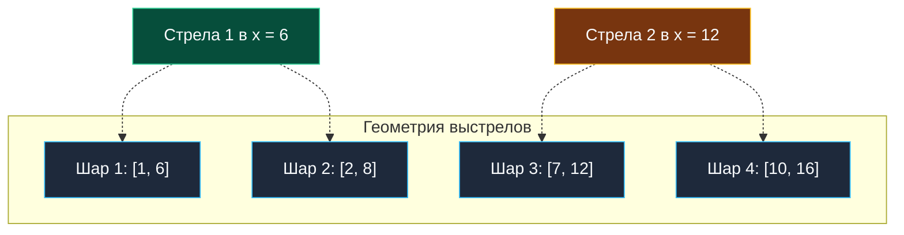
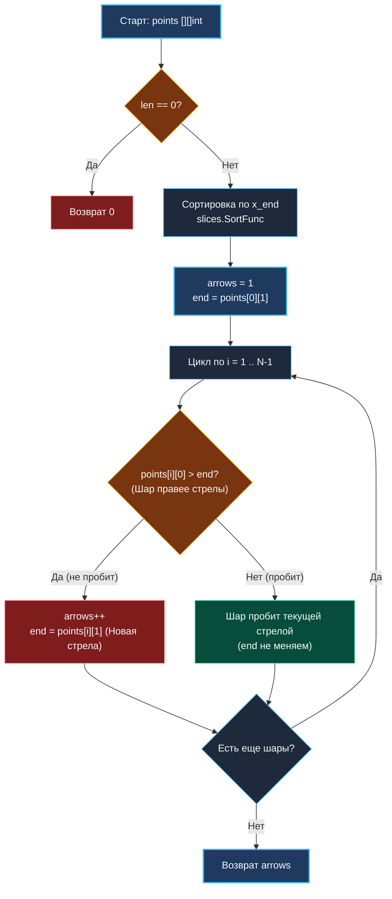

> *«Простота — необходимое условие надежности».*  
> — Эдсгер Дейкстра

Задача **Minimum Number of Arrows to Burst Balloons** (LeetCode 452) — это элегантная геометрическая интерпретация классической задачи о покрытии интервалов точками (Stabbing Intervals Problem / Set Cover on Intervals).

Она логически завершает наш цикл интервальных алгоритмов вслед за [[6. Interval Scheduling]] и [[7. Non-overlapping Intervals]]. Если в задаче о планировании мы выбирали совместимые интервалы, а в Non-overlapping — удаляли конфликты, то здесь мы ищем **минимальное число уколов (выстрелов)**, способных проткнуть все имеющиеся одномерные отрезки.

---

## 1. Постановка задачи и постановка на собеседовании

**Условие:**  
Есть горизонтальные воздушные шары, расположенные на числовой прямой. Каждый шар задан отрезком `points[i] = [x_start, x_end]`.  
Стрела выпускается вертикально вверх из координаты `x`. Она лопает любой шар, отрезок которого включает точку выстрела, то есть $x_{start} \le x \le x_{end}$. Одной стрелой можно пробить бесконечно много шаров, если все они перекрывают координату $x$.

Требуется найти **минимальное количество стрел**, необходимое для уничтожения всех шаров.

```
Вход:  points = [[10, 16], [2, 8], [1, 6], [7, 12]]
Выход: 2
Пояснение: 
- Первая стрела в точке x = 6 пробивает шары [2, 8] и [1, 6].
- Вторая стрела в точке x = 12 (или 11) пробивает [10, 16] и [7, 12].
```



### Вопросы интервьюеру (Senior Checklist):
- *Может ли массив быть пустым?* Да, при $N = 0$ требуется 0 стрел.
- *Может ли шар быть точкой?* Да, если $x_{start} == x_{end}$, выстрел в эту координату пробивает его.
- *Считается ли касание границ пробитием?* Да, если стрела пущена в точку $x = 6$, а шар начинается в $6$ или заканчивается в $6$, он лопается ($x_{start} \le x \le x_{end}$).
- *Возможно ли переполнение `int`?* Координаты могут принимать значения от $-2^{31}$ до $2^{31}-1$. Если вычитать координаты при сортировке (`a - b`), произойдет целочисленное переполнение (`integer overflow`). В Go сравнение должно производиться через безопасный компаратор `cmp.Compare` или операторы `<`, `>`.

---

## 2. Жадный выбор: Почему стрелять нужно строго в правый край?

Представим шар, который заканчивается раньше всех остальных на числовой прямой (назовем его координату конца $E$).  
Чтобы лопнуть этот шар, стрела обязана приземлиться в диапазоне $[x_{start}, E]$.

Куда выгоднее всего направить выстрел?  
Если мы выстрелим левее $E$, мы проткнем этот шар, но упустим шанс задеть другие шары, расположенные дальше вправо.  
Стреляя точно в **крайнюю правую допустимую точку** $x = E$:
1. Мы гарантированно пробиваем текущий шар.
2. Мы максимизируем покрытие всех последующих шаров, которые начались до координаты $E$ включительно!

Это хрестоматийный пример жадного выбора (Greedy Choice Property): локально оптимальное решение (выстрел в правый конец первого непробитого шара) математически гарантирует глобальный минимум стрел.

---

## 3. Алгоритм и визуализация



---

## 4. Реализация на Go 1.22+

```go
package intervals

import (
	"cmp"
	"slices"
)

// FindMinArrowShots находит минимальное число стрел для пробития всех шаров.
// Временная сложность: O(N log N) из-за сортировки.
// Пространственная сложность: O(1) дополнительной памяти (in-place).
func FindMinArrowShots(points [][]int) int {
	if len(points) == 0 {
		return 0
	}

	// Сортируем шары по возрастанию правого края (x_end).
	// В Go 1.21+ slices.SortFunc инлайнится компилятором,
	// а cmp.Compare защищает от переполнения при разности больших int32/int64.
	slices.SortFunc(points, func(a, b []int) int {
		return cmp.Compare(a[1], b[1])
	})

	// Первая стрела целится в правый край первого шара
	arrows := 1
	end := points[0][1]

	for i := 1; i < len(points); i++ {
		// Если левый край текущего шара строго больше координаты стрелы,
		// старая стрела физически не может его пробить.
		if points[i][0] > end {
			arrows++
			// Выпускаем новую стрелу в правый край нового шара
			end = points[i][1]
		}
		// Иначе шар пробивается уже летящей стрелой (points[i][0] <= end)
	}

	return arrows
}
```

> [!WARNING] Ловушка целочисленного переполнения
> В старых версиях Go или на C/C++ разработчики часто писали:  
> `return a[1] - b[1]`  
> Если $a[1] = 2147483647$, а $b[1] = -2147483648$, то разность $a[1] - b[1]$ выходит за пределы знакового 32-битного целого и превращается в отрицательное число!  
> В Go 1.22+ стандартная функция `cmp.Compare(x, y)` сравнивает числа через операторы `<` и `>`, гарантируя математическую корректность без риска переполнения.

---

## 5. Теоретический мост: Теорема Кёнига и дуальность интервалов

Обратите внимание на поразительное сходство между тремя задачами:
- **Interval Scheduling:** найти максимальный размер множества попарно непересекающихся отрезков.
- **Non-overlapping Intervals:** удалить минимальное число отрезков, чтобы оставшиеся не пересекались.
- **Minimum Number of Arrows:** найти минимальное число точек, прокалывающих все отрезки.

В математике и теории графов интервалов (Interval Graphs) существует фундаментальный результат — **теорема о минимальном вершинном покрытии (Dilworth / Kőnig theorem)**:  
Размер максимального независимого множества (максимум непересекающихся отрезков) в графе интервалов **в точности равен** минимальному размеру покрытия отрезков точками (минимальному числу стрел)!

Каждая стрела пробивает свою независимую группу интервалов. Если существует $K$ непересекающихся отрезков, то ни одна стрела не может пробить одновременно два из них, следовательно, стрел требуется **как минимум $K$**. Наш жадный алгоритм находит ровно $K$ точек.

---

## 6. Mechanical Sympathy и Highload-оптимизации

1. **In-place сортировка:** `slices.SortFunc` переставляет элементы входного слайса без выделения дополнительной памяти в куче (`0 allocs/op`).
2. **Кэш-локальность:** После сортировки алгоритм совершает строго последовательный обход массива. Аппаратный префетчер процессора (Hardware Stream Prefetcher) заранее подгружает следующие кэш-линии из L2/L3 в L1D, сводя задержки доступа к данным к нулю.
3. **Регистровая оптимизация ABIInternal:** Переменные `arrows` и `end` полностью размещаются в регистрах процессора (например, `RAX` и `RBX`), цикл не обращается к стеку.

---

## 7. Вопросы для собеседования

> [!INTERVIEW] Вопросы сеньорского уровня
> 
> **Вопрос 1:** *Почему мы проверяем строгое неравенство `points[i][0] > end`, а не `>=`?*  
> **Ответ:** По условию стрела в точке $x$ пробивает любой шар, где $x_{start} \le x \le x_{end}$. Если шар начинается ровно в точке окончания предыдущего ($x_{start} == end$), стрела, выпущенная в $end$, задевает оба шара на своей траектории. Новая стрела не нужна.
> 
> **Вопрос 2:** *Можно ли сортировать по левому концу (`x_start`)?*  
> **Ответ:** Да, но тогда мы должны идти справа налево (с конца массива к началу) и выпускать стрелы в минимальные левые границы. Либо, идя слева направо, сужать интервал попадания стрелы через `end = min(end, points[i][1])`. Сортировка по правому концу концептуально чище и требует меньше кода.

---

## Итог кластера «Жадные алгоритмы»

За этот кластер мы детально изучили ключевые парадигмы жадных алгоритмов:
1. **Интервальное планирование:** Сортировка по времени окончания максимизирует оставшееся окно возможностей.
2. **Кумулятивный баланс:** Решение задачи о заправках ([[5. Gas Station]]) через инвариант замкнутого контура.
3. **Прыжки и охват:** Динамическое расширение горизонта событий в [[3. Jump Game]] и [[4. Jump Game II]].
4. **Разрешение конфликтов:** Использование математической инверсии и теоремы о покрытии точками.

Мы завершили фундаментальный разбор жадных стратегий. Теперь мы переходим к мощнейшему аппарату алгоритмической оптимизации, решающему задачи там, где локальная жадность бессильна, — **Динамическому программированию**. 

В следующей лекции мы заложим теоретический фундамент одномерного ДП: состояния, переходы, мемоизация и сведение памяти к $O(1)$: [[1. Теория. Динамическое программирование 1D]].