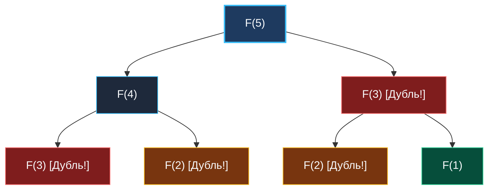
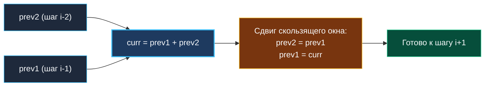

> *«Те, кто не помнит своего прошлого, обречены повторять его».*  
> — Джордж Сантаяна

Динамическое программирование (Dynamic Programming, DP) — один из самых окутанных мифами разделов Computer Science. На собеседованиях оно нередко превращается в пугалку с многомерными матрицами и неочевидными формулами. Но для думающего инженера в DP нет никакой эзотерики: это строгий, прагматичный метод оптимизации вычислений, превращающий нежизнеспособный экспоненциальный перебор в быстрый полиномиальный или линейный алгоритм.

Сам термин «динамическое программирование» ввел в 1950-х годах американский математик Ричард Беллман (Richard Bellman), работая в корпорации RAND. В те годы слово *«programming»* означало не написание машинного кода, а составление оптимальных планов и таблиц (как в «линейном программировании»), а эпитет *«dynamic»* подчеркивал принятие последовательных решений во времени.

Одномерное DP (1D DP) — это фундамент метода. Здесь состояние системы на каждом шаге однозначно описывается одним-единственным параметром (индексом `i`, величиной суммы, шагом процесса), а вычисления разворачиваются вдоль одномерной числовой шкалы.

---

## 1. Два столпа динамического программирования

Любая задача поддается решению через DP тогда и только тогда, когда она обладает двумя фундаментальными свойствами:

1. **Оптимальная подструктура (Optimal Substructure):**  
   Глобально оптимальное решение задачи размера $N$ строится из оптимальных решений её меньших подзадач ($N-1$, $N-2$ и т.д.).  
   *Пример:* кратчайший маршрут из города $A$ в город $C$ через $B$ складывается из кратчайшего маршрута от $A$ до $B$ и кратчайшего от $B$ до $C$.

2. **Перекрывающиеся подзадачи (Overlapping Subproblems):**  
   При наивном рекурсивном дроблении одна и та же меньшая подзадача решается миллионы раз заново.  
   *Пример:* при вычислении $F(5)$ через рекурсию $F(n-1) + F(n-2)$ значение $F(3)$ будет вычислено дважды, $F(2)$ — трижды, а $F(1)$ — пять раз. Экспоненциальный взрыв $O(2^N)$!



DP просто запоминает результат каждого вычисления в таблице (кэше) или строит ответ снизу вверх, гарантируя, что каждая подзадача решается ровно **один раз**.

---

## 2. Top-Down vs Bottom-Up: Инженерный выбор в Go

Существует два принципиальных подхода к реализации DP:

| Подход | Суть | Механизм | Плюсы | Минусы в Go |
|---|---|---|---|---|
| **Top-Down (Мемоизация)** | Сверху вниз: от $N$ к базе | Рекурсия + кэш (хэш-таблица или слайс) | Интуитивно пишется прямо из условия задачи | Оверхед на вызовы, риск роста стека горутины, аллокации `map` |
| **Bottom-Up (Табуляция)** | Снизу вверх: от базы к $N$ | Простой итеративный цикл `for` | Максимальная скорость CPU, zero-alloc, сжатие памяти до $O(1)$ | Требует заранее определить порядок вычисления состояний |

### Стек горутины и риск Stack Overflow

В академических курсах часто пропагандируют Top-Down с мемоизацией. Однако в Go глубокая рекурсия таит в себе системную опасность.

Изначально рантайм Go выделяет горутине микростек размером всего **2 КБ** (в отличие от 1–8 МБ системного потока в OS threads). Когда глубина вызовов растет, рантайм вынужден динамически расширять стек:
1. Выделяется новый кусок памяти вдвое большего размера.
2. Все стек-фреймы копируются на новое место (`runtime.copystack`).
3. Все указатели на переменные стека корректируются.

При $N = 10^5$ рекурсивный Top-Down не только потратит десятки миллисекунд на постоянное перевыделение и копирование памяти стека, но при достижении системного лимита `maxstacksize` (по умолчанию 1 ГБ на 64-битных системах, но на микросервисах лимит может быть сильно урезан) приведет к аварийной панике: `runtime: goroutine stack exceeds limit`.

**Вывод:** Идиоматичный Go-код для 1D DP всегда пишется в стиле **Bottom-Up**.

---

## 3. Анатомия 1D DP: Машина состояний в памяти

В Bottom-Up DP мы начинаем с базового случая и заполняем слайс:
`dp := make([]int, n+1)`

Элемент `dp[i]` представляет собой оптимальный ответ для префикса размера `i`.  
Переход состояний (Recurrence Relation) связывает текущее состояние с предыдущими:
$$dp[i] = f(dp[i-1], dp[i-2], \dots)$$

### Mechanical Sympathy: Линейная память и префетчер CPU

Когда вы создаете плоский срез `make([]int, n+1)` и читаете его последовательно в цикле:
1. Элементы лежат в строго непрерывном диапазоне виртуальной памяти.
2. Процессорный аппаратный префетчер (Hardware Stream Prefetcher) мгновенно распознает линейный шаблон доступа и предварительно загружает кэш-линии (по 64 байта — ровно 8 чисел `int64`) из оперативной памяти в L1/L2 кэш еще до того, как инструкция запросит данные.
3. Промах мимо кэша (Cache Miss) происходит лишь один раз на 8 итераций, а латентность доступа составляет ~1 нс (вместо 50–100 нс при обращении к RAM через узлы дерева или хэш-таблицы).

---

## 4. Оптимизация памяти: От $O(N)$ к $O(1)$

Часто разработчик останавливается на $O(N)$ по памяти. Но взгляните на формулу перехода:
$$dp[i] = dp[i-1] + dp[i-2]$$

Для вычисления $dp[i]$ нам совершенно не нужны значения $dp[i-3], dp[i-4], \dots, dp[0]$! Они стали историей.

### Сравнение реализаций: Фибоначчи

```go
// 1. Наивный слайс: O(N) памяти в куче (Heap Allocation)
func fibSlice(n int) int {
	if n <= 1 {
		return n
	}
	dp := make([]int, n+1) // Аллокация, нагрузка на GC
	dp[0], dp[1] = 0, 1
	for i := 2; i <= n; i++ {
		dp[i] = dp[i-1] + dp[i-2]
	}
	return dp[n]
}

// 2. Идиоматичный Go: O(1) памяти, регистры CPU (Zero Allocations)
func fibOptimized(n int) int {
	if n <= 1 {
		return n
	}
	prev2, prev1 := 0, 1 // Размещаются в регистрах процессора
	for i := 2; i <= n; i++ {
		curr := prev1 + prev2
		prev2, prev1 = prev1, curr // Скользящее окно двух переменных
	}
	return prev1
}
```



> [!TIP] Регистровая оптимизация компилятора Go
> Благодаря ABIInternal (регистровому ABI, появившемуся в Go 1.17+ для x86-64 и ARM64), переменные `prev2`, `prev1` и `curr` даже не касаются стека в оперативной памяти — они циркулируют исключительно в регистрах CPU (`RAX`, `RBX`, `RCX`). Латентность операции сложения в регистрах — ровно **1 такт CPU** (~0.3 нс). Нагрузка на GC равна абсолютному нулю.

---

## 5. Подводные камни инициализации в Go

### Zero Values vs Поиск минимума

В Go любой слайс гарантированно заполняется нулевыми значениями (`0` для чисел). Если вы ищете максимум, ноль часто подходит в качестве базы. Но если ваша задача — найти **минимум** (например, минимальное число монет в Coin Change), ноль сломает логику:

```go
// АНТИПАТТЕРН: Неинициализированный слайс при поиске минимума
dp := make([]int, n+1) // все элементы равны 0!
for i := 1; i <= n; i++ {
    dp[i] = min(dp[i], dp[i-coin] + 1) // min(0, ...) всегда вернет 0!
}
```

Для поиска минимума слайс необходимо явно инициализировать условной бесконечностью:

```go
import "math"

dp := make([]int, n+1)
for i := 1; i <= n; i++ {
    dp[i] = math.MaxInt32 // Защита от переполнения при + 1
}
dp[0] = 0 // Базовое состояние
```

> [!WARNING] Осторожно: Переполнение при `math.MaxInt64`
> Если инициализировать массив предельным значением `math.MaxInt64`, то при попытке прибавить даже единицу:  
> `math.MaxInt64 + 1`  
> произойдет арифметическое знаковое переполнение, и число превратится в отрицательное `math.MinInt64` (-9223372036854775808)!  
> Функция `min()` тут же сочтет это отрицательное число «наилучшим минимумом», и весь алгоритм выдаст мусор. Выбирайте безопасную константу-страж (например, `math.MaxInt32` или `amount + 1`).

---

## 6. Четырехшаговый фреймворк решения 1D DP на собеседовании

Когда на собеседовании перед вами возникает задача на оптимизацию, не бросайтесь писать код. Примените строгий инженерный алгоритм из 4 шагов:

1. **Определение состояния (State Definition):**  
   Сформулируйте вслух: *«Пусть `dp[i]` — это максимальная прибыль / минимальное число шагов для префикса массива длины `i`»*.
2. **Вывод перехода (Recurrence Relation):**  
   Определите последнее действие: *«Чтобы попасть в состояние `i`, я мог прийти либо из `i-1` сделав 1 шаг, либо из `i-2` сделав 2 шага. Следовательно, `dp[i] = dp[i-1] + dp[i-2]`»*.
3. **Базовые случаи (Base Cases):**  
   Чему равны тривиальные значения? $dp[0]$, $dp[1]$? Нужны ли граничные проверки на пустой ввод?
4. **Оптимизация памяти (Space Optimization):**  
   Покажите интервьюеру сжатие памяти: *«Мы видим, что `dp[i]` зависит только от двух предыдущих шагов. Мы можем заменить слайс $O(N)$ на две скалярные переменные $O(1)$, разгрузив GC»*.

---

## Итог

1. **Суть DP:** Оптимальная подструктура + перекрывающиеся подзадачи. Устраняем дублирование вычислений.
2. **Bottom-Up в Go:** Всегда отдаем предпочтение итеративным циклам, защищая стек горутины от исчерпания и помогая аппаратному префетчеру кэша CPU.
3. **Сжатие памяти:** Сводим массивы $O(N)$ к нескольким переменным $O(1)$ на регистрах процессора везде, где переход задействует ограниченное окно истории.
4. **Корректные стражи:** При поиске минимума остерегайтесь нулей Zero Values и переполнения знаковых целых при сложении с `math.MaxInt`.

В следующей лекции мы детально классифицируем ключевые базовые паттерны переходов 1D DP: [[2. Базовые паттерны]].