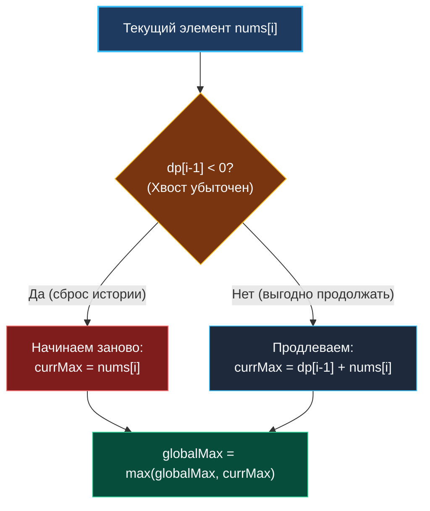
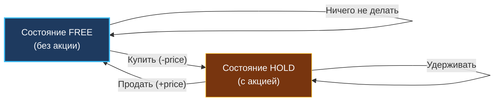

> *«Паттерны в программировании — это способ зафиксировать удачные инженерные решения, чтобы не изобретать колесо заново».*  
> — Брайан Керниган

В предыдущей статье мы выяснили, что динамическое программирование (DP) — это способ устранения экспоненциального дублирования за счет сохранения промежуточных состояний. Но как перейти от сырого условия задачи к конкретной формуле перехода?

Практика показывает, что около 80% задач на одномерное DP сводятся всего к **четырем фундаментальным паттернам**. Опознав шаблон, вы мгновенно получаете готовый скелет алгоритма, инварианты переходов и стратегию сжатия памяти до $O(1)$.

---

## Паттерн 1: Линейная последовательность (Fibonacci-style)

Самый наглядный и распространенный архетип. Значение состояния $dp[i]$ представляет собой кумулятивную сумму или агрегацию фиксированного числа предшествующих шагов.

**Формула перехода:**
$$dp[i] = dp[i-1] + dp[i-2]$$

**Семантика:**  
Мы считаем **общее количество способов** добраться до состояния $i$. Так как последнее действие было либо шагом размера 1 (из $i-1$), либо шагом размера 2 (из $i-2$), и эти события взаимоисключающие, по правилу сложения комбинаторики мы суммируем варианты.

**Пример на Go 1.22+ (сжатие до $O(1)$ памяти):**
```go
func climbStairsWays(n int) int {
	if n <= 2 {
		return n
	}
	prev2, prev1 := 1, 2
	for i := 3; i <= n; i++ {
		curr := prev1 + prev2
		prev2, prev1 = prev1, curr
	}
	return prev1
}
```

**Где в бэкенде:**  
- Расчет количества маршрутов пакета в топологически упорядоченной цепочке прокси-серверов.  
- Подсчет допустимых комбинаций параметров при валидации составных бизнес-правил.

---

## Паттерн 2: Оптимальный путь (Min/Max Cost Path)

Здесь $dp[i]$ означает не количество вариантов, а **экстремальную стоимость** (минимум задержки, максимум выгоды) попадания в точку $i$.

**Формула перехода:**
$$dp[i] = \min(dp[i-1], dp[i-2]) + \text{cost}[i]$$

**Семантика:**  
Мы выбираем наименее затратный предшествующий шаг и прибавляем накладные расходы нахождения в текущем узле.

```go
func minCostPath(cost []int) int {
	n := len(cost)
	if n <= 1 {
		return 0
	}
	prev2, prev1 := cost[0], cost[1]
	for i := 2; i < n; i++ {
		// Go 1.21+ встроенная функция min()
		curr := min(prev1, prev2) + cost[i]
		prev2, prev1 = prev1, curr
	}
	return min(prev1, prev2)
}
```

> [!WARNING] Ловушка различия паттернов: Количество способов vs Стоимость
> Всегда четко разделяйте вопрос задачи:
> - *«Сколько способов...»* $\to$ сложение ($dp[i-1] + dp[i-2]$).
> - *«Какова минимальная/максимальная стоимость...»* $\to$ экстремум ($\min(dp[i-1], dp[i-2]) + \text{cost}$).  
> Путаница между сложением и поиском минимума — частая причина глупых ошибок на собеседованиях.

---

## Паттерн 3: Локальный оптимум (Алгоритм Кадане / Max Subarray)

Критически важный паттерн для любого бэкенд-инженера, работающего с метриками, логами и временными рядами.

Ключевой инсайт: $dp[i]$ означает оптимальный ответ для непрерывного отрезка, **строго заканчивающегося в индексе $i$**.

**Формула перехода:**
$$dp[i] = \max(\text{nums}[i], dp[i-1] + \text{nums}[i])$$

**Семантика:**  
На каждом шаге у нас есть жесткая дилемма:
1. Либо продолжить существующую последовательность ($dp[i-1] + \text{nums}[i]$).
2. Либо, если накопленный предыдущий хвост ушел в минус ($dp[i-1] < 0$), сбросить историю и начать новый отрезок прямо с текущего элемента $\text{nums}[i]$.



### Реализация на Go 1.22+ без аллокаций:

```go
func maxSubArray(nums []int) int {
	if len(nums) == 0 {
		return 0
	}
	currMax := nums[0]
	globalMax := nums[0]

	for i := 1; i < len(nums); i++ {
		// Выбираем: начать новый отрезок или склеить со старым
		currMax = max(nums[i], currMax+nums[i])
		globalMax = max(globalMax, currMax)
	}

	return globalMax
}
```

> [!TIP] Mechanical Sympathy: Потоковая обработка и L1 Cache
> Алгоритм Кадане выполняет ровно один проход по массиву ($O(N)$ времени) и использует ровно две локальные переменные `currMax` и `globalMax` ($O(1)$ памяти).  
> Данные массива читаются строго последовательно, загружаясь префетчером процессора в L1D-кэш 64-байтными строками. Миллион элементов обрабатывается меньше чем за 1 миллисекунду!

**Где в бэкенде:**  
- Детекция пиковых всплесков трафика (наибольшая сумма RPS за непрерывный временной интервал).  
- Финансовая аналитика PnL (Profit and Loss) торговых роботов.  
- Детекция сетевых аномалий в потоковых данных.

---

## Паттерн 4: Конечные автоматы (State Machine DP)

Иногда текущего индекса $i$ недостаточно, чтобы описать контекст. Наше решение на шаге $i$ зависит от дополнительного скрытого статуса — например, держим ли мы открытую сессию, куплена ли акция, включен ли cooldown-таймер.

В таких задачах состояние разбивается на несколько параллельных веток:
- $dp_{hold}[i]$ — оптимальный результат, если на шаге $i$ мы владеем ресурсом.
- $dp_{free}[i]$ — оптимальный результат, если на шаге $i$ мы свободны от ресурса.

**Формула перехода (пример задачи Best Time to Buy and Sell Stock):**
$$dp_{hold}[i] = \max(dp_{hold}[i-1], dp_{free}[i-1] - \text{price}[i])$$
$$dp_{free}[i] = \max(dp_{free}[i-1], dp_{hold}[i-1] + \text{price}[i])$$



В коде на Go вместо двумерных слайсов `[][]int` мы держим 2–3 скалярные переменные:

```go
func maxProfit(prices []int) int {
	if len(prices) == 0 {
		return 0
	}
	hold := -prices[0] // Базовый случай: купили в день 0
	cash := 0

	for i := 1; i < len(prices); i++ {
		hold = max(hold, cash-prices[i])
		cash = max(cash, hold+prices[i])
	}
	return cash
}
```

**Где в бэкенде:**  
- Реализация надежных конечных автоматов (Circuit Breaker: `Closed`, `Open`, `Half-Open`).  
- Управление жизненным циклом распределенных транзакций (Saga: `Pending`, `Committed`, `Compensated`).

---

## 5. Сводная таблица архитектурных архетипов

| Паттерн | Что ищем? | Формула перехода | Сжатие памяти | Применение в Highload |
|---|---|---|:---:|---|
| **1. Линейный (Fibonacci)** | Число комбинаций | $dp[i] = dp[i-1] + dp[i-2]$ | 2 переменные | Маршрутизация, комбинаторика |
| **2. Экстремальный путь** | Мин/макс стоимость | $dp[i] = \min(dp[i-1], dp[i-2]) + c[i]$ | 2 переменные | Оптимизация сетевых задержек |
| **3. Локальный оптимум (Кадане)** | Лучший подмассив | $dp[i] = \max(n[i], dp[i-1] + n[i])$ | 1 переменная + global | Мониторинг метрик, RPS всплески |
| **4. Конечный автомат (FSM)** | Решения с состояниями | Взаимные переходы между $K$ ветками | $K$ переменных | Circuit Breaker, Saga, транзакции |

---

## Итог

1. **Распознавание паттерна — 80% успеха:** Не пытайтесь изобретать велосипед. Определите, что считает задача: число способов, стоимость, подмассив или конечный автомат.
2. **Семантика формулы:** Знак сложения (+) означает подсчет всех взаимоисключающих путей; `min`/`max` означает выбор наилучшей альтернативы.
3. **Ответ не всегда в конце:** В паттерне Кадане ответом является глобальный экстремум, а не последнее значение `dp[n-1]`.
4. **Регистровый Zero-Alloc:** Все четыре паттерна в Go тривиально оптимизируются до константного числа скаляров на регистрах процессора.

В следующей лекции мы применим паттерн Линейной последовательности к классической задаче, открывающей мир DP: [[3. Climbing Stairs]].