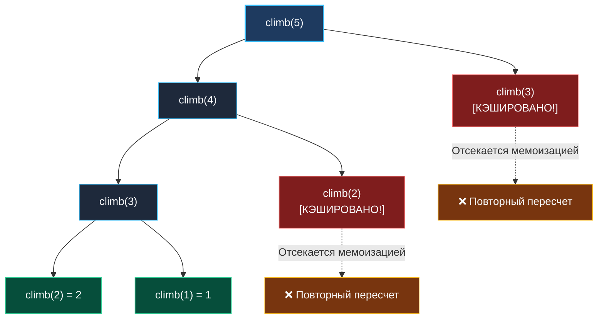
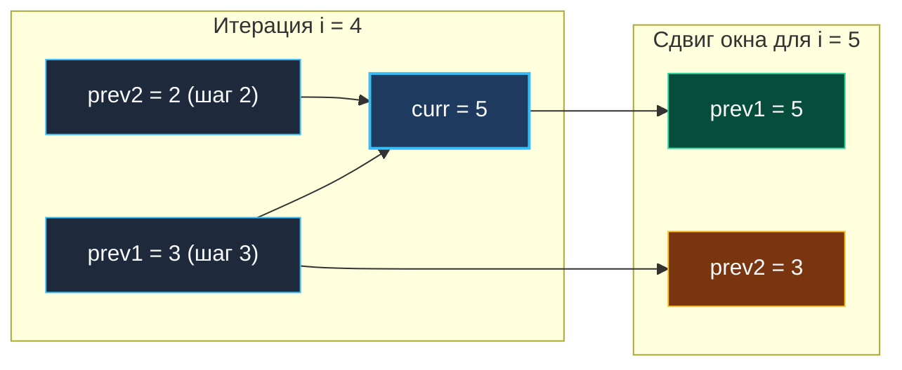

> *«Лестница к совершенству строится по одной ступени за раз».*  
> — Дональд Кнут

Задача о подъеме по лестнице (**Climbing Stairs**, LeetCode 70) — общепризнанный «Hello, World!» в мире динамического программирования. Большинство кандидатов пишут решение за пару минут и переходят дальше, упуская фундаментальные концепции: от экспоненциального взрыва дерева вызовов и поведения стека горутин до матричного возведения в степень за $O(\log N)$.

Мы разберем эту задачу с позиции Principal Go-инженера: препарируем математическую модель, визуализируем отсечение дублирующихся подзадач, исследуем работу аппаратного кэша и устраним аллокации в куче до абсолютного нуля.

---

## 1. Постановка задачи и комбинаторная модель

**Условие:**  
Вы поднимаетесь по лестнице из $n$ ступеней. За один шаг разрешается преодолеть либо **1**, либо **2** ступени.  
Сколько существует уникальных способов добраться до самой верхней, $n$-й ступени?

```
Вход:  n = 3
Выход: 3
Способы:
1. 1 шаг + 1 шаг + 1 шаг
2. 1 шаг + 2 шага
3. 2 шага + 1 шаг
```

### Рекуррентное соотношение

Зададимся вопросом: в какой точке мы находились за мгновение до того, как ступили на ступень $i$?
1. Либо на ступени $i-1$ (и сделали шаг на 1 ступень).
2. Либо на ступени $i-2$ (и сделали прыжок на 2 ступени).

Третьего не дано. Поскольку эти события взаимоисключающие, общее число способов $dp[i]$ строго равно сумме вариантов:

$$dp[i] = dp[i-1] + dp[i-2]$$

Базовые случаи очевидны:
- $dp[1] = 1$ (единственный путь: `[1]`)
- $dp[2] = 2$ (два пути: `[1, 1]` и `[2]`)

Перед нами классическая последовательность Фибоначчи со сдвигом индекса на единицу!

---

## 2. Дерево рекурсии и почему наивный подход умирает при $N=40$

Наивная рекурсия без мемоизации строит бинарное дерево вызовов глубины $N$:



В наивном рекурсивном коде сложность составляет $O(2^N)$. При $n = 45$ число операций превышает $35 \times 10^9$ тактов — ваш HTTP-хэндлер гарантированно словит таймаут.

---

## 3. Top-Down в Go: Скрытые системные ловушки

Многие начинают с мемоизации на хэш-таблице:

```go
func climbStairsMemo(n int) int {
	memo := make(map[int]int)
	var dfs func(int) int
	dfs = func(i int) int {
		if i <= 2 {
			return i
		}
		if val, ok := memo[i]; ok {
			return val
		}
		memo[i] = dfs(i-1) + dfs(i-2)
		return memo[i]
	}
	return dfs(n)
}
```

> [!WARNING] Системные ловушки Top-Down в продакшене Go
> 1. **Динамический рост стека (`runtime.morestack`):** Начальный стек горутины — всего 2 КБ. При большой глубине рекурсии рантайм Go многократно копирует стек в кучу, вызывая скачки латентности (Tail Latency spikes).
> 2. **Утечка в кучу (Heap Escape):** Замыкание с хэш-таблицей `memo` не проходит Escape Analysis и аллоцируется в куче, порождая паразитные вызовы сборщика мусора (GC).
> 3. **Оверхед `map`:** Хэширование ключей `int` и поиск по бакетам в десятки раз медленнее прямого обращения к регистрам CPU.

---

## 4. Bottom-Up: От $O(N)$ памяти к абсолютному $O(1)$

### Этап 1: Табуляция со слайсом $O(N)$

```go
func climbStairsSlice(n int) int {
	if n <= 2 {
		return n
	}
	dp := make([]int, n+1)
	dp[1], dp[2] = 1, 2
	for i := 3; i <= n; i++ {
		dp[i] = dp[i-1] + dp[i-2]
	}
	return dp[n]
}
```
Слайс читается последовательно, идеально утилизируя L1-кэш процессора (64-байтные кэш-линии подгружаются аппаратным префетчером). Но для $N = 10^6$ создание среза требует 8 МБ памяти в куче.

### Этап 2: Идиоматичный Go — сжатие до регистров CPU ($O(1)$ памяти)

Так как для шага $i$ требуются только два предыдущих результата, заменим массив скользящим окном из двух скалярных переменных:

```go
package stairs

// ClimbStairs возвращает количество уникальных способов взобраться на n ступеней.
// Временная сложность: O(N).
// Пространственная сложность: O(1) — 0 аллокаций.
func ClimbStairs(n int) int {
	if n <= 2 {
		return n
	}

	// prev2 соответствует dp[i-2], prev1 соответствует dp[i-1]
	prev2, prev1 := 1, 2

	for i := 3; i <= n; i++ {
		curr := prev1 + prev2
		prev2 = prev1
		prev1 = curr
	}

	return prev1
}
```



### Mechanical Sympathy: Zero-Alloc и ABIInternal

Запустив компилятор с флагом анализа утечек:
```bash
go build -gcflags="-m" stairs.go
```
Вы увидите: в функции `ClimbStairs` **нет ни единой аллокации в куче**.  
Переменные `prev2`, `prev1` и `curr` размещаются непосредственно в регистрах процессора (например, `RAX`, `RDX`, `RCX` в архитектуре x86-64). Время выполнения цикла для $N = 10^4$ занимает считанные микросекунды без малейшего следа в Garbage Collector.

---

## 5. Высший пилотаж: Матричное возведение в степень за $O(\log N)$

На собеседовании уровня Lead / Principal вас могут спросить:  
*«Что если $n = 10^9$? Цикл $O(N)$ займет секунду на ядре CPU. Можем ли мы вычислить ответ быстрее?»*

Ответ — **матричное умножение**.

Линейный переход можно представить в виде векторно-матричного равенства:

$$\begin{pmatrix} dp[i] \\ dp[i-1] \end{pmatrix} = \begin{pmatrix} 1 & 1 \\ 1 & 0 \end{pmatrix} \begin{pmatrix} dp[i-1] \\ dp[i-2] \end{pmatrix}$$

Разворачивая рекуррентность до начального состояния:

$$\begin{pmatrix} dp[n] \\ dp[n-1] \end{pmatrix} = \begin{pmatrix} 1 & 1 \\ 1 & 0 \end{pmatrix}^{n-2} \begin{pmatrix} dp[2] \\ dp[1] \end{pmatrix}$$

Используя алгоритм **быстрого бинарного возведения матрицы в степень** (Binary Exponentiation), матрицу размера $2 \times 2$ можно возвести в степень $n$ всего за **$O(\log N)$** умножений! Для $n = 10^9$ потребуется всего около 30 матричных операций.

---

## 6. Вопросы для собеседования

> [!INTERVIEW] Вопросы сеньорского уровня
> 
> **Вопрос 1:** *Что делать, если $n > 90$ и значение переполняет стандартный `int64`?*  
> **Ответ:** Число Фибоначчи $F(93)$ превышает предел $2^{63}-1$. На интервью уточняйте требования:
> 1. Если задача требует ответ по модулю (например, $\text{modulo } 10^9 + 7$), мы берем `(prev1 + prev2) % 1_000_000_007` на каждой итерации.
> 2. Если требуется точное значение, используем пакет `math/big` (`big.Int.Add()`).
> 
> **Вопрос 2:** *А если разрешено делать 1, 2 или 3 шага?*  
> **Ответ:** Это числа Трибоначчи. Формула расширяется до трех предшествующих состояний: $dp[i] = dp[i-1] + dp[i-2] + dp[i-3]$, а для $O(1)$ памяти понадобятся три переменные (`prev3`, `prev2`, `prev1`).

---

## Итог

1. **Комбинаторная суть:** Задача о лестнице — это последовательность Фибоначчи со смещением.
2. **Отказ от рекурсии:** В Go Top-Down подход приводит к росту стека и оверхеду хэш-таблиц. Bottom-Up табуляция — стандарт де-факто.
3. **Регистровое сжатие:** Использование двух скалярных переменных сводит память к $O(1)$ и обеспечивает 0 аллокаций в куче.
4. **Матричный горизонт:** При экстремальных $N$ бинарное возведение матрицы в степень вычисляет ответ за $O(\log N)$.

В следующей статье мы перейдем к задаче, где каждый шаг требует выбора между выгодой и ограничением на смежность элементов: [[4. House Robber]].