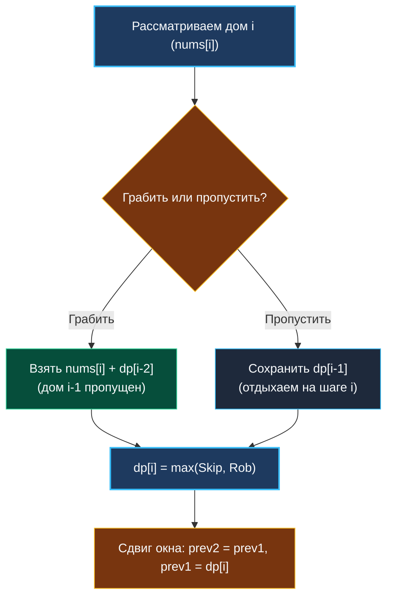
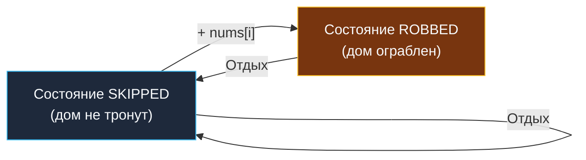

> *«Хороший архитектор знает не только то, что нужно построить, но и то, от чего следует намеренно отказаться».*  
> — Брайан Керниган

Задача о грабителе домов (**House Robber**, LeetCode 198) — это классический шаг вперед по сравнению с [[3. Climbing Stairs]]. Если на лестнице мы складывали все возможные варианты, то здесь в игру вступает **конфликт взаимоисключающих решений (Mutual Exclusion)**.

Мы не можем просто взять накопленную сумму предыдущего шага, потому что выбор текущего элемента накладывает жесткое топологическое ограничение: два соседних ресурса не могут быть захвачены одновременно. Это чистейшее воплощение паттерна оптимального выбора (Decision Making), описанного в [[2. Базовые паттерны]].

---

## 1. Постановка задачи и системная модель

**Условие:**  
Дан целочисленный массив `nums`, где `nums[i]` — стоимость ценностей в доме с номером $i$.  
Дома соединены охранной сигнализацией: если два соседних дома будут ограблены в одну и ту же ночь, сработает тревога.  
Какую максимальную сумму можно извлечь без вызова полиции?

```
Вход:  nums = [2, 7, 9, 3, 1]
Выход: 12
Пояснение: грабим дом 0 (2) + дом 2 (9) + дом 4 (1) = 12.
```

В распределенных системах и бэкенд-инженерии это точная модель **планирования задач с взаимными блокировками (Resource Scheduling with Lock Conflicts)**:
1. **Шардинг и репликация:** выбор серверов для тяжелых операций (например, Compaction в LSM-деревьях), где две соседние ноды делят один сетевой свитч или дисковый массив.
2. **Rate Limiting и Cooldown:** выбор транзакций с максимальной комиссией при условии, что между двумя подтверждениями должен пройти обязательный защитный интервал.
3. **Аллокация CPU-ядер:** распределение горячих вычислений по физическим ядрам с пропуском соседних Hyper-Threading потоков для предотвращения деградации L1-кэша.

---

## 2. Логика перехода: Выбор из двух альтернатив

Остановимся перед домом $i$. Перед нами дилемма:
1. **Грабить дом $i$:** Мы забираем ценности `nums[i]`. Однако по правилам безопасности мы обязаны были пропустить дом $i-1$. Следовательно, наш кумулятивный выигрыш равен:
   $$dp[i-2] + \text{nums}[i]$$
2. **Пропустить дом $i$:** Мы не трогаем текущий дом. Тогда наш выигрыш равен максимальному результату, достигнутому к предыдущему дому:
   $$dp[i-1]$$

Выбирая максимум из двух сценариев, получаем каноническое рекуррентное соотношение:

$$dp[i] = \max(dp[i-1], dp[i-2] + \text{nums}[i])$$



### Базовые случаи:
- $dp[0] = \text{nums}[0]$ (если дом всего один, грабим его).
- $dp[1] = \max(\text{nums}[0], \text{nums}[1])$ (из первых двух домов выбираем более богатый).

> [!WARNING] Почему жадный выбор здесь терпит крах?
> Интуитивно хочется брать самые дорогие дома: «Вижу $9$ — беру!».  
> Но представьте ряд: `[2, 1, 1, 2]`.  
> Жадный алгоритм возьмет первый дом ($2$), пропустит второй ($1$), возьмет третий ($1$) и пропустит четвертый ($2$). Итог: $2 + 1 = 3$.  
> Оптимальный выбор — взять нулевой и третий дома: $2 + 2 = 4$. Жадность близорука, DP глобально оптимально.

---

## 3. Идиоматичная реализация на Go 1.22+ ($O(1)$ памяти)

Хранить срез `dp` размером $N$ совершенно излишне: для каждого шага нам нужны лишь два предыдущих значения.

```go
package robber

// Rob вычисляет максимально возможную добычу без срабатывания сигнализации.
// Временная сложность: O(N).
// Пространственная сложность: O(1) — 0 аллокаций.
func Rob(nums []int) int {
	n := len(nums)
	if n == 0 {
		return 0
	}
	if n == 1 {
		return nums[0]
	}

	// prev2 хранит dp[i-2], prev1 хранит dp[i-1]
	prev2 := nums[0]
	prev1 := max(nums[0], nums[1]) // встроенный max в Go 1.21+

	for i := 2; i < n; i++ {
		// Текущий оптимум: грабить дом i или пропустить его
		curr := max(prev1, prev2+nums[i])
		prev2 = prev1
		prev1 = curr
	}

	return prev1
}
```

---

## 4. Mechanical Sympathy: Регистрация в CPU и Escape Analysis

Давайте взглянем на сгенерированный компилятором код глазами архитектора процессора:

1. **Escape Analysis:** Запустив `go build -gcflags="-m" robber.go`, мы убеждаемся:
   ```
   ./robber.go:7:6: can inline Rob
   ./robber.go:7:10: nums does not escape
   ```
   Внутри функции не создается ни единого указателя. Ни `prev1`, ни `prev2`, ни `curr` не попадают в кучу.
2. **Размещение в регистрах (ABIInternal):** На 64-битной архитектуре переменные размещаются в регистрах `RAX`, `RDX` и `RCX`. В цикле нет ни единого обращения к оперативной памяти или стеку для промежуточных значений.
3. **Линейный prefetching:** Входной срез `nums` читается строго последовательно шаг за шагом (`nums[i]`). Аппаратный блок предвыборки (Hardware Stream Prefetcher) заранее переносит строки кэша L1, исключая простои конвейера CPU.

---

## 5. Альтернативный взгляд: Конечный автомат (State Machine DP)

Формулу House Robber можно эквивалентно выразить через конечный автомат с двумя состояниями:
- **`robbed`**: максимальная сумма при условии, что текущий дом **ограблен**.
- **`skipped`**: максимальная сумма при условии, что текущий дом **пропущен**.

```go
func robFSM(nums []int) int {
	robbed, skipped := 0, 0
	for _, v := range nums {
		newRobbed := skipped + v
		newSkipped := max(skipped, robbed)
		robbed = newRobbed
		skipped = newSkipped
	}
	return max(robbed, skipped)
}
```



> [!TIP] Зачем нам модель FSM?
> В одномерном массиве оба подхода эквивалентны. Но когда мы перейдем к деревьям ([[3. House Robber III]]), где у узла есть потомки вместо линейных индексов $i-1$ и $i-2$, именно пара состояний `(robbed, skipped)` позволит нам элегантно передавать кортеж значений вверх по стеку обхода DFS без построения глобальных таблиц.

---

## 6. Вопросы для собеседования

> [!INTERVIEW] Вопросы сеньорского уровня
> 
> **Вопрос 1:** *Какова сложность алгоритма и можно ли решить задачу быстрее, чем за $O(N)$?*  
> **Ответ:** Временная сложность $O(N)$ строго оптимальна, так как любой алгоритм обязан просмотреть каждый элемент хотя бы один раз (иначе мы рискуем пропустить дом с ценностью $+10^9$). Память $O(1)$ минимально возможна.
> 
> **Вопрос 2:** *Что если значения в домах могут быть отрицательными?*  
> **Ответ:** Если дом приносит убыток (`nums[i] < 0`), грабить его нет никакого смысла. В формулу добавляется отсечение нулем: `curr = max(prev1, prev2 + max(0, nums[i]))`, либо отрицательные дома просто игнорируются на входе.

---

## Итог

1. **Суть паттерна:** Выбор между включением текущего элемента ($dp[i-2] + \text{nums}[i]$) и сохранением предыдущего статуса ($dp[i-1]$).
2. **Оптимизация памяти:** Сжатие таблицы состояний до двух скаляров `prev1` и `prev2` дает $O(1)$ памяти и 0 аллокаций.
3. **Двойственность FSM:** Представление через состояния `robbed` / `skipped` готовит фундамент для динамического программирования на графах и деревьях.

В следующей статье мы замкнем улицу в кольцо: первый и последний дома станут соседями, разрушая линейную базу: [[5. House Robber II]].