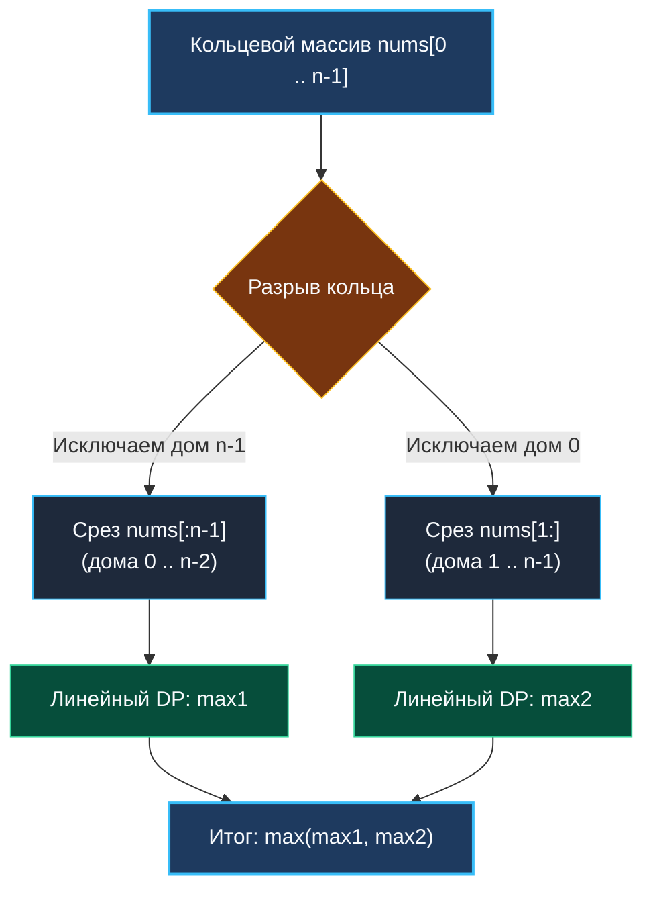

> *«Чтобы разрубить узел сложности, достаточно найти точку, в которой его можно разрезать».*  
> — Эдсгер Дейкстра

Задача **House Robber II** (LeetCode 213) элегантно развивает концепцию [[4. House Robber]], замыкая линейную улицу домов в кольцо. Теперь первый и последний дома стали непосредственными соседями.

Это кажущееся незначительным изменение топологии мгновенно разрушает стандартную одномерную индукцию: мы больше не можем независимо принять решение для дома $n-1$, не зная, был ли ограблен дом $0$. Для думающего инженера это прекрасный повод продемонстрировать **декомпозицию задачи** — сведение сложной циклической системы к двум независимым линейным процессам.

---

## 1. Постановка задачи и конфликт кольцевой топологии

**Условие:**  
Массив `nums` описывает ценности домов, расположенных по кругу. Дом `nums[0]` соседствует с `nums[n-1]`.  
Нельзя грабить два соседних дома подряд.  
Какую максимальную сумму можно украсть?

```
Вход:  nums = [2, 3, 2]
Выход: 3
Пояснение: дома [0] и [2] соседствуют по кругу. Ограбить оба нельзя. Максимум — дом 1 со значением 3.
```

В реальных распределенных системах кольцевая топология встречается повсеместно:
1. **Consistent Hashing кольца (Cassandra, DynamoDB):** если две виртуальные ноды на кольце проецируются на один физический сервер, мы не можем одновременно назначать на них ресурсоемкие операции обслуживания.
2. **Топологии Token Ring и циклические буферы (Disruptor):** координация параллельных воркеров с гарантией взаимного исключения граничных слотов.
3. **Разрешение циклических дедлоков:** разрыв замкнутого графа ожидания ресурсов (Wait-For Graph).

---

## 2. Архитектурный инсайт: Разрыв кольца в двух точках

Поскольку дома $0$ и $n-1$ теперь соединены напрямую, мы **физически не можем ограбить оба этих дома одновременно**.

Следовательно, любое глобально оптимальное решение гарантированно принадлежит одному из двух взаимоисключающих классов:
1. **Сценарий 1: Мы НЕ грабим последний дом ($n-1$).**  
   Тогда мы можем свободно рассматривать дома от $0$ до $n-2$. Последний дом исключен из рассмотрения, и кольцо разомкнуто!
2. **Сценарий 2: Мы НЕ грабим первый дом ($0$).**  
   Тогда мы можем свободно рассматривать дома от $1$ до $n-1$. Первый дом исключен, и кольцо снова превращается в прямую линию!

$$\text{TotalMax} = \max(\text{RobLinear}(nums[0 : n-1]), \text{RobLinear}(nums[1 : n]))$$

Мы разрываем порочный круг и сводим задачу к двум запускам нашей проверенной линейной функции `RobLinear` с памятью $O(1)$!



---

## 3. Mechanical Sympathy: Zero-Copy срезы в Go

В языках вроде Java или Python операция получения подмассива часто влечет за собой физическое копирование памяти ($O(N)$ аллокаций).

В Go срез — это легковесный 24-байтный заголовок на стеке:
```go
type slice struct {
    array unsafe.Pointer // указатель на базовый массив
    len   int            // длина среза
    cap   int            // вместимость
}
```

Когда мы пишем `nums[:n-1]` и `nums[1:]`:
1. **0 байт аллокаций в куче:** создаются лишь две структуры `slice` на регистрах/стеке.
2. **L1-кэш дружелюбность:** обе итерации читают один и тот же непрерывный кусок памяти. Процессор разогревает кэш L1 на первом проходе, и второй проход выполняется с практически 100% Cache Hit Rate.

---

## 4. Реализация на Go 1.22+

```go
package robber

// RobCircle находит максимальную добычу в кольцевом массиве домов.
// Временная сложность: O(N) — ровно два линейных прохода.
// Пространственная сложность: O(1) — 0 аллокаций памяти.
func RobCircle(nums []int) int {
	n := len(nums)
	if n == 0 {
		return 0
	}
	// Крайний случай: если дом всего 1, разрыв срезов вернет пустые слайсы!
	if n == 1 {
		return nums[0]
	}

	// Сценарий 1: дома [0 .. n-2] (дом n-1 заведомо не тронут)
	max1 := robLinearRange(nums[:n-1])
	// Сценарий 2: дома [1 .. n-1] (дом 0 заведомо не тронут)
	max2 := robLinearRange(nums[1:])

	return max(max1, max2) // Встроенный max в Go 1.21+
}

// robLinearRange решает классическую линейную задачу House Robber за O(1) памяти.
func robLinearRange(nums []int) int {
	prev2, prev1 := 0, 0
	for _, v := range nums {
		curr := max(prev1, prev2+v)
		prev2 = prev1
		prev1 = curr
	}
	return prev1
}
```

> [!WARNING] Ловушка граничного случая: $N = 1$
> Если на входе массив из одного элемента `nums = [5]`:  
> `nums[:0]` вернет пустой срез `[]`, и `nums[1:]` вернет пустой срез `[]`.  
> Функция `robLinearRange` для пустого среза вернет `0`, и алгоритм выдаст неверный ответ `0` вместо `5`!  
> Проверка `if n == 1 { return nums[0] }` обязательна перед вызовом декомпозиции.

---

## 5. Системные аналогии: Разрыв петель в сетевых протоколах

Идея «разорвать цикл и запустить линейный алгоритм» — базовый паттерн архитектуры распределенных систем:

1. **STP (Spanning Tree Protocol) в сетях Ethernet:** коммутаторы второго уровня (L2) не имеют TTL в заголовках кадров, и любая петля в кабелях вызывает лавинный широковещательный шторм (Broadcast Storm). Алгоритм STP блокирует один из линков, виртуально «разрывая кольцо», превращая топологию в бесконфликтное дерево.
2. **Consensus в Raft / Paxos:** раунд голосования разделяет кандидатов на изолированные кворумы. Поскольку два мажоритарных кворума обязаны пересекаться хотя бы по одному узлу, кольцевой конфликт нескольких лидеров исключается декомпозицией большинства.

---

## 6. Вопросы для собеседования

> [!INTERVIEW] Вопросы сеньорского уровня
> 
> **Вопрос 1:** *Увеличилась ли асимптотическая сложность по сравнению с линейной задачей?*  
> **Ответ:** Нет. Временная сложность осталась строго $O(N)$, так как константа $2 \times N$ в нотации $O$ отбрасывается. Память по-прежнему $O(1)$, так как срезы в Go являются zero-copy представлениями.
> 
> **Вопрос 2:** *А что если мы не ограбим ни дом 0, ни дом n-1? Не потеряли ли мы этот вариант?*  
> **Ответ:** Нет, не потеряли. Вариант «пропустить оба дома» полностью содержится как в первом сценарии (где дом $n-1$ запрещен, но дом $0$ не обязан быть взят), так и во втором сценарии. Объединение двух сценариев покрывает 100% пространства допустимых конфигураций.

---

## Итог

1. **Разрыв кольца:** Кольцевое ограничение устраняется декомпозицией на два линейных подмассива: `[0 .. n-2]` и `[1 .. n-1]`.
2. **Zero-Copy срезы:** В Go нарезка базового массива не копирует данные и не дергает аллокатор кучи.
3. **Граничный фильтр:** Не забывайте обрабатывать массивы длины 1 вручную, чтобы срезы не схлопнулись в нули.

В следующей лекции мы познакомимся с совершенно новым классом задач 1D DP — неограниченным рюкзаком (Unbounded Knapsack) и поиском комбинаторного минимума: [[6. Coin Change]].