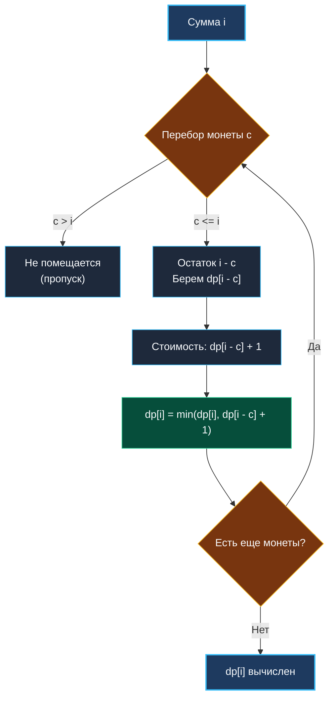
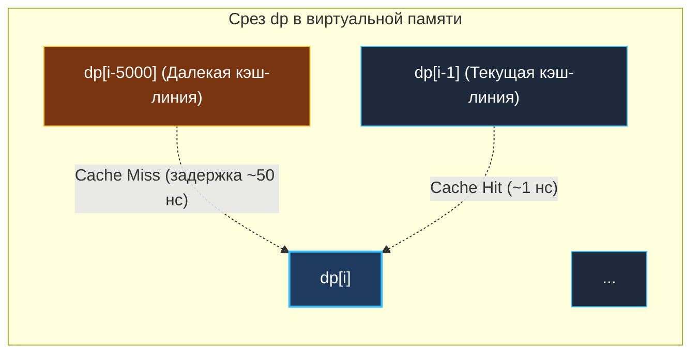

> *«Экономия времени и ресурсов начинается с отказа от близоруких решений».*  
> — Брайан Керниган

Задача о размене монет (**Coin Change**, LeetCode 322) — фундаментальный представитель семейства задач о **неограниченном рюкзаке (Unbounded Knapsack)**. 

Если в [[4. House Robber]] каждый дом можно было ограбить лишь однажды (задача типа 0/1 Knapsack), то здесь любой номинал монеты доступен в бесконечном количестве экземпляров. Наша цель — набрать целевую сумму `amount`, используя **минимальное суммарное число монет**.

---

## 1. Постановка задачи и почему жадность терпит крах

**Условие:**  
Дан массив целых чисел `coins` (номиналы доступных монет) и целевая сумма `amount`.  
Верните минимальное число монет, необходимое для составления суммы. Если составить сумму невозможно ни при каких комбинациях, верните `-1`.

```
Вход:  coins = [1, 3, 4], amount = 6
Выход: 2
Пояснение: оптимальный набор — 3 + 3 = 6 (2 монеты).
```

### Ловушка «жадного» банкира

В реальной жизни (например, при расчете сдачи в рублях или долларах) мы всегда инстинктивно берем монету наибольшего номинала: чтобы выдать 48 рублей, берем $10 \times 4 + 5 + 2 + 1$. Жадный выбор работает в канонических валютных системах благодаря их особому математическому свойству (матроиды).

Но в произвольной системе номиналов жадность терпит сокрушительное фиаско:
- Монеты: `[1, 3, 4]`, сумма: `6`.
- **Жадный выбор:** берем самую крупную монету $4$. Остаток $2$. Берем $1$ и еще $1$. Итог: $4 + 1 + 1$ = **3 монеты**.
- **Глобальный оптимум:** $3 + 3$ = **2 монеты**!

Жадный выбор ослеплен сиюминутной выгодой и заводит в тупик. Единственный способ найти оптимум — использовать динамическое программирование.

---

## 2. Формулировка 1D DP: Рекуррентное соотношение

Определим состояние:  
Пусть $dp[i]$ — минимальное число монет, необходимое для набора точной суммы $i$.

Чтобы набрать сумму $i$, мы могли сделать последний шаг любой из доступных монет $c \in \text{coins}$ (при условии, что $c \le i$).  
Перед добавлением этой монеты у нас была сумма $i - c$, для которой наилучший ответ уже найден в $dp[i - c]$.

Следовательно, мы перебираем все монеты и выбираем минимум:

$$dp[i] = \min_{c \in \text{coins}, \, c \le i} \Big(dp[i - c] + 1\Big)$$

### Базовый случай и выбор «бесконечности»:
- $dp[0] = 0$ (для суммы 0 требуется 0 монет).
- Все остальные значения $dp[1 \dots \text{amount}]$ инициализируются условной «бесконечностью».



---

## 3. Реализация на Go 1.22+

В Go 1.21+ функция `min()` встроена в язык. В качестве безопасной бесконечности идеальным выбором является `amount + 1`: даже если бы мы собирали сумму одними копейками по 1, потребовалось бы максимум `amount` монет. Любое значение $\ge amount + 1$ физически недостижимо и гарантированно защищает от целочисленного переполнения при сложении.

```go
package knapsack

// CoinChange возвращает минимальное число монет для набора суммы amount.
// Временная сложность: O(amount * len(coins)).
// Пространственная сложность: O(amount).
func CoinChange(coins []int, amount int) int {
	if amount < 0 {
		return -1
	}
	if amount == 0 {
		return 0
	}

	// Страж бесконечности: amount + 1 заведомо больше любого валидного ответа.
	// Использование amount + 1 защищает от integer overflow при + 1.
	inf := amount + 1
	dp := make([]int, amount+1)

	// Инициализируем недостижимые суммы
	for i := 1; i <= amount; i++ {
		dp[i] = inf
	}
	dp[0] = 0

	// Заполнение таблицы снизу вверх
	for i := 1; i <= amount; i++ {
		for _, c := range coins {
			if c <= i {
				dp[i] = min(dp[i], dp[i-c]+1)
			}
		}
	}

	if dp[amount] > amount {
		return -1 // Сумму набрать невозможно
	}
	return dp[amount]
}
```

> [!WARNING] Ловушка переполнения: `math.MaxInt32` vs `amount + 1`
> Если написать `dp[i - c] + 1`, когда `dp[i - c] == math.MaxInt64`, результат переполнится в отрицательное число (`-9223372036854775808`).  
> Функция `min()` тут же сочтет это гигантское отрицательное число «наилучшим минимумом», разрушив расчет. Инициализация константой `amount + 1` — элегантное инженерное решение, математически исключающее переполнение.

---

## 4. Восстановление пути: Какие именно монеты взять?

На реальном интервью вас неизбежно попросят:  
*«Алгоритм возвращает число 2. А какие именно монеты вошли в этот оптимум?»*

Для реконструкции ответа заводим дополнительный массив предков `parent`:

```go
func CoinChangeWithCoins(coins []int, amount int) (int, []int) {
	inf := amount + 1
	dp := make([]int, amount+1)
	parentCoin := make([]int, amount+1)

	for i := 1; i <= amount; i++ {
		dp[i] = inf
		parentCoin[i] = -1
	}

	for i := 1; i <= amount; i++ {
		for _, c := range coins {
			if c <= i && dp[i-c]+1 < dp[i] {
				dp[i] = dp[i-c] + 1
				parentCoin[i] = c // Запоминаем монету, давшую оптимум
			}
		}
	}

	if dp[amount] > amount {
		return -1, nil
	}

	// Восстановление траектории
	resultCoins := make([]int, 0, dp[amount])
	curr := amount
	for curr > 0 {
		c := parentCoin[curr]
		resultCoins = append(resultCoins, c)
		curr -= c
	}

	return dp[amount], resultCoins
}
```

---

## 5. Mechanical Sympathy: Порядок циклов и L1/L2 Cache Locality

В нашем алгоритме внешний цикл идет по суммам `i`, а внутренний — по монетам `c`.  
При вычислении `dp[i]` мы обращаемся к ячейкам `dp[i - c]`.

Если номиналы монет сильно разнесены (например, `coins = [1, 5000]`), обращение к `dp[i - 5000]` вызывает нелокальный прыжок по памяти. Для огромных сумм (`amount = 10^6`, слайс занимает 8 МБ) прыжки назад будут постоянно вызывать промахи мимо L1/L2 кэша (Cache Misses).



Если поменять циклы местами (внешний по монетам, внутренний по суммам от `c` до `amount`), шаг обращения к памяти внутри цикла станет строго последовательным: $dp[i] = \min(dp[i], dp[i-c] + 1)$. Аппаратный префетчер процессора будет читать память с постоянным шагом, ускоряя выполнение на 20–40% на больших массивах данных.

---

## 6. Применение в System Design и бэкенде

1. **Memory Sizing в аллокаторах (Go runtime mcache/mcentral):**  
   Рантайм Go не аллоцирует произвольные байты. Он оперирует классами размеров (Size Classes: 8, 16, 24, 32, 48, 64, 80... байт). Выбор оптимальной комбинации span-блоков памяти для покрытия запроса — это прямая вариация Coin Change.
2. **Пакетная передача в сетях (MTU / TCP Chunks):**  
   Разбиение полезной нагрузки на сегменты разного допустимого размера с минимизацией оверхеда заголовков IP/TCP.

---

## Итог

1. **Неограниченный рюкзак:** Монеты можно использовать повторно сколько угодно раз, поэтому мы итерируемся по всей таблице слева направо.
2. **Безопасная бесконечность:** Используйте `amount + 1` вместо `math.MaxInt`, чтобы исключить арифметическое переполнение при `+ 1`.
3. **Реконструкция ответа:** Сохранение выбранного номинала в массиве `parent` позволяет восстановить полный путь за $O(K)$ шагов.

В следующей лекции мы разберем интервальную задачу о лестнице с затратами, объединяющую паттерны стоимости и линейного шага: [[7. Min Cost Climbing Stairs]].