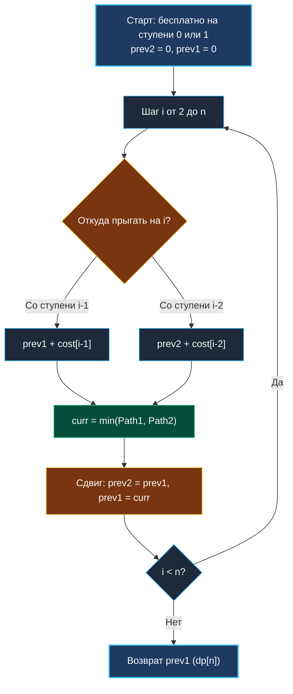

> *«Оптимальный маршрут редко бывает самым очевидным, но всегда подчиняется строгим законам стоимости».*  
> — Брайан Керниган

Задача о минимальной стоимости подъема по лестнице (**Min Cost Climbing Stairs**, LeetCode 746) — каноническое воплощение паттерна «Оптимальный путь» (Min Cost Path), детально классифицированного в [[2. Базовые паттерны]].

Внешне она напоминает [[3. Climbing Stairs]], но вместо комбинаторного сложения вариантов мы решаем оптимизационную задачу: как добраться до вершины лестницы с **минимальными совокупными издержками**. Для Senior-инженера эта задача интересна тонкостями семантики состояния («стоимость достижения» vs «стоимость пребывания»), а также демонстрацией того, как современный компилятор Go превращает вызовы `min()` в бессбойные инструкции `CMOV` на уровне ассемблера.

---

## 1. Постановка задачи и формулировка состояния

**Условие:**  
Дан целочисленный массив `cost`, где `cost[i]` — стоимость шага с $i$-й ступени.  
Оплатив стоимость $i$-й ступени, вы можете подняться либо на **1**, либо на **2** ступени вверх.  
Разрешено стартовать бесплатно с индекса `0` или с индекса `1`.  
Найдите минимальную стоимость достижения вершины лестницы (индекса $n$, расположенного сразу за пределами массива).

```
Вход:  cost = [10, 15, 20]
Выход: 15
Пояснение: стартуем бесплатно со ступени 1 (стоимость 15), делаем прыжок на 2 ступени сразу на вершину (индекс 3). Итого: 15.
```

### Архитектурный инсайт: Семантика $dp[i]$

Самая распространенная ошибка новичков — определять $dp[i]$ как «стоимость ступени $i$». Это порождает хаос в граничных условиях при прыжке на финиш.

Правильная инженерная семантика:  
**$dp[i]$ — это минимальная накопленная стоимость ДОСТИЖЕНИЯ ступени $i$.**

Чтобы достичь ступени $i$, мы могли совершить прыжок:
1. Со ступени $i-1$, оплатив `cost[i-1]`.
2. Со ступени $i-2$, оплатив `cost[i-2]`.

Рекуррентное соотношение:

$$dp[i] = \min\Big(dp[i-1] + \text{cost}[i-1], \; dp[i-2] + \text{cost}[i-2]\Big)$$

### Базовые случаи:
По условию мы можем свободно начать со ступени 0 или со ступени 1:
- $dp[0] = 0$
- $dp[1] = 0$

Финальный ответ — это стоимость достижения виртуальной ступени $n$ (вершины лестницы): **$dp[n]$**.



---

## 2. Реализация на Go 1.22+ ($O(1)$ памяти)

Поскольку для шага $i$ требуются только два предшествующих состояния, таблица сжимается до двух локальных переменных на регистрах CPU:

```go
package stairs

// MinCostClimbingStairs находит минимальную стоимость подъема на вершину лестницы.
// Временная сложность: O(N).
// Пространственная сложность: O(1) — 0 аллокаций.
func MinCostClimbingStairs(cost []int) int {
	n := len(cost)
	if n <= 1 {
		return 0
	}

	// prev2 = dp[i-2], prev1 = dp[i-1]
	// Стоимость старта на ступени 0 или 1 равна 0.
	prev2, prev1 := 0, 0

	// Итерируемся до n включительно (n — вершина лестницы за пределами массива)
	for i := 2; i <= n; i++ {
		// Go 1.21+ встроенный min()
		curr := min(prev1+cost[i-1], prev2+cost[i-2])
		prev2 = prev1
		prev1 = curr
	}

	return prev1
}
```

> [!WARNING] Ловушка финишной черты: индекс `n` против `n-1`
> Обратите внимание на условие цикла: `i <= n`.  
> Если остановить цикл на `i = n - 1`, вы вычислите стоимость достижения последней ступени массива, но не совершите финальный прыжок за пределы лестницы!  
> Проход до `n` гарантирует, что в `prev1` окажется точный ответ $dp[n]$ без необходимости писать дополнительный `min()` после цикла.

---

## 3. Mechanical Sympathy: CMOV, CSEL и ветвления в CPU

Давайте посмотрим на ассемблерный вывод, генерируемый компилятором Go для тела цикла:
```go
curr := min(prev1+cost[i-1], prev2+cost[i-2])
```

В наивной компиляции условие `min` порождало бы инструкцию условного перехода (Conditional Jump, `JGE` / `JLE`). Если массив `cost` содержит случайные значения, блок предсказания ветвлений процессора (Branch Predictor) будет регулярно ошибаться, сбрасывая конвейер (Pipeline Flush) и теряя 15–20 тактов CPU на каждый промах.

Однако в современном Go (начиная с Go 1.21):
- На архитектуре **x86-64** компилятор разворачивает встроенный `min` в инструкцию **`CMOV` (Conditional Move)**.
- На архитектуре **ARM64** (Apple Silicon, AWS Graviton) используется инструкция **`CSEL` (Conditional Select)**.

В машинном коде нет инструкций ветвления `JMP`! Процессор вычисляет обе суммы параллельно в суперскалярных ALU и за 1 такт выбирает меньшую без риска сброса конвейера. В сочетании со строгой предвыборкой кэш-линий массива `cost` это дает предельно возможную скорость выполнения.

---

## 4. Системные аналогии: Маршрутизация с весами в распределенных сетях

В архитектуре высоконагруженных бэкендов поиск пути с минимальной стоимостью — стандартный паттерн:

1. **Динамическая балансировка нагрузки (Latency-Based Routing):**  
   Маршрутизатор входящего трафика оценивает задержку (cost) каждого доступного датацентра. Путь строится через узлы с наименьшим кумулятивным latency.
2. **Exponential Backoff с плавающей ценой:**  
   Повторные попытки HTTP-запросов (Retries) с возрастающей стоимостью ожидания: немедленный ретрай стоит 0 мс, второй — 100 мс, третий — 300 мс. Планировщик выбирает цепочку ретраев так, чтобы уложиться в общий бюджет времени (Timeout Budget).
3. **Ребалансировка шардов в СУБД:**  
   Перемещение данных между серверами с минимизацией совокупного дискового I/O.

---

## 5. Вопросы для собеседования

> [!INTERVIEW] Вопросы сеньорского уровня
> 
> **Вопрос 1:** *Что если размер прыжка может быть до $K$ ступеней?*  
> **Ответ:** Мы получаем обобщенную задачу:  
> $$dp[i] = \min_{1 \le j \le K} \Big(dp[i-j] + \text{cost}[i-j]\Big)$$  
> Сложность составит $O(N \cdot K)$ по времени и $O(K)$ по памяти (кольцевой буфер на $K$ элементов). При больших $K$ окно минимумов можно оптимизировать до $O(N)$ с помощью монотонной деки (Monotonic Queue).
> 
> **Вопрос 2:** *Можно ли изменить входной массив `cost` in-place, чтобы не заводить даже переменные `prev1` и `prev2`?*  
> **Ответ:** Да, можно переписать `cost[i] += min(cost[i-1], cost[i-2])`, начиная с $i = 2$. Однако в production-коде мутация входных данных (side effects) является антипаттерном, нарушающим потокобезопасность и чистоту функций. Скалярные переменные `prev1` и `prev2` дают $O(1)$ памяти без порчи входных срезов.

---

## Итог кластера 1D DP

Мы завершили фундаментальный блок одномерного динамического программирования:
1. **Теория:** Понимание двух столпов DP (оптимальная подструктура и перекрывающиеся подзадачи) и доминирование Bottom-Up табуляции в Go.
2. **Линейная последовательность:** Фибоначчи и Climbing Stairs со сжатием памяти до двух регистров CPU ($O(1)$).
3. **Взаимное исключение:** House Robber I & II — выбор альтернатив и разрыв циклических графов.
4. **Неограниченный рюкзак:** Coin Change — безопасная бесконечность и защита от переполнений.
5. **Оптимальный путь:** Min Cost Climbing Stairs — правильная семантика достижения состояния и аппаратный CMOV.

Теперь мы готовы добавить второе измерение и перейти к вычислениям на матрицах и сетках: [[1. Теория. Динамическое программирование 2D]].