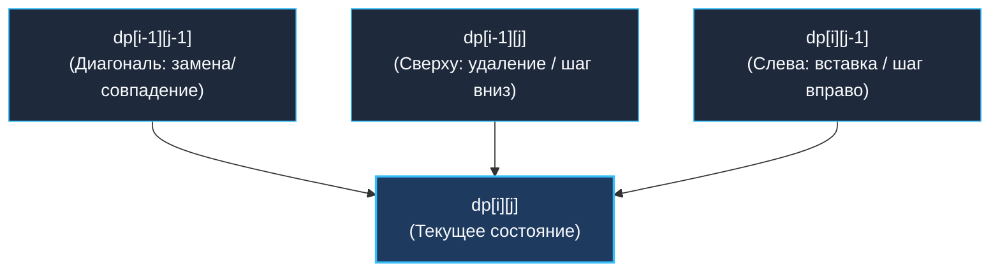
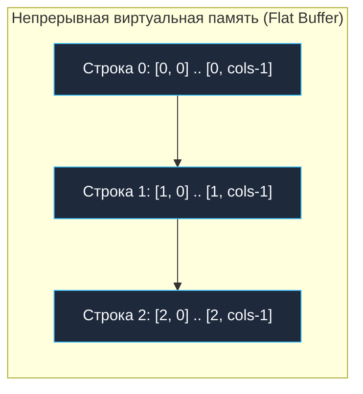
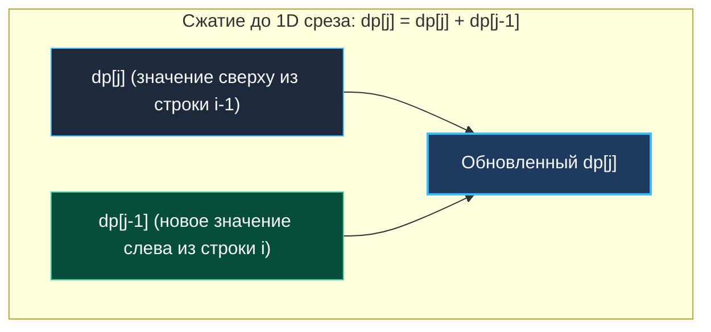

> *«Всякая плоскость есть проекция множества линий, а сложность двумерного пространства познается через аккуратный шаг по одной из осей».*  
> — Брайан Керниган

Переход от одномерного динамического программирования к двумерному (2D DP) — это качественный скачок в алгоритмическом мышлении. Если в 1D DP мы шагали по прямой числовой оси, опираясь на 1–2 предшествующих состояния, то в 2D DP состояние описывается парой координат $(i, j)$, формируя двумерную плоскость решений.

Обычно одна координата $i$ отвечает за прогресс по первой сущности (длина префикса строки $S$, количество рассмотренных предметов в рюкзаке, координата строки в сетке), а вторая координата $j$ — за прогресс во второй сущности (префикс строки $T$, текущая вместимость рюкзака, координата столбца). Ячейка таблицы $dp[i][j]$ становится точкой пересечения двух независимых параметров.

---

## 1. Топология зависимостей в матрице 2D DP

В подавляющем большинстве задач значение в клетке $(i, j)$ вычисляется строго локально — на основе «соседей», расположенных сверху, слева или по диагонали слева-сверху.

Выделяются три фундаментальных шаблона переходов:

1. **Сетевой путь (Grid Path / Minimum Path Sum):**  
   $$dp[i][j] = f(dp[i-1][j], \; dp[i][j-1]) + \text{cost}[i][j]$$  
   В текущую клетку мы можем прийти только двумя путями: сверху или слева.
2. **Строковое сопоставление (LCS / Edit Distance):**  
   $$dp[i][j] = f(dp[i-1][j], \; dp[i][j-1], \; dp[i-1][j-1])$$  
   К верхнему и левому переходам добавляется диагональный переход $(i-1, j-1)$, означающий совпадение или замену символов.
3. **Классический рюкзак (0/1 Knapsack):**  
   $$dp[i][j] = \max(dp[i-1][j], \; dp[i-1][j - w[i]] + v[i])$$  
   Решение о взятии $i$-го предмета при ограничении веса $j$ опирается на предыдущую строку со смещением по весу.



---

## 2. Mechanical Sympathy: Ловушка джаггед-массивов (`[][]int`)

В Go нет встроенного типа для двумерных матриц произвольного размера (в отличие от сишного `int dp[M][N]`). Начинающие разработчики по привычке создают слайс слайсов:

```go
// АНТИПАТТЕРН для Highload: M + 1 аллокаций в куче!
dp := make([][]int, rows)
for i := range dp {
    dp[i] = make([]int, cols)
}
```

Почему для высокопроизводительных систем это катастрофа?

1. **Разрозненность памяти (Pointer Chasing):** Внешний срез `dp` хранит $M$ заголовков срезов (по 24 байта каждый). Каждый внутренний срез выделяется аллокатором рантайма в случайном месте кучи. Строка 0 может оказаться по адресу `0x0010`, а строка 1 — по адресу `0x8FA0`.
2. **Убийство L1/L2 кэша CPU:** При переходе между строками процессор не может предсказать адрес следующего фрагмента. Каждый шаг вызывает Cache Miss и вынуждает ядро простаивать 50–100 наносекунд в ожидании данных из оперативной памяти.
3. **Нагрузка на GC:** Вместо одного непрерывного объекта сборщик мусора вынужден отслеживать и сканировать $M + 1$ независимый объект в куче.

### Инженерное решение: Плоский одномерный срез (Flat Slice)

В продакшене мы всегда выделяем **один непрерывный блок памяти**:

```go
// ИДИОМАТИЧНЫЙ GO: 1 аллокация, непрерывный буфер памяти
flatDP := make([]int, rows*cols)

// Доступ к элементу (i, j): смещение = i * cols + j
func get(i, j int) int {
    return flatDP[i*cols + j]
}
```



> [!TIP] Row-Major Order и аппаратный префетчер
> Если обходить плоский массив построчно (внешний цикл по строкам `i`, внутренний по столбцам `j`), шаг обращения к памяти составляет строго 1 элемент (`stride = 1`).  
> Аппаратный блок предвыборки процессора (Hardware Stream Prefetcher) заранее подтягивает следующие кэш-линии (64 байта = 8 целых `int64`), и скорость обработки матрицы возрастает в 5–10 раз по сравнению со слайсом слайсов!

---

## 3. Сжатие памяти: От матрицы $O(M \cdot N)$ к вектору $O(N)$

Для матрицы $10^4 \times 10^4$ полная таблица требует $10^8$ элементов — это **800 МБ памяти**!  
Однако взгляните на зависимости: для вычисления строки $i$ нам требуются **только данные строки $i-1$** и только что посчитанные ячейки текущей строки $i$. Все строки от $0$ до $i-2$ больше никогда не понадобятся!

Мы можем сжать всю матрицу до **одного-двух одномерных срезов** (Rolling Array / Sliding Row).



### Техника In-Place обновления одной строки:
В формуле $dp[i][j] = dp[i-1][j] + dp[i][j-1]$:
- До вычисления ячейки $j$ элемент `dp[j]` хранит значение из **предыдущей строки $i-1$** (сверху).
- Элемент `dp[j-1]` к этому моменту уже обновлен значением из **текущей строки $i$** (слева).

Следовательно, формула принимает предельно компактный вид:
```go
dp[j] = dp[j] + dp[j-1]
```
Память сокращается с $O(M \cdot N)$ до **$O(N)$** (или $O(\min(M, N))$, если транспонировать матрицу)!

> [!WARNING] Ловушка направления обхода при сжатии
> - **Если переход требует диагональ $dp[i-1][j-1]$:** обновление `dp[j-1]` сотрет старое значение, необходимое для ячейки $j$! В этом случае либо сохраняют диагональ в скалярную переменную `prevDiag`, либо используют два чередующихся среза (`prevRow` и `currRow`).
> - **В задаче 0/1 Knapsack:** срез обходят **справа налево** (от $W$ к 0), чтобы значение $dp[j - w]$ бралось с предыдущей строки, а не перезаписывалось текущим предметом.

---

## 4. Архитектура и System Design: 2D DP в реальных системах

1. **Git diff и вычисление патчей:**  
   Поиск минимального набора вставок и удалений для перехода от одной ревизии файла к другой основан на алгоритме Майерса (Eugene Myers diff algorithm) — вариации 2D DP (LCS).
2. **Нечеткий поиск (Fuzzy Search, ElasticSearch / Lucene):**  
   Расстояние Левенштейна (Edit Distance) вычисляет количество опечаток при поиске по артикулам и именам клиентов.
3. **Выравнивание последовательностей в биоинформатике:**  
   Алгоритмы Нидлмана-Вунша (Needleman-Wunsch) и Смита-Ватермана (Smith-Waterman) для поиска мутаций в геномах — прямое 2D DP над матрицами размером в миллионы пар оснований.

---

## 5. Чек-лист решения 2D DP на собеседовании

При столкновении с двумерной задачей следуйте строгому протоколу:
1. **Нарисуйте матрицу $M \times N$:** четко обозначьте физический смысл строк и столбцов.
2. **Базовый слой:** как инициализируется строка $0$ и столбец $0$?
3. **Векторы перехода:** из каких ячеек (верх, лево, диагональ) приходят стрелки в ячейку $(i, j)$?
4. **Сжатие пространства:** предложите переход от $O(M \cdot N)$ к $O(N)$ через скользящую строку.

---

## Итог

1. **Два параметра состояния:** 2D DP моделирует пространство пересечений двух независимых измерений (сетка или две строки).
2. **Отказ от `[][]int`:** Джаггед-массивы разрушают кэш-локальность и нагружают GC. Используйте либо плоский срез `rows * cols`, либо сжатый вектор.
3. **Rolling Array:** Анализ зависимостей позволяет сжать память до $O(\min(M, N))$, храня только одну-две активные строки.
4. **Направление обхода:** Всегда проверяйте, не затирает ли обновление ячейки `dp[j]` значения, нужные для соседей.

В следующей статье мы применим эти концепции к базовым геометрическим матрицам и сеткам: [[2. Матрицы]].
