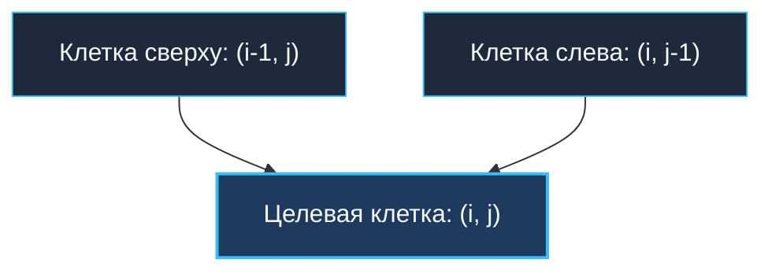
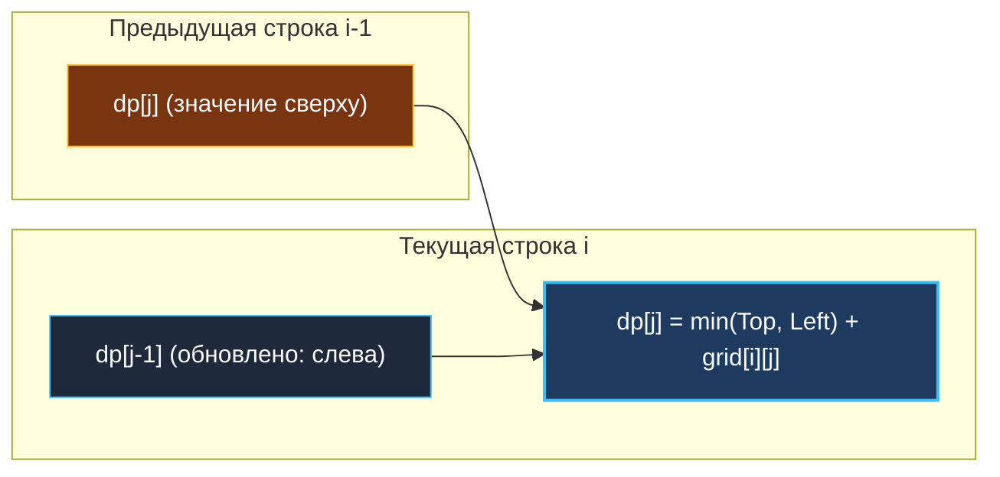

> *«Всякое движение в пространстве ограничено геометрией, но свободно в выборе пути наименьшего сопротивления».*  
> — Брайан Керниган

Задачи на сетках и матрицах (Grid DP) — самый наглядный и геометрически понятный подраздел двумерного динамического программирования. В отличие от строковых алгоритмов, где индексы строк абстрактны, здесь мы физически перемещаемся по координатной плоскости: от стартовой клетки $(0, 0)$ в левом верхнем углу к целевой клетке $(M-1, N-1)$ в правом нижнем.

В бэкенде и системной инженерии матричное DP моделирует:
- Маршрутизацию пакетов в ячеистых сетевых топологиях (Mesh Networks, Clos Networks).
- Расчет задержек передачи данных через каскады микросервисных прокси.
- Поиск геопространственных маршрутов наименьшей стоимости в ГИС (Geographic Information Systems).

---

## 1. Геометрическая парадигма: Движение «Только вправо и вниз»

Классическая постановка: дана матрица размером $M \times N$. Из любой клетки $(i, j)$ разрешено двигаться ровно в двух направлениях:
1. **Вправо** — в клетку $(i, j+1)$.
2. **Вниз** — в клетку $(i+1, j)$.

Из этого инварианта вытекает симметричный закон прихода в клетку $(i, j)$:  
Мы могли оказаться в ней **только двумя путями**:
- Сверху — из клетки $(i-1, j)$.
- Слева — из клетки $(i, j-1)$.



### Два базовых класса задач на сетках:

1. **Подсчет комбинаций (Unique Paths):**  
   Считаем число способов добраться до финиша. По правилу сложения:
   $$dp[i][j] = dp[i-1][j] + dp[i][j-1]$$
2. **Оптимизация стоимости (Minimum Path Sum):**  
   Минимизируем штраф за проход по взвешенным ячейкам:
   $$dp[i][j] = \min\Big(dp[i-1][j], \; dp[i][j-1]\Big) + \text{grid}[i][j]$$

### Базовые слои:
- **Верхняя строка ($i = 0$):** прийти можно только слева (шаг за шагом).
- **Левый столбец ($j = 0$):** прийти можно только сверху (шаг за шагом).

---

## 2. Mechanical Sympathy: Плоский срез вместо джаггед-массива

Как мы выяснили в [[1. Теория. Динамическое программирование 2D]], слайс слайсов `[][]int` фрагментирует память и разрушает кэш-линии процессора.  
Для критических по задержке участков бэкенда матрица выделяется как единый срез:

```go
// 1 аллокация в куче для всей матрицы M x N
flatDP := make([]int, rows*cols)

// Макрос адресации: смещение = i * cols + j
```

```go
package matrixdp

// MinPathSumFlat решает задачу поиска минимального пути через плоский массив.
// Временная сложность: O(M * N).
// Память: O(M * N) в непрерывном блоке L1/L2 кэша.
func MinPathSumFlat(grid [][]int) int {
	rows := len(grid)
	cols := len(grid[0])

	dp := make([]int, rows*cols)

	// База: стартовая ячейка (0, 0)
	dp[0] = grid[0][0]

	// Заполняем первую строку (только слева)
	for j := 1; j < cols; j++ {
		dp[j] = dp[j-1] + grid[0][j]
	}

	// Заполняем первый столбец (только сверху)
	for i := 1; i < rows; i++ {
		dp[i*cols] = dp[(i-1)*cols] + grid[i][0]
	}

	// Заполняем внутренность матрицы в Row-Major порядке
	for i := 1; i < rows; i++ {
		for j := 1; j < cols; j++ {
			top := dp[(i-1)*cols+j]
			left := dp[i*cols+j-1]
			dp[i*cols+j] = min(top, left) + grid[i][j]
		}
	}

	return dp[rows*cols-1]
}
```

---

## 3. Сжатие размерности: 1D Rolling Vector ($O(N)$ памяти)

Выделять полную матрицу $M \times N$ в 99% случаев не требуется.  
Чтобы рассчитать строку $i$, нам нужна только строка $i-1$ (значение сверху) и ячейка $j-1$ текущей строки (значение слева).

Сжимаем матрицу до **одного одномерного среза** длиной `cols`:



```go
// MinPathSumRolling использует ровно O(cols) памяти.
func MinPathSumRolling(grid [][]int) int {
	rows := len(grid)
	cols := len(grid[0])

	dp := make([]int, cols)

	// Инициализация первой строки
	dp[0] = grid[0][0]
	for j := 1; j < cols; j++ {
		dp[j] = dp[j-1] + grid[0][j]
	}

	// Проход по остальным строкам
	for i := 1; i < rows; i++ {
		// Первый столбец обновляется строго сверху: dp[0] = dp[0] + grid[i][0]
		dp[0] += grid[i][0]

		for j := 1; j < cols; j++ {
			// dp[j] — значение сверху (еще не перезаписано)
			// dp[j-1] — значение слева (уже обновлено на текущей итерации)
			dp[j] = min(dp[j], dp[j-1]) + grid[i][j]
		}
	}

	return dp[cols-1]
}
```

> [!WARNING] Критичность направления итерации: Слева направо!
> При обновлении вектора `dp[j]` внутренний цикл **обязан** идти слева направо ($j = 1 \dots \text{cols}-1$).  
> Только в этом случае в ячейке `dp[j-1]` уже лежит свежее значение текущей строки (слева), а в ячейке `dp[j]` все еще находится старое значение предыдущей строки (сверху).  
> Если запустить цикл в обратную сторону, инвариант разрушится.

---

## 4. Экстремальная оптимизация: Транспонирование до $O(\min(M, N))$

Что если матрица сильно вытянута по вертикали: $M = 100\,000$, а $N = 3$?  
Тогда срез `make([]int, cols)` займет всего $3 \times 8 = 24$ байта — он целиком поместится в регистры CPU!

Но что делать, если матрица вытянута по горизонтали: $M = 3$, а $N = 100\,000$?  
Выделять массив на $100\,000$ элементов нерационально. Senior-разработчик на собеседовании мгновенно предлагает:  
*«Мы можем транспонировать задачу и вести сжатие по строкам, выделив срез длиной $M = 3$. Память алгоритма составит строгие $O(\min(M, N))$!»*

---

## 5. Вопросы для собеседования

> [!INTERVIEW] Вопросы сеньорского уровня
> 
> **Вопрос 1:** *Как меняется формула, если в сетке появляются непреодолимые препятствия (стены)?*  
> **Ответ:** Это задача [[4. Unique Paths II]]. Если ячейка содержит препятствие (`grid[i][j] == 1`), мы устанавливаем `dp[j] = 0` (число путей через стену равно нулю). Если ищется минимальная стоимость, ячейка помечается недостижимой бесконечностью.
> 
> **Вопрос 2:** *Можно ли решить задачу вообще без выделения дополнительной памяти ($O(1)$ space), перезаписывая сам входной срез `grid`?*  
> **Ответ:** Да, можно перезаписывать `grid[i][j] += min(grid[i-1][j], grid[i][j-1])`. Но в production-коде мутация входных параметров (In-Place Mutation) запрещена соглашениями о надежности: это создает побочные эффекты (Side Effects) и ломает конкурентный доступ горутин. Срез размером $O(\min(M, N))$ — идеальный баланс между чистотой архитектуры и производительностью.

---

## Итог

1. **Топология сетки:** Движение «вправо и вниз» означает, что предки клетки $(i, j)$ — это строго $(i-1, j)$ и $(i, j-1)$.
2. **Память $O(\min(M, N))$:** Сжатие таблицы до скользящего вектора сокращает аллокации до минимума, сохраняя скорость $O(M \cdot N)$.
3. **Строгий порядок обхода:** Обход слева направо гарантирует корректность in-place обновления `dp[j] = f(dp[j], dp[j-1])`.

В следующей лекции мы детально разберем каноническую задачу на подсчет путей: [[3. Unique Paths]].