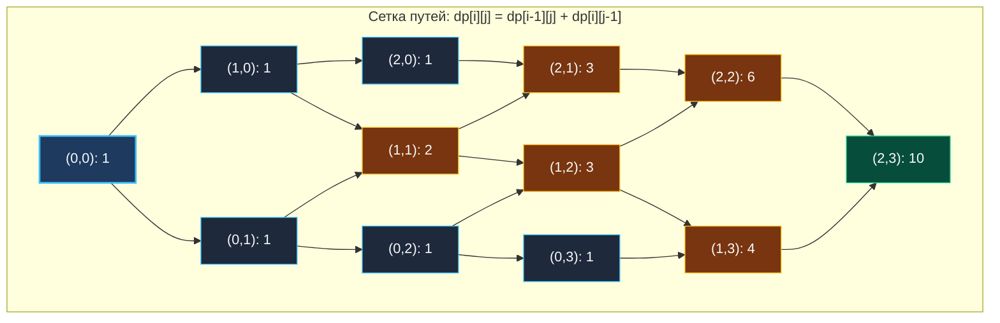
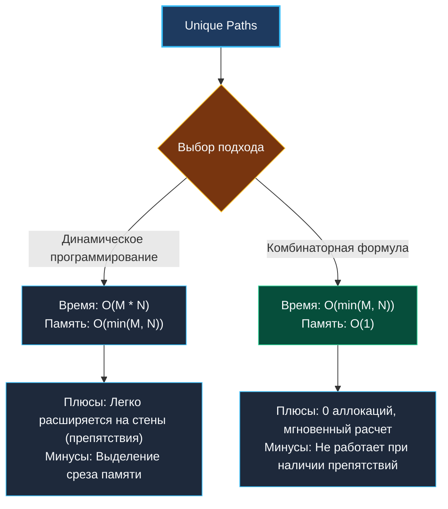

> *«В геометрии нет царских путей».*  
> — Евклид

Задача о числе уникальных маршрутов (**Unique Paths**, LeetCode 62) — классический пример того, как геометрическая задача на сетке раскрывает глубокую связь между динамическим программированием, комбинаторикой и треугольником Паскаля.

Если в [[2. Матрицы]] мы искали минимальную стоимость пути, то здесь мы подсчитываем **суммарное количество допустимых траекторий**. Для Senior-инженера эта задача показательна тем, что имеет два принципиально разных решения: динамическое программирование с памятью $O(\min(M, N))$ и замкнутую комбинаторную формулу за $O(\min(M, N))$ времени и **$O(1)$ памяти**.

---

## 1. Постановка задачи и визуализация сетки

**Условие:**  
Робот находится в левом верхнем углу сетки $m \times n$ (клетка `(0, 0)`).  
Ему необходимо добраться до правого нижнего угла (клетка `(m-1, n-1)`).  
На каждом шаге робот может переместиться только в двух направлениях: **вниз** или **вправо**.  
Сколько существует уникальных маршрутов?

```
Вход:  m = 3, n = 7
Выход: 28
```

### Визуализация сетки путей (Сетка $3 \times 4$ как фрагмент треугольника Паскаля):



Каждая ячейка сетки равна сумме верхней и левой клеток. Это в точности повернутый на 45 градусов треугольник Паскаля!

---

## 2. Подход 1: 1D Rolling DP ($O(M \cdot N)$ времени, $O(\min(M, N))$ памяти)

Рекуррентное соотношение:

$$dp[i][j] = dp[i-1][j] + dp[i][j-1]$$

База: верхняя строка и левый столбец состоят из единиц ($dp[0][j] = 1$, $dp[i][0] = 1$), так как двигаясь строго по прямой, существует ровно 1 маршрут.

### Сжатие памяти до $O(\min(M, N))$:
Если $m = 10\,000$, а $n = 3$, выделять срез на $10\,000$ не имеет смысла. Мы меняем $m$ и $n$ местами (транспонируем матрицу) и выделяем срез размером строго $\min(m, n)$:

```go
package paths

// UniquePathsDP находит число путей через скользящий 1D-срез.
// Временная сложность: O(M * N).
// Пространственная сложность: O(min(M, N)).
func UniquePathsDP(m int, n int) int {
	// Оптимизация памяти: гарантируем, что n <= m
	if m < n {
		m, n = n, m
	}

	dp := make([]int, n)
	// Базовая первая строка заполнена единицами
	for j := range dp {
		dp[j] = 1
	}

	// Итерируемся по строкам
	for i := 1; i < m; i++ {
		for j := 1; j < n; j++ {
			// dp[j] — значение сверху
			// dp[j-1] — значение слева
			dp[j] += dp[j-1]
		}
	}

	return dp[n-1]
}
```

---

## 3. Подход 2: Комбинаторика за $O(1)$ памяти

Senior-инженер видит физическую природу процесса:  
Чтобы дойти из клетки $(0, 0)$ в $(m-1, n-1)$, роботу необходимо сделать:
- Ровно $m - 1$ шагов **вниз** ($D$).
- Ровно $n - 1$ шагов **вправо** ($R$).

Общее число шагов в любом маршруте строго фиксировано:
$$\text{Total Steps} = (m - 1) + (n - 1) = m + n - 2$$

Любой уникальный маршрут — это просто строка длины $m + n - 2$, состоящая из букв $D$ и $R$. Задача сводится к выбору позиций для шагов вниз из общего числа шагов.  
Это биномиальный коэффициент (число сочетаний):

$$C_{m+n-2}^{m-1} = \binom{m+n-2}{m-1} = \frac{(m+n-2)!}{(m-1)! \cdot (n-1)!}$$

### Как избежать переполнения факториала в Go?

Прямое вычисление факториалов в коде приведет к катастрофе: уже $21!$ выходит за пределы `uint64`.  
Мы разворачиваем формулу в мультипликативный ряд и производим сокращение на лету:

$$\binom{N}{k} = \prod_{i=1}^{k} \frac{N - k + i}{i}$$

На каждом шаге мы сначала умножаем текущий результат на числитель, а затем делим на знаменатель $i$. В силу свойств биномиальных коэффициентов, произведение $k$ последовательных целых чисел **всегда строго делится** на $k!$ без остатка!

```go
// UniquePathsMath находит число путей за O(min(M, N)) времени и O(1) памяти.
func UniquePathsMath(m int, n int) int {
	N := m + n - 2
	k := m - 1

	// Используем свойство симметрии: C(N, k) == C(N, N - k)
	if k > N-k {
		k = N - k
	}

	var result uint64 = 1

	for i := 1; i <= k; i++ {
		// ВАЖНО: сначала умножение, затем деление!
		// Умножение на числитель, деление на знаменатель.
		result = result * uint64(N-k+i) / uint64(i)
	}

	return int(result)
}
```

> [!WARNING] Ловушка целочисленного деления
> Если написать `result = result * (uint64(N-k+i) / uint64(i))`, целочисленное деление `(N-k+i) / i` отбросит дробную часть и сломает результат.  
> Скобки ставить нельзя: порядок строго слева направо — сначала умножить накопленный `result`, затем поделить на `i`.

---

## 4. Архитектурное сравнение двух методов



---

## 5. System Design: Leaf-Spine и ECMP в современных дата-центрах

В архитектуре современных сетей ЦОД повсеместно применяется **Clos-топология (Leaf-Spine)**.  
Пакет от сервера источника (Leaf A) до сервера назначения (Leaf B) должен пройти через промежуточный уровень магистральных коммутаторов (Spine switches).

Количество параллельных путей равной стоимости (Equal-Cost Multi-Path, ECMP) вычисляется именно методами комбинаторики путей. Контроллеры SDN (Software-Defined Networking) используют формулы сочетаний для равномерного хеширования сетевых потоков по тысячам транзитных линков без риска перегрузки отдельных кабелей.

---

## 6. Вопросы для собеседования

> [!INTERVIEW] Вопросы сеньорского уровня
> 
> **Вопрос 1:** *Какой из двух подходов предпочтительнее озвучить первым на интервью?*  
> **Ответ:** Начните с DP-решения с 1D-вектором: это продемонстрирует надежное алгоритмическое мышление и готовность к усложнению задачи. Затем сразу скажите: *«Поскольку препятствий в сетке нет, мы можем оптимизировать это до O(1) памяти через биномиальный коэффициент C(m+n-2, m-1)»*. Это покажет широту кругозора.
> 
> **Вопрос 2:** *Что если $m$ и $n$ достигают $100$?*  
> **Ответ:** Число путей для $m = 100, n = 100$ превысит предел `uint64`. В реальном бэкенде для таких масштабов потребуется пакет `math/big` (`big.Int.Binomial`).

---

## Итог

1. **Два пути решения:** 1D DP за $O(M \cdot N)$ времени и комбинаторное число сочетаний за $O(1)$ памяти.
2. **Транспонирование:** Сжатие вектора до $O(\min(M, N))$ защищает память от асимметрии измерений.
3. **Безопасная комбинаторика:** Итеративное умножение и деление предотвращает переполнение факториалов.

В следующей статье мы добавим в сетку препятствия и убедимся, почему комбинаторика уступает место динамическому программированию: [[4. Unique Paths II]].