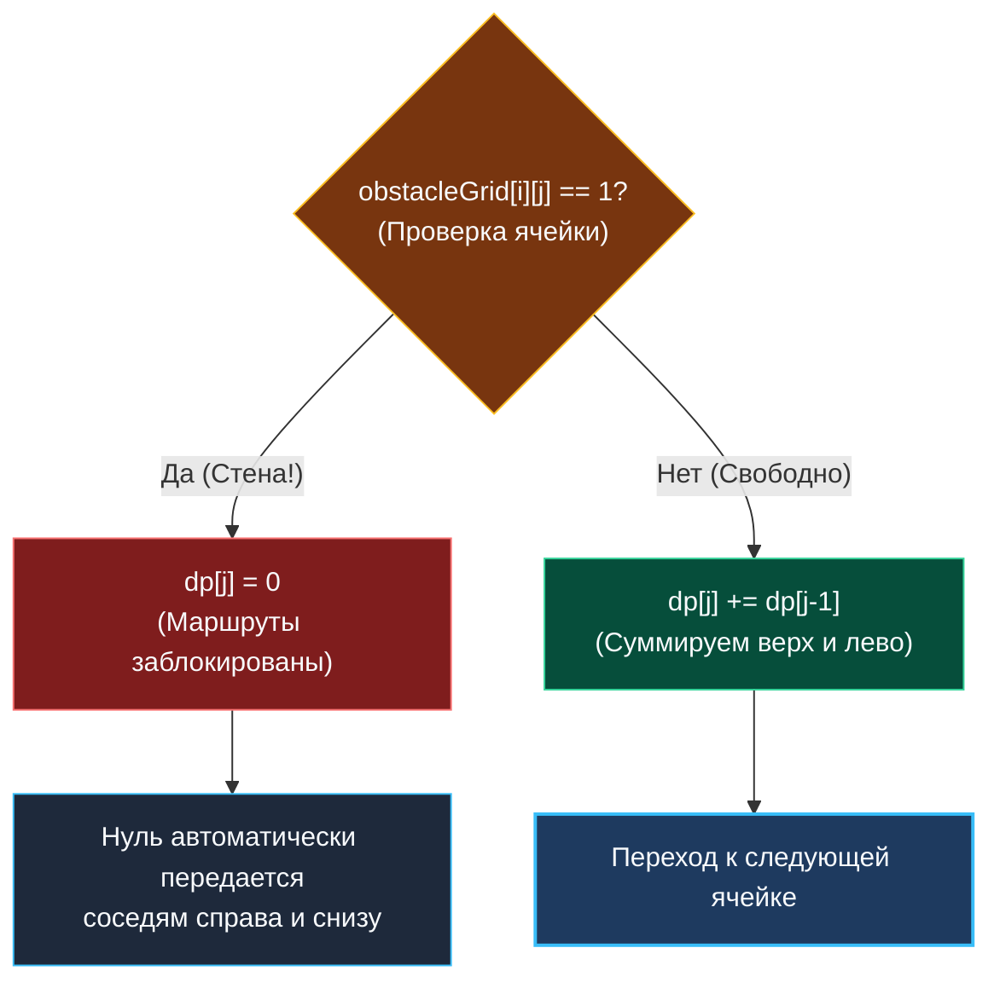

> *«Любое препятствие — это не просто преграда на пути, а повод перестроить маршрут».*  
> — Брайан Керниган

Задача **Unique Paths II** (LeetCode 63) развивает концепцию [[3. Unique Paths]], добавляя в сетку непреодолимые стены (препятствия). Это переломный момент: изящная комбинаторная формула $C_{m+n-2}^{m-1}$ разбивается о суровую реальность. Препятствия нарушают геометрическую симметрию пространства, и единственный инструмент, способный справиться с задачей, — динамическое программирование.

В бэкенде и телекоммуникациях эта задача моделирует **маршрутизацию в условиях частичной деградации инфраструктуры**: расчет связности сервисов, когда отдельные серверы, стойки или каналы связи выведены из строя (Dead Nodes / Outages).

---

## 1. Постановка задачи и обработка граничных условий

**Условие:**  
Робот находится в ячейке `(0, 0)` сетки $m \times n$.  
В сетке `obstacleGrid` препятствия обозначены числом `1`, а свободные клетки — `0`.  
Робот может перемещаться только **вправо** или **вниз**. Нельзя ступать в клетки с препятствиями.  
Сколько существует уникальных маршрутов в целевую клетку `(m-1, n-1)`?

```
Вход:  obstacleGrid = [
  [0, 0, 0],
  [0, 1, 0],
  [0, 0, 0]
]
Выход: 2
```

### Граничный чек-лист:
1. **Старт заблокирован:** если `obstacleGrid[0][0] == 1`, робот не может даже начать путь — ответ `0`.
2. **Финиш заблокирован:** если `obstacleGrid[m-1][n-1] == 1`, цель недостижима — ответ `0`.
3. **Сетка $1 \times 1$:** если свободна — `1`, если занята — `0`.

---

## 2. Логика перехода: Инфицирование нулем

Правило перехода в свободной клетке остается прежним:
$$dp[i][j] = dp[i-1][j] + dp[i][j-1]$$

Если же в клетке $(i, j)$ находится стена (`obstacleGrid[i][j] == 1`), число способов достичь её **строго равно 0**:
$$dp[i][j] = 0$$

В 1D сжатом представлении это превращается в простую мутацию:
- Если клетка — препятствие: `dp[j] = 0`.
- Если клетка свободна: `dp[j] = dp[j] + dp[j-1]`.



> [!NOTE] Автоматическое «заражение нулем» по краям
> Если стена стоит на первой строке в ячейке `(0, 2)`, то `dp[2] = 0`.  
> Для следующей клетки `(0, 3)` вычисление `dp[3] = dp[3-1] = 0`.  
> Все последующие клетки в первой строке автоматически обнуляются без необходимости писать специальный `break`!

---

## 3. Идиоматичная реализация на Go 1.22+ ($O(N)$ памяти)

```go
package paths

// UniquePathsWithObstacles возвращает число путей с учетом препятствий.
// Временная сложность: O(M * N).
// Пространственная сложность: O(N) — один срез размера cols.
func UniquePathsWithObstacles(obstacleGrid [][]int) int {
	m := len(obstacleGrid)
	if m == 0 {
		return 0
	}
	n := len(obstacleGrid[0])
	if n == 0 {
		return 0
	}

	// Если старт или финиш заблокированы — путей нет
	if obstacleGrid[0][0] == 1 || obstacleGrid[m-1][n-1] == 1 {
		return 0
	}

	dp := make([]int, n)
	dp[0] = 1

	for i := 0; i < m; i++ {
		for j := 0; j < n; j++ {
			if obstacleGrid[i][j] == 1 {
				// Стена обнуляет любые маршруты через эту ячейку
				dp[j] = 0
			} else if j > 0 {
				// Свободная клетка: dp[j] уже хранит значение сверху,
				// прибавляем значение слева (dp[j-1])
				dp[j] += dp[j-1]
			}
			// Для j == 0 при obstacleGrid[i][0] == 0:
			// dp[0] сохраняет значение сверху (старый dp[0])
		}
	}

	return dp[n-1]
}
```

---

## 4. Mechanical Sympathy: Branch Prediction vs Branchless DP

Обратите внимание на проверку `if obstacleGrid[i][j] == 1` во внутреннем цикле.

Для процессора с длинным конвейером (14–19 стадий в современных Intel Raptor Lake / AMD Zen 4) каждое условное ветвление — это потенциальная угроза.  
- Если препятствия распределены упорядоченно (например, сплошная стена), предсказатель ветвлений (Branch Predictor) безошибочно настраивается на ветку.
- Если стены разбросаны случайно (хаотический шум), процент промахов (Branch Mispredictions) может достигать 30–40%. Каждая ошибка сбрасывает конвейер и отнимает **15–20 тактов CPU**.

### Высший пилотаж: Безусловный (Branchless) код

Senior-разработчик может устранить ветвление математически с помощью битовой маски:

```go
// Branchless вычисление: 0 проверок if внутри горячего цикла!
// mask = 0, если obstacleGrid == 1
// mask = 1, если obstacleGrid == 0
mask := 1 - obstacleGrid[i][j]
dp[j] = (dp[j] + dp[j-1]) * mask
```

Такой код компилируется в строго линейную последовательность инструкций сложения и умножения без единого перехода `JMP`. Конвейер процессора работает с предельной тактовой эффективностью.

---

## 5. System Design: Failure Domains и Circuit Breaker в сетях

В архитектуре отказоустойчивых распределенных систем алгоритм обхода препятствий лежит в основе:

1. **Failure Domains (Зоны доступности в облаках):**  
   Когда в AWS или GCP падает Availability Zone (AZ-a), планировщик оркестратора помечает все виртуальные ноды этой зоны как `1` (препятствие). Алгоритм мгновенно пересчитывает потоки трафика в обход упавшей зоны.
2. **Dynamic Circuit Breaker в Service Mesh (Envoy / Istio):**  
   Если апстрим-сервис начинает отвечать ошибками 5xx, Circuit Breaker «размыкает цепь» (ставит стену в графе маршрутов). Алгоритм распределения трафика (Weight Balancing) автоматически обнуляет вес ребра и перенаправляет 100% запросов на здоровые реплики.

---

## 6. Вопросы для собеседования

> [!INTERVIEW] Вопросы сеньорского уровня
> 
> **Вопрос 1:** *Почему мы не транспонируем матрицу для уменьшения памяти, как в Unique Paths I?*  
> **Ответ:** Мы можем транспонировать входную матрицу, если $m < n$. Однако в задаче с препятствиями транспонирование требует обращения `obstacleGrid[j][i]`. Если `obstacleGrid` задан как `[][]int`, чтение по столбцам (`stride = cols`) вызывает постоянные Cache Misses в L1D. Выгода от уменьшения среза `dp` может быть сведена на нет деградацией доступа к базовой матрице.
> 
> **Вопрос 2:** *Что если препятствия можно разрушать (например, робот может сломать до $K$ стен)?*  
> **Ответ:** Состояние расширяется до 3D DP: $dp[i][j][k]$ — число путей в клетку $(i, j)$ с использованием $k$ разрушений. Либо задача переформулируется в поиск кратчайшего пути на графе состояний с помощью алгоритма 0-1 BFS / Дейкстры.

---

## Итог

1. **Ограничения убивают формулы:** Препятствия делают комбинаторику неприменимой, требуя полного 2D/1D динамического программирования.
2. **Семантика обнуления:** Препятствие принудительно обнуляет состояние $dp[j] = 0$, каскадно блокируя все маршруты через данную точку.
3. **Branchless оптимизация:** Использование множителя `(1 - obstacle)` устраняет ветвления и защищает конвейер CPU от сбросов.

В следующей лекции мы вернемся к поиску экстремума и объединим матричные сетки со взвешенной стоимостью ячеек: [[5. Minimum Path Sum]].