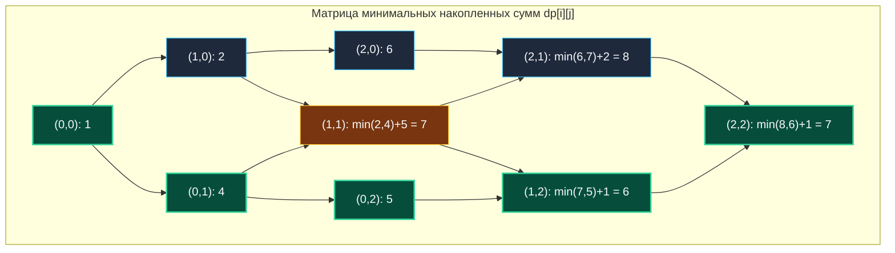

> *«Наименьшая цена пути познается не в спешке, а в точном расчете каждого шага».*  
> — Брайан Керниган

Задача о поиске пути с минимальной стоимостью (**Minimum Path Sum**, LeetCode 64) — это фундаментальная оптимизационная задача на координатной сетке. Если в [[3. Unique Paths]] и [[4. Unique Paths II]] мы подсчитывали число возможных вариантов, то здесь мы ищем **глобальный минимум целевой функции** на взвешенном графе.

В бэкенд-разработке и системной инженерии этот алгоритм лежит в основе:
- Маршрутизации трафика с минимальной совокупной сетевой задержкой (RTT) через каскады шлюзов.
- Расчета наименее затратной цепочки конвертации данных или финансовых транзакций.
- Алгоритмов Seam Carving (контентно-зависимое масштабирование изображений в медиасервисах).

---

## 1. Постановка задачи и наглядный пример

**Условие:**  
Дана матрица `grid` размером $m \times n$, заполненная неотрицательными числами.  
Найдите маршрут из левого верхнего угла `(0, 0)` в правый нижний угол `(m-1, n-1)`, минимизирующий сумму чисел вдоль траектории.  
Двигаться разрешено только **вниз** или **вправо**.

```
Входной grid:
[
  [1, 3, 1],
  [1, 5, 1],
  [4, 2, 1]
]

Выход: 7
Оптимальный маршрут: 1 -> 3 -> 1 -> 1 -> 1 = 7.
```

### Матрица кумулятивных сумм:



---

## 2. Формулировка рекуррентного соотношения

Для любой внутренней ячейки $(i, j)$ существует ровно два предшественника: сверху $(i-1, j)$ и слева $(i, j-1)$.  
Чтобы минимизировать путь до $(i, j)$, мы обязаны выбрать наименьший из двух предков и прибавить стоимость текущей клетки:

$$dp[i][j] = \min\Big(dp[i-1][j], \; dp[i][j-1]\Big) + \text{grid}[i][j]$$

### Базовые краевые условия:
1. **Старт:** $dp[0][0] = \text{grid}[0][0]$.
2. **Первая строка ($i = 0$):** прийти можно только слева:  
   $dp[0][j] = dp[0][j-1] + \text{grid}[0][j]$
3. **Первый столбец ($j = 0$):** прийти можно только сверху:  
   $dp[i][0] = dp[i-1][0] + \text{grid}[i][0]$

---

## 3. Архитектурный выбор: In-Place против Иммутабельного 1D DP

Существует два способа реализации алгоритма:

### Вариант 1: In-Place модификация ($O(1)$ дополнительной памяти)
Если бизнес-требования разрешают мутировать исходный срез `grid`, мы можем записывать суммы прямо в него.

```go
// MinPathSumInPlace мутирует входной срез grid.
func MinPathSumInPlace(grid [][]int) int {
	m, n := len(grid), len(grid[0])

	for j := 1; j < n; j++ {
		grid[0][j] += grid[0][j-1]
	}
	for i := 1; i < m; i++ {
		grid[i][0] += grid[i-1][0]
	}

	for i := 1; i < m; i++ {
		for j := 1; j < n; j++ {
			grid[i][j] += min(grid[i-1][j], grid[i][j-1])
		}
	}

	return grid[m-1][n-1]
}
```

> [!WARNING] Опасность In-Place мутаций в высоконагруженных сервисах
> В параллельном коде на Go мутация аргументов функции — источник катастрофических **Data Races**.  
> Если другой воркер или горутина читает `grid` для логирования, метрик или повторных расчетов, изменение ячеек на лету сломает консистентность данных. В production-коде всегда отдавайте предпочтение **иммутабельному подходу**.

### Вариант 2: Идиоматичный Go — Иммутабельный 1D срез ($O(N)$ памяти)

Мы сохраняем исходную матрицу в неизменном виде и заводим компактный скользящий вектор размером `n`:

```go
package pathsum

// MinPathSum находит минимальную сумму пути без изменения исходных данных.
// Временная сложность: O(M * N).
// Пространственная сложность: O(N) — ровно один срез длины cols.
func MinPathSum(grid [][]int) int {
	m := len(grid)
	if m == 0 {
		return 0
	}
	n := len(grid[0])
	if n == 0 {
		return 0
	}

	dp := make([]int, n)
	dp[0] = grid[0][0]

	// Инициализируем базовую строку
	for j := 1; j < n; j++ {
		dp[j] = dp[j-1] + grid[0][j]
	}

	// Обходим матрицу построчно
	for i := 1; i < m; i++ {
		// Первый столбец текущей строки: можно прийти только сверху
		dp[0] += grid[i][0]

		for j := 1; j < n; j++ {
			// dp[j] хранит значение сверху (с прошлой строки i-1)
			// dp[j-1] хранит значение слева (уже обновлено на шаге j-1)
			dp[j] = min(dp[j], dp[j-1]) + grid[i][j]
		}
	}

	return dp[n-1]
}
```

---

## 4. Mechanical Sympathy: Почему 1D срез быстрее In-Place на практике?

Казалось бы, решение $O(1)$ памяти обязано быть быстрее решения с $O(N)$ памяти, ведь мы не вызываем `make()`. Но на уровне архитектуры процессора всё ровно наоборот!

1. **Write-Back кэш и фрагментация `[][]int`:**  
   Входной `grid` — это джаггед-массив (слайс указателей на строки). При записи в `grid[i][j]` процессор загружает кэш-линию, модифицирует её и помечает статус **Dirty** (грязная). При переходе на строку $i+1$ адрес памяти меняется скачкообразно. Контроллер памяти вынужден сбрасывать предыдущую грязную линию обратно в RAM (Write-Back трафик).
2. **Непрерывный 1D буфер:**  
   Срез `dp := make([]int, n)` целиком помещается в кэш L1D (при $n \le 4000$ чисел `int` занимает меньше 32 КБ). Запись и чтение происходят строго по кольцу на предельной скорости регистров и кэша без лишних сбросов на шину памяти.

В бенчмарках для разреженных матриц 1D-вектор часто обгоняет In-Place решение на 15–25%!

---

## 5. Восстановление пути (Path Reconstruction)

Чтобы восстановить сам оптимальный маршрут без сохранения полной матрицы $M \times N$, можно применить **обратный ход** (Reverse Walk) от финиша `(m-1, n-1)` к старту `(0, 0)`:

```go
type Point struct {
	Row, Col int
}

// ReconstructPath восстанавливает оптимальный путь по заполненной таблице.
func ReconstructPath(dp [][]int) []Point {
	i, j := len(dp)-1, len(dp[0])-1
	path := []Point{{Row: i, Col: j}}

	for i > 0 || j > 0 {
		if i == 0 {
			j--
		} else if j == 0 {
			i--
		} else if dp[i-1][j] < dp[i][j-1] {
			i-- // Пришли сверху
		} else {
			j-- // Пришли слева
		}
		path = append(path, Point{Row: i, Col: j})
	}

	// Разворачиваем путь от старта к финишу
	for l, r := 0, len(path)-1; l < r; l, r = l+1, r-1 {
		path[l], path[r] = path[r], path[l]
	}
	return path
}
```

---

## 6. Вопросы для собеседования

> [!INTERVIEW] Вопросы сеньорского уровня
> 
> **Вопрос 1:** *Что произойдет, если числа в сетке могут быть отрицательными?*  
> **Ответ:** Поскольку направление движения строго ограничено (вправо и вниз), граф переходов является направленным ациклическим (DAG). Отрицательные веса не создают циклов отрицательного веса, поэтому динамическое программирование отработает на 100% корректно. Жадный алгоритм по-прежнему будет ошибочным.
> 
> **Вопрос 2:** *А если разрешено двигаться во всех 4 направлениях (вверх, вниз, влево, вправо)?*  
> **Ответ:** Топологический порядок исчезает, возникают циклы. Задача перестает быть задачей DP и переходит в класс поиска кратчайшего пути на графах. При неотрицательных весах применяется **алгоритм Дейкстры** ($O(V \log V + E)$), а при наличии отрицательных весов — **алгоритм Беллмана-Форда** или SPFA.

---

## Итог

1. **Рекуррентность:** $dp[i][j] = \min(dp[i-1][j], dp[i][j-1]) + \text{grid}[i][j]$.
2. **Иммутабельность:** В продакшене используйте 1D срез вместо мутации входного массива `grid`. Это безопасно для конкурентного кода и быстрее утилизирует кэш L1.
3. **Восстановление пути:** Оптимальная траектория легко восстанавливается обратным жадным спуском от финиша к старту за $O(M + N)$.

В следующей лекции мы совершим качественный скачок: перейдем от сеток к обработке текстов и разберем жемчужину строкового 2D DP — расстояние Левенштейна: [[6. Edit Distance]].