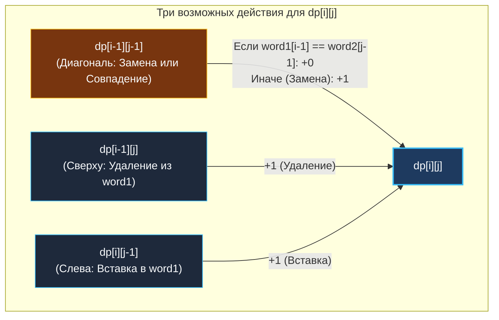

> *«Расстояние между двумя идеями измеряется количеством усилий, необходимых для превращения одной в другую».*  
> — Брайан Керниган

Задача о редакционном расстоянии (**Edit Distance / Расстояние Левенштейна**, LeetCode 72) — признанная классика двумерного динамического программирования на строках. Советский математик Владимир Иосифович Левенштейн сформулировал эту метрику в 1965 году для исправления ошибок в двоичных кодах.

Сегодня расстояние Левенштейна лежит в основе:
- Поисковых подсказок и исправления опечаток («Возможно, вы имели в виду...» в Google, Яндексе, Elasticsearch).
- Алгоритмов вычисления разницы файлов `git diff` и систем слияния веток.
- Сравнения цепочек ДНК и белков в вычислительной геномике (алгоритмы Нидлмана-Вунша).

---

## 1. Постановка задачи и допустимые операции

**Условие:**  
Даны два слова `word1` и `word2`.  
Необходимо найти **минимальное количество элементарных операций**, требуемых для превращения `word1` в `word2`.  
Разрешены три операции:
1. **Вставка (Insert):** добавить один символ в слово.
2. **Удаление (Delete):** стереть один символ из слова.
3. **Замена (Replace):** заменить один символ на любой другой.

```
Вход:  word1 = "horse", word2 = "ros"
Выход: 3
Траектория трансформации:
1. horse -> rorse (замена 'h' на 'r')
2. rorse -> rose  (удаление 'r')
3. rose  -> ros   (удаление 'e')
Итого: 3 операции.
```

---

## 2. Визуализация таблицы переходов: `"horse" → "ros"`

Определим состояние:  
**$dp[i][j]$** — минимальное число правок для преобразования префикса $word1[0 \dots i-1]$ в префикс $word2[0 \dots j-1]$.

### Полноразмерная DP-таблица:

```
        ""     r      o      s
  ""  [ 0 ] → [ 1 ] → [ 2 ] → [ 3 ]
        ↓   ↘   ↓   ↘   ↓   ↘   ↓
  h   [ 1 ] → [ 1 ]   [ 2 ]   [ 3 ]   (замена 'h' -> 'r')
        ↓       ↓   ↘   ↓   ↘   ↓
  o   [ 2 ]   [ 2 ] → [ 1 ] → [ 2 ]   (совпадение 'o' == 'o')
        ↓   ↘   ↓       ↓   ↘   ↓
  r   [ 3 ] → [ 2 ]   [ 2 ] → [ 2 ]   (удаление 'r')
        ↓       ↓       ↓   ↘   ↓
  s   [ 4 ]   [ 3 ]   [ 3 ] → [ 2 ]   (совпадение 's' == 's')
        ↓       ↓       ↓       ↓   ↘
  e   [ 5 ]   [ 4 ]   [ 4 ] → [ 3 ]   (удаление 'e')
```



---

## 3. Рекуррентное соотношение и краевые условия

1. **Если текущие символы совпадают (`word1[i-1] == word2[j-1]`):**  
   Никаких правок делать не нужно, значение берется прямо по диагонали:
   $$dp[i][j] = dp[i-1][j-1]$$
2. **Если символы различаются:**  
   Мы обязаны совершить одну правку (+1) и выбрать минимальный сценарий из трех доступных:
   $$dp[i][j] = 1 + \min \begin{cases} 
   dp[i-1][j-1] & \text{(Замена)} \\
   dp[i-1][j]   & \text{(Удаление)} \\
   dp[i][j-1]   & \text{(Вставка)}
   \end{cases}$$

### Базовые краевые условия:
- $dp[0][j] = j$: чтобы получить $j$ символов из пустой строки, нужно выполнить $j$ операций вставки.
- $dp[i][0] = i$: чтобы превратить строку из $i$ символов в пустую, нужно выполнить $i$ операций удаления.

---

## 4. Идиоматичная реализация на Go 1.22+ ($O(\min(M, N))$ памяти)

Для расчета текущей ячейки нам нужны только:
1. `dp[j]` — значение сверху (из строки $i-1$).
2. `dp[j-1]` — значение слева (только что вычисленное в строке $i$).
3. `prevDiag` — значение по диагонали $dp[i-1][j-1]$.

Сохраняя диагональ в скалярной переменной `prevDiag` перед перезаписью `dp[j]`, мы сжимаем всю матрицу до **одного одномерного среза**:

```go
package editdistance

// MinDistance находит редакционное расстояние между word1 и word2.
// Временная сложность: O(M * N).
// Пространственная сложность: O(min(M, N)) — один компактный срез.
func MinDistance(word1 string, word2 string) int {
	m, n := len(word1), len(word2)

	// Оптимизация: гарантируем, что word2 короче, минимизируя размер слайса
	if m < n {
		word1, word2 = word2, word1
		m, n = n, m
	}

	dp := make([]int, n+1)

	// База: преобразование пустой строки в word2 (столбцы 0 .. n)
	for j := 0; j <= n; j++ {
		dp[j] = j
	}

	for i := 1; i <= m; i++ {
		// prevDiag хранит dp[i-1][0] перед обновлением dp[0]
		prevDiag := dp[0]
		dp[0] = i // База: превращение word1[0..i-1] в пустую строку

		for j := 1; j <= n; j++ {
			// temp запоминает старое значение dp[j] (оно станет диагональю для j+1)
			temp := dp[j]

			if word1[i-1] == word2[j-1] {
				dp[j] = prevDiag
			} else {
				// Go 1.21+ встроенный min() от 3 аргументов: min(a, b, c)
				dp[j] = 1 + min(prevDiag, dp[j], dp[j-1])
			}

			prevDiag = temp // Обновляем диагональ для следующего столбца
		}
	}

	return dp[n]
}
```

> [!WARNING] Ловушка перезаписи диагонали в 1D DP
> При обновлении ячейки `dp[j]` ее прежнее значение стирается.  
> Однако на шаге $j+1$ это старое значение потребуется в качестве **диагонали** ($dp[i-1][j]$)!  
> Переменная `temp` сохраняет значение до перезаписи, обеспечивая безупречную точность без аллокации второй строки.

---

## 5. Mechanical Sympathy: Байты vs Руны (UTF-8 в Go)

Код выше корректен для строк ASCII (английские буквы, цифры).  
Но если ваш сервис обрабатывает многоязычный текст (русский язык, китайские иероглифы, эмодзи), индексация `word[i]` вернет **сырой байт**, а не символ!

```go
// ЛОВУШКА В ПРОДАКШЕНЕ:
s := "тест"
println(len(s))    // Выведет 8, а не 4! Кириллица занимает 2 байта на символ.
println(s[0] == s[1]) // Сравнивает байты UTF-8 префикса, разрывая глифы!
```

В высоконагруженном бэкенде строки предварительно приводятся к рунам:
```go
runes1 := []rune(word1)
runes2 := []rune(word2)
```
Это требует $O(M + N)$ памяти на время работы хэндлера, но гарантирует, что операция вставки/удаления/замены манипулирует полноценными Unicode Code Points, а не уродует символы.

---

## 6. System Design: Масштабирование нечеткого поиска (Fuzzy Search)

Вычисление Edit Distance для двух строк длины $N$ занимает $O(N^2)$ времени.  
Если в поисковом индексе интернет-магазина хранится $1\,000\,000$ товаров, запускать DP-матрицу на каждый поисковый запрос пользователя при 10 000 RPS физически невозможно: CPU сгорит в миллисекундах.

Как Senior-инженеры масштабируют нечеткий поиск в продакшене?


1. **N-граммный префильтр (N-gram Inverted Index):** строки разбиваются на триграммы (`"iph"`, `"pho"`, `"hon"`). По инвертированному индексу находятся только те слова, которые имеют общее пересечение N-грамм с запросом. База сокращается с $10^6$ до 50 кандидатов.
2. **Автоматы Левенштейна (Levenshtein Automata):** алгоритм строится в виде недетерминированного конечного автомата (NFA), позволяя проверять словарное префиксное дерево (Trie) за время $O(M)$ без построения матриц.
3. **SymSpell / Delete-Only подход:** за счет предвычисления всех возможных удалений в словаре при индексации поиск на расстоянии ошибки $\le 2$ выполняется за $O(1)$ времени.

---

## 7. Вопросы для собеседования

> [!INTERVIEW] Вопросы сеньорского уровня
> 
> **Вопрос 1:** *Как изменить алгоритм, если стоимость замены равна 2 (удаление + вставка), а не 1?*  
> **Ответ:** Это классическое расстояние Дамерау-Левенштейна или взвешенный Левенштейн. В формуле меняется штраф: $dp[i][j] = \min(dp[i-1][j-1] + 2, \; dp[i-1][j] + 1, \; dp[i][j-1] + 1)$. При этом замена теряет смысл, если удаление и вставка в сумме дают ту же цену 2.
> 
> **Вопрос 2:** *Можно ли восстановить точную последовательность операций (Align / Diff)?*  
> **Ответ:** Да. Используя 2D-таблицу, мы идем от $(m, n)$ к $(0, 0)$ и смотрим, какая из трех ячеек (диагональ, верх, лево) дала минимальное значение, восстанавливая операции `MATCH`, `REPLACE`, `DELETE` или `INSERT`.

---

## Итог

1. **Три вектора перехода:** Диагональ (Замена/Совпадение), Верх (Удаление), Лево (Вставка).
2. **Сжатие до $O(\min(M, N))$:** Сохранение переменной `prevDiag` позволяет использовать единственный одномерный срез.
3. **Unicode гигиена:** В Go всегда учитывайте разницу между байтами и рунами (`[]rune`) для поддержки UTF-8.
4. **Архитектурный фильтр:** В высоконагруженных поисковых системах DP применяется только как фаза тонкого ранжирования после первичного N-gram или SymSpell отсева.

В следующей лекции мы разберем задачу о чередовании строк, где два строковых потока сливаются в единое целое: [[7. Interleaving String]].