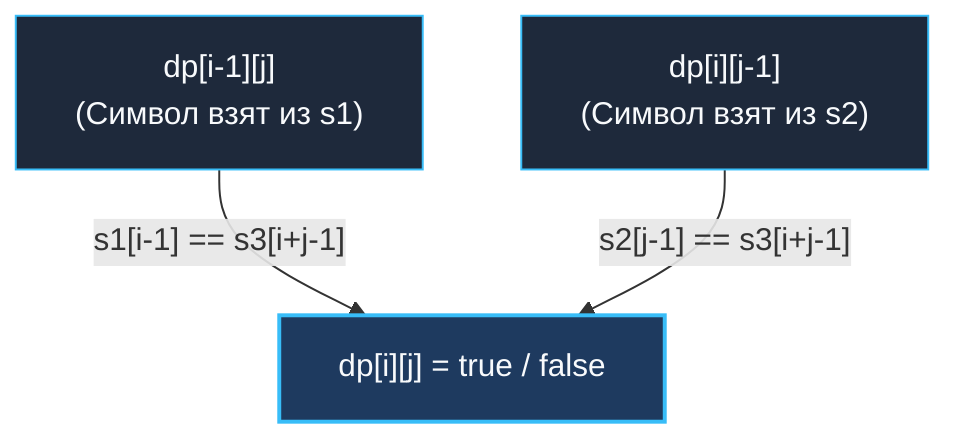
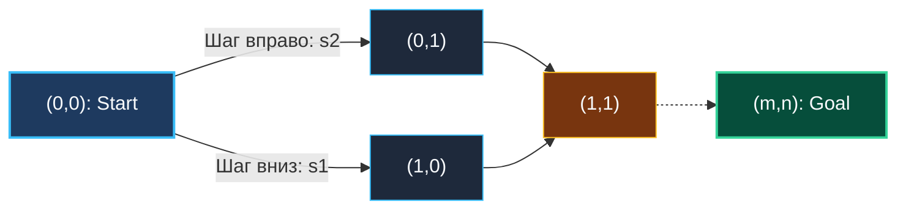

> *«Два параллельных потока соединяются воедино лишь тогда, когда в них соблюден строгий порядок каждого шага».*  
> — Брайан Керниган

Задача о перемежающейся строке (**Interleaving String**, LeetCode 97) — одна из наиболее концептуальных задач двумерного динамического программирования на стыке матричной геометрии и строковых потоков.

Если в [[6. Edit Distance]] мы свободно вставляли, удаляли и заменяли символы за определенную цену, то здесь правила строги: у нас есть два упорядоченных источника данных, и мы обязаны восстановить результирующий поток символ в символ, **не нарушая относительный порядок** ни в одном из источников.

В архитектуре бэкенда это точная модель **мультиплексирования и ресинхронизации параллельных потоков событий**:
- Слияние логов двух независимых реплик БД в единый аудиторский след (Audit Log Reassembly).
- Демультиплексирование TCP/QUIC фреймов при агрегации каналов.
- Проверка согласованности репликации в системах с Event Sourcing.

---

## 1. Постановка задачи и ранняя фильтрация

**Условие:**  
Даны три строки: `s1`, `s2` и `s3`.  
Определите, можно ли получить `s3` путем чередования (перемежения) символов из `s1` и `s2`.  
Относительный порядок символов внутри `s1` и `s2` обязан строго сохраняться.

```
Вход:  s1 = "aabcc", s2 = "dbbca", s3 = "aadbbcbcac"
Выход: true
Пояснение: разбиение по источникам:
s3 = "aa" (из s1) + "dbbc" (из s2) + "bc" (из s1) + "a" (из s2) + "c" (из s1)
```

> [!IMPORTANT] Закон сохранения длины: $O(1)$ фильтр
> Первое действие Senior-разработчика — проверить длины:
> `if len(s1) + len(s2) != len(s3) { return false }`  
> Если суммарная длина источников не совпадает с результирующей строкой, решение невозможно ни при каких обстоятельствах. Эта элементарная проверка отсекает массу невалидных запросов мгновенно.

---

## 2. Формулировка 2D DP: Два источника истины

Определим состояние:  
**$dp[i][j]$** — булево значение: можно ли составить префикс $s3$ длиной $i + j$, используя первые $i$ символов строки $s1$ и первые $j$ символов строки $s2$.

Текущий символ $s3[i+j-1]$ мог поступить только из двух мест:
1. **Из строки $s1$:** если символ $s1[i-1]$ совпадает с $s3[i+j-1]$, и мы могли успешно собрать предыдущую часть без него:  
   $dp[i-1][j] == \text{true}$
2. **Из строки $s2$:** если символ $s2[j-1]$ совпадает с $s3[i+j-1]$, и мы могли успешно собрать предыдущую часть без него:  
   $dp[i][j-1] == \text{true}$

Итоговое рекуррентное соотношение (дизъюнкция):

$$dp[i][j] = \Big(dp[i-1][j] \land s1[i-1] == s3[i+j-1]\Big) \;\lor\; \Big(dp[i][j-1] \land s2[j-1] == s3[i+j-1]\Big)$$



---

## 3. Двойственность представлений: Сетка как граф переходов

Матрицу $dp[i][j]$ можно рассматривать как **ориентированный ациклический граф (DAG)**:
- Стартовая вершина: $(0, 0)$ (обе строки пусты).
- Ребро вниз в $(i+1, j)$: берем символ из $s1$.
- Ребро вправо в $(i, j+1)$: берем символ из $s2$.
- Финишная вершина: $(m, n)$.

Задача эквивалентна поиску пути из $(0, 0)$ в $(m, n)$ на графе, что делает возможным решение через BFS/DFS с мемоизацией!



---

## 4. Идиоматичная реализация на Go 1.22+ ($O(N)$ памяти)

Вместо полноразмерной матрицы `[][]bool` мы используем сжатый одномерный срез `[]bool` длиной $n+1$:

```go
package interleaving

// IsInterleave проверяет, является ли s3 корректным перемежением s1 и s2.
// Временная сложность: O(M * N).
// Пространственная сложность: O(N) — один компактный булевый срез.
func IsInterleave(s1 string, s2 string, s3 string) bool {
	m, n := len(s1), len(s2)

	// Быстрый отсев: закон сохранения длины
	if m+n != len(s3) {
		return false
	}

	// dp[j] хранит истинность для префикса s1 длины i и s2 длины j
	dp := make([]bool, n+1)

	for i := 0; i <= m; i++ {
		for j := 0; j <= n; j++ {
			if i == 0 && j == 0 {
				dp[j] = true // Две пустые строки образуют пустую строку
			} else if i == 0 {
				// Первая строка: берем символы строго из s2
				dp[j] = dp[j-1] && s2[j-1] == s3[j-1]
			} else if j == 0 {
				// Первый столбец: берем символы строго из s1
				// dp[0] берет старое значение сверху (с предыдущего i)
				dp[0] = dp[0] && s1[i-1] == s3[i-1]
			} else {
				// Общий случай: либо сверху (из s1), либо слева (из s2)
				fromS1 := dp[j] && s1[i-1] == s3[i+j-1]
				fromS2 := dp[j-1] && s2[j-1] == s3[i+j-1]
				dp[j] = fromS1 || fromS2
			}
		}
	}

	return dp[n]
}
```

> [!WARNING] Ловушка обновления нулевого столбца: `dp[0]`
> В строке `dp[0] = dp[0] && s1[i-1] == s3[i-1]` переменная `dp[0]` справа содержит старое значение строки $i-1$.  
> Если хотя бы один символ префикса $s1$ не совпал с $s3$, `dp[0]` навсегда становится `false` и больше никогда не сможет стать `true`, что математически строго изолирует все пути, пытающиеся стартовать только из $s1$.

---

## 5. Mechanical Sympathy: Плотность упаковки и Bitset DP

В Go значение типа `bool` занимает **1 полный байт (8 бит)** памяти, а не 1 бит.  
Для $N = 1000$ булевый срез занимает 1000 байт — он легко помещается в L1D-кэш процессора.

Однако на уровне ассемблера вычисления `&&` и `||` порождают ветвления. Если символы в строках чередуются хаотично, процессорный предсказатель ветвлений (Branch Predictor) сталкивается с частыми сбросами конвейера.

### Архитектурный горизонт: Bitset DP за $O((M \cdot N) / 64)$
В высоконагруженных сетевых парсерах булевы срезы упаковывают в 64-битные числа `uint64`.  
Один регистр процессора `RAX` хранит сразу 64 состояния таблицы, а логические операции `AND`, `OR` и битовые сдвиги `SHL` вычисляют **64 ячейки матрицы за 1 такт CPU**. Это фундаментальный паттерн, используемый в сетевых фильтрах BPF / eBPF для мгновенного матчинга заголовков пакетов.

---

## 6. Вопросы для собеседования

> [!INTERVIEW] Вопросы сеньорского уровня
> 
> **Вопрос 1:** *Почему жадный алгоритм с двумя указателями (Two Pointers) здесь не работает?*  
> **Ответ:** Если текущий символ $s3$ совпадает **одновременно** с символом из $s1$ и с символом из $s2$ (например, $s1 = \text{"a"}, s2 = \text{"a"}, s3 = \text{"aa"}$), жадный алгоритм не знает, из какого источника взять букву. Выбрав наугад, мы можем заблокировать будущее продвижение и получить ложный `false`. Динамическое программирование исследует оба пути параллельно за $O(M \cdot N)$.
> 
> **Вопрос 2:** *Можно ли решить задачу с помощью BFS?*  
> **Ответ:** Да. Очередь хранит пары индексов `(i, j)`. Чтобы избежать повторного обхода одних и тех же состояний, используется `visited[i][j]` (хэш-таблица или матрица флагов). В худшем случае BFS просмотрит те же $O(M \cdot N)$ состояний.

---

## Итог кластера 2D DP

Мы полностью завершили блок двумерного динамического программирования:
1. **Теория:** Понимание пространства состояний $(i, j)$, отказ от джаггед-слайсов в пользу непрерывных буферов и сжатие до Rolling Vector.
2. **Сетки:** Unique Paths I & II — комбинаторика путей против преград и отсечение ветвлений.
3. **Оптимальные пути:** Minimum Path Sum — иммутабельность, кэш L1 и обратное восстановление маршрута.
4. **Сравнение строк:** Edit Distance — классическая матрица Левенштейна, диагональный `prevDiag` и масштабирование поиска.
5. **Мультиплексирование:** Interleaving String — слияние упорядоченных потоков и логические инварианты.

В следующем кластере мы углубимся в тончайшие строковые алгоритмы: Longest Common Subsequence, Distinct Subsequences, а также регулярные выражения: [[1. Теория. DP на строках]].