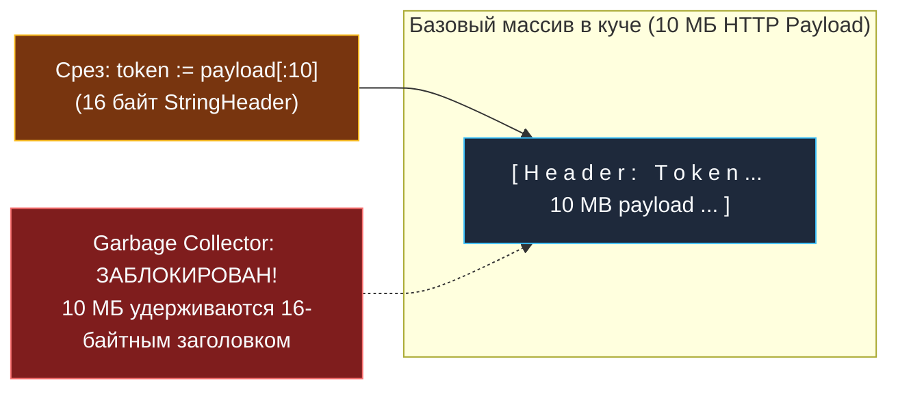
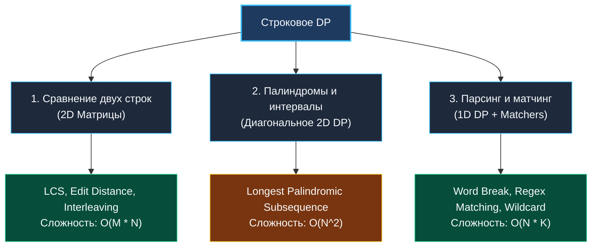

> *«Слова состоят из букв, но смысл рождается лишь в их неизменном порядке».*  
> — Брайан Керниган

Строковое динамическое программирование — специализированный и один из самых востребованных разделов алгоритмической инженерии. В отличие от числовых массивов и геометрических матриц, строки в современных языках программирования обладают уникальной природой: они неизменяемы (immutable), состоят из байтовых последовательностей (UTF-8) и требуют аккуратного обращения с памятью.

В архитектуре высоконагруженных систем строковое DP лежит в фундаменте:
- Систем контроля версий (Git diff, 3-way merge, алгоритм Майерса).
- Движков полнотекстового поиска и нечеткого матчинга (Elasticsearch, Lucene, BLEVE).
- Биоинформатики и геномики (сравнение ДНК/РНК последовательностей, BLAST).
- Лексических анализаторов, парсеров протоколов и компиляторов регулярных выражений.

---

## 1. Анатомия строк в Go: `StringHeader` и `strings.Clone`

Чтобы писать строковые алгоритмы с максимальной производительностью, необходимо понимать внутреннее устройство строк в Go runtime.  
Строка в Go — это не массив и не объект в стиле Java `String`. Это компактная 16-байтная структура:

```go
type stringStruct struct {
    str unsafe.Pointer // Указатель на непрерывный байтовый массив в куче/сегменте данных
    len int            // Длина строки строго в БАЙТАХ
}
```

Строка является **неизменяемым представлением (read-only view)** над базовым массивом байт.



> [!WARNING] Production-ловушка: Скрытая утечка памяти (Memory Leak)
> Операция среза подстроки `sub := s[0:10]` **не копирует данные**. Она создает новый `StringHeader`, поле `str` которого ссылается на исходный большой массив.  
> Если вы распарсили 10-мегабайтный JSON-ответ и сохранили в кэш подстроку длиной 20 байт, весь 10-мегабайтный массив **навсегда зависнет в памяти**, потому что GC видит живой указатель!  
> 
> **Решение (Go 1.20+):** Используйте стандартную функцию `strings.Clone`:
> ```go
> token := strings.Clone(payload[0:10]) // Выделяет ровно 10 байт и отпускает 10 МБ!
> ```

---

## 2. Mechanical Sympathy: Байты против Рун (UTF-8)

В Go индексация `s[i]` обращается к $i$-му **байту**, а не к символу:
1. **ASCII-текст (латиница, цифры, код):** 1 символ = 1 байт. Индексация `s[i]` занимает ровно 1 такт CPU ($O(1)$ без накладных расходов).
2. **UTF-8 (кириллица, китайские иероглифы, эмодзи):** 1 символ (руна) занимает от 1 до 4 байт.

```go
s := "Привет"
println(len(s))    // 12 байт!
println(s[0])      // 208 (первый байт префикса UTF-8 для 'П')
```

Если алгоритм DP манипулирует многоязычным текстом, прямое обращение к байтам разорвет символы на части. В таких сценариях перед запуском матрицы строки приводятся к срезу рун:
```go
runes := []rune(s) // O(N) по времени и памяти, но 100% Unicode-safety
```

---

## 3. Таксономия паттернов строкового DP

Все строковые задачи динамического программирования делятся на три фундаментальных класса:



### Паттерн 1: Сопоставление двух строк (LCS, Edit Distance)
Матрица $dp[i][j]$ связывает префикс $S[0 \dots i-1]$ с префиксом $T[0 \dots j-1]$.  
Переход зависит от совпадения крайних символов: $S[i-1] == T[j-1]$.

### Паттерн 2: Интервальное DP на палиндромах
Состояние $dp[i][j]$ отвечает за подстроку $S[i \dots j]$.  
Переход разворачивается изнутри наружу: подстрока является палиндромом, если $S[i] == S[j]$ и внутренняя часть $dp[i+1][j-1]$ — палиндром. Обход выполняется по возрастанию длины подстроки.

### Паттерн 3: Префиксный парсинг (Word Break)
Одномерный срез $dp[i]$ хранит булев флаг: можно ли разбить префикс $S[0 \dots i-1]$ на токены из словаря.

---

## 4. Архитектура и System Design: Алгоритм Майерса (Myers Diff) в Git

Почему `git diff` для двух файлов по 100 000 строк не падает по таймауту, хотя классический LCS требует $O(N \cdot M) = 10^{10}$ операций и десятки гигабайт памяти?

В 1986 году Юджин Майерс (Eugene Myers) предложил алгоритм, ставший мировым стандартом в системах контроля версий (GNU diff, Git):
1. **Жадный обход «змей» (Snakes):** В исходном коде программ 90–99% строк не меняются между коммитами. Совпадающие блоки символов образуют диагональные отрезки в матрице переходов.
2. **Параметризация по числу правок $D$:** Алгоритм ищет кратчайший путь на графе редактирования с помощью оптимизированного BFS, где сложность составляет не $O(N \cdot M)$, а:
   $$O\Big((N + M) \cdot D\Big)$$
   Где $D$ — реальное количество измененных строк! Если в файле из 50 000 строк изменилось 5 строк ($D = 5$), diff выполняется за доли миллисекунды.

---

## 5. Вопросы для собеседования

> [!INTERVIEW] Вопросы сеньорского уровня
> 
> **Вопрос 1:** *Как оптимизировать строковое 2D DP по памяти, если нужен только числовой ответ?*  
> **Ответ:** За счет сжатия до двух строк или одной строки со скалярной переменной `prevDiag` память сокращается с $O(M \cdot N)$ до $O(\min(M, N))$.
> 
> **Вопрос 2:** *Что эффективнее для проверки подстроки-палиндрома: 2D DP или алгоритм расширения из центра (Expand Around Center)?*  
> **Ответ:** Расширение из центра (Expand Around Center) требует $O(N^2)$ времени, но строго **$O(1)$ дополнительной памяти** (0 аллокаций), тогда как 2D DP требует $O(N^2)$ памяти. Для поиска самой длинной подстроки-палиндрома расширение из центра (или алгоритм Манакера за $O(N)$) архитектурно предпочтительнее.

---

## Итог

1. **Модель памяти:** Строка в Go — это `StringHeader` (16 байт). Для предотвращения утечек при удержании срезов используйте `strings.Clone` (Go 1.20+).
2. **Байты vs Руны:** ASCII обрабатывается байтами на полной скорости кэша L1; Unicode требует явной конвертации в `[]rune`.
3. **Разделение сложности:** Полный 2D DP подходит для коротких строк. Для мегабайтных текстов и файлов применяются эвристики и алгоритм Майерса $O((N+M) \cdot D)$.

В следующей лекции мы разберем математическую дуальность двух ключевых строковых задач — LCS и Edit Distance: [[2. LCS и edit distance]].