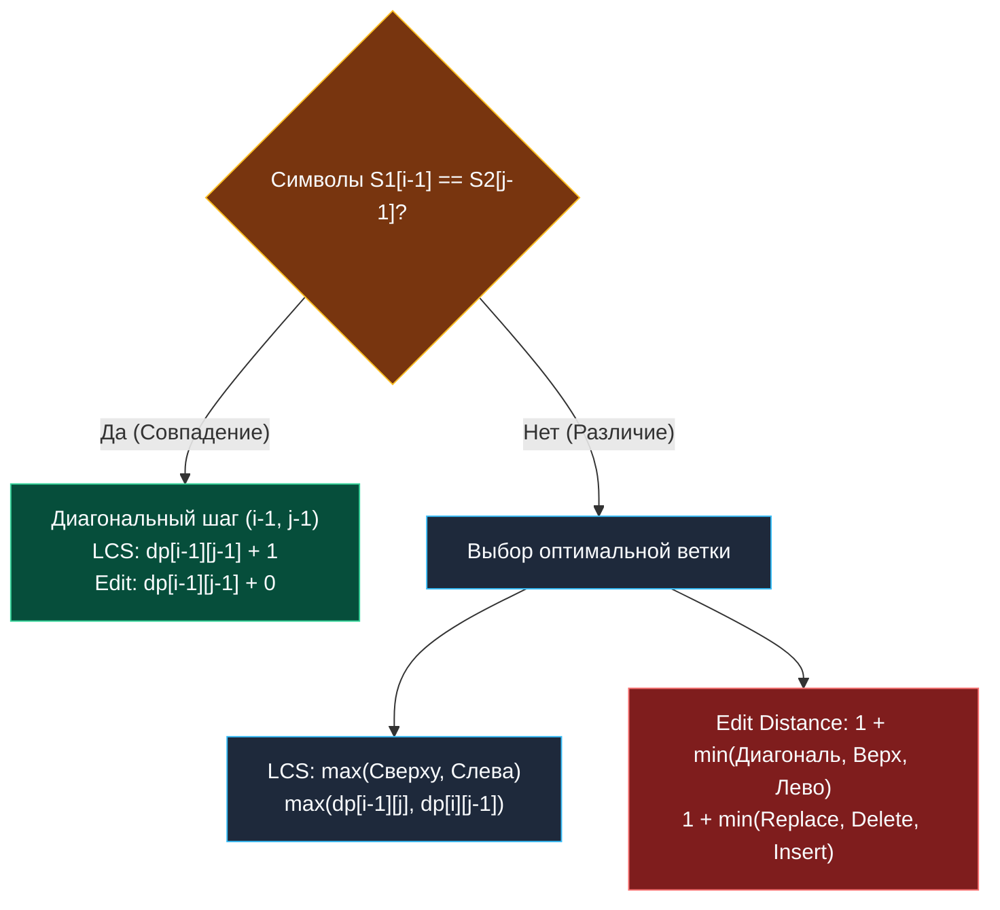

> *«Различия между текстами раскрываются лишь через то общее, что их объединяет».*  
> — Брайан Керниган

Наибольшая общая подпоследовательность (**LCS — Longest Common Subsequence**) и редакционное расстояние (**Edit Distance / Расстояние Левенштейна**) — две фундаментальные задачи строкового динамического программирования, представляющие собой две стороны одной математической медали.

Понимание их глубинного родства позволяет инженеру мгновенно переключаться между задачами поиска схожести (Similarity Matching) и задачами расчета различий (Difference / Patching).

---

## 1. Математическая дуальность: Связь LCS и Edit Distance

Пусть у нас есть две строки: $S_1$ длины $M$ и $S_2$ длины $N$.  
Обе задачи оперируют матрицей размера $(M+1) \times (N+1)$:
- **LCS** стремится **максимизировать** количество сохраненных совпадающих символов, идущих в исходном относительном порядке.
- **Edit Distance** стремится **минимизировать** количество правок (вставок, удалений, замен) для трансформации $S_1$ в $S_2$.

### Фундаментальная теорема эквивалентности (Delete + Insert Only):
Если мы исключим операцию замены (Replace) и разрешим только **удаления** и **вставки**, расстояние редактирования строго выражается через длину наибольшей общей подпоследовательности:

$$\text{EditDistance}_{del/ins}(S_1, S_2) = |S_1| + |S_2| - 2 \cdot \text{LCS}(S_1, S_2)$$

**Физический смысл формулы:**  
Чтобы превратить $S_1$ в $S_2$, оптимальнее всего оставить нетронутым каркас их наибольшей общей подпоследовательности. Тогда:
1. Из строки $S_1$ необходимо удалить все лишние символы: $|S_1| - \text{LCS}(S_1, S_2)$ операций.
2. В результирующую строку необходимо вставить недостающие символы строки $S_2$: $|S_2| - \text{LCS}(S_1, S_2)$ операций.
3. Сумма операций: $(|S_1| - \text{LCS}) + (|S_2| - \text{LCS}) = |S_1| + |S_2| - 2 \cdot \text{LCS}$.

---

## 2. Сравнительная анатомия DP-переходов



| Критерий | LCS (Longest Common Subsequence) | Edit Distance (Levenshtein) |
|---|---|---|
| **Целевая функция** | Максимизация ($\max$) | Минимизация ($\min$) |
| **База: пустая строка** | $dp[i][0] = 0, \quad dp[0][j] = 0$ | $dp[i][0] = i, \quad dp[0][j] = j$ |
| **При совпадении символов** | $dp[i-1][j-1] + 1$ | $dp[i-1][j-1]$ (бесплатно) |
| **При несовпадении** | $\max(dp[i-1][j], \; dp[i][j-1])$ | $1 + \min(dp[i-1][j-1], \; dp[i-1][j], \; dp[i][j-1])$ |
| **Применение в бэкенде** | Git diff, дедупликация, NLP | Опечатки, fuzzy search, автокоррекция |

---

## 3. Идиоматичная реализация LCS на Go 1.22+ ($O(\min(M, N))$ памяти)

Мы используем технику скользящего 1D-вектора с сохранением диагонального значения `prevDiag` на регистрах процессора:

```go
package strings

// LongestCommonSubsequence находит длину наибольшей общей подпоследовательности.
// Временная сложность: O(M * N).
// Пространственная сложность: O(min(M, N)) — один компактный срез.
func LongestCommonSubsequence(text1 string, text2 string) int {
	// Оптимизация памяти: text2 должна быть более короткой строкой
	if len(text1) < len(text2) {
		text1, text2 = text2, text1
	}

	m, n := len(text1), len(text2)
	dp := make([]int, n+1)

	for i := 1; i <= m; i++ {
		prevDiag := dp[0] // dp[i-1][0] == 0

		for j := 1; j <= n; j++ {
			temp := dp[j] // Сохраняем старое dp[i-1][j] до перезаписи

			if text1[i-1] == text2[j-1] {
				// Символы совпали: берем диагональ + 1
				dp[j] = prevDiag + 1
			} else {
				// Не совпали: берем максимум из верхнего (dp[j]) и левого (dp[j-1])
				dp[j] = max(dp[j], dp[j-1]) // Встроенный max() в Go 1.21+
			}

			prevDiag = temp // Для следующего столбца j это станет диагональю
		}
	}

	return dp[n]
}
```

---

## 4. Восстановление подпоследовательности: Алгоритм Хиршберга (Hirschberg's Algorithm)

Если бизнес-задача требует вернуть не просто *длину*, а *саму общую строку*, при сжатии таблицы до 1D мы сталкиваемся с проблемой: траектория переходов стерта.

Два пути решения:
1. **Хранить матрицу предков ($O(M \cdot N)$ памяти):** для строк длины $10^4$ это 800 МБ в куче.
2. **Алгоритм Хиршберга (1975):**  
   Гениальное применение парадигмы «Разделяй и властвуй» (Divide and Conquer). Первая строка делится пополам. С помощью прямого и обратного одномерного DP ищется точка расщепления второй строки. Затем алгоритм рекурсивно вызывается для двух половин.  
   **Результат:** восстановление самой строки за **$O(M \cdot N)$ времени** и **$O(\min(M, N))$ памяти**! Это эталон решения для систем с жесткими лимитами памяти.

---

## 5. System Design: Как Git масштабирует сравнение файлов?

Прямой запуск LCS на двух файлах по 50 000 строк требует $50\,000 \times 50\,000 = 2.5 \times 10^9$ операций. Ни один разработчик не готов ждать 10 секунд при каждом вызове `git status` или `git diff`.

В реальных VCS (Git, Mercurial) применяется трехуровневый конвейер:
1. **Хэширование строк:** Каждая строка файла хэшируется в 32-битное число. Сравнение строк превращается в сравнение целых чисел `uint32` в регистрах процессора ($O(1)$).
2. **Отсечение общих префиксов и суффиксов:** Если первые 1000 строк и последние 2000 строк идентичны, они мгновенно отбрасываются за один проход за $O(N)$.
3. **Алгоритм Майерса (Myers Diff):** Оставшийся фрагмент обрабатывается BFS-поиском по диагоналям («змеям»), находя минимальный diff за $O((N+M) \cdot D)$, где $D$ — число измененных строк.

---

## 6. Вопросы для собеседования

> [!INTERVIEW] Вопросы сеньорского уровня
> 
> **Вопрос 1:** *Как по известной длине LCS вычислить минимальное количество удалений и вставок для превращения строки S1 в S2?*  
> **Ответ:** Применяется формула: $\text{Deletions} + \text{Insertions} = |S_1| + |S_2| - 2 \cdot \text{LCS}(S_1, S_2)$. Удалений потребуется $|S_1| - \text{LCS}$, а вставок $|S_2| - \text{LCS}$.
> 
> **Вопрос 2:** *В чем разница между подстрокой (Substring) и подпоследовательностью (Subsequence)?*  
> **Ответ:** Подстрока (Substring) непрерывна: символы обязаны идти строго подряд без разрывов (задача Longest Common Substring решается обнулением ячейки при несовпадении: `dp[i][j] = 0`). Подпоследовательность (Subsequence) допускает пропуски любых символов при сохранении их исходного относительного порядка.

---

## Итог

1. **Единый каркас:** LCS максимизирует диагональные совпадения; Edit Distance минимизирует штрафы за несовпадения.
2. **Формула связи:** Без операции замены $\text{EditDistance} = |S_1| + |S_2| - 2 \cdot \text{LCS}$.
3. **Регистровый 1D DP:** Сохранение `prevDiag` снижает расход памяти до $O(\min(M, N))$ при нулевых аллокациях на шаг цикла.
4. **Алгоритм Хиршберга:** Позволяет восстановить саму последовательность за $O(M \cdot N)$ времени, не выходя за рамки $O(\min(M, N))$ памяти.

В следующей лекции мы детально погрузимся в пошаговый разбор и визуализацию задачи [[3. Longest Common Subsequence]].