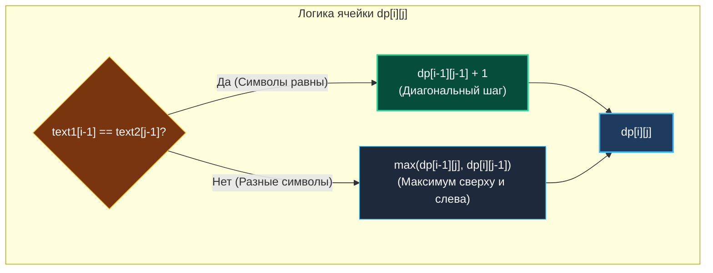
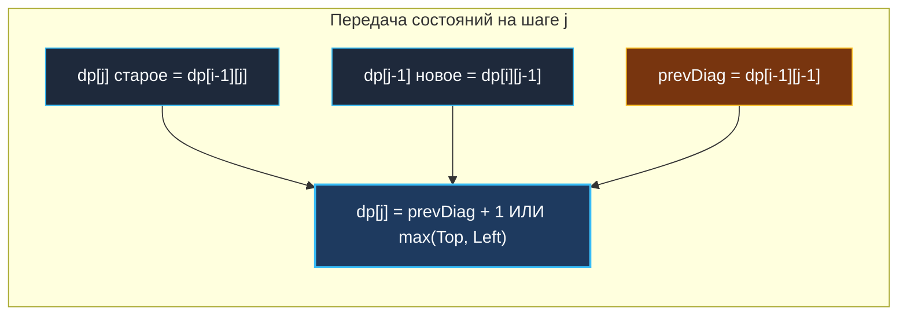

> *«Общие черты между текстами обнаруживаются не в спешке, а в терпеливом посимвольном сопоставлении».*  
> — Брайан Керниган

Задача о наибольшей общей подпоследовательности (**Longest Common Subsequence / LCS**, LeetCode 1143) — краеугольный камень алгоритмов сравнения текстов и вычисления различий (Diffing).

В отличие от подстроки (Substring), где символы обязаны следовать строго непрерывно, подпоследовательность (Subsequence) допускает пропуски любых символов при условии сохранения их исходного относительного порядка. Например, в строке `"abcde"` последовательности `"ace"`, `"bd"`, `"abe"` являются валидными подпоследовательностями, а `"ca"` — нет.

---

## 1. Постановка задачи и DP-таблица: `"abcde"` и `"ace"`

**Условие:**  
Даны две строки `text1` и `text2`.  
Верните длину их наибольшей общей подпоследовательности. Если общей подпоследовательности нет, верните `0`.

```
Вход:  text1 = "abcde", text2 = "ace"
Выход: 3
Пояснение: наибольшая общая подпоследовательность — "ace" (длина 3).
```

### Полноразмерная DP-таблица для `"abcde"` и `"ace"`:

Пусть $dp[i][j]$ — длина LCS для префиксов $text1[0 \dots i-1]$ и $text2[0 \dots j-1]$.

```
        ""     a      c      e
  ""  [ 0 ]  [ 0 ]  [ 0 ]  [ 0 ]
        ↓      ↓      ↓      ↓
  a   [ 0 ]  [ 1 ]* [ 1 ]  [ 1 ]   ('a' == 'a' ⟹ diag 0 + 1 = 1)
        ↓      ↓      ↓      ↓
  b   [ 0 ]  [ 1 ]  [ 1 ]  [ 1 ]   ('b' != 'c' ⟹ max(top:1, left:0) = 1)
        ↓      ↓      ↓      ↓
  c   [ 0 ]  [ 1 ]  [ 2 ]* [ 2 ]   ('c' == 'c' ⟹ diag 1 + 1 = 2)
        ↓      ↓      ↓      ↓
  d   [ 0 ]  [ 1 ]  [ 2 ]  [ 2 ]   ('d' != 'e' ⟹ max(top:2, left:1) = 2)
        ↓      ↓      ↓      ↓
  e   [ 0 ]  [ 1 ]  [ 2 ]  [ 3 ]*  ('e' == 'e' ⟹ diag 2 + 1 = 3)

  * — точки диагонального совпадения символов (диагональ + 1)
```



---

## 2. Рекуррентное соотношение и инварианты

1. **Если текущие символы совпадают (`text1[i-1] == text2[j-1]`):**  
   Мы обязаны включить этот символ в общую подпоследовательность. Длина увеличивается на 1 по сравнению с префиксами без этих символов:
   $$dp[i][j] = dp[i-1][j-1] + 1$$
2. **Если символы различаются (`text1[i-1] != text2[j-1]`):**  
   Символы не могут быть спарены одновременно. Мы пробуем отбросить либо символ из `text1`, либо символ из `text2`, выбирая лучший сценарий:
   $$dp[i][j] = \max\Big(dp[i-1][j], \; dp[i][j-1]\Big)$$

### Базовые краевые условия:
- Если любая из строк пуста, общих символов быть не может:  
  $dp[i][0] = 0$ для всех $i \in [0 \dots M]$, и $dp[0][j] = 0$ для всех $j \in [0 \dots N]$.

---

## 3. Идиоматичная реализация на Go 1.22+ ($O(\min(M, N))$ памяти)

Вместо выделения матрицы $(M+1) \times (N+1)$ мы выделяем компактный срез длины $\min(M, N) + 1$.  
Для сохранения диагонального значения $dp[i-1][j-1]$ используется регистровая переменная `prevDiag`:

```go
package strings

// LongestCommonSubsequence вычисляет длину LCS сжатым 1D-вектором.
// Временная сложность: O(M * N).
// Пространственная сложность: O(min(M, N)) — 0 аллокаций в горячем цикле.
func LongestCommonSubsequence(text1 string, text2 string) int {
	// Гарантируем, что text2 — более короткая строка
	if len(text1) < len(text2) {
		text1, text2 = text2, text1
	}

	m, n := len(text1), len(text2)
	dp := make([]int, n+1)

	for i := 1; i <= m; i++ {
		prevDiag := dp[0] // dp[i-1][0] == 0

		for j := 1; j <= n; j++ {
			temp := dp[j] // Сохраняем старое dp[i-1][j] до его перезаписи

			if text1[i-1] == text2[j-1] {
				dp[j] = prevDiag + 1
			} else {
				// Go 1.21+ встроенный max()
				dp[j] = max(dp[j], dp[j-1])
			}

			prevDiag = temp // Обновляем диагональ для следующего столбца
		}
	}

	return dp[n]
}
```



---

## 4. Mechanical Sympathy: Аппаратный префетчинг и кэш-линии

Посмотрим, как процессор исполняет внутренний цикл:
```go
for j := 1; j <= n; j++ {
    temp := dp[j]
    if text1[i-1] == text2[j-1] { ... }
    ...
}
```

1. **Вектор `dp` в L1D-кэше:** Длина `dp` равна $N + 1$. Если $N \le 4000$, срез занимает меньше 32 КБ и **целиком помещается в L1 Data Cache** процессора. Скорость доступа к нему составляет ~1 нс (4 такта CPU).
2. **Фиксированный байт `text1[i-1]`:** Во внутреннем цикле символ `text1[i-1]` не меняется. Компилятор Go загружает его в один из младших регистров (например, `AL` или `DL`) ровно один раз на всю строку.
3. **Последовательный доступ к `text2`:** Байты `text2` читаются строго последовательно (`stride = 1`). Аппаратный блок предвыборки (Hardware Stream Prefetcher) подгружает кэш-линии по 64 байта без задержек.

---

## 5. Восстановление подпоследовательности (Path Reconstruction)

Если бизнес-логике требуется сама строка (например, `"ace"`), мы можем восстановить её обратным ходом по 2D-таблице от $(m, n)$ к $(0, 0)$:

```go
// ReconstructLCS восстанавливает саму строку LCS по 2D таблице dp.
func ReconstructLCS(text1, text2 string, dp [][]int) string {
	i, j := len(text1), len(text2)
	result := make([]byte, 0, dp[i][j])

	for i > 0 && j > 0 {
		if text1[i-1] == text2[j-1] {
			result = append(result, text1[i-1])
			i--
			j--
		} else if dp[i-1][j] > dp[i][j-1] {
			i-- // Оптимум пришел сверху
		} else {
			j-- // Оптимум пришел слева
		}
	}

	// Разворачиваем срез, так как собирали с конца
	for l, r := 0, len(result)-1; l < r; l, r = l+1, r-1 {
		result[l], result[r] = result[r], result[l]
	}

	return string(result)
}
```

---

## 6. Вопросы для собеседования

> [!INTERVIEW] Вопросы сеньорского уровня
> 
> **Вопрос 1:** *Как алгоритм LCS связан с задачей поиска наибольшей возрастающей подпоследовательности (LIS — Longest Increasing Subsequence)?*  
> **Ответ:** Задачу LIS для массива $A$ можно свести к LCS! Если создать отсортированную копию $B = \text{sort}(A)$ без дубликатов, то $\text{LCS}(A, B)$ будет в точности наибольшей возрастающей подпоследовательностью $A$. Хотя специализированный алгоритм Пасьянса Терпения (Patience Sorting) с бинарным поиском решает LIS быстрее ($O(N \log N)$), связь через LCS демонстрирует глубокое понимание эквивалентности алгоритмических парадигм.
> 
> **Вопрос 2:** *Что если текст содержит символы Unicode?*  
> **Ответ:** При наличии UTF-8 символов строки предварительно преобразуются в срезы рун `[]rune(text1)` и `[]rune(text2)`, чтобы сравнение оперировало полноценными Code Points, а не разорванными байтами.

---

## Итог

1. **Суть LCS:** Совпадение символов дает шаг по диагонали $+1$; несовпадение берет максимум сверху и слева.
2. **Таблица 1D Rolling:** Выбор меньшей строки для среза `dp` дает $O(\min(M, N))$ памяти и помещает рабочий вектор в кэш L1D.
3. **Реконструкция ответа:** Для получения самой строки требуется либо 2D-таблица за $O(M \cdot N)$ памяти, либо алгоритм Хиршберга за $O(\min(M, N))$.

В следующей лекции мы разберем задачу о подсчете различных подпоследовательностей, где сложение вариантов сочетается со строгой префиксной фильтрацией: [[4. Distinct Subsequences]].