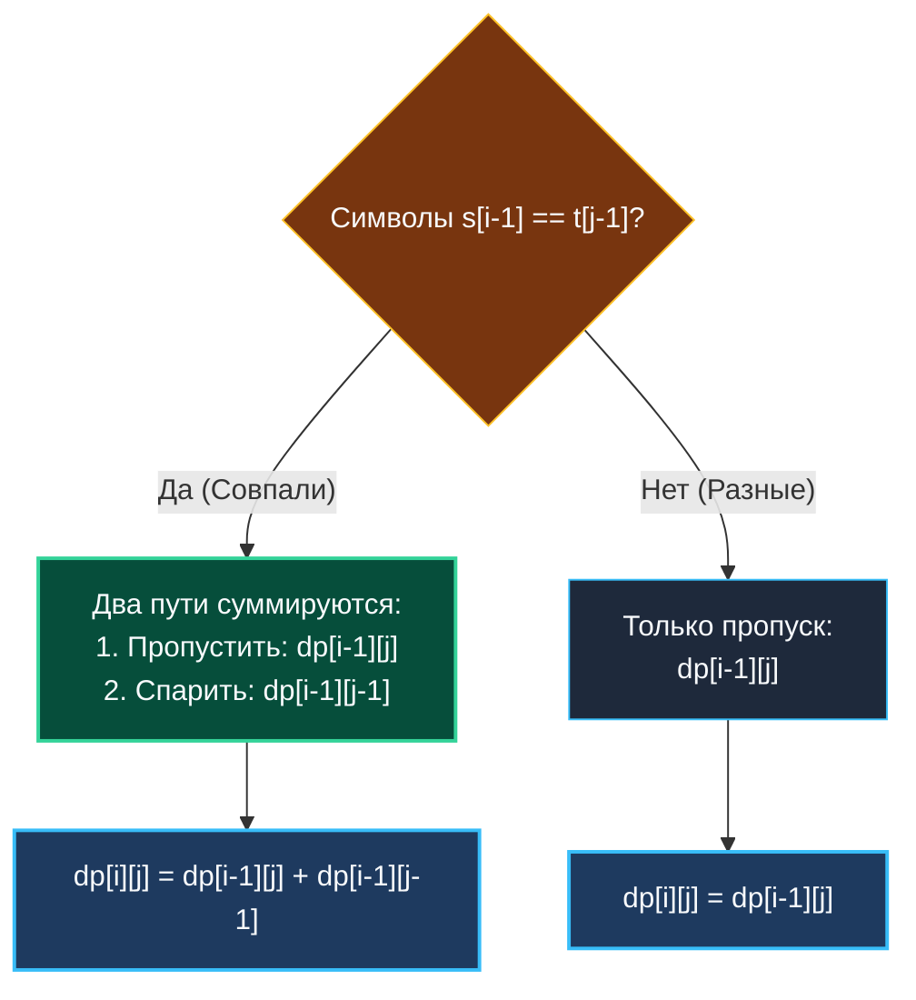
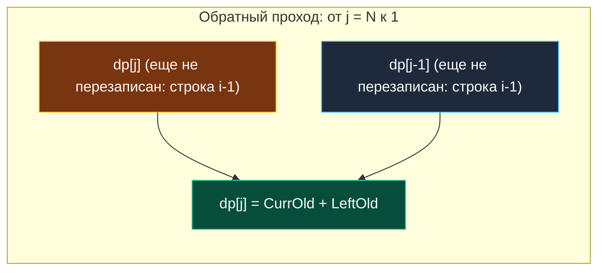

> *«Количество путей к цели может быть огромным, но каждый из них строится из одних и тех же элементарных кирпичиков».*  
> — Брайан Керниган

Задача о различных подпоследовательностях (**Distinct Subsequences**, LeetCode 115) переводит строковое динамическое программирование в плоскость комбинаторного анализа.

Если в [[3. Longest Common Subsequence]] мы определяли *длину* максимального пересечения, то здесь перед нами стоит задача жесткого подсчета: **сколькими уникальными способами** можно вырезать строку $T$ из исходной строки $S$, удаляя произвольные символы, но не нарушая порядок оставшихся?

В архитектуре распределенных систем этот паттерн лежит в основе:
- Детекции паттернов в распределенном трейсинге (OpenTelemetry): сколько подпоследовательностей вызовов в неструктурированном потоке логов соответствуют целевому сценарию сбоя?
- Аудита сетевого трафика и DPI (Deep Packet Inspection): сопоставление подозрительных сигнатур атак в фрагментированном потоке пакетов.

---

## 1. Постановка задачи и комбинаторный взрыв

**Условие:**  
Даны две строки: исходный текст `s` и целевой шаблон `t`.  
Верните количество различных подпоследовательностей `s`, которые в точности равны `t`.

```
Вход:  s = "rabbbit", t = "rabbit"
Выход: 3
Пояснение: в слове "rabbbit" три буквы 'b'. Чтобы получить "rabbit", 
достаточно удалить любую одну из них: C(3, 1) = 3 способа.
```

---

## 2. Формулировка 2D DP: Дилемма «Брать или пропускать»

Определим состояние:  
**$dp[i][j]$** — число способов составить префикс $t[0 \dots j-1]$ из префикса $s[0 \dots i-1]$.

Рассматривая очередной символ исходного текста $s[i-1]$, мы сталкиваемся с выбором:
1. **Пропустить символ $s[i-1]$:**  
   Мы игнорируем текущий символ текста. Число способов собрать $t[0 \dots j-1]$ в таком случае в точности равно результату без этого символа:  
   $$dp[i-1][j]$$
2. **Использовать символ $s[i-1]$ (если $s[i-1] == t[j-1]$):**  
   Если текущий символ текста совпал с текущим символом шаблона, мы можем их спарить! Тогда число способов прибавляется из состояния без обоих этих символов:  
   $$dp[i-1][j-1]$$

Итоговое рекуррентное соотношение:

$$dp[i][j] = \begin{cases} 
dp[i-1][j] + dp[i-1][j-1], & \text{если } s[i-1] == t[j-1] \\ 
dp[i-1][j], & \text{если } s[i-1] \neq t[j-1] 
\end{cases}$$



### Базовые краевые условия:
- **$dp[i][0] = 1$:** Пустую строку $t$ можно собрать из любого префикса $s$ ровно **одним способом** — удалив абсолютно все символы.
- **$dp[0][j] = 0$ (при $j > 0$):** Непустую строку $t$ невозможно получить из пустой строки $s$.

---

## 3. Архитектурный инсайт: Обратный обход (Сжатие до $O(N)$ памяти)

Как сжать матрицу до одного одномерного среза `dp` длиной $N+1$, не вводя дополнительных переменных для диагонали?

В формуле:
$$dp[j] = dp[j] + dp[j-1]$$
Нам нужны оба значения из **предыдущей строки $i-1$**:
- $dp[i-1][j]$ (старое значение в текущем столбце).
- $dp[i-1][j-1]$ (старое значение в левом столбце).

Если мы запустим внутренний цикл **слева направо** ($j = 1 \dots N$), то обновление $dp[j-1]$ сотрет старое значение, необходимое для $dp[j]$.

**Инженерное решение (Паттерн 0/1 Рюкзака):**  
Запустим внутренний цикл **справа налево** — от $j = N$ до $1$!



При обратном ходе ячейка $dp[j-1]$ **еще не обновлена** на текущей строке $i$ — она все еще хранит значение с предыдущей строки $i-1$! Это полностью исключает порчу данных без единой вспомогательной переменной.

---

## 4. Идиоматичная реализация на Go 1.22+

```go
package strings

// NumDistinct возвращает количество различных подпоследовательностей s, равных t.
// Временная сложность: O(M * N).
// Пространственная сложность: O(N) — один срез размера len(t)+1.
func NumDistinct(s string, t string) int {
	m, n := len(s), len(t)

	// Быстрый отсев: шаблон не может быть длиннее исходного текста
	if n > m {
		return 0
	}

	// Используем uint64 для защиты от переполнения промежуточных сумм
	dp := make([]uint64, n+1)

	// База: пустую строку t можно собрать 1 способом
	dp[0] = 1

	for i := 1; i <= m; i++ {
		// ОБРАТНЫЙ ОБХОД: справа налево!
		// Гарантирует, что dp[j-1] берется из предыдущей строки i-1.
		for j := n; j >= 1; j-- {
			if s[i-1] == t[j-1] {
				dp[j] += dp[j-1]
			}
			// При несовпадении dp[j] остается неизменным: dp[j] = dp[j] (сверху)
		}
	}

	return int(dp[n])
}
```

---

## 5. Mechanical Sympathy: Направление памяти и Hardware Prefetcher

Может ли обратный обход замедлить выполнение на уровне процессорного кэша?

1. **Обратный префетчинг:** В современных микроархитектурах (Intel Core, AMD Zen, Apple Silicon) блоки предвыборки данных (Data Stream Prefetchers) поддерживают как положительный, так и отрицательный шаг (`stride = -1`). Процессор распознает обратное чтение кэш-линий и подтягивает их заранее с той же эффективностью, что и при прямом обходе.
2. **Плотность упаковки:** Срез `dp` имеет длину всего $N + 1$ (длина шаблона $T$, обычно не превышает сотен символов). Массив размером в несколько килобайт **намертво оседает в L1D-кэше** процессора. Все операции сложения производятся со скоростью кэша (~1 нс).

---

## 6. Вопросы для собеседования

> [!INTERVIEW] Вопросы сеньорского уровня
> 
> **Вопрос 1:** *Почему мы инициализируем `dp[0] = 1`, если пустой префикс не содержит символов?*  
> **Ответ:** В комбинаторике существует ровно одно пустое подмножество. Базовое значение `dp[0] = 1` служит источником («генератором») единиц: как только первый символ шаблона $t[0]$ встречается в строке $s$, он берет $dp[0] = 1$ и начинает формировать валидные пути. Если установить $dp[0] = 0$, вся таблица навсегда останется нулевой.
> 
> **Вопрос 2:** *Что если значения промежуточных комбинаций превысят предел `uint64`?*  
> **Ответ:** В реальных системах комбинаторного анализа (например, расчет энтропии в криптографии) сложение выполняется по модулю $10^9 + 7$ (`dp[j] = (dp[j] + dp[j-1]) % MOD`), либо используется длинная арифметика `math/big.Int`.

---

## Итог

1. **Комбинаторная формула:** $dp[i][j] = dp[i-1][j] + (s[i-1] == t[j-1] \ ? \ dp[i-1][j-1] : 0)$.
2. **Обратный цикл — ключ к $O(N)$ памяти:** Обход от $N$ к $1$ сохраняет значения предыдущей строки $i-1$ без вспомогательных переменных.
3. **Раннее отсечение:** Проверка `if len(t) > len(s)` защищает от лишней работы за $O(1)$.

В следующей лекции мы перейдем к одной из вершин алгоритмической сложности в строковом DP — реализации сопоставления с регулярными выражениями: [[5. Regular Expression Matching]].