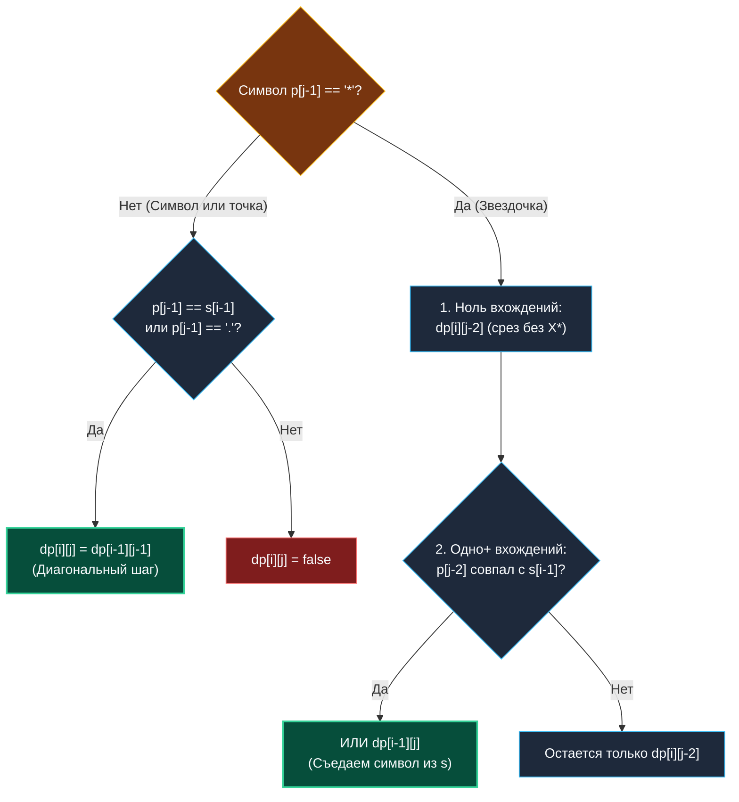
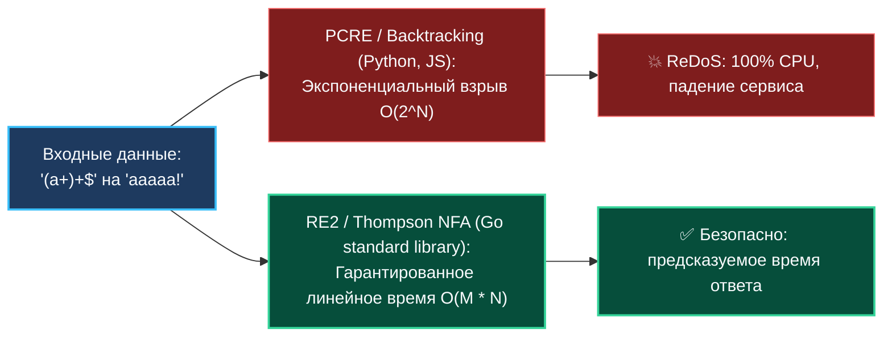

> *«Регулярные выражения — это либо элегантный скальпель инженера, либо граната в руках неосторожного программиста».*  
> — Брайан Керниган

Задача о сопоставлении с регулярным выражением (**Regular Expression Matching**, LeetCode 10) — признанный Эверест строкового динамического программирования.

Если в предыдущих задачах символы сопоставлялись один к одному, то здесь мы моделируем фундаментальный концепт теории вычислений — **недетерминированный конечный автомат (НКА / NFA)** с квантификатором Клини (`*` — ноль или более повторений предшествующего символа) и метасимволом любого символа (`.`).

В бэкенде эта задача открывает понимание того, почему стандартный пакет `regexp` в Go гарантированно защищен от катастрофических уязвимостей **ReDoS (Regular Expression Denial of Service)**, выводящих из строя целые кластеры на Python, Node.js или Java.

---

## 1. Постановка задачи и правила грамматики

**Условие:**  
Даны строка `s` (текст) и строка `p` (шаблон регулярного выражения).  
Реализовать функцию проверки полного совпадения строки с шаблоном со следующими правилами:
1. `.` — соответствует **любому одиночному символу**.
2. `*` — соответствует **нулю или более повторений предшествующего символа**.

```
Вход:  s = "aab", p = "c*a*b"
Выход: true
Пояснение: 'c*' берется 0 раз (""), 'a*' берется 2 раза ("aa"), 'b' совпадает с 'b'. Итог: "aab".
```

---

## 2. Логика переходов: Моделирование состояний автомата

Определим состояние:  
**$dp[i][j]$** — истинно, если префикс строки $s[0 \dots i-1]$ полностью матчится префиксом паттерна $p[0 \dots j-1]$.

При вычислении ячейки $(i, j)$ смотрим на символ паттерна $p[j-1]$:

### Сценарий 1: Обычный символ или точка (`p[j-1] != '*'`)
Символ паттерна сопоставляется ровно с одним символом строки:
$$dp[i][j] = dp[i-1][j-1] \quad \text{при условии, что} \quad (p[j-1] == s[i-1] \lor p[j-1] == '.')$$

### Сценарий 2: Квантификатор звездочка (`p[j-1] == '*'`)
Символ `*` никогда не стоит сам по себе — он модифицирует предшествующий символ $p[j-2]$.  
Перед нами две альтернативы:
1. **Ноль вхождений (Zero occurrences):**  
   Мы полностью игнорируем блок $p[j-2] \ p[j-1]$ (например, `c*` превращается в пустую строку). Значение берется на 2 шага назад по паттерну:  
   $$dp[i][j-2]$$
2. **Одно или более вхождений (Consume one character):**  
   Если символ $p[j-2]$ совпадает с текущим символом строки $s[i-1]$ (или $p[j-2] == '.'$), мы «поглощаем» символ строки $s[i-1]$, но **оставляем паттерн на месте**, так как `*` может поглотить следующий символ:  
   $$dp[i-1][j]$$

Итоговая дизъюнкция для `*`:
$$dp[i][j] = dp[i][j-2] \;\lor\; \Big((p[j-2] == s[i-1] \lor p[j-2] == '.') \land dp[i-1][j]\Big)$$



---

## 3. Идиоматичная реализация на Go 1.22+ ($O(N)$ памяти)

Так как текущая строка $i$ зависит только от значений в этой же строке со смещением назад ($dp[i][j-2]$) и от значений в предыдущей строке ($dp[i-1][j]$ и $dp[i-1][j-1]$), мы используем два чередующихся среза: `prev` и `curr`.

```go
package regex

// IsMatch проверяет полное соответствие строки s шаблону p с поддержкой '.' и '*'.
// Временная сложность: O(M * N).
// Пространственная сложность: O(N) — два компактных булевых среза длины len(p)+1.
func IsMatch(s string, p string) bool {
	m, n := len(s), len(p)

	prev := make([]bool, n+1)
	curr := make([]bool, n+1)

	// База: пустая строка s полностью совпадает с пустым шаблоном p
	prev[0] = true

	// База для пустой строки: шаблоны вида a*, a*b*, a*b*c* могут свернуться в пустую строку
	for j := 2; j <= n; j++ {
		if p[j-1] == '*' {
			prev[j] = prev[j-2]
		}
	}

	for i := 1; i <= m; i++ {
		// Непустая строка не может совпасть с пустым паттерном
		curr[0] = false

		for j := 1; j <= n; j++ {
			if p[j-1] == '*' {
				// Вариант 1: ноль повторений (игнорируем блок p[j-2..j-1])
				curr[j] = curr[j-2]

				// Вариант 2: одно или более повторений
				if p[j-2] == '.' || p[j-2] == s[i-1] {
					curr[j] = curr[j] || prev[j]
				}
			} else {
				// Одиночный символ или точка
				if p[j-1] == '.' || p[j-1] == s[i-1] {
					curr[j] = prev[j-1]
				} else {
					curr[j] = false
				}
			}
		}

		// Swap срезов: смена поколений без дополнительных аллокаций
		prev, curr = curr, prev
	}

	return prev[n]
}
```

---

## 4. System Design: Архитектура RE2 против PCRE и угроза ReDoS

Почему знание этого алгоритма обязательно для Senior Backend инженера?

Большинство языков программирования (Python `re`, JavaScript RegExp, PHP, Perl, Ruby) используют для регулярных выражений движки на основе **обратного слежения (Backtracking / PCRE)**.  
Если пользователь отправляет строку:
`aaaaaaaaaaaaaaaaaaaaaaaaaaaaa!`
на паттерн вида `(a+)+$`, движок начинает экспоненциальный перебор всех возможных группировок.  
Сложность взлетает до **$O(2^N)$**! Одно невинное регулярное выражение подвешивает CPU ядра на часы — сервис падает с отказом в обслуживании (уязвимость **ReDoS — Regular Expression Denial of Service**).



### Почему Go не подвержен ReDoS?
Стандартный пакет `regexp` в Go построен на библиотеке **RE2** (созданной Робом Пайком и Кеном Томпсоном в Google).  
В ее основе лежит алгоритм Томпсона (Thompson NFA Construction, 1968 г.), который моделирует состояния параллельно — в точности так же, как наше DP!  
Время работы регулярных выражений в Go **строго ограничено $O(M \cdot N)$**. Никакой злоумышленник не может положить ваш сервис каверзным вводом.

---

## 5. Вопросы для собеседования

> [!INTERVIEW] Вопросы сеньорского уровня
> 
> **Вопрос 1:** *Какова плата за безопасность RE2 в Go по сравнению с PCRE?*  
> **Ответ:** За гарантию линейного времени $O(M \cdot N)$ RE2 платит отказом от функций, требующих экспоненциального бэктрекинга: в Go `regexp` намеренно не поддерживаются обратные ссылки (Backreferences, `\1`) и произвольные опережающие/ретроспективные проверки (Lookahead/Lookbehind assertions).
> 
> **Вопрос 2:** *Почему при вычислении curr[j-2] мы обращаемся к текущей строке, а не к предыдущей?*  
> **Ответ:** Потому что вариант «ноль повторений» (`curr[j] = curr[j-2]`) означает, что мы прямо сейчас, не поглотив ни одного символа из строки $s$, делаем вывод: блок $X*$ пропускается для текущей длины строки. Мы проверяем, мог ли тот же самый префикс строки $s$ совпасть с паттерном, в котором этого блока вообще не было.

---

## Итог

1. **Модель NFA:** Квантификатор `*` ветвит состояние на пропуск двух символов паттерна (`curr[j-2]`) или поглощение символа строки (`prev[j]`).
2. **Своп срезов:** Использование пары `prev` и `curr` исключает аллокации в куче на каждом шаге цикла.
3. **ReDoS иммунитет:** Алгоритм работает с гарантированной сложностью $O(M \cdot N)$, что объясняет фундаментальную надежность пакета `regexp` в Go.

В следующей финальной лекции кластера строкового DP мы разберем задачу о сопоставлении с масками файлов (Glob / Wildcard): [[6. Wildcard Matching]].