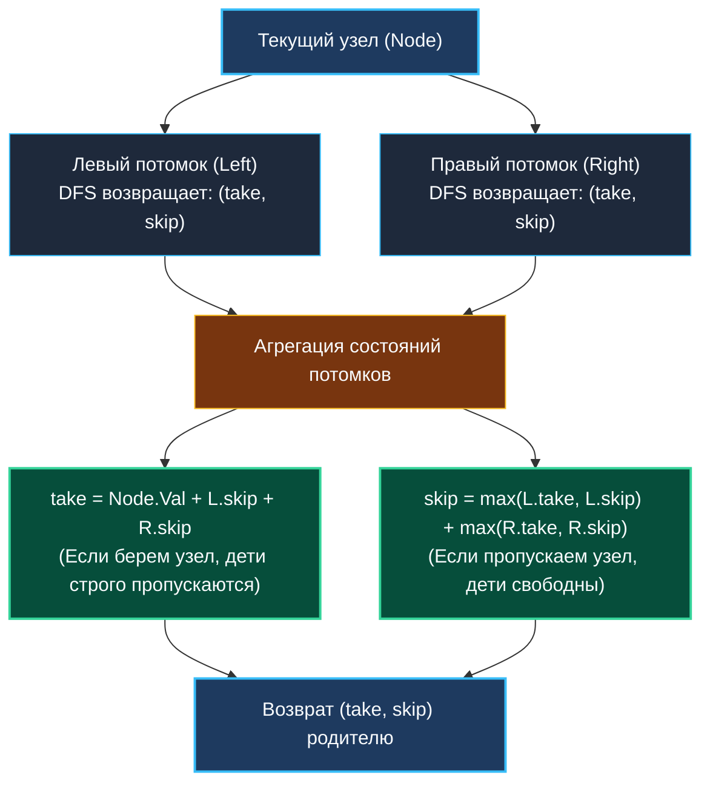
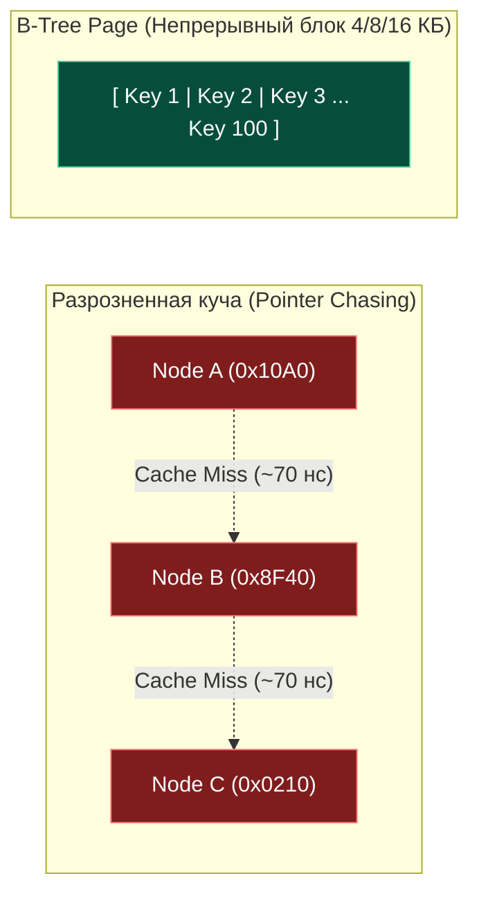

> *«Дерево познается по плодам его, а корень черпает силу из скрытой глубины ветвей».*  
> — Брайан Керниган

Переход от динамического программирования на линейных массивах и матрицах к DP на деревьях (Tree DP) — это качественный скачок в абстракции. На числовой оси или координатной сетке мы привыкли итерироваться простыми циклами, заполняя ячейки в предсказуемом порядке (Bottom-Up). В дереве линейный порядок невозможен: дерево — это иерархический направленный ациклический граф (DAG).

Единственный способ корректно вычислить состояние родительского узла — сначала получить оптимальные ответы для всех его поддеревьев. Поэтому **динамическое программирование на деревьях всегда реализуется через обход в глубину в обратном порядке (Post-Order DFS)**: мы спускаемся до листьев (базовые случаи DP) и вычисляем переходы снизу вверх на этапе всплытия из рекурсии.

---

## 1. Архитектура состояний: Конечный автомат на узле

В задачах на деревьях состояние поддерева редко описывается единственным скалярным числом. Поскольку каждый узел топологически связан со своим родителем, решение, принятое в текущем узле (например, «включить этот узел в выборку»), накладывает жесткие ограничения на допустимые действия родителя.

Отсюда возникает паттерн **конечного автомата на узле** (FSM on Tree Node). Рекурсивная функция обхода возвращает кортеж состояний:
1. `take`: оптимальный результат для поддерева при условии, что текущий узел **включен** (захвачен).
2. `skip`: оптимальный результат для поддерева при условии, что текущий узел **пропущен** (свободен).



Родительский узел, принимая пару `(take, skip)` от левого и правого потомков, агрегирует их за $O(1)$ операций и передает свой кортеж выше по дереву. В корне дерева глобальным ответом становится $\max(\text{rootTake}, \text{rootSkip})$.

---

## 2. Under the Hood: Стек горутины, отсутствие TCO и `morestack`

В языках с оптимизацией хвостовой рекурсии (TCO — Tail Call Optimization, таких как Haskell или компиляторы Scheme) глубокая рекурсия компилируется в плоский цикл.  
**В Go компилятор намеренно не выполняет TCO.** Каждый рекурсивный вызов функции создает полноценный стек-фрейм (Stack Frame).

1. **Размер начального стека:** Рантайм Go выделяет новой горутине стек размером всего **2 КБ – 4 КБ**.
2. **Несбалансированные деревья:** Если дерево вырождается в связный список глубиной $N = 100\,000$, глубина рекурсии достигнет 100 000 кадров.
3. **Механизм `runtime.morestack`:** Когда стек переполняется, рантайм вызывает процедуру расширения:
   - Аллоцирует в куче новый блок памяти вдвое большего размера.
   - Копирует все стек-фреймы на новое место.
   - Корректирует указатели внутри кадров.

При миллионах рекурсивных шагов постоянный `morestack` порождает огромные задержки (Tail Latency Spikes). Для потенциально глубоких деревьев в продакшене Senior-разработчик реализует итеративный DFS с явным стеком `[]*TreeNode` в куче.

---

## 3. Mechanical Sympathy: Pointer Chasing и почему СУБД отвергли BST

Бинарные деревья в памяти представляются через указатели:
```go
type TreeNode struct {
    Val   int
    Left  *TreeNode
    Right *TreeNode
}
```

Это фундаментальная проблема для современных процессоров, известная как **Pointer Chasing (погоня за указателями)**:
- Каждый узел `TreeNode` выделяется аллокатором Go в произвольном фрагменте кучи.
- Указатели `Left` и `Right` ссылаются на непредсказуемые адреса оперативной памяти.
- При переходе `node = node.Left` процессор не может предсказать шаблон доступа. Аппаратный префетчер бессилен.
- Каждый переход к дочернему узлу влечет за собой **L1/L2 Cache Miss** с ожиданием подгрузки строки памяти из RAM в течение 50–100 наносекунд.



> [!NOTE] Почему в СУБД (PostgreSQL, MySQL) используются B-деревья, а не BST?
> Именно из-за катастрофических потерь производительности на Pointer Chasing в базах данных индексы строятся на **B-деревьях (B+Trees)**. Узел B-дерева имеет размер 4 КБ, 8 КБ или 16 КБ (точно под размер страницы операционной системы). Десятки ключей упакованы в один непрерывный плоский срез. При чтении узла процессор подгружает его целиком в кэш L1D/L2, и бинарный поиск по сотням ключей внутри страницы выполняется со скоростью кэша за считанные наносекунды.

---

## 4. Идиоматичный Go: Множественный возврат в регистрах CPU (Zero-Alloc)

В Java или Python возврат двух значений из функции требует создания объекта-обертки `Pair` или кортежа, что порождает паразитные аллокации в куче на каждом узле дерева.

В Go множественные возвращаемые значения — часть сигнатуры функции. Благодаря внедрению **ABIInternal (Register-based Calling Convention)** в современных компиляторах Go:
- Первое значение `take` возвращается непосредственно в регистре **`RAX`** (или `R0` на ARM64).
- Второе значение `skip` возвращается в регистре **`RDX`** (или `R1` на ARM64).

```go
// Идиоматичный шаблон Tree DP в Go: 0 аллокаций памяти!
func dfs(node *TreeNode) (take, skip int) {
	if node == nil {
		return 0, 0
	}

	leftTake, leftSkip := dfs(node.Left)
	rightTake, rightSkip := dfs(node.Right)

	// Переходы FSM:
	take = node.Val + leftSkip + rightSkip
	skip = max(leftTake, leftSkip) + max(rightTake, rightSkip) // Go 1.21+ встроенный max()

	return take, skip
}
```
Передача состояний происходит на уровне регистров CPU со скоростью **1 такт на операцию**, создавая абсолютный ноль нагрузки на Garbage Collector.

---

## 5. System Design: Иерархические квоты и MapReduce

В распределенных файловых системах (Ceph, HDFS, Google Colossus) и системах разграничения прав (IAM, RBAC) структура данных представляет собой гигантское дерево каталогов или организационных юнитов (Org Units).

Расчет агрегированных метрик:
- Подсчет суммарного дискового пространства каталога (`du -sh`).
- Определение максимальной квоты CPU/RAM для дочерних неймспейсов в Kubernetes.
- Применение политик безопасности с наследованием (Inherited Permissions).

Все эти задачи реализуются по модели Tree DP. В распределенной среде Post-order DFS распараллеливается: листья вычисляются параллельными воркерами (**Map-фаза**), а родительские узлы объединяют результаты (**Reduce-фаза**), формируя иерархический пайплайн агрегации данных.

---

## 6. Вопросы для собеседования

> [!INTERVIEW] Вопросы сеньорского уровня
> 
> **Вопрос 1:** *Почему на деревьях не применяется классическая мемоизация с глобальной map?*  
> **Ответ:** При Post-order DFS каждый узел посещается ровно один раз снизу вверх. Возврат состояний через кортеж `(take, skip)` передает всю необходимую историю родителю. Использование `map[*TreeNode]int` добавило бы $O(N)$ аллокаций в куче и накладные расходы на хэширование указателей без какой-либо выгоды.
> 
> **Вопрос 2:** *Какова временная и пространственная сложность Tree DP?*  
> **Ответ:** Время строго $O(N)$, так как каждое ребро и узел проходятся константное число раз. Память равна $O(H)$, где $H$ — высота дерева (глубина стека вызовов): $O(\log N)$ для сбалансированного дерева и $O(N)$ в худшем случае вырождения в линию.

---

## Итог

1. **Post-order — это Bottom-Up:** DP на деревьях вычисляется на этапе возврата из рекурсии снизу вверх.
2. **FSM на узле:** Возврат кортежа состояний `(take, skip)` решает конфликты ограничений между предками и потомками.
3. **Регистровый Zero-Alloc:** Множественный возврат в Go транслируется в регистры CPU без выделения памяти в куче.
4. **Mechanical Sympathy:** Помните о проблеме Pointer Chasing при обходе указателей и рисках роста стека `morestack`.

В следующей лекции мы распространим парадигму DP с ациклических деревьев на общие графы, где возникают циклы и требуется топологическая сортировка: [[2. DP на графах]].