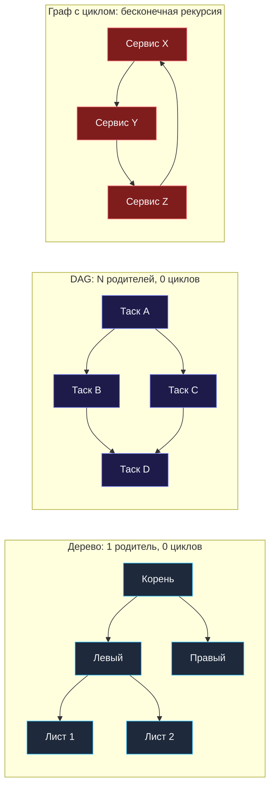
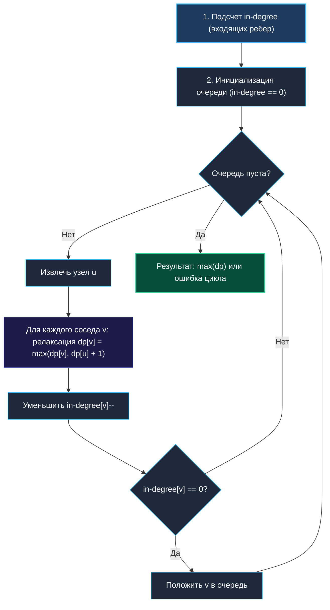
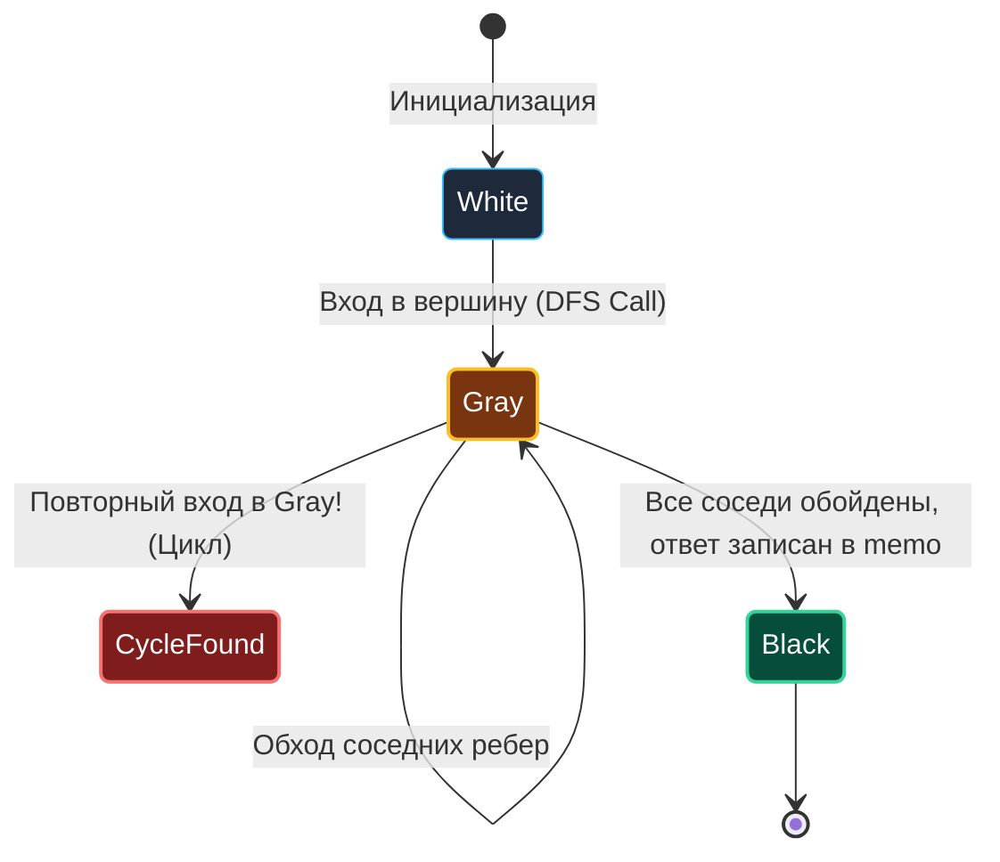
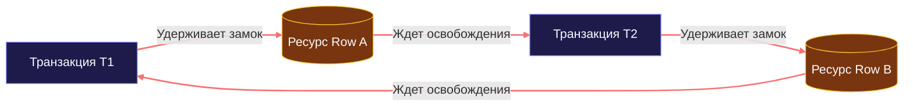

> *«Порядок в хаосе связей возникает лишь тогда, когда устранены порочные круги».*  
> — Брайан Керниган

Переход от DP на деревьях к DP на графах — это шаг из кристально упорядоченного мира в хаос. В [[1. Теория. DP на деревьях]] мы опирались на фундаментальную аксиому: между любыми двумя вершинами дерева существует ровно один простой путь. Нет альтернативных предков, нет обратных ребер, а главное — нет **циклов**.

В реальных графах эта идиллия мгновенно рушится:
1. Узел может иметь несколько родителей (convergences).
2. Разные пути могут иметь разную длину.
3. Появляются обратные и перекрестные ребра, создающие замкнутые петли.

Для бэкенд-инженера графы — это не олимпиадная абстракция, а повседневный ландшафт: зависимости микросервисов при RPC-вызовах, коммиты в Git, таски в CI/CD (GitHub Actions, GitLab Pipelines), пайплайны данных (Apache Airflow) и распределенные транзакции с блокировками. Умение применять динамическое программирование на графах позволяет строить критические пути выполнения, находить оптимальные маршруты с учетом ограничений и гарантировать отсутствие взаимных блокировок.



---

## 1. Фундаментальный водораздел: DAG против графов с циклами

Классическое динамическое программирование покоится на принципе **оптимальности Беллмана** и требует, чтобы пространство подзадач формировало ориентированный граф без контуров. Если в графе есть цикл $A \to B \to C \to A$, понятие «меньшая подзадача» теряет смысл: для вычисления $A$ нужно знать $C$, для которого нужно знать $B$, а для него — снова $A$. Без защитных механизмов наивный DFS уйдет в бесконечную рекурсию и завершится с `runtime: goroutine stack exceeds 1GB limit`.

Поэтому в теории графов алгоритмы DP делятся на две принципиально разные парадигмы:

| Параметр | Парадигма 1: DAG (Ациклический граф) | Парадигма 2: Граф с циклами |
| :--- | :--- | :--- |
| **Топологический порядок** | Гарантированно существует | Невозможен (нет начала и конца) |
| **Подход к DP** | **Bottom-Up**: итерация по топосортировке | **Top-Down DFS**: с раскраской узлов (3 цвета) |
| **Сложность по времени** | Строго линейная: $O(V + E)$ | $O(V + E)$ при мемоизации (или $O(V \cdot E)$ для Беллмана-Форда) |
| **Память** | $O(V)$ под DP-массив и очередь | $O(V)$ под стек рекурсии, цвета и мемоизацию |
| **Примеры применения** | Критический путь в CI/CD, сборка Bazel | Детекция дедлоков в СУБД, арбитраж валют |

---

## 2. Парадигма 1: DAG и топологическая сортировка (Алгоритм Кана)

В направленном ациклическом графе (DAG) ребра можно «вытянуть в струну» так, чтобы все стрелки вели строго слева направо. Это преобразование называется **топологической сортировкой**.

Как только порядок вершин зафиксирован, многомерная топология графа редуцируется до обычного 1D DP: мы перебираем вершины в порядке топосортировки и знаем, что когда мы пришли в вершину $v$, оптимальные ответы для всех ее входящих соседей $u$ уже окончательно вычислены!

### Алгоритмический шаблон: Критический путь в пайплайне задач

Представьте, что вы проектируете движок исполнения пайплайнов (аналог GitHub Actions). У вас есть $N$ задач и список зависимостей. Требуется найти максимальную длину цепочки последовательных задач (критический путь), определяющую общее время сборки.



### Реализация на Go: Без утечек памяти очереди

> [!WARNING]
> **Ловушка слайса-очереди в Go (`queue = queue[1:]`):**  
> В наивном коде очередь часто делают через срез: `u := queue[0]; queue = queue[1:]`. При миллионах операций это порождает скрытую проблему: указатель базового массива сдвигается вперед, но память под уже обработанные элементы не освобождается сборщиком мусора, пока вся очередь не выйдет из области видимости. Для высоконагруженного кода используйте индекс начала очереди (`head`) либо кольцевой буфер.

```go
package main

// MaxDAGPath вычисляет длину длиннейшего пути в ориентированном графе.
// Если в графе обнаружен цикл, возвращает -1.
func MaxDAGPath(n int, edges [][]int) int {
    // 1. Строим список смежности и массив степеней входа
    adj := make([][]int, n)
    inDegree := make([]int, n)
    for _, e := range edges {
        u, v := e[0], e[1]
        adj[u] = append(adj[u], v)
        inDegree[v]++
    }

    // 2. Инициализируем очередь вершинами без зависимостей
    // Предвыделяем емкость под n элементов для полного исключения реаллокаций
    queue := make([]int, 0, n)
    for i := 0; i < n; i++ {
        if inDegree[i] == 0 {
            queue = append(queue, i)
        }
    }

    dp := make([]int, n) // dp[i] — максимальное число шагов до вершины i
    processedCount := 0
    head := 0 // Указатель на начало очереди (O(1) pop без утечек)

    for head < len(queue) {
        u := queue[head]
        head++
        processedCount++

        for _, v := range adj[u] {
            // Релаксация DP-перехода: подзадача u гарантированно решена
            if dp[u]+1 > dp[v] {
                dp[v] = dp[u] + 1
            }

            inDegree[v]--
            if inDegree[v] == 0 {
                queue = append(queue, v)
            }
        }
    }

    // Если обработаны не все вершины — в графе есть хотя бы один цикл!
    if processedCount < n {
        return -1
    }

    maxPath := 0
    for _, val := range dp {
        if val > maxPath {
            maxPath = val
        }
    }
    return maxPath
}
```

---

## 3. Mechanical Sympathy: Pointer Chasing и локальность кэша

В реальных бэкенд-приложениях вершины графа изначально представлены не целыми числами от $0$ до $N-1$, а строковыми идентификаторами (UUID, имена сервисов вроде `"payment-service"`, `"auth-gateway"`).

Неопытный разработчик строит граф как `map[string][]string`, а таблицу динамики — как `map[string]int`.

### Почему `map[string]int` катастрофичен для железа?
1. **Pointer Chasing (погоня за указателями):** Каждое обращение к хэш-таблице — это вычисление хэша, переход к бакету в куче, сравнение `tophash` и разыменование указателя на данные.
2. **L1/L2 Cache Misses:** Память бакетов фрагментирована по всей оперативной памяти. Процессор не может предсказать адрес следующей записи и простаивает 200–300 тактов (до 100 нс) в ожидании выборки из RAM.
3. **Аллокации в куче:** Поиск по `map[string]` с конкатенацией строк порождает мусор для сборщика мусора.

```
Наивный подход (Pointer Chasing в куче):
[map bucket] -> [bucket] -> [string struct: ptr + len] -> [string bytes in heap]
               \-> 250 тактов ожидания шины памяти при каждом шаге!

Инженерный подход (Плотный массив в L1 Cache):
Index:  [  0  ] [  1  ] [  2  ] [  3  ] [  4  ] [  5  ] [  6  ] [  7  ]
Memory: [ 8 B ] [ 8 B ] [ 8 B ] [ 8 B ] [ 8 B ] [ 8 B ] [ 8 B ] [ 8 B ]
        <-------------- 64-байтовая линия кэша CPU -------------->
```

### Архитектурный паттерн: String Interning & Dense Indexing

Если вы строите планировщик микросервисов или систему роутинга:
1. На этапе парсинга конфигурации/схемы сопоставьте каждой строке уникальный плотный индекс $0 \le i < N$ через временный `map[string]int`.
2. Сохраните массив обратного маппинга `[]string` длины $N$.
3. Все тяжелые графовые DP-алгоритмы запускайте на плотных срезах `[]int` и `[][]int`.
4. В самом конце транслируйте численные результаты обратно в строки через срез по индексу за $O(1)$.

Этот прием ускоряет алгоритмы на графах в **10–25 раз** исключительно за счет эффективного использования кэш-линий процессора и аппаратного prefetcher.

---

## 4. Парадигма 2: Top-Down DFS с раскраской узлов (3-Color Algorithm)

Что делать, если граф произвольный (может содержать циклы), но нам нужно вычислить значения динамики на ациклических компонентах или вовремя обнаружить петлю?

Топологическая сортировка здесь бессильна — алгоритм Кана остановится на циклах. На помощь приходит **Top-Down DFS с мемоизацией и трехцветной раскраской узлов**:



- **0 — Белый (White):** Узел еще не посещался.
- **1 — Серый (Gray):** Узел находится в текущем активном стеке вызовов (мы вошли в него, но еще не вышли из его детей). Если DFS встречает серого соседа — **обнаружен цикл**!
- **2 — Черный (Black):** Узел и все его поддерево полностью исследованы. Ответ для него окончательно сохранен в массиве `memo`. Повторное посещение возвращает `memo[u]` за $O(1)$.

```go
package main

const (
    White = 0 // Не посещен
    Gray  = 1 // В текущем стеке рекурсии (Back-edge / Цикл)
    Black = 2 // Полностью обработан (значение в memo)
)

type GraphSolver struct {
    adj      [][]int
    color    []int
    memo     []int
    hasCycle bool
}

func NewGraphSolver(n int, adj [][]int) *GraphSolver {
    return &GraphSolver{
        adj:   adj,
        color: make([]int, n),
        memo:  make([]int, n),
    }
}

// DFS возвращает максимальный путь из вершины u.
// При обнаружении цикла флаг hasCycle выставляется в true.
func (s *GraphSolver) DFS(u int) int {
    if s.hasCycle {
        return -1
    }

    // Если узел серый — мы пришли по обратному ребру в активный стек вызовов!
    if s.color[u] == Gray {
        s.hasCycle = true
        return -1
    }

    // Если узел черный — результат уже вычислен и зафиксирован
    if s.color[u] == Black {
        return s.memo[u]
    }

    // Входим в вершину: помечаем серым
    s.color[u] = Gray

    maxFromSubtree := 0
    for _, v := range s.adj[u] {
        sub := s.DFS(v)
        if s.hasCycle {
            return -1
        }
        if sub+1 > maxFromSubtree {
            maxFromSubtree = sub + 1
        }
    }

    // Выходим из вершины: фиксируем результат в memo и красим в черный
    s.color[u] = Black
    s.memo[u] = maxFromSubtree
    return maxFromSubtree
}
```

---

## 5. System Design: Детекция дедлоков в базах данных (Wait-For Graph)

В реляционных СУБД (PostgreSQL, MySQL InnoDB) и распределенных менеджерах блокировок транзакции конкурируют за строчные эксклюзивные замки (`FOR UPDATE`).

Когда транзакция $T_1$ удерживает замок на строке $X$ и пытается захватить строку $Y$, которую в этот же момент удерживает транзакция $T_2$, возникает ребро ожидания $T_1 \to T_2$. Если $T_2$, в свою очередь, запрашивает ресурс, захваченный $T_1$, формируется цикл:



В СУБД фоновый процесс (Deadlock Detector) периодически (по тайм-ауту `deadlock_timeout`, по умолчанию 1 секунда в PostgreSQL) строит **Wait-For Graph** и запускает трехцветный DFS.
- Как только обнаруживается узел в состоянии `Gray`, цикл дедлока математически доказан.
- База данных выбирает «жертву» (транзакцию с меньшим приоритетом или наименьшим числом модификаций) и принудительно прерывает ее (`ERROR: deadlock detected`), разрывая цикл и позволяя оставшимся транзакциям завершить работу.

---

## 6. Алгоритм Беллмана-Форда как классическое 2D DP

> [!TIP]
> **Вопрос на интервью:**  
> *«Как найти кратчайший путь в графе с отрицательными весами ребер и обнаружить отрицательный цикл?»*  
> Алгоритм Дейкстры с отрицательными весами дает неверный ответ из-за своей «жадной» природы. Правильный ответ — **Алгоритм Беллмана-Форда**, представляющий собой классическое двумерное динамическое программирование!

### Смысл DP-состояния
Пусть `dp[k][v]` — кратчайшее расстояние от источника $S$ до вершины $v$, использующее **не более $k$ ребер**.

Базовый случай:
$$dp[0][S] = 0, \quad dp[0][v] = \infty \quad (\forall v \ne S)$$

Формула перехода:
$$dp[k][v] = \min \left( dp[k-1][v], \; \min_{(u, v) \in E} (dp[k-1][u] + w(u, v)) \right)$$

В простом графе без циклов любой кратчайший путь содержит не более $V - 1$ ребер. Поэтому достаточно провести $V - 1$ итераций.

```go
package main

import "math"

type Edge struct {
    From, To, Weight int
}

// BellmanFord возвращает кратчайшие расстояния от start.
// Если обнаружен отрицательный цикл, возвращает (nil, true).
func BellmanFord(n, start int, edges []Edge) ([]int, bool) {
    const inf = math.MaxInt32 / 2
    dist := make([]int, n)
    for i := range dist {
        dist[i] = inf
    }
    dist[start] = 0

    // Проводим N-1 релаксаций (оптимизация памяти до 1D массива)
    for i := 1; i < n; i++ {
        updated := false
        for _, e := range edges {
            if dist[e.From] != inf && dist[e.From]+e.Weight < dist[e.To] {
                dist[e.To] = dist[e.From] + e.Weight
                updated = true
            }
        }
        if !updated {
            // Ранний выход: расстояния стабилизировались
            break
        }
    }

    // N-я итерация: если расстояние все еще можно уменьшить — есть отрицательный цикл!
    for _, e := range edges {
        if dist[e.From] != inf && dist[e.From]+e.Weight < dist[e.To] {
            return nil, true // Обнаружен отрицательный цикл
        }
    }

    return dist, false
}
```

### Применение в FinTech: Арбитраж валют

На валютных биржах котировки $A \to B \to C \to A$ могут сложиться так, что произведение обменных курсов окажется строго больше единицы:
$$R_{AB} \cdot R_{BC} \cdot R_{CA} > 1$$
Если взять логарифм и умножить на $-1$:
$$-\ln(R_{AB}) - \ln(R_{BC}) - \ln(R_{CA}) < 0$$
Задача мгновенно превращается в **поиск отрицательного цикла в ориентированном графе с весами $-\ln(\text{rate})$**! Высокочастотные торговые роботы запускают Беллмана-Форда (или алгоритм Джонсона) для мгновенного извлечения безрисковой прибыли.

---

## 7. Резюме инженера

1. **DAG — это рай для DP:** Если в графе нет циклов, топологическая сортировка (алгоритм Кана) упорядочивает подзадачи, позволяя решать оптимизационные задачи за линейное время $O(V + E)$ в Bottom-Up стиле.
2. **Очереди без аллокаций:** Избегайте `queue = queue[1:]` в цикле. Используйте целочисленный указатель `head`, чтобы не удерживать память и не нагружать GC.
3. **Плотная адресация:** Заменяйте строковые ключи `map[string]` на плотные индексы $0 \dots N-1$. Плотный срез `[]int` полностью помещается в кэш-линию процессора (64 байта) и работает на порядок быстрее хеш-таблиц.
4. **3-Color DFS — универсальный детектор циклов:** Белый, Серый и Черный цвета гарантируют выявление циклов и предотвращают зацикливание при мемоизации.
5. **Беллман-Форд — это 2D DP во времени:** Ограничение на $k$ шагов позволяет естественно обрабатывать отрицательные веса и обнаруживать отрицательные контуры в финансовых и маршрутных системах.

В следующей лекции мы вернемся к деревьям и разберем классическую задачу уровня Google и Meta, где паттерн конечного автомата на вершинах раскрывается во всей красе: [[3. House Robber III]].