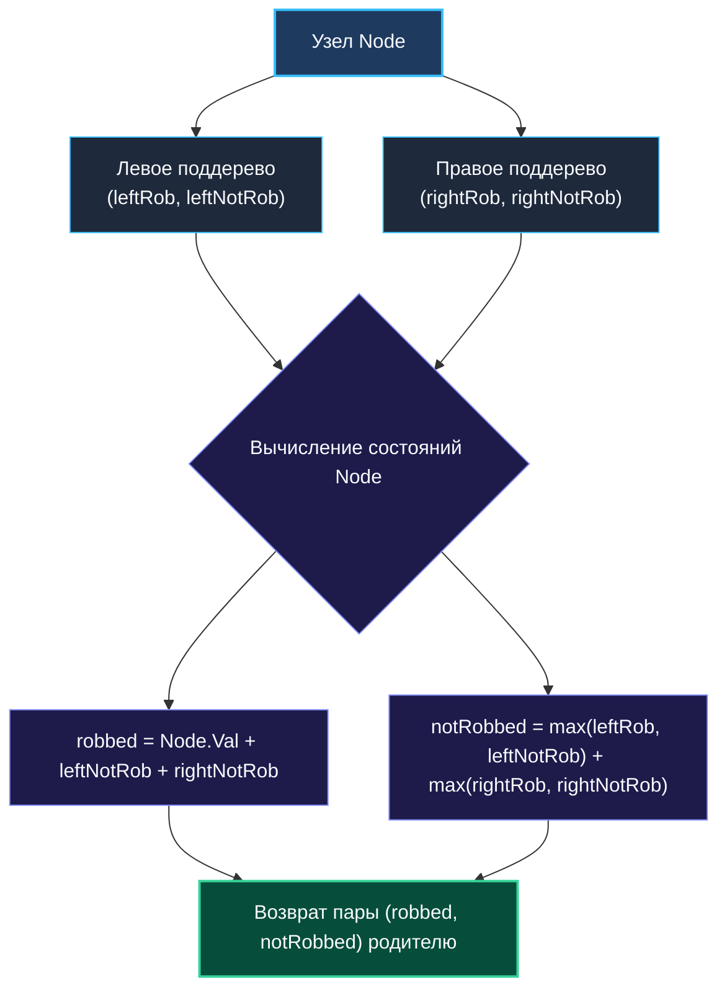

> *«Искусство компромисса заключается в том, чтобы отказаться от сиюминутной выгоды ради большего блага потомков».*  
> — Брайан Керниган

Задача **House Robber III (LeetCode 337)** — это классический триумф структурного динамического программирования, концептуальные основы которого мы заложили в [[1. Теория. DP на деревьях]]. Если в классической [[4. House Robber]] дома грабителя стояли в одномерную шеренгу, то теперь квартал организован в виде бинарного дерева. Воровской кодекс остался непреклонен: охранная сигнализация срабатывает мгновенно, если в одну ночь ограблены два напрямую связанных узла (родитель и его непосредственный ребенок).

Эта задача — показательный пример того, как наивное рекурсивное разделение подзадач приводит к катастрофическому экспоненциальному взрыву $O(2^N)$, в то время как проектирование **конечного автомата состояний узла** сжимает вычисления до элегантного линейного обхода $O(N)$ с **нулевыми аллокациями в куче**.

---

## 1. Постановка задачи и прикладная аналогия

Дано бинарное дерево, в каждом узле которого хранится неотрицательное целое число (сумма денег). Нельзя выбирать два узла, соединенных ребром. Требуется найти максимально возможную сумму.

```
       3
      / \
    (4) (5)   <- Если берем 3, детей 4 и 5 брать нельзя!
    / \    \
   1   3    1
```

В реальном бэкенде эта задача моделирует **независимое взвешенное множество (Maximum Weight Independent Set)** в иерархических инфраструктурах:
- **Размещение тяжелых задач в rack-топологии:** Серверы объединены в иерархию (стойка $\to$ коммутатор $\to$ дата-центр). Нельзя запускать ресурсоемкие репликации на соседних уровнях иерархии, разделяющих один сетевой свитч или общую шину электропитания.
- **Распределение прав и изоляция отказов:** Выбор резервных координаторов кластера, исключающий одновременное падение смежных узлов при сбое сетевого сегмента.

---

## 2. Наивный подход: Экспоненциальный тупик $O(2^N)$

Первый импульс программиста — написать функцию `rob(root)`, возвращающую максимальную сумму для поддерева:
- Если мы грабим `root`, то его детей грабить нельзя, но можно грабить четырех внуков: `root.Left.Left`, `root.Left.Right`, `root.Right.Left`, `root.Right.Right`.
- Если мы не грабим `root`, то ответ — сумма максимумов для левого и правого детей: `rob(root.Left) + rob(root.Right)`.

```go
// АНТИПАТТЕРН: Экспоненциальная сложность и дублирование обходов
func robNaive(root *TreeNode) int {
    if root == nil {
        return 0
    }

    // Вариант 1: Грабим текущий корень + внуков
    take := root.Val
    if root.Left != nil {
        take += robNaive(root.Left.Left) + robNaive(root.Left.Right)
    }
    if root.Right != nil {
        take += robNaive(root.Right.Left) + robNaive(root.Right.Right)
    }

    // Вариант 2: Пропускаем корень, грабим детей
    skip := robNaive(root.Left) + robNaive(root.Right)

    return max(take, skip)
}
```

> [!WARNING]
> **Почему этот код не пройдет тесты:**  
> Дерево рекурсивных вызовов многократно перекрывается. Чтобы вычислить `robNaive(root)`, мы вызываем детей `root.Left` и `root.Right`. Но внутри `root.Left` снова будут вызваны его дети, которые являются внуками `root`! Одни и те же поддеревья обходятся десятки тысяч раз. Временная сложность взлетает до $O(2^N)$ на сбалансированном дереве, а стек горутины мгновенно исчерпывается.

---

## 3. Оптимальное решение: FSM на узлах (Post-order DFS за $O(N)$)

Ключ к линейному времени — **Post-order обход** (снизу вверх, от листьев к корню) с возвратом **вектора состояний** из каждого узла.

Каждому узлу дерева соответствует конечный автомат из двух взаимоисключающих состояний:
1. `robbed` (взяли текущий дом): Мы получаем `node.Val`, но обязаны отказаться от ограбления обоих непосредственных детей. Мы берем их значения `notRobbed`.
2. `notRobbed` (пропустили текущий дом): Текущий узел не грабится. Значит, каждый из его детей может быть **как ограблен, так и пропущен** — мы независимо выбираем наиболее выгодный сценарий для левого и правого ребенка: $\max(\text{robbed}_L, \text{notRobbed}_L) + \max(\text{robbed}_R, \text{notRobbed}_R)$.



### Идиоматичная реализация на современном Go

Начиная с Go 1.21, встроенная функция `max()` доступна из коробки. Мы используем множественные возвращаемые значения `(int, int)`:

```go
package main

// TreeNode представляет узел бинарного дерева.
type TreeNode struct {
    Val   int
    Left  *TreeNode
    Right *TreeNode
}

// Rob находит максимальную сумму за один проход O(N).
func Rob(root *TreeNode) int {
    robbed, notRobbed := robDFS(root)
    return max(robbed, notRobbed)
}

// robDFS выполняет Post-order обход и возвращает (robbed, notRobbed).
func robDFS(node *TreeNode) (int, int) {
    if node == nil {
        return 0, 0 // Базовый случай: пустое дерево дает 0 прибыли
    }

    // 1. Сначала рекурсивно вычисляем детей (снизу вверх)
    leftRob, leftNotRob := robDFS(node.Left)
    rightRob, rightNotRob := robDFS(node.Right)

    // 2. Если грабим текущий узел: дети строго не грабятся
    robbed := node.Val + leftNotRob + rightNotRob

    // 3. Если пропускаем текущий узел: выбираем максимум для каждого ребенка
    notRobbed := max(leftRob, leftNotRob) + max(rightRob, rightNotRob)

    return robbed, notRobbed
}
```

---

## 4. Mechanical Sympathy: Реверс-инжиниринг ABIInternal и Zero Allocations

Почему решение с возвратом двух `int` работает в десятки раз быстрее решений на других языках или наивной реализации с `map[*TreeNode]int`?

### 1. Передача кортежей через регистры CPU
Начиная с Go 1.17, компилятор перешел на стандарт вызовов **ABIInternal** (регистровый ABI). 
Когда функция возвращает `(int, int)`, компилятор не выделяет фрейм на стеке для промежуточных структур и тем более не идет в кучу:
- Первое значение `robbed` возвращается в регистре `RAX` (на x86-64) или `X0` (на ARM64).
- Второе значение `notRobbed` возвращается в регистре `RBX` или `X1`.

Ни одного обращения к шине оперативной памяти при передаче результата между узлами не происходит — всё крутится исключительно в регистрах ядра процессора!

```
ABIInternal (x86-64):
Call robDFS(node.Left):
  <- Возврат в регистрах RAX (leftRob), RBX (leftNotRob)
Call robDFS(node.Right):
  <- Возврат в регистрах RAX (rightRob), RBX (rightNotRob)
Вычисление:
  ADDQ, MAX, ADDQ -> результат снова в RAX и RBX
  RET -> возврат родителю без аллокаций!
```

### 2. Ловушка `map[*TreeNode]int` и Escape Analysis
Если бы мы попытались закешировать наивный top-down DFS с помощью хэш-таблицы:

```go
// ОШИБКА: Мемоизация через map убивает производительность
var memo = make(map[*TreeNode]int)
```

1. Указатели `*TreeNode` попадают в хэш-таблицу, что заставляет Escape Analysis поместить всё дерево в кучу (Heap).
2. Каждое обращение к `memo` производит хэширование адреса указателя, поиск бакета и провоцирует постоянные промахи кэша (Cache Misses).
3. Сборщик мусора (GC) вынужден сканировать все ключи хэш-таблицы на фазе Mark.

Наше решение с чистым Post-order обходом потребляет ровно **0 байт в куче** ($0\text{ allocs/op}$) и $O(H)$ памяти на стеке горутины, где $H$ — высота дерева.

---

## 5. Pointer Chasing: Реальность железа против абстракции дерева

Несмотря на оптимальную асимптотику $O(N)$, обход дерева на современном оборудовании выполняется заметно медленнее, чем эквивалентный обход массива аналогичного размера. Причина кроется в физическом устройстве подсистемы памяти.

```
Массив dp[] (Последовательная память):
[  node 0  ][  node 1  ][  node 2  ][  node 3  ]  <- 1 Cache Line (64B)
^ Процессорный Prefetcher загружает данные наперед. 0 Cache Misses.

Дерево *TreeNode (Фрагментированная куча):
[  Node A  ] --------> (150 байт пустоты) --------> [  Node B  ]
  0x1040                                              0x48A0
^ Каждое разыменование node.Left — это непредсказуемый прыжок в RAM (~80-100 нс).
```

Структуры `TreeNode` создаются оператором `new` или литералом `&TreeNode{}` в разное время и оказываются раскиданными по страницам кучи рантайма Go. Разыменование `node.Left` порождает **Pointer Chasing** (погоню за указателями), при которой аппаратный блок упреждающей выборки (hardware prefetcher) не в силах предугадать следующий адрес памяти.

---

## 6. Вопросы для собеседования

> [!TIP]
> **Каверзный вопрос интервьюера:**  
> *«Почему мы не можем обойтись одним состоянием на узел, возвращая просто `max(robbed, notRobbed)`?»*  
> **Эталонный ответ:**  
> Если родитель получает от ребенка только одно скалярное число, он теряет контекст: был ли ограблен сам ребенок или нет. Если ребенок был ограблен, родитель не имеет права грабить себя. Чтобы родитель мог принять решение о собственном ограблении, ему **критически необходимо** знать, сколько денег принесет поддерево ребенка в сценарии, когда ребенок гарантированно не тронут (`notRobbed`). Потеря этого состояния вынуждает спускаться к внукам, возвращая нас к экспоненциальной сложности $O(2^N)$.

> [!NOTE]
> **Сложность алгоритма:**
> - **По времени:** $\mathcal{O}(N)$ — каждый узел дерева посещается ровно один раз в процессе Post-order DFS.
> - **По дополнительной памяти:** $\mathcal{O}(H)$, где $H$ — высота дерева. Память расходуется только на системный стек вызовов горутины ($O(\log N)$ в сбалансированном дереве, $O(N)$ в худшем случае вырожденного дерева-бамбука). В куче выделяется ровно $0$ байт.

---

## 7. Резюме

1. **Бинарный FSM на деревьях:** При переходе от линейного массива к иерархическим структурам паттерн состояний «Взять / Пропустить» сохраняется, но передается снизу вверх через возвращаемые значения рекурсии.
2. **Post-order — фундамент DP на деревьях:** Чтобы принять оптимальное решение в текущем узле, необходимо иметь окончательно сформированные ответы для всех его дочерних поддеревьев.
3. **Сила ABIInternal в Go:** Возврат кортежей элементарных типов `(int, int)` транслируется компилятором в регистры процессора, гарантируя нулевую нагрузку на GC и минимальные накладные расходы на вызовы.

В следующей статье мы разберем задачу, где путь не привязан к жесткой иерархии родитель-ребенок, а может изгибаться «мостом» через любую вершину: [[4. Binary Tree Maximum Path Sum]].