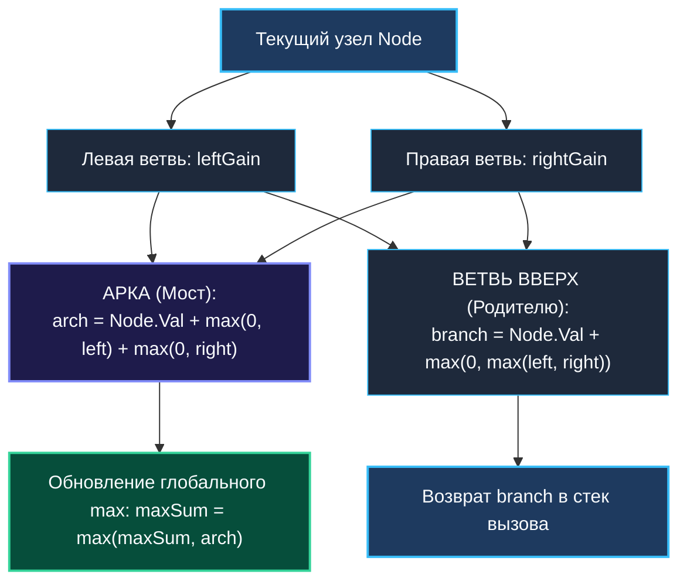
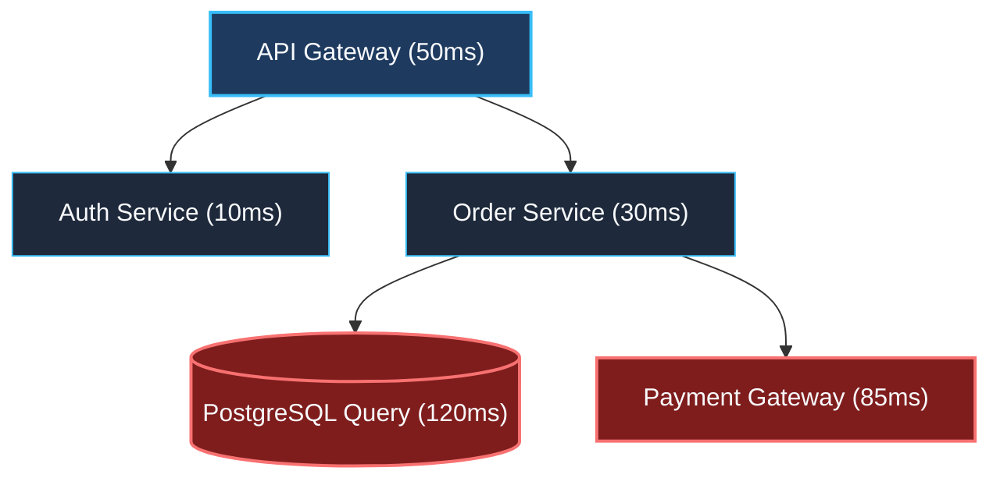

> *«Наилучший путь через вершину часто требует умения вовремя отсекать бесперспективные ответвления».*  
> — Брайан Керниган

Задача **Binary Tree Maximum Path Sum (LeetCode 124, Hard)** по праву считается вершиной мастерства в динамическом программировании на деревьях. Если в [[3. House Robber III]] мы решали задачу независимого множества с жесткой субординацией родитель-потомок, то здесь мы сталкиваемся с геометрией «изгибающихся» путей.

Путь в бинарном дереве больше не обязан следовать гравитации от корня к листьям: он может начаться в глубине левого поддерева, подняться до некоторой вершины-«моста» и спуститься в правое поддерево.

---

## 1. Постановка задачи и формулировка инварианта

Путь в бинарном дереве — это любая непрерывная последовательность узлов, в которой любые два соседних узла соединены ребром. Каждый узел дерева может входить в путь **не более одного раза**. Значения в узлах могут быть как положительными, так и строго отрицательными. Путь обязан содержать хотя бы один узел.

Требуется найти **максимально возможную сумму значений** узлов вдоль такого пути.

```
       -10
       /  \
      9   [20]       <- Мост (арка): 15 + 20 + 7 = 42!
          /  \
        [15]  [7]
```

В инженерной практике эта задача возникает при анализе графов вызовов и трассировок:
- **Distributed Tracing (OpenTelemetry / Jaeger):** Поиск критического пути (Critical Path Analysis) с максимальной совокупной задержкой или потреблением памяти в дереве вложенных RPC-спанов.
- **Отказоустойчивость и каскадные сбои:** Определение подсистемы, аккумулирующей максимальный штраф (latency penalty), где ошибка распространяется через общего диспетчера запросов.

---

## 2. Архитектурный инсайт: Ветвь (Branch) против Арки (Arch)

Ключевой концептуальный барьер задачи — четкое разделение двух топологических ролей текущего узла:

1. **Ветвь (Branch — подзадача для родителя):**  
   Это однонаправленный путь, который начинается где-то внизу поддерева, поднимается до текущего узла и **готов быть продолжен родителем**. Поскольку дерево не может содержать циклов, родитель может выбрать только **одну** из дочерних ветвей (левую или правую).  
   $$\text{branchGain} = \text{node.Val} + \max(0, \; \max(\text{leftGain}, \; \text{rightGain}))$$

2. **Арка (Arch — мост через вершину):**  
   Это путь, соединяющий левую ветвь, текущий узел и правую ветвь. Он образует законченную параболу. **Родительский узел не может подключиться к арке**, иначе путь раздвоится, что нарушит аксиому простого пути в дереве. Арка — это локальный кандидат на глобальный оптимум:  
   $$\text{archSum} = \text{node.Val} + \max(0, \text{leftGain}) + \max(0, \text{rightGain})$$



> [!WARNING]
> **Фатальная ошибка на собеседованиях:**  
> Попытка вернуть `archSum` родителю. Если функция вернет сумму обеих ветвей, вышестоящий узел сформирует «вилку» (три ребра из одного узла), что превратит дерево в некорректный граф. Наверх передается строго **одна** максимальная ветвь!

---

## 3. Идиоматичная реализация на Go

Благодаря встроенной в Go 1.21+ функции `max()` и константе `math.MinInt` (минимальное целое число для текущей платформы), код получается лаконичным и безопасным от переполнений:

```go
package main

import "math"

// TreeNode представляет узел бинарного дерева.
type TreeNode struct {
    Val   int
    Left  *TreeNode
    Right *TreeNode
}

// MaxPathSum находит максимальную сумму любого непустого пути в дереве.
// Временная сложность: O(N) — каждый узел посещается один раз.
// Память: O(H) — стек рекурсии горутины.
func MaxPathSum(root *TreeNode) int {
    if root == nil {
        return 0
    }

    // Инициализируем глобальный максимум минимально возможным int
    maxSum := math.MinInt

    // postOrder возвращает максимальную однонаправленную ветвь от узла node
    var postOrder func(node *TreeNode) int
    postOrder = func(node *TreeNode) int {
        if node == nil {
            return 0
        }

        // 1. Постфиксный спуск: вычисляем выигрыш от левого и правого поддеревьев.
        // Если ветвь приносит убыток (gain < 0), мы её отсекаем (max(..., 0)).
        leftGain := max(postOrder(node.Left), 0)
        rightGain := max(postOrder(node.Right), 0)

        // 2. Вычисляем арку (путь, замыкающийся в текущей вершине)
        currentArch := node.Val + leftGain + rightGain

        // 3. Обновляем глобальный оптимум
        if currentArch > maxSum {
            maxSum = currentArch
        }

        // 4. Родителю отдаем только ОДНУ ветвь с наибольшей выгодой
        return node.Val + max(leftGain, rightGain)
    }

    postOrder(root)
    return maxSum
}
```

---

## 4. Mechanical Sympathy: Branchless CMOV и обрезка отрицательных ветвей

Обратите внимание на конструкцию:
```go
leftGain := max(postOrder(node.Left), 0)
```

Это не просто математический фильтр, это алгоритмический аналог **Circuit Breaker** (предохранителя цепи). Если поддерево генерирует отрицательную сумму, мы не обязаны включать его в наш путь — мы просто не спускаемся в него, беря $0$.

### Ассемблерный анализ (x86-64 и ARM64)
Как компилятор Go `go build -gcflags="-S"` переводит `max(val, 0)`?
- На платформе **x86-64**: компилятор избегает инструкции условного перехода `JLE`/`JGE`, вызывающей сброс конвейера процессора при неверном предсказании переходов (Branch Misprediction). Вместо этого генерируется бессбойная инструкция условного перемещения **`CMOVL` / `CMOVG`**:
  ```asm
  TESTQ  AX, AX
  MOVQ   $0, CX
  CMOVLQ CX, AX   // Если AX < 0, переместить 0 в AX за 1 такт!
  ```
- На архитектуре **ARM64**: генерируется инструкция условного выбора **`CSEL`**:
  ```asm
  CMP   X0, #0
  CSEL  GT, X0, XZR, X0  // Выбор между регистром X0 и нулевым регистром XZR
  ```
Это гарантирует, что обрезка отрицательных ветвей выполняется за **1 такт CPU без остановки конвейера инструкций**.

---

## 5. Under the Hood: Escape Analysis замыканий в Go

В коде выше анонимная функция `postOrder` захватывает переменную `maxSum` из внешней функции `MaxPathSum`. Что делает компилятор Go?

```
Стек вызова MaxPathSum:
+-----------------------------+
| root *TreeNode              |
| postOrder func(node) int    |
+-----------------------------+
               |
               v
Куча (Heap):
+-----------------------------+
| maxSum int (escapes to heap)|  <-- Вынесено в кучу из-за захвата в замыкание!
+-----------------------------+
```

1. **Escape Analysis:** Поскольку замыкание может потенциально пережить родительский фрейм (например, если бы мы передали его наружу или в горутину), компилятор перемещает переменную `maxSum` со стека в кучу:  
   `./solution.go:20:2: moved to heap: maxSum`
2. **Аллокации:** Для одного скалярного `int` это создает всего одну микроаллокацию (8 байт). Однако в экстремально горячем коде (high-frequency trading, ядро сетевого стека) даже одной аллокации можно избежать, если передавать указатель на структуру или использовать именованный метод:

```go
type PathSolver struct {
    maxSum int
}

func (s *PathSolver) dfs(node *TreeNode) int {
    if node == nil { return 0 }
    l := max(s.dfs(node.Left), 0)
    r := max(s.dfs(node.Right), 0)
    s.maxSum = max(s.maxSum, node.Val+l+r)
    return node.Val + max(l, r)
}
// Если PathSolver выделен на стеке вызывающей стороны, аллокаций = 0!
```

---

## 6. System Design: OpenTelemetry и Critical Path в дереве спанов

В распределенных микросервисных архитектурах каждый HTTP/gRPC запрос порождает распределенный трейс (Trace), состоящий из родительских и дочерних спанов (Span DAG/Tree).



Когда SRE-инженеры расследуют деградацию времени ответа в системе:
- Параллельные вызовы (например, обращение к БД и стороннему платежному шлюзу) формируют «арку» совокупной задержки для родителя.
- Алгоритм поиска максимального взвешенного пути по спанам позволяет автоматически локализовать **узкое горлышко системы (System Bottleneck)** — критическую цепочку выполнения, оптимизация которой даст максимальное сокращение общего времени ожидания пользователя (p99 latency).

---

## 7. Резюме

1. **Два взгляда на узел:** Ветвь передается родителю (линейный выбор $\max(L, R)$). Арка соединяет обе ветви через вершину и участвует только в обновлении глобального максимума.
2. **Обрезка нулем $\max(\text{gain}, 0)$:** Исключает отрицательные поддеревья, компилируясь в бессбойные инструкции процессора `CMOV`/`CSEL`.
3. **Безопасность типов и переполнений:** Инициализируйте аккумулятор `math.MinInt`, чтобы корректно обрабатывать деревья, целиком состоящие из отрицательных чисел.
4. **Замыкания и Escape Analysis:** Понимание того, какие переменные выносятся в кучу при захвате контекста, отличает рядового разработчика от senior Go-инженера.

В следующей лекции мы объединим DP на деревьях с префиксными суммами и скользящими хэш-таблицами в задаче [[5. Path Sum III]].