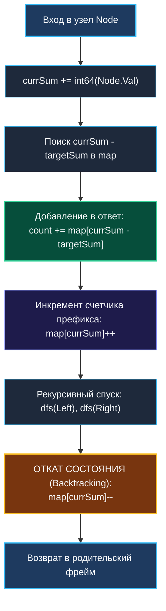

> *«Всякий след, оставленный при спуске вглубь, должен быть аккуратно стерт при возвращении».*  
> — Брайан Керниган

Задача **Path Sum III (LeetCode 437)** — это элегантный финал нашего путешествия по динамическому программированию на деревьях. Она образует концептуальный мост между геометрией путей в деревьях из [[4. Binary Tree Maximum Path Sum]] и математическим аппаратом префиксных сумм из [[4. Subarray Sum Equals K]].

На собеседованиях в бигтех (Google, Uber, Amazon) эта задача служит лакмусовой бумажкой: способен ли кандидат спроецировать одномерный паттерн хеш-таблицы на нелинейную иерархическую структуру и грамотно организовать **откат состояния (Backtracking)** без утечек памяти и давления на GC.

---

## 1. Постановка задачи и свойства путей

Дано бинарное дерево, узлы которого содержат целые числа (включая отрицательные и ноль), и целевое значение `targetSum`. Необходимо найти **суммарное количество путей**, сумма значений узлов в которых в точности равна `targetSum`.

Инварианты пути:
1. Путь должен идти **строго вниз** (от родителя к ребенку).
2. Путь не обязан начинаться в корне дерева.
3. Путь не обязан заканчиваться в листе.

```
          10
         /  \
        5   -3
       / \    \
      3   2   11
     / \   \
    3  -2   1

Target = 8:
Путь 1: 5 -> 3 (сумма 8)
Путь 2: 5 -> 2 -> 1 (сумма 8)
Путь 3: -3 -> 11 (сумма 8)
Итого: 3 пути
```

В распределенных системах это точная модель анализа **бюджетов задержек (Latency Budgets / SLO)** в деревьях распределенной трассировки: сколько непрерывных цепочек синхронных подзапросов вносят суммарную задержку ровно в `target` миллисекунд.

---

## 2. Квадратичный тупик: Двойной DFS за $O(N^2)$

Наивный подход заключается в запуске двойного обхода:
1. Внешний DFS обходит каждый узел дерева.
2. Для каждого посещенного узла запускается внутренний DFS, ищущий все нисходящие пути с суммой `targetSum`.

```go
// АНТИПАТТЕРН: Двойной DFS O(N^2) в худшем случае
func pathSumNaive(root *TreeNode, targetSum int) int {
    if root == nil {
        return 0
    }
    return countFromNode(root, targetSum) + 
           pathSumNaive(root.Left, targetSum) + 
           pathSumNaive(root.Right, targetSum)
}
```

Для вырожденного в цепочку дерева (бамбука) из $N = 10\,000$ узлов это потребует $\approx 5 \cdot 10^7$ рекурсивных вызовов. В production-сервисе квадратичный алгоритм приведет к блокировке потоков и срабатыванию таймаутов.

---

## 3. Оптимальное решение: Префиксные суммы + Backtracking за $O(N)$

Вспомним фундаментальное свойство префиксных сумм на массивах:
$$\text{Sum}(i, j) = \text{PrefixSum}[j] - \text{PrefixSum}[i-1] = \text{target}$$
$$\text{PrefixSum}[i-1] = \text{PrefixSum}[j] - \text{target}$$

В процессе спуска вглубь дерева (DFS) активный путь от корня до текущего узла представляет собой **обыкновенный одномерный срез**!  
Если в текущем узле накопленная сумма равна `currSum`, и где-то выше на этой же ветке уже встречалась префиксная сумма $\text{currSum} - \text{targetSum}$, значит, вертикальный отрезок между тем предком и текущим узлом дает в сумме ровно `targetSum`.

### Проблема ветвления и решение через откат (Backtracking)
В массиве префиксные суммы накапливаются строго линейно. В дереве же после обхода левого поддерева мы возвращаемся в родительский узел и уходим в правое поддерево.  
Префиксные суммы, сгенерированные в левой ветке, **не имеют никакого отношения к правой ветке**! Если их не удалить, правая ветвь посчитает пути, физически проходящие сквозь чужих «кузенов», нарушив топологию дерева.



---

## 4. Идиоматичная реализация на Go

```go
package main

// TreeNode представляет узел бинарного дерева.
type TreeNode struct {
    Val   int
    Left  *TreeNode
    Right *TreeNode
}

// PathSum находит количество вертикальных путей с суммой targetSum.
// Временная сложность: O(N) — каждый узел посещается один раз.
// Память: O(H) — глубина дерева для мапы и стека рекурсии.
func PathSum(root *TreeNode, targetSum int) int {
    // Мапа префиксных сумм: значение суммы -> сколько раз встретилась на текущей ветке
    prefixCount := make(map[int64]int)

    // Базовый случай: пустой префикс (сумма 0) встретился ровно 1 раз до корня
    prefixCount[0] = 1

    totalPaths := 0

    var dfs func(node *TreeNode, currSum int64)
    dfs = func(node *TreeNode, currSum int64) {
        if node == nil {
            return
        }

        // Предотвращаем целочисленное переполнение при суммировании
        currSum += int64(node.Val)

        // 1. Проверяем, существует ли комплементарный префикс выше по ветке
        complement := currSum - int64(targetSum)
        totalPaths += prefixCount[complement]

        // 2. Регистрируем текущий префикс для потомков
        prefixCount[currSum]++

        // 3. Рекурсивный спуск в поддеревья
        dfs(node.Left, currSum)
        dfs(node.Right, currSum)

        // 4. Backtracking: убираем текущий узел из истории перед выходом!
        // Это гарантирует чистоту контекста для параллельных веток.
        prefixCount[currSum]--
    }

    dfs(root, 0)
    return totalPaths
}
```

---

## 5. Mechanical Sympathy: Мутация одной мапы против копирования

На технических собеседованиях начинающие инженеры часто предлагают:  
*«А давайте просто передавать новую копию `map` в каждый вызов `dfs`, чтобы не заморачиваться с откатом состояния?»*

Давайте сопоставим это предложение с архитектурой железа и рантаймом Go:

| Характеристика | Копирование мапы на каждом шаге | Мутация одной мапы с Backtracking |
| :--- | :--- | :--- |
| **Аллокации в куче** | $\mathcal{O}(N)$ аллокаций новых хэш-таблиц | **Строго 1 аллокация** на старте |
| **Расход памяти** | $\mathcal{O}(N \cdot H)$ байт (десятки мегабайт) | $\mathcal{O}(H)$ записей (не больше глубины дерева) |
| **Нагрузка на GC** | Колоссальная (GC вынужден сканировать тысячи объектов) | Практически нулевая |
| **Копирование данных** | $\mathcal{O}(H)$ операций на каждый узел дерева | $\mathcal{O}(1)$ инкремент и декремент |
| **Общее время работы** | $\mathcal{O}(N \cdot H)$ — деградация до секунд | $\mathcal{O}(N)$ — единицы миллисекунд |

### Почему явный декремент быстрее `defer` в глубокой рекурсии?
В коде выше мы выполнили откат явной строкой `prefixCount[currSum]--` в конце функции, а не через `defer func() { prefixCount[currSum]-- }()`.  
Несмотря на то, что с Go 1.14+ открытый `defer` (open-coded defer) инлайнится компилятором, внутри функций с рекурсией компилятор часто вынужден сохранять метаинформацию отложенных вызовов в стековом фрейме. Явный декремент в конце функции гарантирует нулевые накладные расходы рантайма (0 CPU-тактов оверхеда).

---

## 6. Подводный камень: Переполнение `int32` в LeetCode 437

> [!WARNING]
> **Ловушка переполнения целых чисел (Integer Overflow):**  
> В тестах LeetCode узлы могут содержать значения до $10^9$, а глубина дерева может достигать $1000$.  
> Сумма нескольких таких узлов легко превосходит $2 \cdot 10^9$ — максимальное значение для 32-битного знакового целого `math.MaxInt32` ($2^{31}-1 \approx 2.14 \times 10^9$).  
> Если вести подсчет `currSum` в типе `int` на 32-битных системах или оперировать 32-битными целыми без приведения к `int64`, произойдет арифметическое переполнение (переход в отрицательную область), что приведет к ложным результатам поиска в хэш-таблице.  
> **Всегда используйте `int64` для накопительных сумм!**

---

## 7. System Design: Распределенный контекст и изоляция скоупов

Паттерн «накопление $\to$ спуск $\to$ очистка» в точности повторяет работу распределенного контекста (`context.Context`) в Go и OpenTelemetry Tracing:
1. При поступлении входящего запроса создается трассировочный контекст с уникальным `TraceID`.
2. При вызове зависимых сервисов контекст обогащается новыми атрибутами спана (`SpanID`).
3. Когда подзапрос завершается, дочерний спан закрывается, не загрязняя контекст соседних независимых горутин.

Умение контролировать жизненный цикл локального состояния гарантирует отсутствие утечек данных между параллельными потоками исполнения.

---

## 8. Итоги кластера: Деревья покорены!

Завершая кластер динамического программирования на деревьях, зафиксируем единую систему ориентиров:

1. **Конечный автомат узла ([[3. House Robber III]]):** Возвращайте из Post-order обхода вектор взаимоисключающих состояний `(robbed, notRobbed)`. Регистровый ABI Go (`ABIInternal`) передает их мгновенно без аллокаций.
2. **Ветвь vs Арка ([[4. Binary Tree Maximum Path Sum]]):** Четко разделяйте то, что возвращается родителю (линейная ветвь $\max(L, R)$), и то, что обновляет глобальный оптимум (изгибающаяся арка). Отсекайте убыточные ветви через `max(gain, 0)`.
3. **Префиксные суммы на дереве ([[5. Path Sum III]]):** Линейные алгоритмы переносятся на деревья при условии обязательного отката состояния (Backtracking) при возврате из рекурсии.
4. **Защита от переполнений:** Накапливающиеся префиксы требуют 64-битных целых чисел (`int64`).

---

В следующем модуле мы спустимся на фундаментальный аппаратный уровень и изучим битовую магию процессоров: регистры, битовые маски, инструкции конвейера и битовые трюки, лежащие в основе высокопроизводительного кода: [[1. Теория. Битовые операции]].