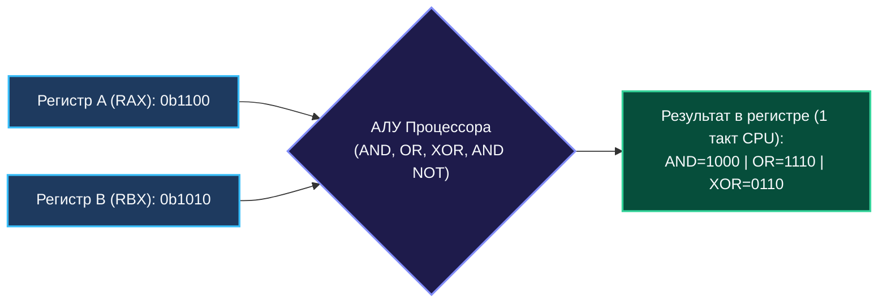
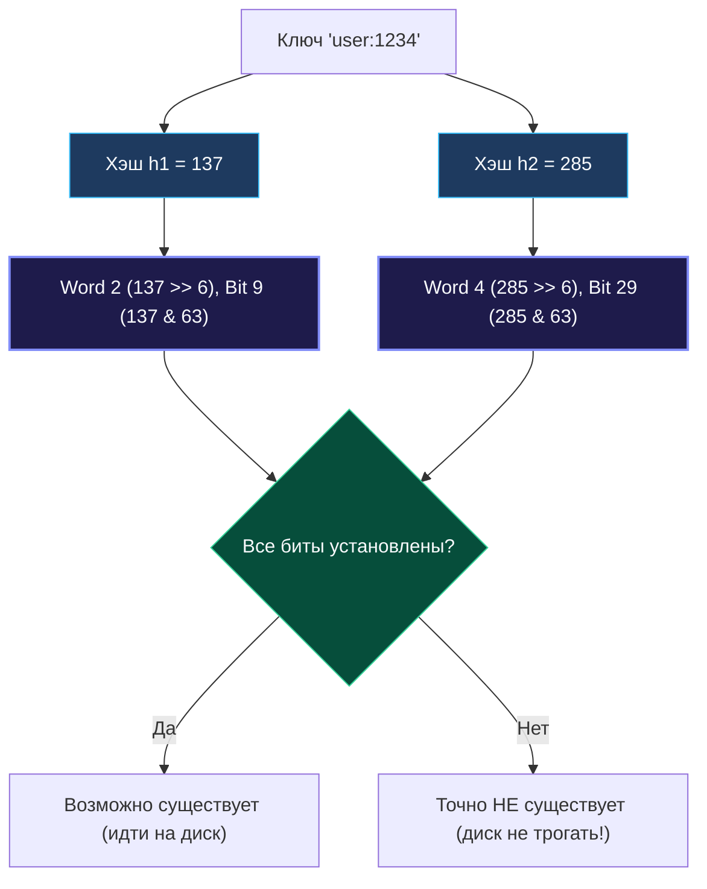

> *«Вся магия высших абстракций в конечном счете сводится к быстрому переключению битов в кремнии».*  
> — Брайан Керниган

В эпоху микросервисных архитектур, сборщиков мусора, распределенных очередей и высокоуровневых дженериков легко поддаться иллюзии, будто память и вычисления абстрактны. Но кремний не знает ни JSON, ни HTTP, ни деревьев поиска. На уровне регистров центрального процессора любая программа — это лишь манипуляция машинными словами, состоящими из нулей и единиц.

**Побитовые операции (Bitwise Operations)** — это не архаичный синтаксис из учебников по ассемблеру PDP-11, а один из самых мощных инструментов в арсенале senior-инженера:
1. **Экстремальная производительность:** Битовые инструкции выполняются процессором за **1 машинный такт** (или суб-такт через параллельные порты АЛУ) с нулевыми аллокациями и нулевой нагрузкой на шину памяти.
2. **Плотность данных и экономия кэша L1:** Упаковка сотен флагов или множеств в машинные слова экономит мегабайты памяти, повышая Hit Rate кэш-линий CPU до предела.
3. **Фундамент системного дизайна:** Сетевые маски подсетей (CIDR, TCP/IP headers), криптография (AES, SHA), сериализация (Protocol Buffers varints), вероятностные структуры данных (Bloom Filter, HyperLogLog) и движки баз данных (Bitmap Indexes) построены на битовой логике.



---

## 1. Базовый набор операций в Go: Полная сводная таблица

В отличие от C/C++, в языке Go строгая типизация: логические операторы `&&` и `||` работают **исключительно с типом `bool`**, а для целых чисел существуют специализированные побитовые операторы. Кроме того, Go обладает уникальным оператором **Bit Clear (`&^`)**, которого нет в большинстве других языков.

| Операция | Оператор в Go | Таблица истинности (A, B $\to$ Out) | Смысл операции | Инструкция x86-64 / ARM64 |
| :--- | :---: | :---: | :--- | :---: |
| **AND (И)** | `&` | $1, 1 \to 1$ <br> остальные $\to 0$ | Фильтрация, выделение битовой маски | `AND` / `AND` |
| **OR (ИЛИ)** | `\|` | $0, 0 \to 0$ <br> остальные $\to 1$ | Установка (включение) битов | `OR` / `ORR` |
| **XOR (Искл. ИЛИ)** | `^` | $1, 0 \to 1; 0, 1 \to 1$ <br> $0, 0 \to 0; 1, 1 \to 0$ | Инверсия битов, поиск различий | `XOR` / `EOR` |
| **NOT (НЕ)** | `^` *(унарный)* | $0 \to 1; 1 \to 0$ | Побитовая инверсия (дополнение до 1) | `NOT` / `MVN` |
| **AND NOT (Bit Clear)** | `&^` | $A = 1, B = 0 \to 1$ <br> если $B = 1 \to 0$ | Сброс (очистка) битов маски: $A \ \& \ (\sim B)$ | `ANDN` (BMI1) / `BIC` |
| **Shift Left (Сдвиг влево)** | `<<` | `x << k` | Сдвиг влево, эквивалент $x \cdot 2^k$ | `SHL` / `LSL` |
| **Shift Right (Сдвиг вправо)** | `>>` | `x >> k` | Логический или арифметический сдвиг | `SHR` / `SAR` |

### Уникальный оператор Go: Bit Clear (`&^`)

Оператор `&^` (AND NOT) — это гордость создателей Go:
```go
// Сбросить 3-й бит числа x (сделать его 0):
x = x &^ (1 << 3)
```
В других языках программисту приходится писать громоздкую связку `x = x & (~(1 << 3))`. В Go оператор `&^` очищает биты числа `x`, которые установлены в единицу во втором операнде. На процессорах с набором инструкций BMI1 компилятор Go превращает эту операцию в одну ассемблерную инструкцию `ANDN`.

---

## 2. Представление чисел: Two's Complement и ловушка разрядности `int`

### Дополнительный код (Two's Complement)
Современные процессоры представляют отрицательные целые числа в виде **дополнения до двух**:
$$-x = \hat{\phantom{}}x + 1$$

```go
// Пример для 8-битного знакового числа (int8):
//  5:  0000 0101
// ^5:  1111 1010 (инверсия всех бит)
// -5:  1111 1011 (^5 + 1)
```

> [!TIP]
> **Вопрос с собеседования:**  
> *«Чему равно выражение `x & (-x)` и почему оно работает?»*  
> **Ответ:** Это классический трюк извлечения **младшей установленной единицы** (Lowest Set Bit).  
> Допустим, $x = 12$ (`0b00001100`).  
> Тогда $-x = \hat{\phantom{}}x + 1 = \text{0b11110011} + 1 = \text{0b11110100}$.  
> Вычисляем $x \ \& \ (-x)$:
> ```
>   0000 1100  (x = 12)
> & 1111 0100  (-x = -12)
>   ---------
>   0000 0100  (результат = 4)
> ```
> Все старшие биты взаимно уничтожаются, и на выходе остается изолированная младшая единица!

---

## 3. Архитектурная ловушка: Разрядность `int` и знаковый бит в Go

> [!WARNING]
> **Платформозависимость типов `int` и `uint`:**  
> В Go размер типа `int` равен размеру машинного слова целевой архитектуры:
> - На 64-битных системах (amd64, arm64): `int` — это 64 бита (эквивалент `int64`).
> - На 32-битных системах (386, arm, wasm): `int` — это 32 бита (эквивалент `int32`).

### Опасность переполнения знакового бита
Посмотрим, что произойдет, если написать:
```go
mask := 1 << 31
```
1. **На 64-битной машине:** `1 << 31` — это положительное число $2\,147\,483\,648$ (бит 31 установлен, знаковый бит 63 равен 0).
2. **На 32-битной машине:** бит 31 — это **знаковый бит**! Число мгновенно становится отрицательным (`-2147483648` или `math.MinInt32`). Попытка сдвинуть на 32 бита (`1 << 32`) на 32-битной системе приведет к ошибке компиляции или неопределенному результату.

**Золотое правило системного инженера:** Если ваш алгоритм зависит от конкретного количества бит (маски флагов, криптография, сетевые пакеты), **никогда не используйте `int` или `uint`**. Всегда явно указывайте типы фиксированной ширины: `uint32`, `uint64`, `int32`, `int64`.

---

## 4. Арифметический против логического сдвига (`>>`)

Как процессор сдвигает число вправо?
- **Логический сдвиг (Logical Shift Right, `SHR`):** Освобождающиеся старшие биты всегда заполняются нулями.
- **Арифметический сдвиг (Arithmetic Shift Right, `SAR`):** Освобождающиеся старшие биты заполняются **копией знакового бита** (знаковое расширение / sign extension), сохраняя знак числа.

В Go выбор инструкции определяется типом переменной:
```go
var a int8 = -8  // 0b11111000 (-8)
b := a >> 1      // 0b11111100 (-4) — компилятор выбрал SAR (знак сохранен)

var c uint8 = 248 // 0b11111000 (248)
d := c >> 1       // 0b01111100 (124) — компилятор выбрал SHR (старший бит стал 0)
```

---

## 5. Золотой фонд битовых трюков (Bit Twiddling Hacks)

Эти алгоритмические паттерны необходимо знать наизусть каждому разработчику:

### 1. Проверка, является ли число степенью двойки
Число $N > 0$ является степенью двойки ($1, 2, 4, 8, 16, \dots$) тогда и только тогда, когда в его двоичной записи содержится ровно одна единица:
```go
func isPowerOfTwo(n int) bool {
    return n > 0 && (n & (n - 1)) == 0
}
```
**Механика:** Если $n = 16$ (`0b10000`), то $n - 1 = 15$ (`0b01111`). Операция `16 & 15` дает чистый `0`. Если же единиц было больше одной, общий префикс сохранится.

### 2. Сброс младшей единицы (Brian Kernighan's Algorithm)
Выражение `n & (n - 1)` сбрасывает самый младший единичный бит в ноль. Это основа алгоритма подсчета единиц за время, пропорциональное количеству единиц, а не разрядности числа:
```go
func countBitsKernighan(n int) int {
    count := 0
    for n != 0 {
        n &= n - 1 // Уничтожаем младшую единицу за 1 шаг
        count++
    }
    return count
}
```

### 3. Быстрый обмен значений без временной переменной (XOR Swap)
```go
a ^= b
b ^= a
a ^= b
```
> [!WARNING]
> В production-коде на Go этот трюк не нужен: идиоматичный свап `a, b = b, a` компилируется в регистровые инструкции и гораздо лучше читается человеком. Но на интервью знание свойств XOR проверяется регулярно (подробнее в [[2. XOR паттерны]]).

---

## 6. Mechanical Sympathy: Пакет `math/bits` и аппаратные интринсики

В Go стандартный пакет `math/bits` — это не просто набор функций, это **прямой интерфейс к аппаратным инструкциям процессора**.

Компилятор Go (`cmd/compile`) содержит специальные правила распознавания (Intrinsics): если процессор поддерживает соответствующие инструкции, вызов функции из `math/bits` заменяется на **одну процессорную инструкцию**:

| Функция Go | x86-64 инструкция | ARM64 инструкция | Что делает |
| :--- | :---: | :---: | :--- |
| `bits.OnesCount64(x)` | `POPCNT` | `VCNT` | Подсчет установленных единиц |
| `bits.LeadingZeros64(x)` | `LZCNT` / `BSR` | `CLZ` | Число ведущих нулей (Count Leading Zeros) |
| `bits.TrailingZeros64(x)` | `TZCNT` / `BSF` | `CTZ` | Число замыкающих нулей |
| `bits.Reverse64(x)` | Табличный алгоритм | `RBIT` | Реверс всех бит в слове |

```go
package main

import (
    "fmt"
    "math/bits"
)

func main() {
    x := uint64(0b00101000)
    fmt.Println(bits.OnesCount64(x))     // 2 (POPCNT)
    fmt.Println(bits.TrailingZeros64(x)) // 3 (TZCNT)
}
```

Никогда не пишите свои циклы подсчета битов в продакшене — `math/bits` работает со скоростью аппаратуры.

---

## 7. Битовые маски и упаковка структур (Memory Footprint Optimization)

Представьте структуру HTTP-сессии:
```go
// НЕОПТИМАЛЬНО: Занимает 32 байта из-за Padding и выравнивания в памяти
type UserPermissionsBad struct {
    CanRead    bool // 1 байт
    CanWrite   bool // 1 байт
    CanDelete  bool // 1 байт
    IsAdmin    bool // 1 байт
    IsPremium  bool // 1 байт
    IsBlocked  bool // 1 байт
}
```

Каждое поле `bool` занимает 1 байт, а компилятор дополняет размер структуры до границы машинного слова (8 байт). При миллионе пользователей в памяти мы тратим десятки мегабайт впустую.

### Оптимальное решение: Битовое поле (1 байт)
```go
type Permission uint8

const (
    PermRead    Permission = 1 << 0 // 0b00000001
    PermWrite   Permission = 1 << 1 // 0b00000010
    PermDelete  Permission = 1 << 2 // 0b00000100
    PermAdmin   Permission = 1 << 3 // 0b00001000
    PermPremium Permission = 1 << 4 // 0b00010000
    PermBlocked Permission = 1 << 5 // 0b00100000
)

type UserState struct {
    Perms Permission // Ровно 1 байт!
}

// Добавление права
func (u *UserState) Grant(p Permission) { u.Perms |= p }

// Проверка наличия права
func (u *UserState) Has(p Permission) bool { return (u.Perms & p) != 0 }

// Отзыв права (оператор Bit Clear)
func (u *UserState) Revoke(p Permission) { u.Perms &^= p }
```

### Конкурентность: Атомарные битовые операции
> [!WARNING]
> Обычные битовые операции `u.Perms |= PermAdmin` состоят из трех машинных шагов: чтение $\to$ модификация $\to$ запись (RMW). В конкурентной среде это приведет к Data Race!  
> Начиная с **Go 1.20**, пакет `sync/atomic` предоставляет атомарные битовые операции:
> ```go
> import "sync/atomic"
> 
> var flags atomic.Uint32
> flags.Or(0b00000100)  // Атомарная установка бита
> flags.And(^0b00000100) // Атомарный сброс бита
> ```

---

## 8. Архитектурный кейс: Проектирование Bloom Filter

Фильтр Блума (Bloom Filter) — это вероятностная структура данных, используемая в Cassandra, RocksDB и PostgreSQL для исключения дорогостоящих обращений к диску. Он хранит битовый массив огромного размера.



```go
package main

// CompactBitSet представляет эффективный битовый массив
type CompactBitSet struct {
    words []uint64 // Каждое машинное слово вмещает 64 бита
    size  int
}

func NewBitSet(size int) *CompactBitSet {
    return &CompactBitSet{
        words: make([]uint64, (size+63)/64),
        size:  size,
    }
}

// Set устанавливает i-й бит в 1
func (b *CompactBitSet) Set(i int) {
    wordIdx := i >> 6     // Быстрое деление на 64 (i / 64)
    bitOffset := i & 63   // Быстрый остаток от деления на 64 (i % 64)
    b.words[wordIdx] |= (1 << bitOffset)
}

// Test проверяет, равен ли i-й бит единице
func (b *CompactBitSet) Test(i int) bool {
    wordIdx := i >> 6
    bitOffset := i & 63
    return (b.words[wordIdx] & (1 << bitOffset)) != 0
}
```

Деление на 64 заменено сдвигом `>> 6`, а вычисление остатка — битовой маской `& 63`. На высоконагруженном потоке запросов это исключает дорогостоящую инструкцию целочисленного деления `DIV` (которая занимает 15–40 тактов процессора), заменяя ее на 1-тактные инструкции.

---

## 9. Резюме

1. **Биты — это 1 такт CPU:** Побитовые операции не создают аллокаций, не обращаются к RAM и выполняются за доли наносекунды.
2. **Bit Clear (`&^`):** Фирменный оператор Go для сброса битов без многословных конструкций с инверсией.
3. **Остерегайтесь `int`:** Помните о 32/64-битной вариативности. Для битовых манипуляций всегда используйте строго типизированные `uint32` или `uint64`.
4. **Используйте `math/bits`:** Стандартный пакет Go транслируется напрямую в процессорные инструкции (`POPCNT`, `LZCNT`).
5. **Атомарность:** Модификация битов в многопоточном коде требует методов `atomic.Uint32/Uint64` (`Or`, `And`).

В следующей лекции мы разберем математическое чудо операции «Исключающее ИЛИ» и научимся решать задачи на поиск элементов с гарантией $O(1)$ по памяти: [[2. XOR паттерны]].