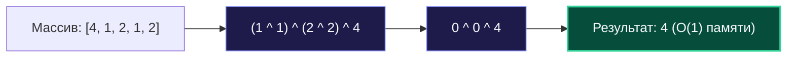
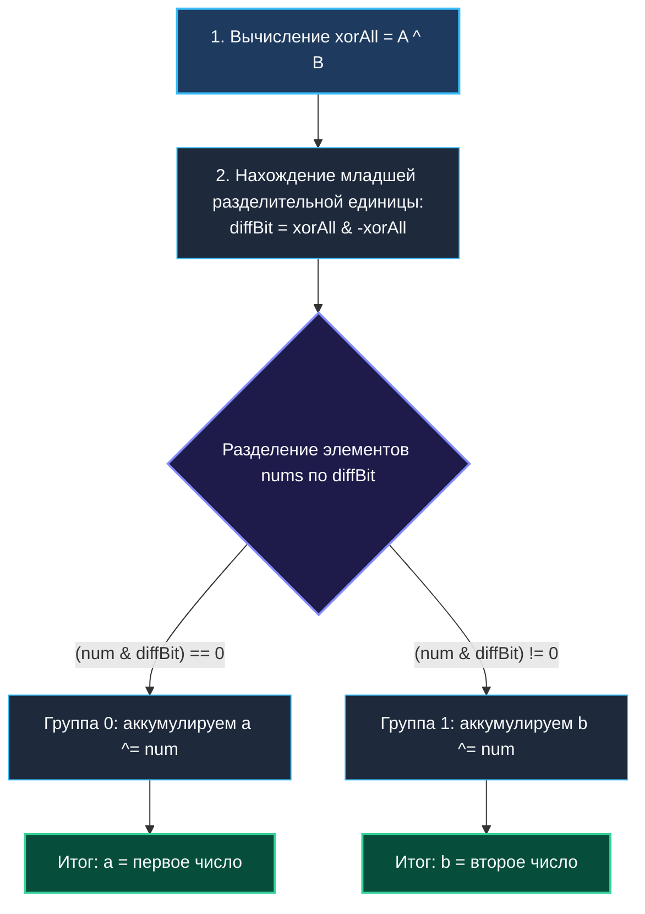

> *«Всякое действие, повторенное дважды, возвращает нас в исходную точку — в этом суть исключающего ИЛИ».*  
> — Брайан Керниган

Побитовая операция **XOR** (исключающее ИЛИ, в Go обозначается символом `^`) — это самый элегантный математический инструмент в низкоуровневом программировании. Её уникальные алгебраические свойства позволяют решать задачи, которые на первый взгляд требуют громоздких хэш-таблиц, дополнительной памяти $O(N)$ или тяжелой сортировки, за **один линейный проход $O(N)$ с константной памятью $O(1)$**.

На собеседованиях задачи на XOR — излюбленная классика. Они проверяют не заучивание библиотечных функций, а умение инженера видеть фундаментальные инварианты и понимать, как информация представлена в регистрах процессора.



---

## 1. Алгебраический фундамент операции XOR

Операция XOR подчиняется строгим законам теории групп и булевой алгебры:

| Свойство | Формула | Инженерный смысл |
| :--- | :--- | :--- |
| **Тождество с нулем** | $a \oplus 0 = a$ | Битовая маска из нулей сохраняет исходное число без изменений |
| **Самоуничтожение (Нильпотентность)** | $a \oplus a = 0$ | Повторение значения четное число раз полностью аннулирует его |
| **Коммутативность** | $a \oplus b = b \oplus a$ | Порядок поступления данных в потоке не имеет значения |
| **Ассоциативность** | $(a \oplus b) \oplus c = a \oplus (b \oplus c)$ | Допустима параллельная редукция (MapReduce / SIMD) |
| **Инволюция (Обратимость)** | $(a \oplus b) \oplus b = a$ | Наложение маски и повторное её наложение восстанавливает оригинал |

---

## 2. Паттерн 1: Поиск единственного уникального элемента (LeetCode 136)

**Постановка задачи:** В срезе целых чисел каждое число встречается ровно **дважды**, кроме одного-единственного. Найти это число за $O(N)$ времени и $O(1)$ дополнительной памяти.

### Наивный подход
Выделить `map[int]int`, посчитать частоты, затем найти ключ со значением `1`. Это требует $\mathcal{O}(N)$ аллокаций в куче и нагружает GC.

### Идиоматичный подход на Go
Благодаря коммутативности и свойству $x \oplus x = 0$, мы аккумулятором `result` свертываем весь срез:
$$(x_1 \oplus x_1) \oplus (x_2 \oplus x_2) \oplus \dots \oplus (x_k \oplus x_k) \oplus \text{unique} = 0 \oplus 0 \oplus \dots \oplus \text{unique} = \text{unique}$$

```go
package main

// SingleNumber находит уникальное число среди парных элементов за O(N) и O(1) памяти.
func SingleNumber(nums []int) int {
    var result int
    for _, num := range nums {
        result ^= num
    }
    return result
}
```

---

## 3. Паттерн 2: Поиск двух уникальных элементов (LeetCode 260)

**Постановка задачи:** Все элементы встречаются по два раза, кроме **двух различных уникальных чисел** $A$ и $B$. Найти $A$ и $B$ за $O(N)$ времени и $O(1)$ памяти.

### Математический инсайт
Если мы выполним XOR всех элементов массива, все дубликаты взаимоуничтожатся, и на выходе мы получим:
$$\text{xorSum} = A \oplus B$$
Так как $A \ne B$, в числе $\text{xorSum}$ гарантированно есть хотя бы один бит, равный $1$.  
Единичный бит означает, что **в этом конкретном разряде числа $A$ и $B$ различаются** (у одного там $1$, а у другого $0$).

Мы можем использовать этот бит как селектор (фильтр), чтобы разделить все числа исходного массива на две непересекающиеся группы:
1. **Группа 1:** числа, у которых выбранный бит равен $1$ (в нее попадет либо $A$, либо $B$).
2. **Группа 2:** числа, у которых выбранный бит равен $0$ (в нее попадет второе число).

Все парные числа гарантированно попадут в одну и ту же группу (так как их биты идентичны) и взаимно сократятся!



### Реализация на Go

```go
package main

// SingleNumberTwo находит два уникальных числа.
func SingleNumberTwo(nums []int) (int, int) {
    var xorAll int
    for _, num := range nums {
        xorAll ^= num
    }

    // Извлекаем младший единичный бит различия через Two's Complement хак:
    diffBit := xorAll & (-xorAll)

    var a, b int
    for _, num := range nums {
        if (num & diffBit) == 0 {
            a ^= num
        } else {
            b ^= num
        }
    }

    return a, b
}
```

---

## 4. Паттерн 3: Нахождение недостающего числа (Missing Number)

**Постановка задачи:** В массиве длины $N$ содержатся $N$ уникальных чисел из диапазона $[0, N]$. Одно число пропущено. Найти его.

### Арифметический риск переполнения
Классическая формула суммы Гаусса $\frac{N(N+1)}{2}$ при больших $N$ (например, $N = 10^7$) может переполнить знаковое 32-битное целое число, приведя к арифметическому переполнению (integer overflow).

### XOR-решение: Абсолютная защита от переполнения
XOR работает строго поразрядно. Значения никогда не превышают диапазон исходного типа данных:
$$\text{Missing} = N \oplus \bigoplus_{i=0}^{N-1} (i \oplus \text{nums}[i])$$

```go
package main

// MissingNumber находит пропущенное число в диапазоне [0, n].
func MissingNumber(nums []int) int {
    n := len(nums)
    res := n
    for i, val := range nums {
        res ^= i ^ val
    }
    return res
}
```

---

## 5. Паттерн 4: Ветвление без ветвлений (Branchless Abs & Sign)

На современных конвейерных процессорах (x86-64, Apple M-серии) условный переход `if/else`, который процессор не смог предсказать (Branch Misprediction), сбрасывает конвейер и обходится в 15–20 тактов простоя.

С помощью операции XOR и арифметического сдвига вправо можно вычислить абсолютное значение числа **без единого условного перехода**:

```go
package main

// AbsBranchless вычисляет |v| без инструкций условного перехода (JMP/CMOV).
func AbsBranchless(v int64) int64 {
    // Для v >= 0: mask = 0x0000000000000000 (0)
    // Для v < 0:  mask = 0xFFFFFFFFFFFFFFFF (-1)
    mask := v >> 63
    // Если mask == 0:  (v ^ 0) - 0 = v
    // Если mask == -1: (v ^ -1) - (-1) = (^v) + 1 = -v
    return (v ^ mask) - mask
}
```

### Ассемблерный эквивалент (x86-64):
```asm
MOVQ    AX, CX
SARQ    $63, CX     // CX = знаковая маска
XORQ    CX, AX      // AX ^= mask
SUBQ    CX, AX      // AX -= mask
```
Всего 3 инструкции, выполняющиеся строго линейно за 2 такта CPU.

---

## 6. Mechanical Sympathy: Аппаратная инструкция XORQ

На кристалле процессора логический блок XOR реализован через простейшие логические вентили на КМОП-транзисторах.
- Инструкция `XORQ RAX, RBX` имеет задержку (latency) в **1 такт**.
- В современных суперскалярных ядрах (Intel Raptor Lake, AMD Zen 4, Apple Firestorm) имеется до 4–6 параллельных АЛУ-портов, способных выполнять до **четырех XOR-инструкций за один машинный такт**.

Более того, инструкция обнуления регистра `XORQ AX, AX` распознается процессором еще на стадии декодирования (Register Renaming) и выполняется **за 0 тактов (Zero-latency instruction)**, не занимая исполнительные порты ядра!

---

## 7. Резюме

1. **Инволюция $x \oplus x = 0$:** Фундаментальный закон, позволяющий фильтровать парные события, сетевые пакеты и идентификаторы без аллокации хэш-таблиц.
2. **Селектор $x \ \& \ (-x)$:** Позволяет мгновенно извлечь различающийся бит и разделить пространство поиска на независимые классы эквивалентности.
3. **Безопасность типов:** XOR-вычисления защищены от целочисленного переполнения, в отличие от сумм и произведений.
4. **Zero Allocations:** Алгоритмы на базе XOR работают исключительно в регистрах процессора с константной памятью $\mathcal{O}(1)$.

В следующей статье мы подробно рассмотрим реализацию эталонной задачи этого семейства: [[3. Single Number]].