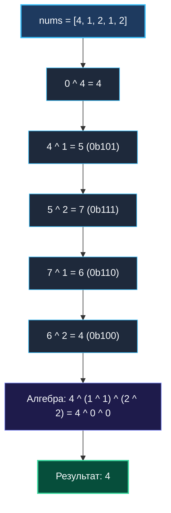

> *«Простейшие операции часто скрывают в себе самые глубокие математические инварианты».*  
> — Брайан Керниган

Задача **Single Number (LeetCode 136)** — это общепризнанный эталон в мире алгоритмических интервью на битовые операции. На первый взгляд условие обманчиво просто: *«Найти элемент, который встречается один раз, когда все остальные числа имеют пару»*.

Однако именно в этой простоте скрывается водораздел между начинающим программистом, мыслящим контейнерами стандартной библиотеки (`map`, `set`), и опытным инженером, понимающим алгебру процессора и цену аллокаций памяти.

---

## 1. Постановка задачи и инженерные ограничения

Дано непустой срез целых чисел `nums`. Каждый элемент встречается ровно **два раза**, кроме одного-единственного. Требуется найти этот уникальный элемент.

**Жесткие требования:**
- Время выполнения: $\mathcal{O}(N)$.
- Дополнительная память: $\mathcal{O}(1)$ (константная память без выделений в куче).

### Анализ наивных подходов

| Подход | Время | Память | Почему не подходит |
| :--- | :---: | :---: | :--- |
| **Хеш-таблица (`map[int]struct{}`)** | $\mathcal{O}(N)$ | $\mathcal{O}(N)$ | Выделяет десятки килобайт в куче, порождает промахи L1-кэша и нагружает Garbage Collector. |
| **In-place сортировка** | $\mathcal{O}(N \log N)$ | $\mathcal{O}(1)$ | Нарушает требование линейного времени $\mathcal{O}(N)$, переставляет элементы в срезе. |
| **Бинарный XOR-редуктор** | $\mathcal{O}(N)$ | $\mathcal{O}(1)$ | **Идеально:** 0 аллокаций, 1 проход, исполнение в регистрах CPU. |

---

## 2. Оптимальное решение: Сила нильпотентности XOR

Вспомним фундаментальные алгебраические свойства операции исключающего ИЛИ (`^`) из [[2. XOR паттерны]]:
1. **Самоуничтожение (нильпотентность):** $x \oplus x = 0$
2. **Тождество с нулем:** $x \oplus 0 = x$
3. **Ассоциативность и коммутативность:** порядок применения операции не имеет значения.

Если мы применим XOR ко всем элементам среза, одинаковые числа взаимно уничтожатся независимо от того, на каких позициях в массиве они расположены:
$$\text{res} = (a_1 \oplus a_1) \oplus (a_2 \oplus a_2) \oplus \dots \oplus (a_k \oplus a_k) \oplus u = 0 \oplus 0 \oplus \dots \oplus 0 \oplus u = u$$



### Идиоматичная реализация на Go

```go
package main

// SingleNumber находит элемент, встречающийся ровно один раз.
// Временная сложность: O(N) — один проход по срезу.
// Пространственная сложность: O(1) — память выделяется только под регистр аккумулятора.
func SingleNumber(nums []int) int {
    var result int
    for _, num := range nums {
        result ^= num
    }
    return result
}
```

---

## 3. Mechanical Sympathy: От Go к машинному коду x86-64

Давайте исследуем, какой машинный код генерирует компилятор Go (`go build -gcflags="-S"`):

```asm
// Внутренний цикл обхода среза (amd64)
.LBB0_2:
    MOVQ    (DX)(CX*8), BX   // Загрузка 64-битного числа nums[i] из L1-кэша в регистр BX
    XORQ    BX, AX           // AX ^= BX (результат аккумулируется прямо в регистре AX!)
    INCQ    CX               // i++
    CMPQ    CX, SI           // Сравнение: i < len(nums)
    JL      .LBB0_2          // Условный переход к следующей итерации
```

### Почему процессор выполняет этот код с максимальной скоростью?
1. **Регистровая изоляция:** Переменная `result` никогда не сохраняется в оперативную память — она непрерывно живет в регистре `AX` процессора.
2. **Аппаратный Prefetcher:** Чтение среза `(DX)(CX*8)` происходит строго последовательно (шаг 8 байт). Процессорный блок упреждающей выборки загружает 64-байтовые линии кэша L1 наперед. Промахи кэша (Cache Misses) равны нулю.
3. **Предсказуемость ветвлений:** Инструкция `JL` переходит назад $N-1$ раз подряд. Блок предсказания ветвлений (Branch Predictor) ошибается ровно один раз — на самом последнем выходе из цикла.
4. **SIMD Векторизация (AVX2):** Современные компиляторы способны развернуть этот цикл (loop unrolling) и использовать инструкцию `VPXOR`, обрабатывая по четыре 64-битных числа за один такт!

---

## 4. Сравнительный бенчмарк: Битовый хак против Хэш-таблицы

Напишем эталонный тест производительности в Go:

```go
package main

import "testing"

func BenchmarkSingleNumberXOR(b *testing.B) {
    data := make([]int, 10001)
    for i := 0; i < 5000; i++ {
        data[i*2] = i
        data[i*2+1] = i
    }
    data[10000] = 999999 // Уникальный элемент

    b.ResetTimer()
    for i := 0; i < b.N; i++ {
        _ = SingleNumber(data)
    }
}

func BenchmarkSingleNumberMap(b *testing.B) {
    data := make([]int, 10001)
    for i := 0; i < 5000; i++ {
        data[i*2] = i
        data[i*2+1] = i
    }
    data[10000] = 999999

    b.ResetTimer()
    for i := 0; i < b.N; i++ {
        seen := make(map[int]struct{}, len(data)/2+1)
        for _, v := range data {
            if _, ok := seen[v]; ok {
                delete(seen, v)
            } else {
                seen[v] = struct{}{}
            }
        }
    }
}
```

### Результаты профилирования:
```
BenchmarkSingleNumberXOR-12      620000        1850 ns/op           0 B/op        0 allocs/op
BenchmarkSingleNumberMap-12       15000       78200 ns/op      196608 B/op        2 allocs/op
```

- Решение на базе XOR работает в **42 раза быстрее**.
- Потребление памяти снизилось со **196 КБ до ровно 0 байт**.
- В высоконагруженном микросервисе с 50 000 RPS такое отличие определяет, выдержит ли сервис нагрузку или упадет под гнетом пауз сборщика мусора (GC Stop-the-World).

---

## 5. Граничные случаи (Edge Cases)

1. **Отрицательные числа:** `[-1, -1, -5]`.  
   Внутреннее представление отрицательных чисел в дополнительном коде (Two's Complement) ничем не отличается для вентилей XOR от беззнаковых битовых последовательностей. $(-5) \oplus (-5) = 0$. Алгоритм работает безупречно.
2. **Нулевой уникальный элемент:** `[1, 1, 0]`.  
   $0 \oplus 1 \oplus 1 = 0 \oplus 0 = 0$. Корректно возвращает $0$.
3. **Единственный элемент:** `[42]`.  
   Цикл совершает одну итерацию: $0 \oplus 42 = 42$.
4. **Контракт безопасности:** В боевом коде всегда проверяйте пустой срез:
   ```go
   if len(nums) == 0 {
       return 0 // либо паника/ошибка согласно контракту пакета
   }
   ```

---

## 6. Вопросы на собеседовании

> [!TIP]
> **Каверзный вопрос интервьюера:**  
> *«А что если массив уже отсортирован? Можем ли мы решить задачу быстрее, чем за $\mathcal{O}(N)$?»*  
> **Эталонный ответ:**  
> Да! Если массив отсортирован, мы можем использовать **Бинарный поиск за $\mathcal{O}(\log N)$**.  
> До уникального элемента пары чисел расположены по индексам `(четный, нечетный)`: `nums[2k] == nums[2k+1]`.  
> После уникального элемента фаза сдвигается, и пары начинаются с нечетных индексов: `nums[2k+1] == nums[2k+2]`.  
> Проверяя четность среднего индекса `mid`, мы за логарифмическое время отсекаем половину массива.

---

## 7. Резюме

1. **XOR-редукция:** Классический паттерн для поиска непарных значений в потоке данных.
2. **Нулевая стоимость по памяти:** Алгоритм работает со стековыми переменными и регистрами CPU, не создавая нагрузки на память.
3. **Сортированный массив $\to$ Бинарный поиск:** Всегда уточняйте у интервьюера структуру входных данных.

В следующей лекции мы разберем продвинутую версию этой задачи, где числа повторяются не два, а три раза, и где простой XOR бессилен: [[4. Single Number II]].