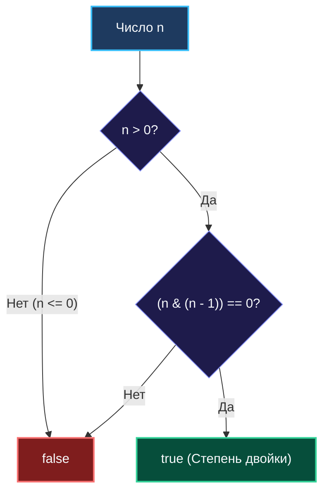

> *«Всякое число, несущее лишь одну единицу в двоичном коде, обладает совершенной степенью двойки».*  
> — Брайан Керниган

Задача **Power of Two (LeetCode 231, Easy)** на первый взгляд кажется элементарной: «Проверить, является ли целое число $N$ степенью двойки».

Начинающие программисты часто пишут цикл с последовательным делением на 2 (`n /= 2`) или вызывают функцию вещественного логарифма `math.Log2(float64(n))`, допуская погрешности чисел с плавающей точкой IEEE 754. Опытный системный инженер решает эту задачу за **ровно 1 машинный такт** благодаря фундаментальному свойству двоичной арифметики.

---

## 1. Математический инвариант двоичного представления

Любая натуральная степень двойки ($2^0=1, 2^1=2, 2^2=4, 2^3=8, \dots, 2^{62}$) в двоичной системе счисления представляется числом, в котором содержится **ровно один единичный бит**:
- $2^0 = 1 = 0000\,0001_2$
- $2^1 = 2 = 0000\,0010_2$
- $2^2 = 4 = 0000\,0100_2$
- $2^3 = 8 = 0000\,1000_2$

Все остальные разряды строго равны нулю.

### Алгебра выражения $n \ \& \ (n - 1)$
Что происходит при вычитании единицы из степени двойки?  
Единственный старший бит $1$ заменяется на $0$, а все младшие нулевые биты инвертируются в $1$:
$$8 = 1000_2, \quad 8 - 1 = 7 = 0111_2$$

Применяя побитовую операцию AND:
```text
  1000  (n = 8)
& 0111  (n - 1 = 7)
------
  0000  (результат 0!)
```

Если же число **не** является степенью двойки, в нем присутствует более одного единичного бита. Вычитание единицы сбросит лишь самый младший бит, а старшие единицы останутся нетронутыми:
```text
  0110  (n = 6)
& 0101  (n - 1 = 5)
------
  0100  (результат != 0)
```

Следовательно, условие `(n & (n - 1)) == 0` истинно тогда и только тогда, когда число содержит не более одной единицы.



---

## 2. Идиоматичная реализация на Go

```go
package main

// IsPowerOfTwo проверяет, является ли n степенью двойки.
// Временная сложность: O(1) — 1 такт CPU.
// Память: O(1) — 0 аллокаций.
func IsPowerOfTwo(n int) bool {
    return n > 0 && (n&(n-1)) == 0
}
```

> [!WARNING]
> **Приоритет операторов в Go:**  
> Побитовый оператор `&` имеет более высокий приоритет, чем оператор сравнения `==`.  
> Выражение `n & (n - 1) == 0` без явных скобок вокруг побитовой части приведет к ошибке компиляции в Go: `mismatched types int and bool`.  
> Скобки вокруг `(n & (n - 1))` **строго обязательны**!

---

## 3. Коварные ловушки: Ноль и `math.MinInt`

Почему проверка `n > 0` критически необходима?

### 1. Число 0
Для нуля: $0 \ \& \ (0 - 1) = 0 \ \& \ (-1) = 0$.  
Без условия `n > 0` алгоритм вернет `true` для нуля, что математически некорректно ($2^k \ne 0$).

### 2. Ловушка `math.MinInt64`
Рассмотрим минимальное знаковое 64-битное целое число:
$$\text{MinInt64} = -2^{63} = \text{0x8000000000000000}$$
В двоичной форме это число состоит из **ровно одной единицы** в старшем (знаковом) разряде и 63 нулей!  
При вычитании единицы в дополнительном коде (Two's Complement):
$$\text{MinInt64} - 1 = \text{MaxInt64} = \text{0x7FFFFFFFFFFFFFFF} = 0111\dots111_2$$
Вычисляем побитовое AND:
$$\text{0x8000000000000000} \ \& \ \text{0x7FFFFFFFFFFFFFFF} = 0!$$
Без явной проверки положительности `n > 0`, выражение `MinInt64 & (MinInt64 - 1) == 0` вернет `true`!  
Это катастрофический краевой случай, который приводит к уязвимостям в криптографических и системных библиотеках.

---

## 4. Mechanical Sympathy: Branchless ассемблер (x86-64 и ARM64)

Как компилятор Go генерирует машинный код для `n > 0 && (n & (n - 1)) == 0`?

```asm
// x86-64 (go build -gcflags="-S")
TESTQ   AX, AX       // Проверка знака и нуля числа n
SETG    CL           // CL = 1, если n > 0 (Signed Greater)
LEAQ    -1(AX), DX   // DX = n - 1 (быстрое вычитание через LEA за 1 такт)
ANDQ    DX, AX       // AX = n & (n - 1)
TESTQ   AX, AX       // Проверка AX == 0
SETZ    DL           // DL = 1, если результат равен 0 (Zero flag)
ANDB    DL, CL       // CL = (n > 0) AND ((n & (n - 1)) == 0)
MOVBLZX CL, AX       // Возврат булева значения в RAX
RET
```

**Анализ:**
В сгенерированном машинном коде **нет ни одной инструкции условного перехода (`JMP`/`JNE`)**! Инструкции `SETG` и `SETZ` превращают флаги процессора напрямую в значения регистров.  
Конвейер CPU исполняет этот фрагмент строго прямолинейно за **2–3 такта процессора** без малейшего риска Branch Misprediction.

---

## 5. Расширение паттерна: Степень четверки (Power of Four)

На технических собеседованиях часто задают усложнение: *«Как проверить, является ли число степенью четверки (LeetCode 342)?»*

### Свойства степеней 4:
1. Число обязано быть степенью двойки: $4^k = (2^2)^k = 2^{2k}$.
2. Единственный единичный бит обязан находиться на **четной позиции** (считая от младшего 0-го разряда):
   - $4^0 = 1$ (разряд 0 — четный)
   - $4^1 = 4 = 0000\,0100_2$ (разряд 2 — четный)
   - $4^2 = 16 = 0001\,0000_2$ (разряд 4 — четный)

Для фильтрации позиций единицы применим битовую маску, где единицы стоят строго на всех четных позициях:
$$\text{mask}_{32} = \text{0x55555555} = 0101\,0101\,0101\,0101\,0101\,0101\,0101\,0101_2$$

```go
package main

// IsPowerOfFour проверяет степень 4 за 1 такт без циклов и делений.
func IsPowerOfFour(n int) bool {
    // 1. n > 0
    // 2. n & (n - 1) == 0  (проверка на степень 2)
    // 3. n & 0x55555555 != 0 (единица на четной позиции)
    return n > 0 && (n&(n-1)) == 0 && (n&0x55555555) != 0
}
```

---

## 6. Прикладное применение в Go: Выравнивание памяти (Memory Alignment)

В ядре рантайма Go (аллокатор `runtime/malloc.go`) и драйверах высокопроизводительных баз данных адреса памяти обязаны быть выровнены по размеру машинного слова (8 байт), кэш-линии (64 байта) или страницы памяти ОС (4096 байт = 4 КБ).

Поскольку размеры страниц и кэш-линий **всегда являются степенями двойки**, округление размера буфера вверх до границы выравнивания выполняется одной быстрой побитовой операцией:

```go
package main

// AlignUp округляет размер n вверх до границы alignment (alignment обязан быть степенью 2).
func AlignUp(n, alignment int) int {
    // В Go оператор &^ (Bit Clear) идеально сбрасывает младшие биты:
    return (n + alignment - 1) &^ (alignment - 1)
}
```

**Пример:** При `n = 4100` и `alignment = 4096` (4 КБ):
- `alignment - 1` = `4095` (`0x0FFF`)
- `(n + 4095)` = `8195`
- Оператор `&^ 0x0FFF` обнуляет младшие 12 бит, давая ровно `8192` (2 страницы по 4 КБ) за **1 такт CPU без инструкции деления**.

---

## 7. Резюме

1. **Инвариант степени двойки:** В двоичной записи числа ровно один единичный бит.
2. **Формула Кернигана:** `n > 0 && (n & (n - 1)) == 0` — канонический способ проверки за $\mathcal{O}(1)$ времени и памяти.
3. **Краевые случаи:** Всегда защищайте код проверкой $n > 0$, помня про особенности нуля и коварство `math.MinInt64`.
4. **Степень 4:** Проверяется наложением маски четных битов `0x55555555`.
5. **Выравнивание памяти:** Формула `(n + align - 1) &^ (align - 1)` лежит в основе рантайма Go и аллокаторов памяти.

В следующей статье мы завершим кластер битовых операций задачей поиска пропавшего элемента в массиве: [[7. Missing Number]].