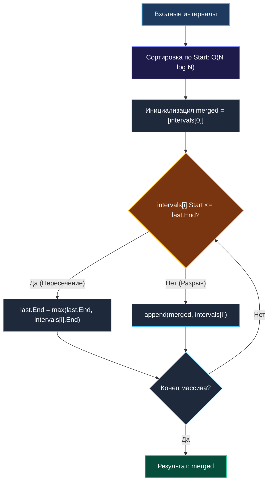

> *«Время — это не точка, а непрерывный отрезок; упорядочив их истоки, мы обуздываем хаос совпадений».*  
> — Брайан Керниган

Интервальные задачи лежат в самом сердце архитектуры высоконагруженных бэкенд-систем:
- **Планировщики задач и бронирование ресурсов:** Выделение вычислительных слотов в Kubernetes, бронирование отелей и билетов, распределение переговорных комнат в корпоративных календарях (Google Calendar, Outlook).
- **Сетевой стек и хранилища данных:** Слияние окон подтверждения TCP (TCP SACK intervals), оптимизация дискового ввода-вывода (IO coalescing), диапазоны LSM-деревьев в RocksDB и Cassandra.
- **Финансовые системы:** Анализ биржевых свечей (OHLC), агрегация временных рядов в Prometheus и VictoriaMetrics.

На технических собеседованиях интервальные задачи позволяют интервьюеру мгновенно оценить культуру кода инженера: умеет ли он моделировать непрерывные диапазоны, как обрабатывает граничные коллизии (касания концов) и способен ли выбрать оптимальную стратегию между **жадным слиянием (Greedy Merging)** и **методом заметающей прямой (Sweep Line)**.

---

## 1. Память и представление: Slice of Slices против Flat Structs

На LeetCode интервалы традиционно задаются как срез срезов: `intervals [][]int`.  
Давайте проанализируем, во что это выливается в оперативной памяти с точки зрения железа:

```
LeetCode формат: [][]int (Фрагментация кучи и Pointer Chasing)
[Slice Header: ptr, len, cap] (24 байта)
    |
    +---> [Backing array: *ptr, len, cap] -> [int, int] (16 байт в куче)
    +---> [Backing array: *ptr, len, cap] -> [int, int] (16 байт в куче)
^ Десятки тысяч микроаллокаций, размазанных по RAM. L1 Cache Misses гарантированы.

Инженерный формат: []Interval (Непрерывный массив в L1 Cache)
+-------------------+-------------------+-------------------+-------------------+
| Interval 0 (16B)  | Interval 1 (16B)  | Interval 2 (16B)  | Interval 3 (16B)  |
+-------------------+-------------------+-------------------+-------------------+
<--------------------------- 1 Линия кэша CPU (64 байта) --------------------------->
```

1. **Структура `Interval`:**
   ```go
   type Interval struct {
       Start int // 8 байт
       End   int // 8 байт
   }
   ```
   Размер структуры составляет ровно **16 байт** без какого-либо скрытого паддинга (Padding).
2. **Кэш-линия:** Стандартная линия кэша x86-64 и ARM64 составляет 64 байта. В одну линию кэша L1 помещается ровно **4 интервала**. Аппаратный префетчер процессора загружает их блоками, обеспечивая максимальную скорость итерации.

---

## 2. Фундаментальный паттерн 1: Сортировка и жадное слияние (Greedy Merge)

Применяется, когда необходимо объединить пересекающиеся отрезки или найти свободные «окна» между ними.

### Главный инвариант
Если отсортировать интервалы **по времени начала (`Start`)**, то все потенциальные кандидаты на пересечение выстраиваются строго в хронологический ряд. Каждый новый интервал $I_{k}$ может пересекаться **только с самым последним объединенным интервалом $I_{\text{last}}$**! Сравнивать его с более ранними интервалами не требуется.



### Идиоматичный Go-код
```go
package main

import "slices"

type Interval struct {
    Start int
    End   int
}

// MergeIntervals объединяет перекрывающиеся интервалы.
// Временная сложность: O(N log N) из-за сортировки.
// Память: O(N) под результирующий срез.
func MergeIntervals(intervals []Interval) []Interval {
    if len(intervals) <= 1 {
        return intervals
    }

    // Современная быстрая сортировка без аллокаций интерфейсов (Go 1.21+)
    slices.SortFunc(intervals, func(a, b Interval) int {
        return a.Start - b.Start
    })

    // Предвыделяем емкость N для исключения реаллокаций базового массива
    merged := make([]Interval, 0, len(intervals))
    merged = append(merged, intervals[0])

    for i := 1; i < len(intervals); i++ {
        last := &merged[len(merged)-1] // Указатель на последний элемент без копирования

        if intervals[i].Start <= last.End {
            // Пересечение: растягиваем границу до максимума
            last.End = max(last.End, intervals[i].End)
        } else {
            // Разрыв: добавляем новый изолированный интервал
            merged = append(merged, intervals[i])
        }
    }

    return merged
}
```

---

## 3. Фундаментальный паттерн 2: Заметающая прямая (Sweep Line)

Когда требуется найти **максимальное количество одновременно активных процессов** (пиковую нагрузку на сервер, требуемое число конференц-залов), слияние интервалов не подходит. На помощь приходит **Sweep Line**.

### Физическая модель
Представьте вертикальную линию времени, которая движется слева направо.  
Каждый интервал $[S, E]$ распадается на два независимых точечных события:
1. `Start (+1)`: процесс начался, нагрузка выросла на единицу.
2. `End (-1)`: процесс завершился, нагрузка уменьшилась на единицу.

Мы сортируем все события вдоль временной оси и за один линейный проход накапливаем сумму, фиксируя глобальный максимум.

```mermaid
flowchart LR
    classDef startEv fill:#064e3b,stroke:#34d399,stroke-width:1px,color:#f8fafc
    classDef endEv fill:#7f1d1d,stroke:#f87171,stroke-width:1px,color:#f8fafc
    classDef peak fill:#1e1b4b,stroke:#818cf8,stroke-width:2px,color:#f8fafc

    E1["t=1: Start (+1) [Загрузка: 1]"]:::startEv --> E2["t=2: Start (+1) [Загрузка: 2]"]:::startEv
    E2 --> E3["t=3: Start (+1) [ПИК: 3]"]:::peak
    E3 --> E4["t=4: End (-1) [Загрузка: 2]"]:::endEv
    E4 --> E5["t=6: End (-1) [Загрузка: 1]"]:::endEv
```



### Коварный нюанс: Тайбрейкинг при совпадении времени (Tie-Breaking)
Что делать, если событие окончания одного интервала и событие начала другого приходятся на один и тот же момент времени $T$?
- **Если интервалы полуоткрытые $[S, E)$:** касание в точке $T$ не является пересечением. Событие **конца (`-1`)** обязано обрабатываться **раньше** события начала (`+1`).
- **Если интервалы замкнутые $[S, E]$:** касание в точке $T$ считается пересечением. Событие **начала (`+1`)** обязано обрабатываться **раньше** окончания (`-1`).

```go
type Event struct {
    Time int
    Type int // +1 — старт, -1 — конец
}

func MaxConcurrentEvents(intervals []Interval) int {
    events := make([]Event, 0, len(intervals)*2)
    for _, iv := range intervals {
        events = append(events, Event{Time: iv.Start, Type: 1})
        events = append(events, Event{Time: iv.End, Type: -1})
    }

    // Сортировка: при равном времени порядок Type определяет семантику границ
    slices.SortFunc(events, func(a, b Event) int {
        if a.Time != b.Time {
            return a.Time - b.Time
        }
        return a.Type - b.Type // -1 раньше +1 (для полуоткрытых отрезков)
    })

    current, maxPeak := 0, 0
    for _, ev := range events {
        current += ev.Type
        maxPeak = max(maxPeak, current)
    }
    return maxPeak
}
```

---

## 4. Оптимизация памяти: In-Place Compacting за $O(1)$ extra space

На собеседованиях уровня Staff/Principal часто звучит требование:  
*«Память $\mathcal{O}(1)$ дополнительно. Разрешено мутировать входной массив».*

Для этого применяется паттерн двух указателей (Read Pointer и Write Pointer):

```go
// MergeInPlace выполняет слияние прямо во входном срезе intervals.
func MergeInPlace(intervals []Interval) []Interval {
    if len(intervals) <= 1 {
        return intervals
    }

    slices.SortFunc(intervals, func(a, b Interval) int {
        return a.Start - b.Start
    })

    writeIdx := 0 // Указатель на последний валидный объединенный элемент

    for readIdx := 1; readIdx < len(intervals); readIdx++ {
        if intervals[readIdx].Start <= intervals[writeIdx].End {
            intervals[writeIdx].End = max(intervals[writeIdx].End, intervals[readIdx].End)
        } else {
            writeIdx++
            intervals[writeIdx] = intervals[readIdx]
        }
    }

    // Усекаем срез до фактически записанных элементов (0 аллокаций!)
    return intervals[:writeIdx+1]
}
```

---

## 5. Граничные случаи и ловушки

1. **Вложенные интервалы:** `[1, 10]` и `[2, 5]`.  
   После сортировки `[1, 10]` идет первым. Для второго интервала `2 <= 10`, но `5 < 10`.  
   Формула `last.End = max(last.End, curr.End)` гарантирует, что конец не откатится назад до 5.
2. **Точечные интервалы нулевой длины:** `[3, 3]`.  
   Моделируют мгновенные события (импульсы, flash sales). Корректно сливаются с окружающими диапазонами.
3. **Пустой срез или срез из 1 элемента:** Всегда ставьте guard clause `if len(intervals) <= 1 { return intervals }` в самом начале функции.

---

## 6. Резюме

1. **Сортировка — фундамент:** 90% интервальных задач начинаются с сортировки по времени начала `Start`. Это упорядочивает пересечения во времени.
2. **Жадное слияние (Greedy Merge):** После сортировки текущий интервал сравнивается исключительно с последним объединенным элементом.
3. **Заметающая прямая (Sweep Line):** Превращает отрезки в независимые события `+1 / -1`. Порядок тайбрейкинга при равенстве временных меток критичен для корректности.
4. **Кэш-дружественность:** Плоские структуры `Interval` размером 16 байт утилизируют кэш-линии процессора на 100%, в отличие от вложенных срезов `[][]int`.

В следующей лекции мы разберем каноническую задачу LeetCode на слияние диапазонов и напишем для нее исчерпывающий набор тестов: [[3. Merge Intervals]].