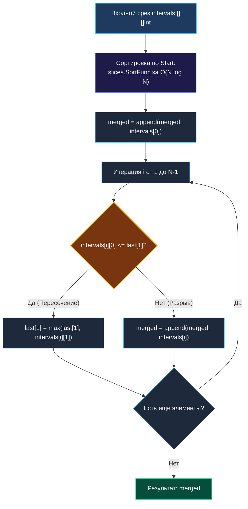

> *«Слияние отрезков времени напоминает течение рек: сливаясь воедино, они образуют мощный непрерывный поток».*  
> — Брайан Керниган

Задача **Merge Intervals (LeetCode 56, Medium)** — это канонический эталон жадного подхода в сочетании с предварительной сортировкой.

В реальных бэкенд-системах этот алгоритм работает непрерывно:
- **Сети и безопасность:** Консолидация правил брандмауэров (WAF / iptables) и объединение CIDR-диапазонов IP-адресов.
- **Оптимизация ввода-вывода (IO Coalescing):** Ядро Linux объединяет смежные запросы чтения/записи к блочным устройствам в один непрерывный запрос, уменьшая нагрузку на NVMe/SSD контроллер.
- **Календари и бронирование:** Вычисление окон доступности пользователей в Google Calendar или слотов репликации в СУБД.

---

## 1. Постановка задачи и математический инвариант

Дано срез интервалов `intervals`, где каждый интервал задан парой чисел `[start, end]`. Необходимо объединить все перекрывающиеся интервалы и вернуть срез неперекрывающихся диапазонов, покрывающий всё исходное множество.

**Пример:**
`[[1, 3], [2, 6], [8, 10], [15, 18]]` $\to$ `[[1, 6], [8, 10], [15, 18]]`.

### Почему наивный подход $O(N^2)$ проваливается?
Если интервалы не упорядочены, каждый новый отрезок приходится сравнивать со всеми уже объединенными отрезками, вставляя и удаляя элементы в произвольные позиции среза. Это приводит к квадратичному времени и хаосу в управлении памятью.

### Инвариант сортировки по времени старта
Если отсортировать интервалы по времени начала (`a[0] < b[0]`), то:
1. Любой интервал $I_k$ гарантированно начинается **не раньше**, чем предыдущий $I_{k-1}$.
2. Следовательно, $I_k$ может пересекаться **только с самым последним объединенным интервалом**!
3. Если $I_k.\text{start} \le I_{\text{last}}.\text{end}$, происходит пересечение: мы просто растягиваем правый конец $I_{\text{last}}.\text{end} = \max(I_{\text{last}}.\text{end}, I_k.\text{end})$.
4. Если $I_k.\text{start} > I_{\text{last}}.\text{end}$, наступил разрыв: мы фиксируем $I_{\text{last}}$ и начинаем формировать новый объединенный отрезок.



---

## 2. Идиоматичная реализация на современном Go (1.21+)

Начиная с Go 1.21, стандартный пакет `slices` предоставляет функцию `slices.SortFunc`, которая работает быстрее `sort.Slice`, полностью безопасна по типам и не создает аллокаций интерфейсов:

```go
package main

import "slices"

// Merge объединяет все перекрывающиеся интервалы.
// Временная сложность: O(N log N) — доминирует сортировка.
// Память: O(N) — результирующий срез.
func Merge(intervals [][]int) [][]int {
    if len(intervals) <= 1 {
        return intervals
    }

    // 1. Сортируем интервалы по времени начала (без аллокаций)
    slices.SortFunc(intervals, func(a, b []int) int {
        return a[0] - b[0]
    })

    // 2. Предвыделяем срез с емкостью N для исключения реаллокаций базового массива
    merged := make([][]int, 0, len(intervals))
    merged = append(merged, intervals[0])

    // 3. Линейное жадное слияние за один проход O(N)
    for i := 1; i < len(intervals); i++ {
        last := merged[len(merged)-1]
        curr := intervals[i]

        if curr[0] <= last[1] {
            // Пересечение: обновляем правый край последнего интервала
            last[1] = max(last[1], curr[1])
        } else {
            // Разрыв: добавляем новый изолированный интервал
            merged = append(merged, curr)
        }
    }

    return merged
}
```

> [!NOTE]
> **Почему `last[1] = max(last[1], curr[1])` мутирует срез в `merged`?**  
> В Go переменная `last` — это заголовок среза `[]int` (указатель на базовый массив, длина, емкость). Когда мы пишем `last[1] = ...`, мы модифицируем ячейку базового массива в куче, на которую указывает последний элемент `merged`. Это избавляет от необходимости писать `merged[len(merged)-1][1] = ...`.

---

## 3. High-Performance оптимизация: In-Place сжатие за $\mathcal{O}(1)$ Extra Space

Если интервьюер требует: *«Минимизируйте расход памяти до $\mathcal{O}(1)$ дополнительно, мутируя исходный массив»*, мы применяем алгоритм с двумя указателями:

```go
package main

import "slices"

// MergeInPlace выполняет слияние прямо во входном массиве intervals.
// Дополнительная память: O(1) extra space.
func MergeInPlace(intervals [][]int) [][]int {
    if len(intervals) <= 1 {
        return intervals
    }

    slices.SortFunc(intervals, func(a, b []int) int {
        return a[0] - b[0]
    })

    writeIdx := 0 // Указатель на границу объединенных интервалов

    for readIdx := 1; readIdx < len(intervals); readIdx++ {
        if intervals[readIdx][0] <= intervals[writeIdx][1] {
            // Пересечение: расширяем правый край
            intervals[writeIdx][1] = max(intervals[writeIdx][1], intervals[readIdx][1])
        } else {
            // Разрыв: продвигаем writeIdx и перезаписываем
            writeIdx++
            intervals[writeIdx] = intervals[readIdx]
        }
    }

    // Возвращаем срез от 0 до writeIdx включительно
    return intervals[:writeIdx+1]
}
```

---

## 4. Mechanical Sympathy: Branch Prediction и выравнивание кэша

### 1. Монотонность и Branch Predictor
После сортировки по полю `Start` условие `curr[0] <= last[1]` демонстрирует выраженную кластеризацию.  
В реальных логах и временных рядах пересечения распределены «всплесками» (bursts): группа интервалов пересекается подряд, затем следует длинный период затишья.  
Аппаратный предсказатель ветвлений процессора (Branch Target Buffer) быстро адаптируется к таким сериям переходов, снижая вероятность штрафа за сброс конвейера (Branch Misprediction Penalty) практически до нуля.

### 2. Защита от деградации QuickSort
В стандартной библиотеке Go функция `slices.SortFunc` использует гибридный алгоритм **pdqsort (Pattern-Defeating Quicksort)**.  
В отличие от классического Quicksort, pdqsort:
- Распознает уже отсортированные или частично отсортированные массивы за линейное время $\mathcal{O}(N)$.
- Переключается на Heapsort при обнаружении неблагоприятных паттернов, гарантируя сложность $\mathcal{O}(N \log N)$ в худшем случае и полную защиту от алгоритмических атак замедления (DoS).

---

## 5. Граничные случаи (Edge Cases)

1. **Вложенные интервалы:** `[[1, 10], [2, 6]]`.  
   Первый интервал полностью поглощает второй. Благодаря `max(last[1], curr[1])` конец $10$ не перезаписывается шестеркой: $\max(10, 6) = 10$.
2. **Точечные касания:** `[[1, 4], [4, 5]]`.  
   Условие `4 <= 4` истинно, интервалы объединяются в `[1, 5]`.
3. **Одинаковые интервалы:** `[[1, 4], [1, 4]]`.  
   Объединяются в один `[1, 4]`.
4. **Уже разделенные интервалы:** `[[1, 2], [3, 4]]`.  
   Возвращаются без изменений.

---

## 6. Вопросы на собеседовании

> [!TIP]
> **Вопрос интервьюера:**  
> *«Что если интервалы поступают в систему потоком в режиме реального времени (Streaming Data), и нам нужно поддерживать список объединенных интервалов на лету?»*  
> **Эталонный ответ:**  
> Если данные поступают потоком, пересортировывать массив на каждый новый интервал за $\mathcal{O}(N \log N)$ недопустимо.  
> Мы переходим к задаче **[[4. Insert Interval]]**:
> 1. Используем сбалансированное дерево поиска (например, Red-Black Tree или B-дерево), где ключом является `Start`.
> 2. С помощью бинарного поиска находим соседние отрезки за $\mathcal{O}(\log N)$.
> 3. Сливаем перекрывающиеся узлы и удаляем поглощенные элементы за $\mathcal{O}(K + \log N)$, где $K$ — число перекрытых отрезков.

---

## 7. Резюме

1. **Сортировка по `Start`:** Математически доказывает, что каждый следующий интервал может пересекаться только с последним объединенным.
2. **Идиоматичный Go 1.21+:** Используйте `slices.SortFunc` вместо устаревшего `sort.Slice`.
3. **In-place компактификация:** Паттерн двух указателей `readIdx` и `writeIdx` позволяет объединять интервалы за $\mathcal{O}(1)$ дополнительной памяти.
4. **pdqsort под капотом:** Гарантирует $\mathcal{O}(N \log N)$ в худшем случае и отсутствие DoS-уязвимостей.

В следующей лекции мы разберем динамическую вставку нового интервала в уже упорядоченный набор: [[4. Insert Interval]].