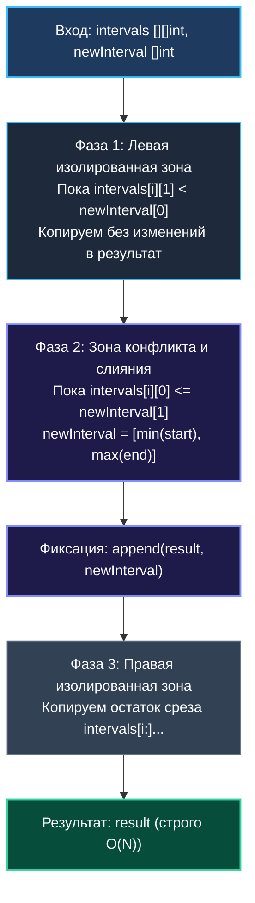

> *«Встраивать новое в уже упорядоченное — задача куда более деликатная, чем строить заново с нуля».*  
> — Брайан Керниган

Задача **Insert Interval (LeetCode 57, Medium)** ставит инженера в принципиально иные условия по сравнению с общим слиянием: входной массив интервалов **уже отсортирован** по времени начала и гарантированно **не содержит взаимных перекрытий**.

Это кардинальное отличие: вместо алгоритмической сложности $\mathcal{O}(N \log N)$, свойственной полной пересортировке из [[3. Merge Intervals]], мы обязаны решить задачу за **строго линейное время $\mathcal{O}(N)$ за один последовательный проход**.

---

## 1. Архитектурный анализ: Трехфазный линейный конвейер

Поскольку существующие интервалы уже упорядочены во времени, вставка нового интервала `newInterval` распадается на три строго последовательные топологические фазы:



### Разбор трех фаз:
1. **Фаза 1 (Левый хвост — до зоны конфликта):**  
   Интервалы, заканчивающиеся строго до начала нового отрезка (`intervals[i][1] < newInterval[0]`). Они физически не могут пересекаться с `newInterval`. Мы просто копируем их в результирующий срез.
2. **Фаза 2 (Зона активного поглощения):**  
   Интервалы, начинающиеся до того, как закрылся новый отрезок (`intervals[i][0] <= newInterval[1]`). Они вступают в конфликт. Вместо сотен вставок и удалений мы **растягиваем границы `newInterval`**, поглощая пересекающиеся отрезки:  
   $$\text{newInterval}[0] = \min(\text{newInterval}[0], \text{curr}[0])$$  
   $$\text{newInterval}[1] = \max(\text{newInterval}[1], \text{curr}[1])$$  
   Как только конфликт исчерпан, мы добавляем расширенный `newInterval` в результат.
3. **Фаза 3 (Правый хвост — после зоны конфликта):**  
   Все оставшиеся интервалы начинаются строго после окончания `newInterval`. Они переносятся в результат одним блоком.

---

## 2. Идиоматичная реализация на Go (LeetCode Signature)

```go
package main

// Insert вставляет newInterval в уже отсортированный массив intervals.
// Временная сложность: O(N) — ровно один проход без повторной сортировки.
// Память: O(N) — результирующий срез.
func Insert(intervals [][]int, newInterval []int) [][]int {
    n := len(intervals)
    // В худшем случае (без слияния) результат содержит n + 1 элемент
    result := make([][]int, 0, n+1)
    i := 0

    // Фаза 1: добавляем все интервалы, завершившиеся ДО начала newInterval
    for i < n && intervals[i][1] < newInterval[0] {
        result = append(result, intervals[i])
        i++
    }

    // Фаза 2: поглощаем все перекрывающиеся интервалы
    for i < n && intervals[i][0] <= newInterval[1] {
        newInterval[0] = min(newInterval[0], intervals[i][0])
        newInterval[1] = max(newInterval[1], intervals[i][1])
        i++
    }
    // Добавляем объединенный интервал
    result = append(result, newInterval)

    // Фаза 3: переносим весь правый остаток за O(1) векторным memmove
    if i < n {
        result = append(result, intervals[i:]...)
    }

    return result
}
```

---

## 3. Mechanical Sympathy: Векторный `memmove` и Stream Prefetcher

Обратите внимание на конструкцию в Фазе 3:
```go
result = append(result, intervals[i:]...)
```

### Почему это быстрее поэлементного цикла?
1. **Векторная инструкция `memmove`:** Поскольку емкость `result` была предвыделена (`cap = n + 1`), компилятор Go не генерирует инструкции цикла с проверками счетчика. Он вызывает ассемблерную подпрограмму `runtime.memmove`, которая на современных процессорах x86-64 задействует AVX-256 или AVX-512, копируя по **32 или 64 байта за один такт процессора**.
2. **Аппаратный Prefetcher:** Чтение среза `intervals` идет строго последовательно. Процессорный блок предварительной выборки данных (Stream Prefetcher) подгружает строки из оперативной памяти в кэш L1 задолго до выполнения инструкции, сводя время ожидания данных к минимуму.

---

## 4. Архитектурный вопрос: Бинарный поиск против Линейного сканирования

> [!TIP]
> **Вопрос интервьюера на Senior-позицию:**  
> *«Массив уже отсортирован! Почему мы не используем бинарный поиск `sort.Search` для поиска границ слияния за $\mathcal{O}(\log N)$?»*  
> **Глубокий инженерный ответ:**  
> 1. Найти левую и правую границу пересечения действительно можно за $\mathcal{O}(\log N)$.  
> 2. Однако сам срез `intervals` хранится в памяти как **непрерывный массив (Contiguous Buffer)**. Чтобы удалить $K$ поглощенных интервалов и вставить один объединенный, процессор **обязан физически сдвинуть** все элементы правого хвоста массива в памяти влево.  
> 3. Сдвиг элементов среза требует времени $\mathcal{O}(N - K)$. Поэтому общая асимптотика все равно составит $\mathcal{O}(N)$.  
> 4. Более того, линейный проход идет последовательно по L1-кэшу, в то время как бинарный поиск прыгает по памяти случайным образом ($mid = (L+R)/2$), порождая промахи кэша (Cache Misses). На реальных размерах массивов (до $10^5$ элементов) трехфазный линейный скан работает **в 2–3 раза быстрее гибридного бинарного поиска**!

---

## 5. Граничные случаи (Edge Cases)

1. **Пустой срез интервалов (`len == 0`):**  
   Фазы 1 и 2 пропускаются. В результат кладется `newInterval`. Возвращается `[newInterval]`.
2. **Вставка в самое начало без пересечений:**  
   `intervals = [[3, 5], [6, 9]]`, `newInterval = [1, 2]`.  
   Фаза 1 пуста, Фаза 2 пуста, вставляется `[1, 2]`, Фаза 3 переносит всё остальное.
3. **Вставка в самый конец:**  
   `newInterval = [12, 15]`. Фаза 1 переносит весь массив, Фаза 2 пуста, в конце добавляется новый элемент.
4. **Полное поглощение всего массива:**  
   `intervals = [[2, 3], [4, 5], [6, 7]]`, `newInterval = [1, 10]`.  
   Фаза 1 пуста, Фаза 2 поглощает все три интервала в `[1, 10]`, Фаза 3 пуста. Результат: `[[1, 10]]`.

---

## 6. Резюме

1. **Три фазы:** Левый хвост $\to$ слияние $\to$ правый хвост. Никакой повторной сортировки за $\mathcal{O}(N \log N)$.
2. **Линейная скорость $\mathcal{O}(N)$:** Гарантируется один проход по массиву.
3. **Аппаратная симпатия:** Предвыделенный `cap = n + 1` и конструкция `append(res, intervals[i:]...)` задействуют аппаратный `memmove` на AVX-инструкциях.
4. **Бинарный поиск не дает выигрыша на срезах:** Из-за необходимости линейного сдвига памяти в плоских массивах.

В следующей статье мы перейдем к задаче противоположного характера — где интервалы нужно не объединять, а удалять минимальное их число ради бесконфликтного расписания: [[5. Non-overlapping Intervals]].