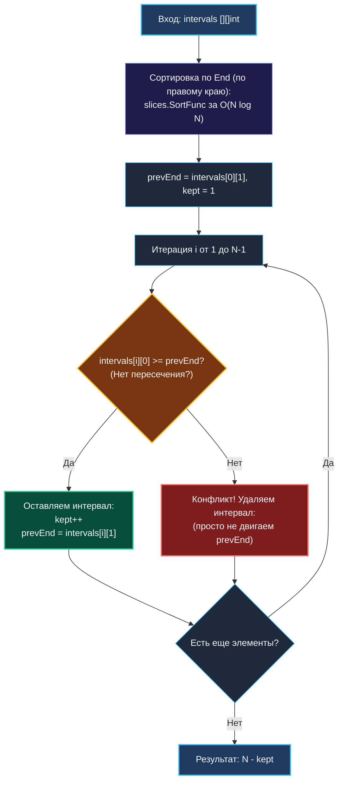

> *«Выбирая то, что завершается раньше всех, мы оставляем наибольший простор для будущих свершений».*  
> — Брайан Керниган

Задача **Non-overlapping Intervals (LeetCode 435, Medium)** формулируется как оптимизационная задача минимизации потерь:
> Дан срез интервалов `intervals`, где `intervals[i] = [start, end]`.  
> Найдите **минимальное количество интервалов**, которые необходимо удалить, чтобы все оставшиеся отрезки стали взаимно непересекающимися.  
> Граничное касание концов (например, `[1, 2]` и `[2, 3]`) **не считается** пересечением.

Прямая попытка перебирать «какие интервалы удалить» ведет к комбинаторному взрыву или тяжелому двумерному динамическому программированию.  
Инженерный подход заключается в математической трансформации задачи:
$$\text{Минимум удалений} = N - \text{Максимум совместимых непересекающихся отрезков}$$

Мы мгновенно редуцируем задачу к классической **«Задаче о выборе мероприятий» (Activity Selection Problem)**, которая решается с помощью бескомпромиссно жадного алгоритма за $\mathcal{O}(N \log N)$ времени и $\mathcal{O}(1)$ дополнительной памяти.

---

## 1. Фундаментальный выбор: Сортировка по началу или по концу?

В [[3. Merge Intervals]] мы сортировали интервалы по времени начала (`Start`).  
Что произойдет, если мы применим жадный выбор после сортировки по `Start` здесь?

### Разрушительный контрпример для сортировки по `Start`:
Пусть дан набор интервалов: `[[1, 100], [2, 3], [4, 5]]`.  
1. Если мы сортируем по `Start`, первым идет длинный отрезок `[1, 100]`.  
2. Жадный выбор берет `[1, 100]`. Теперь отрезки `[2, 3]` и `[4, 5]` пересекаются с ним и должны быть удалены!  
   Результат: выбрано 1 мероприятие, удалено 2.
3. Но если взять `[2, 3]` и `[4, 5]`, мы удалим всего 1 отрезок (`[1, 100]`)!  
   **Сортировка по времени начала для этой задачи не работает.**

### Почему сортировка по времени окончания (`End`) математически оптимальна?
Каждый раз, когда мы выбираем интервал, завершающийся **как можно раньше** (`\min End`), мы освобождаем ресурс (комнату, процессорное ядро, временную шкалу) для максимально возможного количества последующих событий.  
Отрезок с минимальным `End` оставляет наибольший сухой остаток времени справа от себя!



---

## 2. Идиоматичная реализация на Go 1.21+

```go
package main

import "slices"

// EraseOverlapIntervals возвращает минимальное число удалений для устранения конфликтов.
// Временная сложность: O(N log N) — доминирует сортировка.
// Память: O(1) extra space — сортировка выполняется in-place.
func EraseOverlapIntervals(intervals [][]int) int {
    n := len(intervals)
    if n <= 1 {
        return 0
    }

    // 1. Сортируем интервалы строго по времени окончания (intervals[i][1])
    slices.SortFunc(intervals, func(a, b []int) int {
        return a[1] - b[1]
    })

    // 2. Жадный выбор максимального количества совместимых интервалов
    keptCount := 1
    prevEnd := intervals[0][1]

    for i := 1; i < n; i++ {
        // Если начало текущего интервала >= окончания предыдущего — конфликта нет!
        if intervals[i][0] >= prevEnd {
            keptCount++
            prevEnd = intervals[i][1]
        }
        // В противном случае интервал отбрасывается (не включается в keptCount)
    }

    // Минимальное число удалений = всего интервалов - сохранено интервалов
    return n - keptCount
}
```

---

## 3. Mechanical Sympathy: In-Place pdqsort и регистровые переменные

1. **In-Place сортировка:** Функция `slices.SortFunc` сортирует указатели среза на месте. Не создается никаких дополнительных динамических коллекций в куче.
2. **Нулевая нагрузка на GC:** Переменные `keptCount`, `prevEnd`, `i`, `n` размещаются компилятором Go в регистрах центрального процессора (`RAX`, `RBX`, `RCX`, `RSI`). Память в куче равна ровно **0 байт** ($0\text{ allocs/op}$).
3. **Линейный Prefetching:** После завершения сортировки цикл `for i := 1; i < n; i++` выполняет строго последовательное линейное сканирование. Процессорный блок Stream Prefetcher подгружает данные в кэш L1 заблаговременно, исключая простои вычислительного конвейера.

---

## 4. Вопросы на собеседовании

> [!TIP]
> **Продвинутый вопрос интервьюера:**  
> *«А что если каждый интервал имеет вес (прибыль), и нам нужно максимизировать суммарную прибыль непересекающихся отрезков (Weighted Interval Scheduling)? Работает ли жадный алгоритм?»*  
> **Эталонный ответ:**  
> Нет, жадный алгоритм в присутствии весов терпит крах: короткий интервал с мизерной стоимостью заблокирует более выгодные длинные интервалы.  
> Для взвешенной задачи применяется **динамическое программирование в сочетании с бинарным поиском**:
> 1. Сортируем по `End`.
> 2. Определяем `dp[i]` как максимальную прибыль среди первых $i$ интервалов.
> 3. Формула перехода:  
>    $$dp[i] = \max(dp[i-1], \; \text{weight}_i + dp[p(i)])$$  
>    где $p(i)$ — индекс последнего интервала, совместимого с $i$ (находится за $\mathcal{O}(\log N)$ через `sort.Search`).  
> Общая сложность взвешенной версии составит $\mathcal{O}(N \log N)$.

---

## 5. Резюме

1. **Двойственность задачи:** Минимум удалений равен $N$ минус максимум совместимых отрезков.
2. **Сортировка по `End`:** Гарантирует локальный жадный выбор, оставляющий максимальный запас времени для будущих задач.
3. **Строго $\mathcal{O}(1)$ памяти:** Весь алгоритм требует лишь две скалярные целочисленные переменные.

В следующей статье мы применим интервальный анализ к многопользовательским системам планирования и научимся находить коллизии во встречах: [[6. Meeting Rooms]].