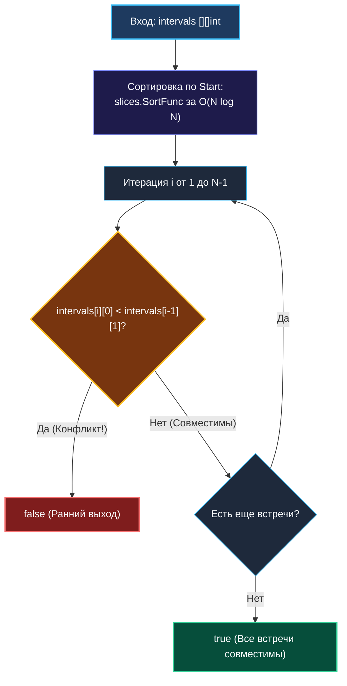

> *«Один человек не может находиться в двух местах одновременно — это простейший инвариант материального мира».*  
> — Брайан Керниган

Задача **Meeting Rooms (LeetCode 252, Easy)** моделирует фундаментальный инвариант физического мира и системного программирования: эксклюзивное владение неразделяемым ресурсом.

Условие задачи:
> Дан срез интервалов встреч `intervals`, где `intervals[i] = [start, end]`.  
> Определите, может ли один человек посетить все запланированные встречи без временных коллизий (наложений).  
> Если одна встреча заканчивается в момент времени $T$, а следующая начинается ровно в $T$, такое касание **не является** конфликтом.

В архитектуре бэкенда это прямая модель проверки эксклюзивных строковых блокировок (`SELECT ... FOR UPDATE`), валидации пользовательских тайм-слотов в системах бронирования и детекции конфликтов расписания в планировщиках cron-задач.

---

## 1. Алгоритмический анализ: Квадратичный перебор против Сортировки

### Наивный подход за $\mathcal{O}(N^2)$
Если оставить интервалы в произвольном порядке, нам придется сравнивать каждую встречу со всеми остальными через двойной цикл:
```go
for i := 0; i < n; i++ {
    for j := i + 1; j < n; j++ {
        if max(intervals[i][0], intervals[j][0]) < min(intervals[i][1], intervals[j][1]) {
            return false // Найдено пересечение
        }
    }
}
```
При $N = 10\,000$ это потребует $5 \cdot 10^7$ проверок и неприемлемо для боевого сервиса.

### Оптимальный инвариант сортировки
Если упорядочить все встречи по времени их начала (`Start`), то любой возможный конфликт во времени **гарантированно локализуется между двумя строго соседними элементами**:
$$\text{intervals}[i][0] < \text{intervals}[i-1][1]$$
Если соседние встречи не пересекаются, то никакие другие пересечься уже физически не способны!



---

## 2. Идиоматичная реализация на Go 1.21+

```go
package main

import "slices"

// CanAttendMeetings возвращает true, если человек может посетить все встречи.
// Временная сложность: O(N log N) — сортировка.
// Память: O(1) extra space — сортировка выполняется in-place.
func CanAttendMeetings(intervals [][]int) bool {
    if len(intervals) <= 1 {
        return true
    }

    // 1. Сортируем встречи по времени начала
    slices.SortFunc(intervals, func(a, b []int) int {
        return a[0] - b[0]
    })

    // 2. Линейная проверка смежных соседей с ранним выходом
    for i := 1; i < len(intervals); i++ {
        if intervals[i][0] < intervals[i-1][1] {
            return false // Обнаружено перекрытие во времени
        }
    }

    return true
}
```

---

## 3. Mechanical Sympathy: Early Exit и Branch Target Buffer

1. **Ранний выход (Early Exit):**  
   В отличие от задач полного слияния, здесь при обнаружении первого же пересечения функция немедленно завершает работу (`return false`). В реальных производственных календарях с высокой плотностью записей конфликт обычно обнаруживается в первых 5–10% массива, что снижает среднее время выполнения до долей микросекунды.
2. **Предсказуемость ветвлений:**  
   Если конфликтов нет (лучший сценарий, `return true`), проверка `intervals[i][0] < intervals[i-1][1]` дает монотонный результат `false` $N-1$ раз подряд. Блок предсказания ветвлений процессора (Branch Target Buffer) фиксирует этот паттерн, обеспечивая конвейеру CPU непрерывную работу без сбросов.
3. **Кэш-локальность:**  
   Сравнение `intervals[i]` и `intervals[i-1]` обращается к смежным адресам памяти. Аппаратный блок упреждающей выборки (Hardware Prefetcher) подгружает строки L1-кэша заранее.

---

## 4. Граничные случаи (Edge Cases)

1. **Граничные касания (`[1, 5]` и `[5, 10]`):**  
   Строгое неравенство `5 < 5` ложно, конфликта нет, возвращается `true`.
2. **Мгновенные встречи нулевой длительности (`[4, 4]`):**  
   Если в расписании есть звонок `[4, 4]` и встреча `[4, 5]`, проверка `4 < 4` ложна. Касание в точке допустимо.
3. **Пустой срез или срез из 1 встречи:**  
   Конфликты невозможны, guard clause мгновенно возвращает `true`.

---

## 5. Вопросы на собеседовании

> [!TIP]
> **Вопрос интервьюера:**  
> *«Можно ли решить задачу быстрее, чем за $\mathcal{O}(N \log N)$?»*  
> **Ответ:**  
> В общем случае теории алгоритмов (в модели сравнений) проверка наличия пересекающихся отрезков имеет доказанную нижнюю границу $\Omega(N \log N)$ (эквивалентна проверке уникальности элементов / Element Uniqueness Problem).  
> Однако, если временные метки ограничены фиксированным диапазоном (например, минуты внутри одних суток: $0 \le t \le 1440$), мы можем применить **Bucket Sort** или **битовый массив (Bitset)**:
> 1. Создаем битовый массив из 1440 бит (всего 180 байт).
> 2. Для каждого интервала проверяем, установлены ли биты, и устанавливаем их.
> 3. Время работы составит строго $\mathcal{O}(N)$ без сортировки!

---

## 6. Резюме

1. **Сортировка локализует коллизии:** После сортировки по `Start` достаточно проверять только соседние пары `intervals[i]` и `intervals[i-1]`.
2. **Строгое неравенство:** Условие `curr[0] < prev[1]` корректно обрабатывает точечные стыки встреч.
3. **Zero Allocations:** Алгоритм работает in-place без создания новых срезов.

В следующей статье мы масштабируем эту задачу от одного человека до целого офиса и научимся находить минимальное количество переговорных комнат для проведения всех встреч: [[7. Meeting Rooms II]].