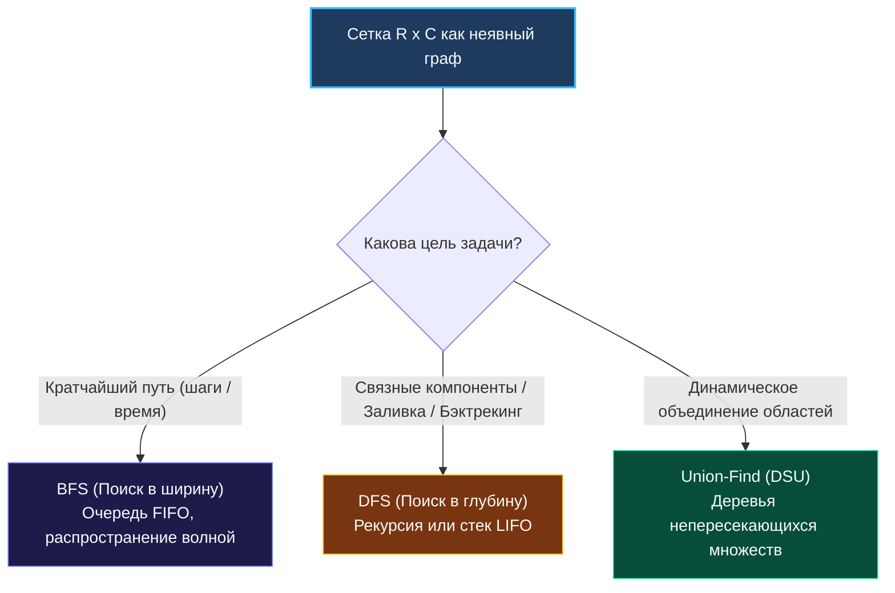

> *«Всякая сетка — это лишь строгий геометрический граф, где каждый узел обречен на общение лишь со своими ближайшими соседями».*  
> — Брайан Керниган

Матричные задачи (Grid Problems) — это обширный класс инженерных задач, где данные представлены в виде двумерной координатной сетки $R \times C$.

Визуально мы видим таблицу ячеек, но для опытного бэкенд-инженера это **неявный планарный граф**:
- Каждая ячейка $(r, c)$ является **вершиной графа**.
- Ребрами являются ортогональные (4 направления) или диагональные (8 направлений) переходы между соседними ячейками.

В реальных распределенных и вычислительных системах сеточные алгоритмы работают повсюду:
- **Логистика и робототехника:** Навигация складских роботов (Pathfinding в Amazon Kiva), расчет кратчайших маршрутов обхода препятствий.
- **Геоинформационные системы (GIS):** Поиск кластеров объектов на карте, заливка высотных изолиний, детекция связных зон затопления.
- **Обработка медиа и компьютерное зрение:** Сегментация изображений (Flood Fill), выделение связных контуров (Connected Component Labeling).
- **Игровые серверы:** Поле зрения (Field of View), расчет траекторий NPC, физика воксельных пространств.

---

## 1. Архитектура памяти в Go: Миф о двумерном массиве

В языках низкого уровня вроде C или Fortran двумерный массив `int matrix[R][C]` представляет собой **единый непрерывный блок памяти** в стеке или куче.

В языке Go тип `[][]int` устроен принципиально иначе: это **срез срезов (Slice of Slices)**:

```
Go [][]int: Фрагментация и Pointer Chasing
+-----------------------+
|  grid: []([]int)      |  (Slice Header: Data, Len, Cap - 24 байта)
+-----------------------+
   |
   +--> [Row 0 Header: Data*, Len, Cap] ---> [ 1 ][ 2 ][ 3 ][ 4 ] (Куча, адрес 0x1000)
   +--> [Row 1 Header: Data*, Len, Cap] ---> [ 5 ][ 6 ][ 7 ][ 8 ] (Куча, адрес 0x8540)
   +--> [Row 2 Header: Data*, Len, Cap] ---> [ 9 ][ 1 ][ 2 ][ 3 ] (Куча, адрес 0x3020)
```

### Чем это грозит производительности?
1. **Pointer Chasing (Погоня за указателями):**  
   Для чтения `grid[r][c]` процессор обязан выполнить **два последовательных разыменования**:
   - Шаг 1: Прочитать адрес базового массива строк `grid.Data + r * 24`.
   - Шаг 2: Прочитать указатель на ячейку `row.Data + c * 8`.
2. **Разрушение пространственной локальности (Cache Thrashing):**  
   Строки матрицы создаются независимыми вызовами `make([]int, cols)` и могут быть разбросаны аллокатором Go по совершенно разным страницам оперативной памяти.

### Закон Row-Major обхода
В Go данные внутри одной строки хранятся последовательно:
- **Правильно (Row-Major):** Внешний цикл по строкам `r`, внутренний — по столбцам `c`. Процессор читает смежные адреса памяти с шагом 8 байт. Линия L1-кэша (64 байта) вмещает 8 целых чисел, аппаратный префетчер работает со 100% эффективностью.
- **Антипаттерн (Column-Major):** Внешний цикл по `c`, внутренний — по `r`. На каждом шаге процессор перескакивает между разными строками в памяти, провоцируя лавину L1/L2 Cache Misses. Обход по колонкам работает **в 5–10 раз медленнее**!

```go
// ОПТИМАЛЬНО ДЛЯ КЭША:
for r := 0; r < rows; r++ {
    for c := 0; c < cols; c++ {
        process(grid[r][c])
    }
}
```

---

## 2. Три кита сеточных алгоритмов



### 1. Поиск в ширину (BFS)
- **Область применения:** Поиск кратчайшего пути в невзвешенном лабиринте, распространение огня/инфекции (волновой фронт).
- **Сложность:** $\mathcal{O}(R \cdot C)$ времени, $\mathcal{O}(\min(R, C))$ памяти (размер очереди ограничен периметром фронта волны).
- **Инвариант:** Первая встреча целевой клетки гарантирует **минимально возможное расстояние**.

### 2. Поиск в глубину (DFS)
- **Область применения:** Подсчет связных компонентов (островов), заливка областей (Flood Fill), поиск слов в сетке (Backtracking).
- **Сложность:** $\mathcal{O}(R \cdot C)$ времени, $\mathcal{O}(R \cdot C)$ памяти стека вызовов в худшем случае вырожденной змейки.

### 3. Системы непересекающихся множеств (DSU / Union-Find)
- **Область применения:** Задачи динамической связанности (когда клетки добавляются на лету, например, LeetCode 305 «Number of Islands II»).
- **Сложность:** Практически $\mathcal{O}(1)$ на операцию благодаря эвристикам ранга и сжатия путей.

---

## 3. Инженерный паттерн: Векторы смещений (Delta Directions)

Вместо того чтобы писать четыре громоздких блока условий (`r-1`, `r+1`, `c-1`, `c+1`), senior Go-инженер использует статический массив дельт направлений:

```go
package main

// Дельты 4 ортогональных направлений: Вверх, Вниз, Влево, Вправо
var directions4 = [4][2]int{
    {-1, 0}, // Вверх
    {1, 0},  // Вниз
    {0, -1}, // Влево
    {0, 1},  // Вправо
}

// Дельты 8 направлений (включая диагонали):
var directions8 = [8][2]int{
    {-1, 0}, {1, 0}, {0, -1}, {0, 1},
    {-1, -1}, {-1, 1}, {1, -1}, {1, 1},
}

// Универсальный цикл исследования соседей
func exploreNeighbors(grid [][]int, r, c int) {
    rows, cols := len(grid), len(grid[0])

    for _, d := range directions4 {
        nr, nc := r+d[0], c+d[1]

        // Единый Guard Clause выхода за границы сетки
        if nr < 0 || nr >= rows || nc < 0 || nc >= cols {
            continue
        }

        // Обработка валидного соседа (nr, nc)
    }
}
```

Массив `directions4` целиком помещается в регистры процессора и избавляет код от опечаток и копипасты.

---

## 4. Память и оптимизация: In-Place Visited против матрицы флагов

Традиционное решение выделяет матрицу посещенных ячеек:
```go
visited := make([][]bool, rows)
for i := range visited {
    visited[i] = make([]bool, cols)
}
```
Для матрицы $1000 \times 1000$ это порождает **1001 аллокацию в куче**, потребляя мегабайты памяти и заставляя сборщик мусора сканировать миллион ячеек.

### Паттерн In-Place мутации (Zero Allocations):
Если контракт задачи разрешает модифицировать исходные данные, мы отмечаем посещенную ячейку изменением ее значения на месте:
- В задаче поиска островов: `grid[r][c] = '0'` (затопляем исследованную сушу водой).
- В числовых матрицах: инвертируем знак `grid[r][c] = -grid[r][c]` или записываем специальный sentinel-маркер (`-1`).

Это сокращает расход памяти с $\mathcal{O}(R \cdot C)$ до **строго $\mathcal{O}(1)$ дополнительной памяти**!

---

## 5. Граничные случаи (Edge Cases)

1. **Вырожденная пустая сетка:**  
   `grid = [][]int{}` или `grid = [][]int{{}}`.  
   Всегда начинайте функцию с проверки:
   ```go
   if len(grid) == 0 || len(grid[0]) == 0 {
       return 0
   }
   ```
2. **Сетка в виде линии:**  
   $1 \times N$ (одна строка) или $N \times 1$ (один столбец). Алгоритм обязан корректно обходить соседей без паники выхода за границы.
3. **Глубокая рекурсия и стек горутины:**  
   Стек горутины в Go стартует с 2 КБ и динамически расширяется до 1 ГБ на 64-битных системах. Однако частое выделение стековых страниц при рекурсивном DFS на матрице $2000 \times 2000$ накладывает заметный оверхед. Для гигантских сеток предпочтителен **итеративный BFS с предвыделенным срезом-очередью**.

---

## 6. Резюме

1. **Матрица — это неявный граф:** Ячейки — узлы, смежные соседи — ребра.
2. **Row-Major — закон кремния:** Обходите матрицу строго по строкам (`for r ... for c`), чтобы попадать в кэш-линии процессора L1.
3. **Векторы направлений:** Используйте компактный массив `[4][2]int` для чистого обхода соседей.
4. **In-Place маркировка:** Экономьте память и защищайте GC от аллокаций, заменяя матрицу `visited` на мутацию значений ячеек.

В следующей лекции мы детально сопоставим реализацию обходов в глубину и ширину на координатных сетках: [[2. DFS и BFS на матрицах]].