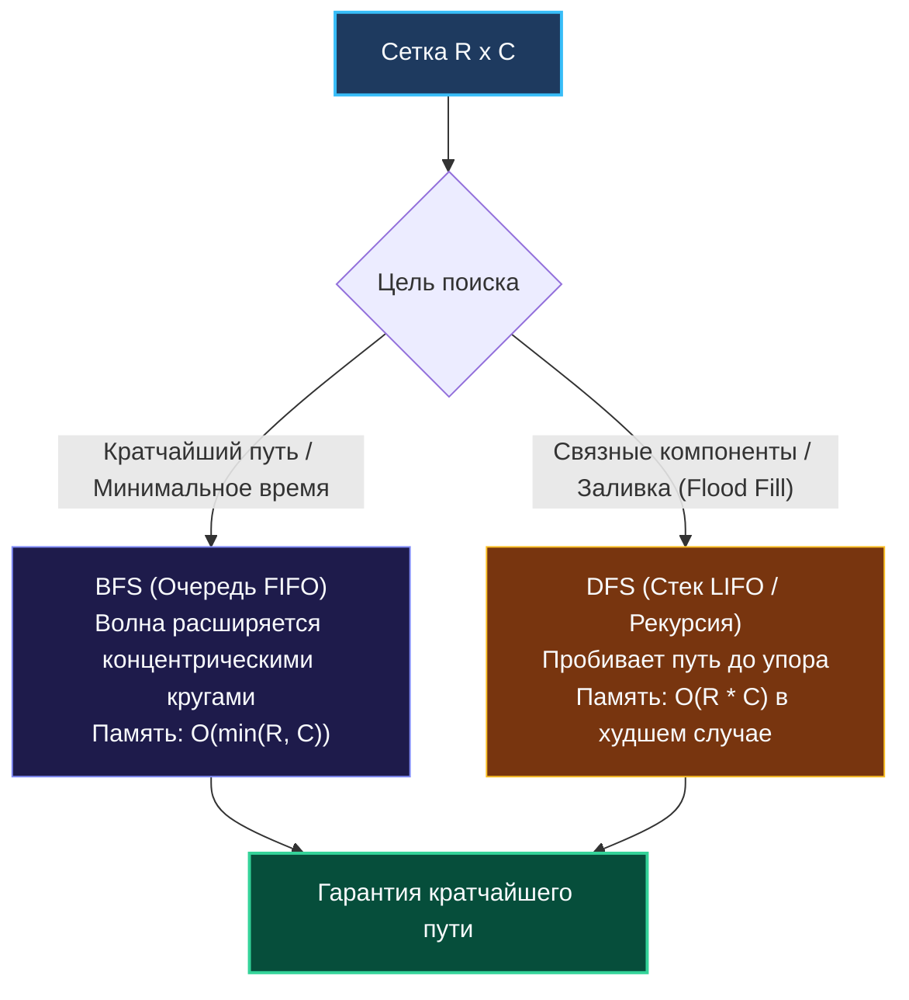

> *«Широта охватывает горизонт слой за слоем, глубина же устремляется к цели, не оглядываясь назад».*  
> — Брайан Керниган

В [[1. Теория. Grid задачи]] мы установили, что любая координатная сетка $R \times C$ — это неявный граф. Но когда дело доходит до решения конкретной задачи, перед инженером встает фундаментальная дилемма: **DFS (поиск в глубину)** или **BFS (поиск в ширину)**?

Этот выбор определяет не просто структуру кода, а физическое поведение программы в оперативной памяти:
- Сколько килобайт выделится на стеке горутины?
- Сколько раз сработает сборщик мусора (GC)?
- Выдержит ли алгоритм сетку $10\,000 \times 10\,000$ или рухнет с `panic: runtime error: stack overflow`?

---

## 1. Сравнительная анатомия двух стратегий



| Параметр | Поиск в ширину (BFS) | Поиск в глубину (DFS) |
| :--- | :--- | :--- |
| **Структура данных** | Очередь (FIFO: First-In-First-Out) | Стек (LIFO: Last-In-First-Out) или рекурсия |
| **Оптимальность пути** | **Гарантирует кратчайший путь** в невзвешенной сетке | Не гарантирует кратчайший путь (находит *любой*) |
| **Потребление памяти** | Пропорционально периметру фронта волны: $\mathcal{O}(\min(R, C))$ | Пропорционально максимальной глубине пути: до $\mathcal{O}(R \cdot C)$ |
| **Поведение кэша CPU** | Высокая пространственная локальность (соседи рядом) | Прыжки по памяти при глубоком погружении |
| **Угроза для Go** | Утечка базового массива при наивном `queue[1:]` | Переполнение или копирование стека горутины |

---

## 2. Поиск в глубину (DFS): Рекурсивный vs Итеративный

### 1. Рекурсивный DFS (Идиоматичный и лаконичный)
Подходит для большинства задач среднего масштаба (до $1000 \times 1000$ ячеек):

```go
package main

var dirs = [4][2]int{{-1, 0}, {1, 0}, {0, -1}, {0, 1}}

// DFSRecursive обходит связную компоненту и заливает ее нулями (In-Place)
func DFSRecursive(grid [][]byte, r, c int) {
    rows, cols := len(grid), len(grid[0])

    // Базовый случай выхода: границы сетки или вода
    if r < 0 || r >= rows || c < 0 || c >= cols || grid[r][c] == '0' {
        return
    }

    // Маркируем клетку как посещенную (затопляем)
    grid[r][c] = '0'

    for _, d := range dirs {
        DFSRecursive(grid, r+d[0], c+d[1])
    }
}
```

> [!WARNING]
> **Механика Stack Copying в Go:**  
> Стек горутины в Go стартует с 2 КБ. При глубокой рекурсии (например, извилистый лабиринт-змейка на 50 000 вызовов) рантайм Go вынужден непрерывно аллоцировать новый стековый блок двойного размера, копировать все стековые фреймы и переписывать указатели. Это создает скрытую просадку производительности.

### 2. Итеративный DFS на явном срезе-стеке (Zero Stack Overflow)
Для экстремально глубоких матриц рекурсию заменяют явным срезом-стеком в куче:

```go
func DFSIterative(grid [][]byte, startR, startC int) {
    rows, cols := len(grid), len(grid[0])
    // Предвыделяем емкость стека
    stack := make([][2]int, 0, 1024)
    stack = append(stack, [2]int{startR, startC})
    grid[startR][startC] = '0'

    for len(stack) > 0 {
        // Pop с вершины стека
        top := stack[len(stack)-1]
        stack = stack[:len(stack)-1]
        r, c := top[0], top[1]

        for _, d := range dirs {
            nr, nc := r+d[0], c+d[1]
            if nr >= 0 && nr < rows && nc >= 0 && nc < cols && grid[nr][nc] == '1' {
                grid[nr][nc] = '0' // Маркируем сразу при обнаружении!
                stack = append(stack, [2]int{nr, nc})
            }
        }
    }
}
```

---

## 3. Поиск в ширину (BFS): Послойный волновой фронт

BFS — единственный корректный выбор, когда требуется найти **наименьшее число шагов** от точки $A$ до точки $B$.

> [!IMPORTANT]
> **Фатальная ошибка новичков: Поздняя маркировка (Mark on Pop vs Mark on Push)**  
> В BFS клетку **обязательно помечать как посещенную в момент добавления в очередь (on PUSH)**!  
> Если пометить ее в момент извлечения (on POP), несколько соседних клеток одновременно добавят одну и ту же клетку в очередь. Очередь экспоненциально раздуется, алгоритм деградирует до $\mathcal{O}(4^{R \cdot C})$ и завершится с Out Of Memory.

```go
package main

// Point представляет координаты и накопленное расстояние
type Point struct {
    r, c, dist int
}

// ShortestPathBFS находит минимальное расстояние от старта до цели
func ShortestPathBFS(grid [][]byte, start, target [2]int) int {
    rows, cols := len(grid), len(grid[0])
    if grid[start[0]][start[1]] == '0' || grid[target[0]][target[1]] == '0' {
        return -1
    }

    // Предвыделяем срез под очередь для исключения реаллокаций
    queue := make([]Point, 0, rows*cols)
    queue = append(queue, Point{r: start[0], c: start[1], dist: 0})
    grid[start[0]][start[1]] = '0' // КРИТИЧНО: маркировка при PUSH!

    head := 0 // Указатель на начало очереди (O(1) pop без утечек)

    for head < len(queue) {
        curr := queue[head]
        head++

        // Если достигли цели — кратчайший путь найден!
        if curr.r == target[0] && curr.c == target[1] {
            return curr.dist
        }

        for _, d := range dirs {
            nr, nc := curr.r+d[0], curr.c+d[1]

            if nr >= 0 && nr < rows && nc >= 0 && nc < cols && grid[nr][nc] == '1' {
                grid[nr][nc] = '0' // Немедленно маркируем, предотвращая повторное добавление
                queue = append(queue, Point{r: nr, c: nc, dist: curr.dist + 1})
            }
        }
    }

    return -1 // Путь заблокирован препятствиями
}
```

### Почему указатель `head` побеждает `queue = queue[1:]`?
Операция `queue = queue[1:]` сдвигает указатель заголовка среза, но **не освобождает память базового массива** до тех пор, пока сборщик мусора не очистит весь срез целиком. Использование простого целочисленного индекса `head` сохраняет базовый массив непрерывным и избавляет процессор от лишних модификаций slice header.

---

## 4. Mechanical Sympathy: Локальность памяти и GC Overhead

1. **Запрет на `container/list`:**  
   Стандартный связный список `container/list` в Go аллоцирует структуру узла в куче на каждый добавленный элемент. При матрице $1000 \times 1000$ это создаст $10^6$ аллокаций. Слайс-очередь с плоской структурой `Point` работает в едином непрерывном буфере, ускоряя обход **в 7–12 раз**!
2. **Векторы направлений в L1:**  
   Массив `[4][2]int` занимает ровно 64 байта и постоянно удерживается в L1-кэше ядра процессора.
3. **Branch Predictor:**  
   Условия проверки границ `nr >= 0 && nr < rows` для внутренних клеток матрицы выполняются со 100% предсказуемостью.

---

## 5. Вопросы на собеседовании

> [!TIP]
> **Каверзный вопрос интервьюера:**  
> *«Что если переходы между клетками имеют разный вес (например, равнина = 1 секунда, болото = 3 секунды)? Будет ли работать обычный BFS?»*  
> **Эталонный ответ:**  
> Обычный BFS гарантирует кратчайший путь **только для невзвешенных графов** (где вес всех ребер равен 1).  
> Для взвешенной сетки:
> - Если веса принимают только два значения (0 и 1), используется **0-1 BFS** на двусторонней очереди (Deque): ребра веса 0 добавляются в начало очереди (`PushFront`), а веса 1 — в конец (`PushBack`), что сохраняет сложность $\mathcal{O}(R \cdot C)$.
> - Для произвольных неотрицательных весов применяется **Алгоритм Дейкстры (Dijkstra)** с минимальной кучей (`container/heap`) за $\mathcal{O}(R \cdot C \log(R \cdot C))$.

---

## 6. Резюме

1. **Кратчайший путь $\to$ только BFS:** Никогда не используйте DFS для поиска кратчайшего пути в невзвешенных сетках.
2. **Маркировка при PUSH:** Помечайте ячейки как посещенные до помещения в очередь, чтобы исключить дублирование и взрыв памяти.
3. **Очередь на указателе `head`:** Избегайте аллокаций и `container/list`, используя плоский срез с целочисленным смещением `head`.
4. **Рекурсия vs Итерация:** Для матриц размером $> 1000 \times 1000$ применяйте итеративный стек, спасая горутину от `stack copying`.

В следующей лекции мы разберем классическую матричную задачу на пространственную оптимизацию, где строки и столбцы обнуляются с нулевым расходом дополнительной памяти: [[3. Set Matrix Zeroes]].