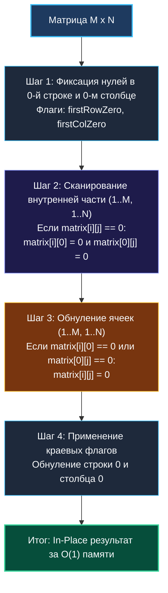

> *«Самое надежное место для хранения меток — само рабочее полотно, если только не затереть его прежде времени».*  
> — Брайан Керниган

Задача **Set Matrix Zeroes (LeetCode 73, Medium)** — это шедевр пространственной оптимизации, проверяющий умение инженера работать с памятью на пределе возможностей:
> Дана целочисленная матрица `matrix` размера $M \times N$.  
> Если элемент равен `0`, установите **всю его строку и весь его столбец** в `0`.  
> Преобразование требуется выполнить **строго In-Place**, используя $\mathcal{O}(1)$ дополнительной памяти.

Любой кандидат может решить эту задачу, создав копию матрицы за $\mathcal{O}(M \cdot N)$ памяти или выделив срезы-маркеры `rows []bool` и `cols []bool` за $\mathcal{O}(M + N)$ памяти. Но требование $\mathcal{O}(1)$ отсекает внешние структуры данных и заставляет использовать **саму матрицу как собственное хранилище служебных флагов**.

---

## 1. Архитектурный инсайт: Первая строка и столбец как регистры меток

Если в ячейке `matrix[i][j] == 0`, это означает, что вся строка $i$ и весь столбец $j$ в итоге должны стать нулями.  
Почему бы не спроецировать эту информацию на границы матрицы?
- Флаг обнуления строки $i$ сохраним в ячейке `matrix[i][0]`.
- Флаг обнуления столбца $j$ сохраним в ячейке `matrix[0][j]`.

### Коллизия в точке `matrix[0][0]`
Ячейка `matrix[0][0]` находится на пересечении первого столбца и первой строки. Если записать туда ноль, мы потеряем контекст: относится ли этот ноль к первой строке, к первому столбцу или к обоим сразу?

**Элегантное решение:**  
Мы используем две локальные булевы переменные на стеке: `firstRowZero` и `firstColZero`. Они изолируют состояние нулевой строки и нулевого столбца, позволяя ячейкам первого ряда выступать в роли чистых маркеров для внутренней части матрицы.



---

## 2. Идиоматичная реализация на Go

```go
package main

// SetZeroes обнуляет строки и столбцы с нулями in-place за O(1) памяти.
// Временная сложность: O(M * N) — константное число проходов.
// Пространственная сложность: O(1) extra space — 0 аллокаций в куче.
func SetZeroes(matrix [][]int) {
    if len(matrix) == 0 || len(matrix[0]) == 0 {
        return
    }

    m, n := len(matrix), len(matrix[0])
    firstRowZero := false
    firstColZero := false

    // 1. Проверяем, есть ли нули изначально в первой строке
    for j := 0; j < n; j++ {
        if matrix[0][j] == 0 {
            firstRowZero = true
            break
        }
    }

    // 2. Проверяем, есть ли нули изначально в первом столбце
    for i := 0; i < m; i++ {
        if matrix[i][0] == 0 {
            firstColZero = true
            break
        }
    }

    // 3. Сканируем внутреннюю область (i >= 1, j >= 1) и проставляем маркеры
    for i := 1; i < m; i++ {
        for j := 1; j < n; j++ {
            if matrix[i][j] == 0 {
                matrix[i][0] = 0 // Помечаем строку i
                matrix[0][j] = 0 // Помечаем столбец j
            }
        }
    }

    // 4. Обнуляем внутренние ячейки по маркерам из первой строки и столбца
    for i := 1; i < m; i++ {
        for j := 1; j < n; j++ {
            if matrix[i][0] == 0 || matrix[0][j] == 0 {
                matrix[i][j] = 0
            }
        }
    }

    // 5. Обнуляем первую строку, если в ней был исходный ноль
    if firstRowZero {
        for j := 0; j < n; j++ {
            matrix[0][j] = 0
        }
    }

    // 6. Обнуляем первый столбец, если в нем был исходный ноль
    if firstColZero {
        for i := 0; i < m; i++ {
            matrix[i][0] = 0
        }
    }
}
```

---

## 3. Mechanical Sympathy: Zero Allocations и Row-Major кэш

### 1. Escape Analysis и нулевая нагрузка на GC
Переменные `m`, `n`, `firstRowZero`, `firstColZero`, `i`, `j` имеют примитивные типы (`int`, `bool`) и локальную область видимости.  
Команда `go build -gcflags="-m"` подтверждает: **ни одна переменная не убегает в кучу**.  
Алгоритм выделяет ровно **0 байт динамической памяти** ($0\text{ allocs/op}$), не создавая работы для сборщика мусора Go.

### 2. Row-Major обход и аппаратный префетчинг
Все двойные циклы организованы строго в порядке `for i ... for j`:
- Чтение элементов `matrix[i][j]` идет последовательно с шагом 8 байт вдоль непрерывного базового массива строки.
- Блок Stream Prefetcher в процессорах x86-64 и ARM64 упреждающе считывает 64-байтовые линии кэша L1, маскируя накладные расходы на разыменование указателя строки.

---

## 4. Граничные случаи (Edge Cases)

1. **Матрица $1 \times 1$:**  
   `matrix = [[0]]`.  
   Оба флага `firstRowZero` и `firstColZero` станут `true`. Внутренние циклы пропустятся, на шагах 5 и 6 ячейка корректно останется `0`.
2. **Вся матрица уже состоит из нулей:**  
   Все маркеры будут установлены в `0`, повторные записи нулей не изменят результат.
3. **В матрице нет ни одного нуля:**  
   Флаги останутся `false`, маркеры не взведутся, матрица останется нетронутой.

---

## 5. Вопросы на собеседовании

> [!TIP]
> **Каверзный вопрос интервьюера:**  
> *«А можно ли избавиться даже от двух переменных `firstRowZero` и `firstColZero` и обойтись вообще одной переменной `col0`?»*  
> **Эталонный ответ:**  
> Да! Ячейку `matrix[0][0]` можно закрепить исключительно за первой строкой (`row0`), а состояние первого столбца хранить в единственной переменной `col0`.  
> Тогда при сканировании $i$ от $0$ до $M-1$:  
> - Если `matrix[i][0] == 0`, то `col0 = 0`.  
> - Для столбцов $j$ от $1$ до $N-1$: если `matrix[i][j] == 0`, то `matrix[i][0] = 0` и `matrix[0][j] = 0`.  
> При обратном обходе (снизу вверх, чтобы не затереть маркеры) матрица восстанавливается. Однако использование двух независимых булевых флагов считается золотым стандартом читаемости в production-коде.

---

## 6. Резюме

1. **Матрица как хранилище:** Использование границ матрицы в качестве регистров экономит $\mathcal{O}(M + N)$ памяти.
2. **Изоляция нулевой ячейки:** Флаги `firstRowZero` и `firstColZero` предотвращают взаимное затирание первого ряда и колонки.
3. **Строгий порядок этапов:** Сбор маркеров во внутренней области $\to$ применение маркеров $\to$ обработка границ. Нарушение порядка приведет к тотальному ложному обнулению матрицы.

В следующей статье мы разберем геометрическую трансформацию матриц и научимся поворачивать изображение на 90 градусов без создания вспомогательных буферов: [[4. Rotate Image]].