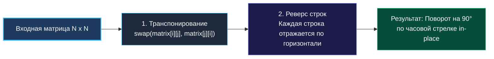
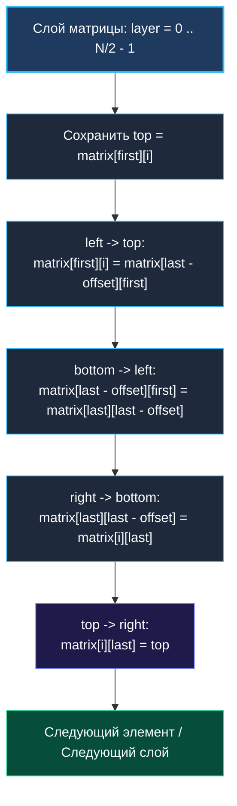

> *«Симметрия и элегантность алгоритма часто избавляют нас от необходимости выделять лишнюю память».*  
> — Брайан Керниган

## Введение: Геометрическая трансформация без аллокаций памяти

Задача **Rotate Image** (LeetCode 48) требует повернуть квадратную матрицу $N \times N$ на 90 градусов по часовой стрелке строго **in-place**, то есть используя $O(1)$ дополнительной памяти без создания вспомогательных двумерных массивов.

В бэкенд-инженерии и смежных областях похожие геометрические и линейно-алгебраические операции встречаются регулярно:
* Поворот тепловых карт (heatmaps) и матриц плотности сетевого трафика.
* Обработка и нормализация кадровых буферов в медиа-микросервисах без привлечения тяжелых CGO-библиотек.
* Трансформация матриц смежности в графовых алгоритмах для смены направления ориентированных ребер.
* Переупаковка матриц для оптимизации векторных вычислений (SIMD) и смены формата хранения (Row-Major $\leftrightarrow$ Column-Major).

На технических интервью уровня Middle+/Senior эта задача служит надежной проверкой: способен ли кандидат манипулировать индексами без ошибок смещения на единицу (off-by-one), понимает ли он физику перемещения данных в оперативной памяти и как структура `[][]int` в Go влияет на L1/L2 кэши современных процессоров.



---

## Математический и алгоритмический принцип: Разложение на отражения

Наиболее элегантный и устойчивый к ошибкам подход заключается в разложении поворота на **две простые геометрические операции**:

1. **Транспонирование относительно главной диагонали:**
   Каждый элемент $(i, j)$ меняется местами с элементом $(j, i)$. При этом главная диагональ $(i == j)$ остается неподвижной:
   $$\text{matrix}[i][j] \longleftrightarrow \text{matrix}[j][i], \quad \forall j > i$$
2. **Горизонтальное отражение (реверс каждой строки):**
   В каждой строке $i$ меняются местами элементы $j$ и $N - 1 - j$:
   $$\text{matrix}[i][j] \longleftrightarrow \text{matrix}[i][N - 1 - j], \quad 0 \le j < \lfloor N/2 \rfloor$$

### Трассировка преобразования координат

Проследим математическую судьбу элемента при последовательном применении этих двух шагов:
$$(i, j) \xrightarrow{\text{Транспонирование}} (j, i) \xrightarrow{\text{Реверс строки}} (j, N - 1 - i)$$

Формула поворота точки матрицы $N \times N$ на 90 градусов по часовой стрелке:
$$(r_{\text{new}}, c_{\text{new}}) = (c_{\text{old}}, N - 1 - r_{\text{old}})$$

Обе формулы совпадают до бита. Разложение сложного 2D-вращения на два простых одномерных прохода делает код компактным, легко тестируемым и исключает запутанные четырехсторонние перестановки.

```
Исходная (3x3):       Транспонирование:      Реверс строк (90° по часовой):
[ 1,  2,  3 ]          [ 1,  4,  7 ]          [ 7,  4,  1 ]
[ 4,  5,  6 ]   --->   [ 2,  5,  8 ]   --->   [ 8,  5,  2 ]
[ 7,  8,  9 ]          [ 3,  6,  9 ]          [ 9,  6,  3 ]
```

---

## Идиоматичная реализация на Go

В современном Go (начиная с версии 1.21+) стандартная библиотека предоставляет пакет `slices`, включающий функцию `slices.Reverse`. Однако полезно уметь писать оба варианта: идиоматичный с двухточечным указателем (two pointers) и с использованием стандартной библиотеки.

```go
package matrix

import "slices"

// Rotate поворачивает квадратную матрицу N x N на 90 градусов по часовой стрелке in-place.
// Временная сложность: O(N^2)
// Пространственная сложность: O(1)
func Rotate(matrix [][]int) {
	n := len(matrix)
	if n <= 1 {
		return
	}

	// Шаг 1. Транспонирование матрицы относительно главной диагонали.
	// Обходим только верхний треугольник (j > i), чтобы избежать двойного свопа.
	for i := 0; i < n; i++ {
		for j := i + 1; j < n; j++ {
			matrix[i][j], matrix[j][i] = matrix[j][i], matrix[i][j]
		}
	}

	// Шаг 2. Горизонтальное отражение (реверс каждой строки).
	for i := 0; i < n; i++ {
		// Идиоматичный двухточечный реверс без аллокаций
		left, right := 0, n-1
		for left < right {
			matrix[i][left], matrix[i][right] = matrix[i][right], matrix[i][left]
			left++
			right--
		}
	}
}

// RotateWithSlices демонстрирует современную реализацию на Go 1.21+.
func RotateWithSlices(matrix [][]int) {
	n := len(matrix)
	if n <= 1 {
		return
	}

	for i := 0; i < n; i++ {
		for j := i + 1; j < n; j++ {
			matrix[i][j], matrix[j][i] = matrix[j][i], matrix[i][j]
		}
	}

	for i := 0; i < n; i++ {
		slices.Reverse(matrix[i])
	}
}
```

> [!NOTE]
> **Многозначное присваивание в Go: `a, b = b, a`**  
> Спецификация языка Go гарантирует, что все выражения в правой части оператора присваивания вычисляются до того, как происходит запись в левую часть. Компилятор Go преобразует конструкцию `matrix[i][j], matrix[j][i] = matrix[j][i], matrix[i][j]` в загрузку двух 64-битных значений в регистры процессора (например, `RAX` и `RDX`), за которой следуют две инструкции сохранения. Временная переменная в памяти стека не создается.

---

## Альтернатива: Послойный четырехточечный своп (Layer-by-Layer)

Второй классический метод выполняет поворот ровно за один проход по концентрическим квадратным слоям матрицы от внешнего периметра к центру:



### 4-позиционный цикл перестановок

В каждом слое четыре связанных элемента образуют замкнутый цикл:
$$\text{Top} \to \text{Right} \to \text{Bottom} \to \text{Left} \to \text{Top}$$

```go
// RotateLayerByLayer осуществляет послойное вращение за один проход по элементам.
func RotateLayerByLayer(matrix [][]int) {
	n := len(matrix)
	if n <= 1 {
		return
	}

	for layer := 0; layer < n/2; layer++ {
		first := layer
		last := n - 1 - layer

		for i := first; i < last; i++ {
			offset := i - first

			// 1. Сохраняем верхний элемент
			top := matrix[first][i]

			// 2. Левый нижний -> Верхний левый
			matrix[first][i] = matrix[last-offset][first]

			// 3. Нижний правый -> Левый нижний
			matrix[last-offset][first] = matrix[last][last-offset]

			// 4. Верхний правый -> Нижний правый
			matrix[last][last-offset] = matrix[i][last]

			// 5. Сохраненный верхний -> Верхний правый
			matrix[i][last] = top
		}
	}
}
```

Количество перемещений данных в этом алгоритме минимально: ровно $N^2 - 1$ записей для нечетного $N$ (центр не трогается) и $N^2$ для четного. Однако индексная арифметика с `offset`, `first` и `last` существенно сложнее и часто приводит к багам на интервью.

---

## Архитектура памяти и Mechanical Sympathy: Проблема `[][]int`

Понимание устройства памяти в Go отличает зрелого Senior-инженера от теоретика. В Go тип `[][]int` — это **слайс заголовков слайсов** (slice of slices), а не плоский непрерывный массив (как `int[N][N]` в C/C++):

```
matrix (Заголовок слайса в стеке): [ Data: 0x1000 | Len: 3 | Cap: 3 ]
                      │
                      ▼
Память кучи 0x1000:
  [0]: [ Data: 0x2000 | Len: 3 | Cap: 3 ] ────► Массив строки 0: [ 1, 2, 3 ] (0x2000)
  [1]: [ Data: 0x2080 | Len: 3 | Cap: 3 ] ────► Массив строки 1: [ 4, 5, 6 ] (0x2080)
  [2]: [ Data: 0x2100 | Len: 3 | Cap: 3 ] ────► Массив строки 2: [ 7, 8, 9 ] (0x2100)
```

### Pointer Chasing и Cache Thrashing при транспонировании

1. При обращении `matrix[i][j]` процессор выполняет два чтения памяти: сначала читает заголовок строки `matrix[i]`, берет указатель `Data`, затем смещается на `j * 8` байт.
2. Во внешнем цикле по `i` и внутреннем по `j`:
   - Доступ `matrix[i][j]` идет **последовательно** по строке `i`. Аппаратный префетчер L1/L2 кэша (Spatial Locality) работает отлично: одна строка кэша (64 байта) вмещает 8 значений `int64`.
   - Но парный доступ `matrix[j][i]` при транспонировании шагает **по столбцу**! Каждый шаг меняет указатель строки `matrix[j]`, прыгая между несвязанными блоками памяти в куче.
   - Для больших матриц (например, $2048 \times 2048$) каждый доступ `matrix[j][i]` приводит к **Cache Miss** в L1 и L2 кэше, вызывая задержки обращения к DRAM (~50–80 нс вместо ~1 нс).

### Инженерное решение для продакшена: Сплющивание (Flattening)

В высоконагруженных численных библиотеках матрицы хранят в едином непрерывном 1D-слайсе:

```go
type FlatMatrix struct {
	Data []int
	N    int
}

// At возвращает значение по координатам (r, c)
func (m *FlatMatrix) At(r, c int) int {
	return m.Data[r*m.N+c]
}
```

При 1D-раскладке вся матрица занимает один последовательный блок памяти, что снижает нагрузку на сборщик мусора (GC отслеживает всего один указатель вместо $N+1$) и позволяет компилятору применять автовекторизацию (SIMD инструкции `VMOVUPD`).

---

## Анализ сложности и Escape Analysis

| Параметр | Значение | Обоснование |
|---|---|---|
| **Временная сложность** | $O(N^2)$ | Транспонирование выполняет ровно $N(N-1)/2$ свопов. Реверс строк выполняет $N \times \lfloor N/2 \rfloor$ свопов. Суммарно: $N^2 - N/2 = O(N^2)$. |
| **Пространственная сложность** | $O(1)$ | Используются только регистры процессора для индексов и временных значений. Никаких аллокаций. |
| **Escape Analysis** | `0 allocs/op, 0 B/op` | Слайс `matrix` передается в функцию по значению (24 байта заголовка). Никакие объекты не покидают стек функции. |

---

## Подводные камни и граничные условия

1. **Матрицы размером $0 \times 0$ и $1 \times 1$:**  
   Условие `if n <= 1 { return }` защищает от паники на пустых слайсах и мгновенно возвращает матрицу $1 \times 1$, поворот которой является тождественным преобразованием.
2. **Неквадратные матрицы $M \times N$ ($M \neq N$):**  
   Задача LeetCode 48 гарантирует квадратность $N \times N$. При повороте прямоугольной матрицы $M \times N$ результирующая размерность меняется на $N \times M$. Вращение прямоугольной матрицы **in-place** в общем случае невозможно без сложнейших алгоритмов циклического сдвига с перестановкой памяти (Cycle Leader Algorithm). В продакшене для $M \neq N$ всегда выделяют новый слайс.
3. **Параллелизм и Data Race:**  
   Поскольку функция `Rotate` мутирует входной слайс in-place, конкурентный вызов чтения или поворота над одной матрицей без синхронизации приведет к гонке данных. Если матрица хранится в кэше сервиса, перед поворотом необходимо создать ее копию.

---

## Вопросы для собеседования

> [!INTERVIEW]
> **Вопрос 1:** Как повернуть матрицу на 90 градусов против часовой стрелки in-place?  
> **Ответ:** Два симметричных варианта:  
> 1. Сначала реверсировать каждую строку, затем транспонировать матрицу относительно главной диагонали: `Reverse Rows -> Transpose`.  
> 2. Либо транспонировать матрицу относительно побочной (антидиагонали), а затем отразить по вертикали. Первый способ проще всего реализовать на практике.

> [!INTERVIEW]
> **Вопрос 2:** Как повернуть матрицу на 180 градусов in-place?  
> **Ответ:** Поворот на 180° — это два поворота на 90°. В коде это эквивалентно:  
> 1. Реверсировать порядок строк (перевернуть матрицу по вертикали: строка `0` со строкой `N-1`).  
> 2. Реверсировать элементы внутри каждой строки (перевернуть по горизонтали).  
> Либо выполнить один проход парного свопа `matrix[i][j] <-> matrix[n-1-i][n-1-j]` до середины матрицы.

> [!INTERVIEW]
> **Вопрос 3:** Как оптимизировать транспонирование для матриц гигантского размера ($N > 4096$), которые не помещаются в L3-кэш?  
> **Ответ:** Использовать **блочное транспонирование (Tiling / Cache-Blocking)**. Матрица разбивается на квадратные тайлы размером $B \times B$ (где $B$ подбирается так, чтобы два тайла гарантированно помещались в L1d кэш, например $32 \times 32$ или $64 \times 64$). Алгоритм транспонирует тайлы целиком, сохраняя локальность данных и минимизируя промахи по кэш-линиям.

---

## Резюме

* Поворот матрицы на 90° по часовой стрелке in-place декомпозируется на две элементарные операции: **Транспонирование главной диагонали + Реверс каждой строки**.
* Временная сложность строго оптимальна: $O(N^2)$, дополнительная память: $O(1)$.
* В Go двумерный слайс `[][]int` страдает от pointer chasing. Транспонирование вызывает доступ по столбцам с промахами кэша CPU. Для критичных к производительности систем предпочтительнее плоская 1D-раскладка.
* Идиоматичный Go 1.21+ позволяет использовать `slices.Reverse` для второй фазы алгоритма.

В следующей лекции мы разберем нелинейный алгоритм обхода матрицы по концентрической траектории: [[5. Spiral Matrix]], где научимся строго управлять границами активной зоны сканирования.