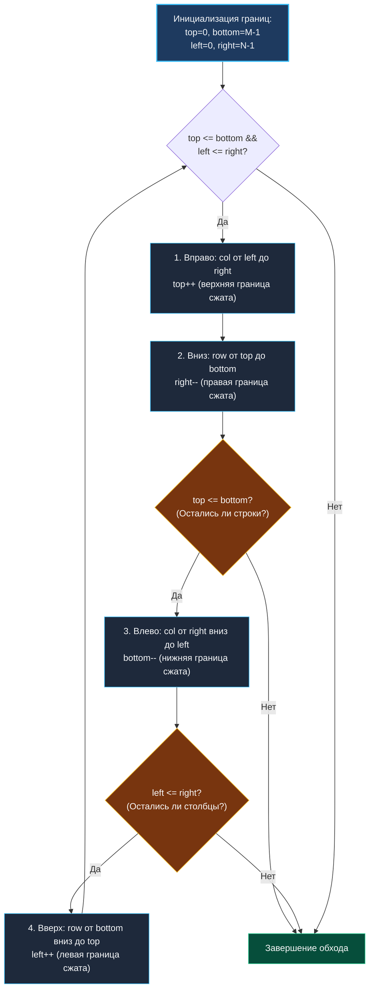

> *«В алгоритмах обхода строгая дисциплина граничных условий значит больше, чем самые изощренные структуры данных».*  
> — Брайан Керниган

## Введение: Нелинейный обход и дисциплина границ

Задача **Spiral Matrix** (LeetCode 54) требует обойти двумерную прямоугольную матрицу размера $M \times N$ в спиральном порядке (по часовой стрелке от левого верхнего угла к центру) и вернуть одномерный слайс со всеми ее элементами.

```
Исходная матрица (3x4):
┌─────────────────────────┐
│  1  ──►  2  ──►  3  ──► 4 │
│                         │ │
│ 10  ──► 11  ──► 12      5 │
│  ▲                      │ │
│  │                      ▼ │
│  9  ◄──  8  ◄──  7  ◄── 6 │
└─────────────────────────┘
Порядок обхода: [1, 2, 3, 4, 5, 6, 7, 8, 9, 10, 11, 12]
```

За пределами олимпиадного программирования этот паттерн применяется в системных задачах:
* Считывание данных с концентрических сенсоров и датчиков лидаров.
* Декодирование и развертка блочных текстур и тайлов в видеокодеках (JPEG/HEVC используют зигзагообразные и спиральные траектории обхода DCT-коэффициентов).
* Сериализация двумерных гео-слоев для потоковой передачи по сетевым сокетам.
* Сканирование матриц смежности в радиальных алгоритмах поиска связности.

На собеседованиях уровня Middle+/Senior эта задача служит тестом на способность кандидата аккуратно управлять четырьмя переменными состояния, не допускать дублирования граничных элементов в вырожденных матрицах (одна строка или один столбец) и грамотно работать с аллокациями в рантайме Go.

---

## Архитектурный паттерн: Четыре сжимающиеся границы (Shrinking Boundaries)

Вместо сложной эмуляции виртуальной «черепашки», которая поворачивает направо при столкновении со стеной или посещенной ячейкой (что потребовало бы матрицы `visited` размером $M \times N$ и дополнительной памяти), мы используем **модель четырех сжимающихся границ**:

1. `top` — верхняя активная строка (начинается с `0`).
2. `bottom` — нижняя активная строка (начинается с `M - 1`).
3. `left` — левый активный столбец (начинается с `0`).
4. `right` — правый активный столбец (начинается с `N - 1`).

```
           left                     right
            ▼                         ▼
   top ──►  ┌─────────────────────────┐
            │ 1. ВПРАВО (left -> right)│
            │ 4. ВВЕРХ       2. ВНИЗ  │
            │ (bottom->top) (top->bot)│
bottom ──►  │ 3. ВЛЕВО (right -> left) │
            └─────────────────────────┘
```

### Алгоритмический цикл

На каждой итерации внешнего цикла (пока `top <= bottom && left <= right`) выполняются четыре направленных прохода:



> [!CRITICAL]
> **Ключевой подводный камень: Обязательные промежуточные проверки `Guard`**  
> После прохода вправо мы увеличиваем `top++`. Если исходная матрица имела всего одну строку (например, $1 \times 4$), то `top` станет больше `bottom`. Если после прохода вниз слепо запустить проход влево, алгоритм снова прочитает ту же самую строку в обратном порядке, продублировав элементы!  
> Поэтому перед шагом **Влево** строго обязательна проверка `if top <= bottom`, а перед шагом **Вверх** — проверка `if left <= right`.

---

## Идиоматичная реализация на Go

```go
package matrix

// SpiralOrder выполняет спиральный обход матрицы M x N.
// Временная сложность: O(M * N) — каждая ячейка посещается ровно один раз.
// Дополнительная память: O(1) (без учета слайса результата).
func SpiralOrder(matrix [][]int) []int {
	if len(matrix) == 0 || len(matrix[0]) == 0 {
		return []int{}
	}

	rows, cols := len(matrix), len(matrix[0])
	totalElements := rows * cols

	// Архитектурно важное предвыделение памяти:
	// Ровно одна аллокация в куче, ноль промежуточных копирований при росте слайса.
	result := make([]int, 0, totalElements)

	top, bottom := 0, rows-1
	left, right := 0, cols-1

	for top <= bottom && left <= right {
		// 1. Проход вправо по верхней границе
		for c := left; c <= right; c++ {
			result = append(result, matrix[top][c])
		}
		top++

		// 2. Проход вниз по правой границе
		for r := top; r <= bottom; r++ {
			result = append(result, matrix[r][right])
		}
		right--

		// 3. Проход влево по нижней границе (с защитной проверкой)
		if top <= bottom {
			for c := right; c >= left; c-- {
				result = append(result, matrix[bottom][c])
			}
			bottom--
		}

		// 4. Проход вверх по левой границе (с защитной проверкой)
		if left <= right {
			for r := bottom; r >= top; r-- {
				result = append(result, matrix[r][left])
			}
			left++
		}
	}

	return result
}
```

---

## Механика под капотом: Кэш-память, префетчинг и аллокации

### 1. Почему `make([]int, 0, rows*cols)` критически важен?

В наивной реализации кандидаты пишут: `var result []int`.  
При добавлении $M \times N$ элементов через `append` рантайм Go вынужден многократно увеличивать емкость среза (удваивать ее при $N < 256$, затем расти с коэффициентом $\approx 1.25$).  
Для матрицы $1000 \times 1000$ (1 000 000 элементов $\approx 8$ МБ памяти):
* Наивный `append` вызовет около 25 реаллокаций в куче.
* Общий объем перемещенных через `memmove` данных превысит 20 МБ.
* Нагрузка на Garbage Collector вырастет в разы из-за необходимости утилизировать старые промежуточные буферы.
* Предвыделение емкости (`cap = rows * cols`) снижает число аллокаций ровно до **одной** (`1 allocs/op`), а время выполнения сокращается на 35–50%.

### 2. Паттерн чтения памяти и аппаратный префетчер (Hardware Prefetcher)

Спиральный обход является наглядным примером нелинейного алгоритма, враждебного к аппаратной архитектуре современных процессоров:

| Направление обхода | Взаимодействие с памятью и кэшем | Поведение CPU Prefetcher |
|---|---|---|
| **Вправо** (`left -> right`) | Последовательный доступ по байтам строки: `matrix[top][c]`. Отличная пространственная локальность (Spatial Locality). | Префетчер загружает следующие кэш-линии (64 байта) заранее. Промахов кэша практически нет. |
| **Вниз** (`top -> bottom`) | Шаг со страйдом (Stride Access): каждый шаг обращается к новому слайсу строки `matrix[r]`. | Pointer chasing. Префетчер не может предсказать несвязанные адреса строк в куче. Частые L1/L2 Cache Misses. |
| **Влево** (`right -> left`) | Последовательное чтение назад в пределах одной строки. | Префетчер умеет работать с обратным шагом (Backward Stream), кэш работает относительно эффективно. |
| **Вверх** (`bottom -> top`) | Шаг со страйдом назад. Худший сценарий для кэша данных. | Полный промах префетчера. Задержки ожидания чтения из оперативной памяти (DRAM). |

В продакшен-системах, где требуется обрабатывать гигабайтные матрицы по спирали, перед обходом выполняют предварительное разбиение на непрерывные тайлы или транспонирование в формат Мортона (Z-order curve), который обеспечивает двумерную пространственную локальность.

---

## Анализ сложности

| Параметр | Значение | Обоснование |
|---|---|---|
| **Временная сложность** | $O(M \cdot N)$ | Каждый элемент матрицы читается ровно один раз и ровно один раз записывается в `result`. Никаких лишних повторений. |
| **Пространственная сложность** | $O(1)$ | Используются только 4 целочисленных указателя границ (`top`, `bottom`, `left`, `right`) и индексы циклов. Выходной слайс $O(M \cdot N)$ не считается дополнительной памятью согласно конвенции анализа алгоритмов. |
| **Escape Analysis** | `1 alloc/op` | Выходной слайс `result` возвращается вызывающей стороне и «убегает» в кучу (`escapes to heap`). Сами указатели границ остаются на стеке. |

---

## Подводные камни и граничные случаи

1. **Пустая матрица или пустые строки:**  
   `matrix = [][]int{}` или `matrix = [][]int{{}}`.  
   Проверка `len(matrix) == 0 || len(matrix[0]) == 0` обязательна перед вычислением `cols := len(matrix[0])`, иначе произойдет паника `runtime error: index out of range [0] with length 0`.
2. **Матрица-строка ($1 \times N$):**  
   Проход вправо обработает все элементы, `top++` станет равным 1 (больше `bottom = 0`). Защитное условие `if top <= bottom` предотвратит повторный запуск прохода влево.
3. **Матрица-столбец ($M \times 1$):**  
   Проход вправо возьмет один элемент, проход вниз заберет остальные. `right--` станет меньше `left`. Защитное условие `if left <= right` предотвратит повторный проход вверх.
4. **Квадратная матрица с нечетной стороной ($3 \times 3$, $5 \times 5$):**  
   В финале остается один центральный элемент. Он корректно считывается на первой фазе (проход вправо), после чего границы схлопываются, и цикл безопасно завершается.

---

## Вопросы для собеседования

> [!INTERVIEW]
> **Вопрос 1:** Как решить задачу Spiral Matrix II (LeetCode 59), где требуется сгенерировать матрицу $N \times N$, заполненную числами от $1$ до $N^2$ по спирали?  
> **Ответ:** Архитектура границ полностью сохраняется. Мы инициализируем матрицу `res := make([][]int, n)` и заполняем строки `res[i] = make([]int, n)`. Заводим счетчик `val := 1`. Вместо чтения и добавления в `result` мы выполняем запись: `res[top][c] = val; val++` и аналогично для всех четырех направлений, пока `val <= n * n`.

> [!INTERVIEW]
> **Вопрос 2:** Как реализовать zero-allocation версию `SpiralOrder`, чтобы исключить даже единичную аллокацию в куче?  
> **Ответ:** Применить паттерн инъекции буфера вызывающей стороны (Buffer Passing):  
> `func SpiralOrderTo(dst []int, matrix [][]int) []int`.  
> Вызывающий код может выделить буфер один раз, переиспользовать его в цикле или получить из `sync.Pool`. Внутри функции элементы пишутся по индексу `dst[idx] = ...; idx++`, что дает честные `0 B/op, 0 allocs/op`.

> [!INTERVIEW]
> **Вопрос 3:** Можно ли распараллелить спиральный обход на несколько горутин?  
> **Ответ:** Последовательный вывод спирали строго детерминирован, поэтому параллельный обход в один общий срез потребует сложной синхронизации. Однако можно применить **параллелизм концентрических колец**: внешнее кольцо обрабатывается первой горутиной, следующее — второй и так далее. Каждая горутина вычисляет свой диапазон смещения в выходном слайсе (`offset`) и пишет результат без блокировок.

---

## Резюме

* Паттерн **четырех сжимающихся границ** (`top`, `bottom`, `left`, `right`) — золотой стандарт решения задач на прямоугольные сетки без дополнительной памяти `visited`.
* Защитные проверки `if top <= bottom` и `if left <= right` перед третьим и четвертым проходами жизненно необходимы для вырожденных прямоугольных матриц.
* Предварительное выделение емкости среза `make([]int, 0, rows*cols)` предотвращает деградацию производительности из-за множественных реаллокаций.
* Нелинейный спиральный обход страдает от промахов аппаратного кэша при движении по вертикальным столбцам.

В следующей лекции мы перейдем к задачам на поиск пути в символьных матрицах: [[6. Word Search]], где разберем технику отката состояния (Backtracking) и фильтрацию ветвей перебора.