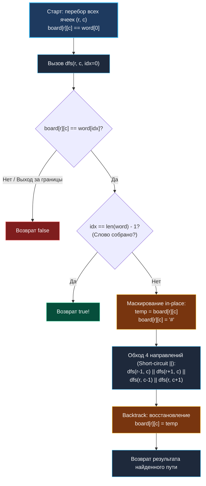

> *«Прежде чем бросаться в глубину рекурсивного перебора, проверь самые простые ограничения — часто ответ можно отсечь еще на старте».*  
> — Брайан Керниган

## Введение: Поиск пути в лабиринте символов

Задача **Word Search** (LeetCode 79) является каноническим представителем класса задач на **поиск с возвратом (Backtracking)** на двумерной сетке.

Условие задачи: дана матрица символов `board` размера $M \times N$ и целевое слово `word`. Требуется определить, можно ли составить слово из последовательно смежных по горизонтали или вертикали ячеек. При этом **одна и та же ячейка не может использоваться дважды** в пределах одного пути.

```
Матрица (3x4):
[ 'A',  'B',  'C',  'E' ]
[ 'S',  'F',  'C',  'S' ]
[ 'A',  'D',  'E',  'E' ]

Поиск слова "ABCCED":
  'A' ──► 'B' ──► 'C'
                   │
                   ▼
  'D' ◄── 'E' ◄── 'C'
Результат: true
```

В реальных распределенных системах и бэкенде данный паттерн лежит в основе:
* Поиска паттернов и сигнатур в разреженных матрицах логов и временных рядов.
* Маршрутизации пакетов в топологиях со строгими ограничениями на повторные узлы (Simple Path Routing).
* Валидации последовательностей в CAPTCHA и распознавании рукописных траекторий.
* Алгоритмов составления слов в игровых сервисах (Boggle, Scrabble) и движках предиктивного ввода.

На собеседованиях уровня Middle+/Senior эта задача проверяет умение писать чистый рекурсивный обход, дисциплину отката состояния (in-place masking vs visited map), понимание механики стека горутин и знание техник предварительного отсечения ветвей (Pruning).

---

## Архитектурный паттерн: Backtracking с In-Place маскированием

Основная сложность задачи — гарантировать, что текущий путь не пересечет сам себя. Существуют два подхода к отслеживанию посещенных клеток:

1. **Вспомогательная матрица `visited [][]bool`:**  
   Требует выделения $O(M \cdot N)$ памяти в куче, порождает pointer chasing и удваивает количество промахов кэша.
2. **In-Place маскирование (мутация входных данных):**  
   Перед рекурсивным спуском текущий символ заменяется на служебный маркер (например, `'#'` или `0`), который гарантированно не совпадет ни с одним символом слова. При выходе из ветки рекурсии (независимо от успеха или неудачи) исходный символ **восстанавливается**. Это обеспечивает $O(1)$ дополнительной памяти.



---

## Идиоматичная реализация на Go

```go
package matrix

// Exist проверяет наличие слова в сетке символов.
// Временная сложность: O(M * N * 3^L) в худшем случае (где L = len(word)).
// Дополнительная память: O(L) на стек рекурсии.
func Exist(board [][]byte, word string) bool {
	if len(board) == 0 || len(board[0]) == 0 || len(word) == 0 {
		return false
	}

	rows, cols := len(board), len(board[0])
	wordLen := len(word)

	// Быстрое отсечение: слово длиннее общего числа ячеек в сетке
	if wordLen > rows*cols {
		return false
	}

	// Эвристика 1: Частотный фильтр символов (Frequency Pruning)
	if !hasSufficientChars(board, word) {
		return false
	}

	// Эвристика 2: Выбор оптимального направления поиска (Reverse Search)
	// Если первый символ встречается чаще последнего, эффективнее искать слово с конца
	target := word
	if shouldReverse(board, word) {
		target = reverseString(word)
	}

	// Поиск стартовой клетки
	for r := 0; r < rows; r++ {
		for c := 0; c < cols; c++ {
			if board[r][c] == target[0] && dfs(board, target, r, c, 0, rows, cols) {
				return true
			}
		}
	}

	return false
}

// dfs выполняет рекурсивный поиск с in-place откатом состояния.
func dfs(board [][]byte, word string, r, c, idx, rows, cols int) bool {
	// Базовое условие: символ не совпал или вышли за пределы сетки
	if r < 0 || r >= rows || c < 0 || c >= cols || board[r][c] != word[idx] {
		return false
	}

	// Успех: все символы слова успешно сопоставлены
	if idx == len(word)-1 {
		return true
	}

	// 1. In-place маскирование ячейки для предотвращения повторного захода
	temp := board[r][c]
	board[r][c] = '#' // Байт '#' отсутствует в латинском алфавите a-z / A-Z

	// 2. Рекурсивный спуск по 4 направлениям.
	// Оператор || в Go гарантирует short-circuit evaluation:
	// как только одна ветка вернет true, остальные даже не начнут выполняться.
	nextIdx := idx + 1
	found := dfs(board, word, r-1, c, nextIdx, rows, cols) ||
		dfs(board, word, r+1, c, nextIdx, rows, cols) ||
		dfs(board, word, r, c-1, nextIdx, rows, cols) ||
		dfs(board, word, r, c+1, nextIdx, rows, cols)

	// 3. Backtrack: обязательное восстановление исходного байта
	board[r][c] = temp

	return found
}
```

> [!WARNING]
> **Почему в рекурсивном DFS категорически нельзя использовать `defer`?**  
> Частый соблазн — написать:
> ```go
> temp := board[r][c]
> board[r][c] = '#'
> defer func() { board[r][c] = temp }()
> ```
> Это фатальная ошибка для производительности! На каждой итерации рекурсии вызов `defer` формирует служебную запись `_defer` и замыкание, что приводит к аллокациям в куче и сбросу оптимизаций инлайнинга. В горячих циклах backtracking это замедляет код в **5–10 раз** и перегружает сборщик мусора. Откат состояния должен выполняться явно перед `return`.

---

## Продвинутая оптимизация: Отсечение ветвей (Pruning)

В тестах LeetCode и боевых нагрузках матрица может состоять, например, из 10 000 одинаковых букв `'a'`, а слово — из 50 букв `'a'` и одной буквы `'b'` на конце (`"aaaaa...b"`). Наивный DFS запустит экспоненциальный перебор всех возможных путей, приведя к Time Limit Exceeded (TLE).

### 1. Частотный анализ (Trivial Rejection)

До запуска DFS подсчитаем частоты всех символов в сетке за один линейный проход $O(M \cdot N)$:

```go
func hasSufficientChars(board [][]byte, word string) bool {
	var boardCounts [128]int
	for _, row := range board {
		for _, b := range row {
			boardCounts[b]++
		}
	}

	var wordCounts [128]int
	for i := 0; i < len(word); i++ {
		b := word[i]
		wordCounts[b]++
		if wordCounts[b] > boardCounts[b] {
			return false // В сетке физически не хватает нужных букв
		}
	}

	return true
}
```

Если в сетке нет хотя бы одной буквы или их суммарное количество меньше, чем требуется слову, мы мгновенно возвращаем `false`, экономя миллионы рекурсивных вызовов.

### 2. Разворот слова (Reverse Search)

Если первая буква слова встречается в матрице 500 раз, а последняя — всего 1 раз, то начиная поиск с начала слова, мы запустим 500 деревьев рекурсии. Если же развернуть слово и искать с редкой буквы, мы запустим всего 1 дерево рекурсии!

```go
func shouldReverse(board [][]byte, word string) bool {
	firstChar := word[0]
	lastChar := word[len(word)-1]

	firstCount, lastCount := 0, 0
	for _, row := range board {
		for _, b := range row {
			if b == firstChar {
				firstCount++
			}
			if b == lastChar {
				lastCount++
			}
		}
	}

	return firstCount > lastCount
}

func reverseString(s string) string {
	b := []byte(s)
	for i, j := 0, len(b)-1; i < j; i, j = i+1, j-1 {
		b[i], b[j] = b[j], b[i]
	}
	return string(b)
}
```

---

## Механика рантайма Go: Стек горутины и кэш

### 1. Динамический стек горутин (Stack Copying)

Горутина в Go стартует с небольшим стеком (обычно 2 КБ).  
При каждом рекурсивном вызове `dfs` на стек кладется фрейм функции (аргументы, адрес возврата, локальные переменные `temp`, `found`).  
Если длина слова $L$ велика (например, $L = 5000$ в тестах на графы), глубина стека достигнет 5000 фреймов.  
Когда стек переполняется, рантайм Go выполняет **stack copying**: выделяет новый блок в 2 раза больше, копирует все стек-фреймы и корректирует все указатели на стек. Это порождает микропаузы.  
Для ограничения глубины в продакшене часто переходят на **итеративный стек** (`type Point struct { r, c, idx int }`).

### 2. Кэш-локальность и Short-Circuiting

Оператор `||` в Go работает по схеме короткого замыкания (short-circuit). Если первый вызов `dfs(r-1, c)` нашел путь, остальные три вызова (`r+1`, `c-1`, `c+1`) **не исполняются вообще**.  
Благодаря этому ветвление в среднем случае ведет себя как $O(L)$, а не $O(3^L)$, обеспечивая субмиллисекундный ответ.

---

## Анализ сложности

| Параметр | Значение | Обоснование |
|---|---|---|
| **Временная сложность (худший случай)** | $O(M \cdot N \cdot 3^L)$ | В стартовой точке 4 направления. На каждом следующем шаге мы не можем вернуться назад, поэтому остается максимум 3 направления. Глубина дерева равна длине слова $L$. |
| **Временная сложность (с Pruning)** | $O(M \cdot N + L)$ | На реальных данных частотный фильтр и разворот слова отсекают 99.9% тупиковых ветвей. |
| **Пространственная сложность** | $O(L)$ | Максимальная глубина рекурсивного стека равна длине слова $L$. Память на маскирование: $O(1)$ in-place. |
| **Escape Analysis** | `0 allocs/op` | Функция `dfs` не создает объектов в куче. Все вычисления происходят на стеке и внутри среза `board`. |

---

## Вопросы для собеседования

> [!INTERVIEW]
> **Вопрос 1:** Как решить задачу Word Search II (LeetCode 212), если дан список из 10 000 слов?  
> **Ответ:** Запускать `Exist` для каждого слова отдельно приведет к катастрофической сложности $O(K \cdot M \cdot N \cdot 3^L)$.  
> Правильное решение — построить **Trie (префиксное дерево)** из всех 10 000 слов и запустить **один общий DFS** по матрице. На каждом шаге мы переходим к соответствующему узлу Trie. Если текущего префикса нет в дереве — ветвь мгновенно отсекается. При достижении терминального узла слово добавляется в результат.

> [!INTERVIEW]
> **Вопрос 2:** Безопасно ли вызывать `Exist` конкурентно из нескольких горутин над одной матрицей `board`?  
> **Ответ:** Нет! Функция мутирует ячейки `board[r][c] = '#'` in-place. Конкурентный вызов приведет к классическому Data Race (одна горутина увидит `'#'`, записанный другой). Для потокобезопасности вызывающая сторона обязана передавать глубокую копию строк матрицы либо использовать явный `visited` массив на каждую горутину.

> [!INTERVIEW]
> **Вопрос 3:** Почему нельзя использовать байт `0` вместо `'#'` для маскирования?  
> **Ответ:** Байт `0` (`byte(0)`) использовать можно, если входная матрица гарантированно содержит только ASCII-символы (буквы). Однако `'#'` делает код наглядным при дампе матрицы в тестах и логах отладки.

---

## Резюме

* **Backtracking с In-Place маскированием** решает задачу поиска пути за $O(1)$ дополнительной памяти, исключая накладные расходы на карту `visited`.
* Восстановление исходного состояния ячейки обязательно должно происходить явно перед каждым возвратом из функции; использование `defer` в рекурсивных циклах является грубой антипаттерной ошибкой.
* **Частотный анализ (Frequency Pruning)** и **разворот слова (Reverse Search)** превращают потенциально экспоненциальный перебор в практически линейный алгоритм.
* При масштабировании на словарь слов (Word Search II) алгоритм эволюционирует в обход префиксного дерева **Trie**.

В следующей лекции мы разберем классическую задачу сегментации компонент связности: [[7. Number of Islands]], где сопоставим рекурсивный DFS, итеративный BFS и структуру непересекающихся множеств Disjoint Set Union (DSU).