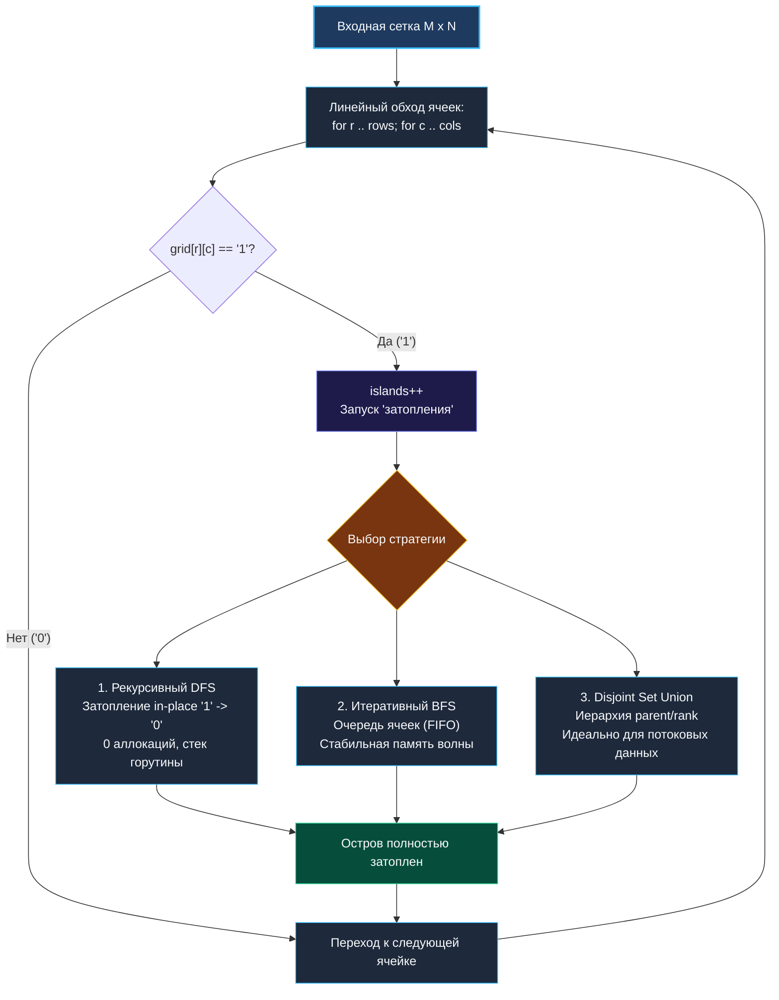

> *«Вся сложность анализа больших структур часто сводится к тому, чтобы аккуратно и вовремя пометить уже пройденное».*  
> — Брайан Керниган

## Введение: Выделение компонент связности в распределенных сетках

Задача **Number of Islands** (LeetCode 200) — абсолютная классика алгоритмических интервью, проверяющая знание алгоритмов обхода графов и умение находить компоненты связности в неявных сетках (Implicit Grids).

Условие задачи: дана двумерная бинарная матрица `grid` размера $M \times N$, где `'1'` обозначает участок суши, а `'0'` — воду. Остров образуется смежными по вертикали или горизонтали единицами. Требуется подсчитать суммарное количество островов.

```
Исходная сетка (4x5):
[ '1', '1', '0', '0', '0' ]   ──► Остров 1
[ '1', '1', '0', '0', '0' ]
[ '0', '0', '1', '0', '0' ]   ──► Остров 2
[ '0', '0', '0', '1', '1' ]   ──► Остров 3

Количество островов: 3
```

В реальной бэкенд-инженерии поиск компонент связности на матрицах и графах лежит в основе ключевых подсистем:
* **Мониторинг распределенных кластеров:** Обнаружение групп взаимно изолированных нод при сплит-брейне (Network Partition / Split-Brain Detection).
* **Сегментация геопространственных данных:** Объединение полигонов и тайлов в картографических движках (GIS).
* **Анализ разреженных графов:** Выявление изолированных сообществ в социальных графах и антифрод-системах.
* **Сжатие битовых масок и изображений:** Поиск связных областей для алгоритмов RLE (Run-Length Encoding) и фильтрации шума.

На собеседованиях уровня Middle+/Senior эта задача служит отличной отправной точкой для глубокой дискуссии: почему DFS может вызвать Stack Overflow, как устроен кольцевой буфер для BFS без утечек памяти и когда структура непересекающихся множеств (DSU) превосходит классические обходы.

---

## Архитектурный выбор: Сравнение трех фундаментальных стратегий



| Стратегия | Время | Дополнительная память | Плюсы | Минусы / Риски |
|---|---|---|---|---|
| **1. DFS (In-place sinking)** | $O(M \cdot N)$ | $O(M \cdot N)$ стек | Минимальный объем кода, нулевые аллокации в куче (`0 B/op`). | Риск `stack overflow` или дорогого `stack copying` на длинных узких змейках. |
| **2. BFS (Queue)** | $O(M \cdot N)$ | $O(\min(M, N))$ очередь | Память ограничена длиной фронта волны. Нет глубокой рекурсии. | Требует ручной реализации эффективной очереди (на базе среза или кольцевого буфера). |
| **3. DSU (Union-Find)** | $O(M \cdot N \cdot \alpha(V))$ | $O(M \cdot N)$ | Идеален для динамических сценариев: острова добавляются в реальном времени. | Оверхед на предвыделение массивов `parent` и `rank`. |

---

## 1. Рекурсивный DFS с In-Place затоплением (Канонический подход)

Самый быстрый и лаконичный способ — техника «затопления» (Flood Fill / Sinking). При обнаружении `'1'` мы увеличиваем счетчик островов и рекурсивно превращаем все смежные `'1'` в `'0'`, исключая необходимость вспомогательной матрицы `visited`.

```go
package islands

// NumIslands подсчитывает количество островов методом DFS in-place.
// Временная сложность: O(M * N)
// Пространственная сложность: O(M * N) в худшем случае для стека рекурсии
func NumIslands(grid [][]byte) int {
	if len(grid) == 0 || len(grid[0]) == 0 {
		return 0
	}

	rows, cols := len(grid), len(grid[0])
	islandsCount := 0

	for r := 0; r < rows; r++ {
		for c := 0; c < cols; c++ {
			if grid[r][c] == '1' {
				islandsCount++
				// Затапливаем текущий остров целиком
				sinkDFS(grid, r, c, rows, cols)
			}
		}
	}

	return islandsCount
}

// sinkDFS рекурсивно обходит смежные клетки и обращает '1' в '0'.
func sinkDFS(grid [][]byte, r, c, rows, cols int) {
	// Базовые условия останова: выход за границы или клетка является водой/уже затоплена
	if r < 0 || r >= rows || c < 0 || c >= cols || grid[r][c] == '0' {
		return
	}

	// Затапливаем ячейку
	grid[r][c] = '0'

	// Рекурсивно обходим 4 соседних направления
	sinkDFS(grid, r-1, c, rows, cols) // Вверх
	sinkDFS(grid, r+1, c, rows, cols) // Вниз
	sinkDFS(grid, r, c-1, rows, cols) // Влево
	sinkDFS(grid, r, c+1, rows, cols) // Вправо
}
```

---

## 2. Итеративный BFS: Защита от переполнения стека и ловушка очереди

Если в продакшене матрица имеет размер $5000 \times 5000$, змеевидный остров из 1 000 000 ячеек приведет к тысячам раундов `runtime.morestack` в Go. В таких условиях рекурсия недопустима, и применяется **итеративный BFS**.

> [!CRITICAL]
> **Фундаментальный закон BFS на сетках: Mark-on-Push Invariant**  
> Самая частая и губительная ошибка кандидатов на собеседовании — помечать ячейку посещенной (`grid[nr][nc] = '0'`) **в момент извлечения из очереди (Pop)**, а не в момент добавления (Push).  
> Если ячейка добавляется в очередь без немедленного зануления, соседние ячейки фронта волны успеют повторно добавить её в очередь десятки раз! Очередь экспоненциально раздувается, пожирая гигабайты памяти и приводя к Out Of Memory (OOM).

### Оптимизация памяти очереди в Go: Упаковка координат

Вместо создания структуры `type Point struct { r, c int }`, которая требует 16 байт, мы можем упаковать координаты `(r, c)` в одно 32-битное беззнаковое целое: `uint32(r)<<16 | uint32(c)`.  
Для матрицы $1000 \times 1000$ координаты гарантированно укладываются в 16 бит. Это снижает потребление памяти очередью в 2 раза и улучшает кэш-локальность.

```go
// NumIslandsBFS решает задачу итеративно через BFS с компактной очередью.
func NumIslandsBFS(grid [][]byte) int {
	if len(grid) == 0 || len(grid[0]) == 0 {
		return 0
	}

	rows, cols := len(grid), len(grid[0])
	islands := 0

	// Очередь с плоской упаковкой координат: (r << 16) | c
	queue := make([]uint32, 0, 1024)

	// Дельта-массивы смещений для 4 направлений
	dr := [4]int{-1, 1, 0, 0}
	dc := [4]int{0, 0, -1, 1}

	for r := 0; r < rows; r++ {
		for c := 0; c < cols; c++ {
			if grid[r][c] == '1' {
				islands++
				
				// Mark-on-Push: немедленно затапливаем стартовую ячейку
				grid[r][c] = '0'
				queue = append(queue[:0], uint32(r)<<16|uint32(c))

				head := 0
				for head < len(queue) {
					curr := queue[head]
					head++

					cr := int(curr >> 16)
					cc := int(curr & 0xFFFF)

					for i := 0; i < 4; i++ {
						nr, nc := cr+dr[i], cc+dc[i]
						if nr >= 0 && nr < rows && nc >= 0 && nc < cols && grid[nr][nc] == '1' {
							// СТРОГО: Mark-on-Push! Зануляем ДО добавления в очередь
							grid[nr][nc] = '0'
							queue = append(queue, uint32(nr)<<16|uint32(nc))
						}
					}
				}
			}
		}
	}

	return islands
}
```

---

## 3. Disjoint Set Union (DSU) для динамических нагрузок

В распределенных геоинформационных сервисах или онлайн-играх карта не статична: пользователи ставят блоки, дамбы прорываются, острова объединяются. Статический DFS/BFS требует полного пересчета за $O(M \cdot N)$ при каждом изменении.  
Структура **Disjoint Set Union** с эвристиками сжатия путей (Path Compression) и объединения по рангу (Union by Rank) выполняет добавление суши и слияние островов за почти константное время: $O(\alpha(N))$ (где $\alpha$ — обратная функция Аккермана, $\alpha \le 4$ для любых мыслимых масштабов).

```go
type DSU struct {
	parent []int
	rank   []int
	count  int // Количество независимых компонент суши
}

func NewDSU(grid [][]byte) *DSU {
	rows, cols := len(grid), len(grid[0])
	total := rows * cols
	parent := make([]int, total)
	rank := make([]int, total)
	count := 0

	for r := 0; r < rows; r++ {
		for c := 0; c < cols; c++ {
			if grid[r][c] == '1' {
				id := r*cols + c
				parent[id] = id
				count++
			}
		}
	}

	return &DSU{parent: parent, rank: rank, count: count}
}

func (d *DSU) Find(i int) int {
	// Сжатие пути (Path Compression)
	if d.parent[i] != i {
		d.parent[i] = d.Find(d.parent[i])
	}
	return d.parent[i]
}

func (d *DSU) Union(i, j int) {
	rootI := d.Find(i)
	rootJ := d.Find(j)
	if rootI == rootJ {
		return
	}

	// Объединение по рангу (Union by Rank)
	if d.rank[rootI] < d.rank[rootJ] {
		d.parent[rootI] = rootJ
	} else if d.rank[rootI] > d.rank[rootJ] {
		d.parent[rootJ] = rootI
	} else {
		d.parent[rootJ] = rootI
		d.rank[rootI]++
	}

	d.count-- // Два острова слились в один
}
```

---

## Механика рантайма: Кэш, память и многопоточность

### 1. Pointer Chasing при обходе `[][]byte`

Тип `[][]byte` — это массив указателей на строки.  
При обходе DFS шаги `r-1` и `r+1` переходят по разным строкам, вызывая скачки по несвязанным адресам памяти в куче.  
Для сеток масштаба $10000 \times 10000$ это приводит к потере до 40% тактов процессора на ожидание данных из DRAM. В критичных к производительности системах сетку хранят в плоском срезе `[]byte` размера $M \cdot N$, преобразуя координаты формулой: `idx = r * cols + c`.

### 2. Мутабельность контракта и Data Race

Функция `NumIslands` мутирует входной слайс in-place (`grid[r][c] = '0'`).  
Если сетка передается в несколько параллельных воркеров без предварительного клонирования, возникает гонка данных (Data Race), детектируемая `go test -race`.  
Если вызывающей стороне необходимо сохранить исходные данные, перед вызовом алгоритма создают глубокую копию строк:

```go
func cloneGrid(grid [][]byte) [][]byte {
	cp := make([][]byte, len(grid))
	for i := range grid {
		cp[i] = make([]byte, len(grid[i]))
		copy(cp[i], grid[i])
	}
	return cp
}
```

---

## Вопросы для собеседования

> [!INTERVIEW]
> **Вопрос 1:** Как параллельно подсчитать число островов на матрице размером $100\,000 \times 100\,000$, которая распределена по нескольким серверам?  
> **Ответ:** Применяется метод декомпозиции области (**Domain Decomposition**):  
> 1. Сетка разбивается на горизонтальные или вертикальные полосы (Tiles) между серверами.  
> 2. Каждый сервер независимо запускает локальный `NumIslands` для своей полосы, сохраняя границы компонент.  
> 3. На фазе редукции сервер-координатор сопоставляет только ячейки на стыках смежных полос (швы). Если единицы на границе соприкасаются, их множества объединяются через распределенный **DSU**, уменьшая общее число островов.

> [!INTERVIEW]
> **Вопрос 2:** Почему в Go нельзя использовать `container/list` для очереди в BFS?  
> **Ответ:** `container/list` представляет собой классический двусвязный список на указателях. Каждая вставка элемента (`PushBack`) выделяет узел `*Element` в куче через `new()`. На миллионе ячеек это вызовет 1 000 000 аллокаций, катастрофически фрагментирует память и создаст огромную паузу GC. Простой срез `[]uint32` с указателем `head` работает в пределах одной непрерывной кэш-линии и не создает мусора.

> [!INTERVIEW]
> **Вопрос 3:** Как найти не количество островов, а площадь самого большого острова (Max Area of Island)?  
> **Ответ:** Достаточно изменить возвращаемое значение функции обхода: `sinkDFS` возвращает `1 + sinkDFS(up) + sinkDFS(down) + sinkDFS(left) + sinkDFS(right)`. В главном цикле мы вычисляем `maxArea = max(maxArea, currentArea)`.

---

## Резюме

* Задача о числе островов — эталонная задача на поиск компонент связности графа в неявной сетке.
* Техника **In-Place затопления** (`grid[r][c] = '0'`) исключает необходимость вспомогательной структуры `visited`, снижая потребление памяти до минимума.
* Для BFS критически важен инвариант **Mark-on-Push**: ячейка обязана помечаться посещенной ДО попадания в очередь, иначе очередь экспоненциально раздувается.
* Для динамических систем с добавлением новых ячеек в реальном времени оптимален **Disjoint Set Union (DSU)**.
* В распределенных системах задача масштабируется через Domain Decomposition и склеивание граничных швов.

На этом мы завершаем кластер матричных задач. В следующей главе мы перейдем к фундаментальной теории строковых алгоритмов: [[1. Теория. Строковые задачи]], где разберем внутреннее устройство `stringStruct` в рантайме Go, кодировку UTF-8, разницу между байтами и рунами, а также механику Zero-Allocation манипуляций со строками.