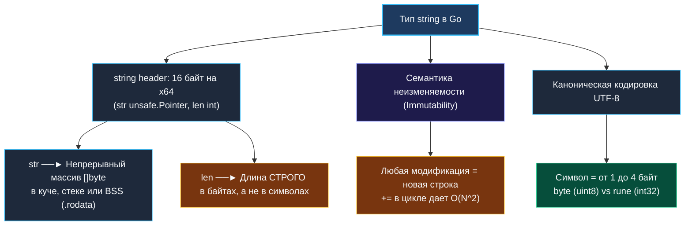
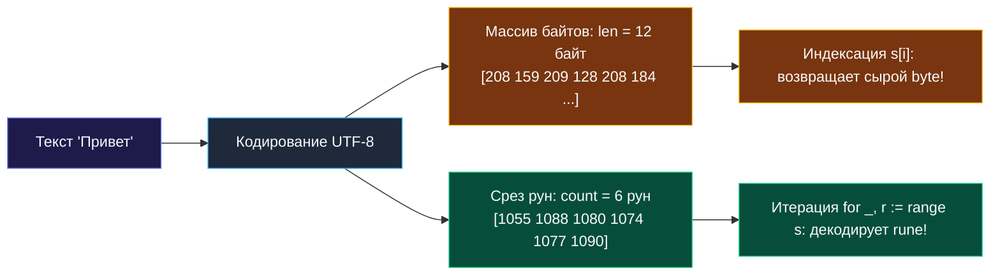
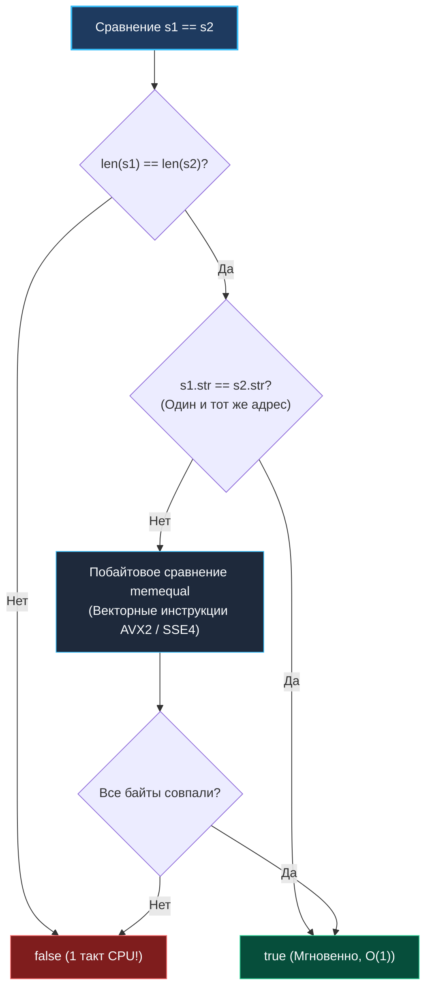

> *«Строки — это не просто абстрактные цепочки символов; это конкретные структуры в памяти, подчиняющиеся законам архитектуры процессора и рантайма».*  
> — Брайан Керниган

## Внутреннее устройство строк в Go: Фундамент для алгоритмических задач

При решении строковых задач на технических собеседованиях и в реальной распределенной разработке критически важно понимать физическую природу строк в памяти. В отличие от C/C++, где строка часто является изменяемым массивом байт с завершающим нулем (`char*`), или Java/Python, где под капотом могут скрываться сложные кодировки UTF-16, в языке Go строка спроектирована с предельной ясностью: это **неизменяемая (immutable) структура**, жестко ориентированная на кодировку **UTF-8**.



---

## 1. Внутреннее представление: `stringStruct` в рантайме

В исходном коде рантайма Go (`src/runtime/string.go`) тип `string` объявлен как простая двухпоточная структура:

```go
type stringStruct struct {
    str unsafe.Pointer // Указатель на первый байт массива данных
    len int            // Длина строки строго в байтах
}
```

На 64-битной платформе дескриптор строки занимает ровно **16 байт**:
1. 8 байт: 64-битный указатель на непрерывную область памяти.
2. 8 байт: 64-битное целое число со знаком — размер в байтах.

```
Стек горутины:
┌───────────────────────────────┐
│ stringStruct (16 байт)        │
│  str: 0x00007fff... (8 байт) ─┼───► Память (.rodata или куча):
│  len: 12            (8 байт)  │     [ 'П', 'р', 'и', 'в', 'е', 'т' ] (12 байт UTF-8)
└───────────────────────────────┘
```

### Архитектурные следствия

1. **Передача по значению без аллокаций:**  
   Когда вы передаете `string` в функцию как аргумент (`func process(s string)`), копируются всего 16 байт заголовка. Сами байты строки **не копируются**! Это операция $O(1)$ по времени и $0$ байт дополнительной памяти.
2. **Срез строки (Slicing) без аллокаций:**  
   Выражение `sub := s[2:7]` создает **новый 16-байтовый заголовок**, у которого указатель `str` смещен на 2 байта вперед (`s.str + 2`), а поле `len` равно 5 (`7 - 2`). Физического выделения памяти в куче не происходит.
3. **Ловушка удержания памяти (Memory Retention Hazard):**  
   Поскольку срез ссылается на исходный массив байтов, сборщик мусора (GC) не сможет освободить гигантский массив (например, файл на 1 ГБ), пока в памяти живет хотя бы один маленький срез длиной в 10 байт:
   ```go
   // ОПАСНО: удержание гигантского буфера в памяти
   func getID(hugeData string) string {
       return hugeData[:8] // GC не сможет собрать hugeData!
   }

   // БЕЗОПАСНО: разрыв связи через клонирование (Go 1.20+ strings.Clone)
   func getIDSafe(hugeData string) string {
       return strings.Clone(hugeData[:8]) // Выделяет ровно 8 байт
   }
   ```

---

## 2. Байты, руны и кодировка UTF-8: Где ошибаются 90% кандидатов

В Go необходимо строго различать три базовых понятия:

| Тип | Размер | Что представляет | Пример |
|---|---|---|---|
| `byte` (`uint8`) | 1 байт (8 бит) | Сырой машинный байт данных | `b := s[0]` |
| `rune` (`int32`) | 4 байта (32 бита) | Кодовая точка Unicode (Code Point) | `r := 'G'` или `r := '世'` |
| `string` | 16 байт дескриптор | Неизменяемая последовательность байт UTF-8 | `"Привет, мир"` |



### Ловушки индексации и длины

1. **`len(s)` возвращает байты, а не буквы!**  
   Для строки `"Привет"` `len(s)` равен **12**, потому что каждая кириллическая буква в UTF-8 занимает 2 байта. Чтобы узнать реальное количество символов (рун), вызывайте `utf8.RuneCountInString(s)` (возвращает 6, но требует $O(N)$ декодирования).
2. **Индексация `s[i]` дает `byte`, а не `rune`!**  
   Если в строке `"Привет"` обратиться к `s[0]`, вернется байт `208` (`0xD0`), являющийся лишь первой половинкой двухбайтовой последовательности буквы `'П'`. Попытка напечатать `string(s[0])` выведет испорченный символ `` (replacement character).
3. **Два типа итерации по строке:**
   ```go
   s := "Go языки"

   // Вариант 1: Итерация по байтам (O(N), быстро, 0 декодирования)
   for i := 0; i < len(s); i++ {
       b := s[i] // b имеет тип byte
   }

   // Вариант 2: Итерация по рунам (декодирование UTF-8 на лету)
   for byteOffset, r := range s {
       // byteOffset — смещение в БАЙТАХ, где началась руна (0, 1, 2, 3, 5, 7...)
       // r — раскодированная кодовая точка типа rune (int32)
   }
   ```

> [!WARNING]
> **Неизменяемость строк: Почему `s[0] = 'a'` не компилируется?**  
> В Go строки строго иммутабельны. Строка может быть размещена линковщиком в секции памяти `.rodata` (Read-Only Data) исполняемого файла ELF/Mach-O. Попытка записи в эту область на уровне процессора вызвала бы аппаратное прерывание `SIGSEGV` (Segmentation Fault). Компилятор предотвращает это еще на этапе сборки: `cannot assign to s[0]`.

---

## 3. Аллокации памяти: От квадратичного $O(N^2)$ к линейному $O(N)$

Самая частая причина деградации сервисов при обработке текста — неграмотная конкатенация строк.

### Проблема: Конкатенация через `+=` в цикле

```go
// ❌ АНТИПАТТЕРН: O(N^2) по времени и памяти!
func BuildStringBad(n int) string {
    s := ""
    for i := 0; i < n; i++ {
        s += "a" // На каждой итерации выделяется новый буфер и копируются старые данные!
    }
    return s
}
```
При $N = 100\,000$ этот код выделит суммарно $\frac{100\,000 \times 100\,001}{2} \approx 5$ ГБ временной памяти, заставив GC полностью заморозить выполнение горутин.

### Решение 1: `strings.Builder` (Золотой стандарт)

`strings.Builder` спроектирован специально для эффективной сборки строк:

```go
// ✅ ИДИОМАТИЧНО: O(N) по времени, минимум аллокаций
func BuildStringGood(n int) string {
    var b strings.Builder
    b.Grow(n) // Архитектурное предвыделение памяти в куче
    for i := 0; i < n; i++ {
        b.WriteByte('a')
    }
    return b.String() // Zero-copy преобразование!
}
```

> [!NOTE]
> **Внутренняя магия `strings.Builder.String()`:**  
> Метод `b.String()` преобразует внутренний `[]byte` в `string` **без копирования памяти** через `unsafe.Pointer`. Внутренний флаг защищает `Builder` от дальнейших записей: если после вызова `String()` попробовать снова вызвать `Write`, произойдет `panic`. Это гарантирует сохранение контракта неизменяемости `string`.

### Решение 2: Пакет `unsafe` в Go 1.20+ (`unsafe.String` и `unsafe.StringData`)

Начиная с Go 1.20, стандартная библиотека предоставляет официальные примитивы для zero-copy конвертации среза байт в строку:

```go
import "unsafe"

// BytesToString преобразует []byte в string без аллокации (0 B/op)
func BytesToString(b []byte) string {
    if len(b) == 0 {
        return ""
    }
    return unsafe.String(unsafe.SliceData(b), len(b))
}

// StringToBytes преобразует string в []byte без аллокации
// ВНИМАНИЕ: полученный срез НЕЛЬЗЯ мутировать, иначе это приведет к краху программы!
func StringToBytes(s string) []byte {
    if len(s) == 0 {
        return nil
    }
    return unsafe.Slice(unsafe.StringData(s), len(s))
}
```

---

## 4. Сравнение строк: Механика `==` в рантайме Go

Когда вы сравниваете две строки `s1 == s2`, рантайм Go (`runtime.strequal`) выполняет проверку по строго оптимизированному многоступенчатому каскаду:



1. **Сравнение длин (1 такт CPU):** Если `len(s1) != len(s2)`, сравнение завершается с `false`.
2. **Сравнение указателей (1 такт CPU):** Если `s1.str == s2.str`, то обе строки указывают на один и тот же блок памяти — возврат `true` без чтения байтов.
3. **Векторный `memequal`:** Если указатели разные, вызывается ассемблерная функция `runtime.memequal`, которая сравнивает память блоками по 16, 32 или 64 байта за такт с помощью SIMD-инструкций (`VPCMPEQB`, `VPTEST`).

---

## 5. Классификация алгоритмических паттернов для строк

| Паттерн | Применение | Сложность времени | Сложность памяти | Типичные задачи |
|---|---|---|---|---|
| **Два указателя (Two Pointers)** | Встречное или параллельное движение указателей. | $O(N)$ | $O(1)$ | Палиндромы, валидация скобок, реверс. |
| **Скользящее окно (Sliding Window)** | Непрерывный подмассив с динамическими границами `[L, R]`. | $O(N)$ | $O(\Sigma)$ алфавит | Longest Substring Without Repeating Characters, Minimum Window Substring. |
| **Частотный массив (Frequency Bucket)** | Подсчет частот символов в `[26]int` или `[128]int`. | $O(N)$ | $O(1)$ | Valid Anagram, Group Anagrams, Permutation in String. |
| **Префиксные деревья (Trie)** | Индексация словарей и префиксный поиск. | $O(L)$ слово | $O(N \cdot L \cdot \Sigma)$ | Автодополнение, Word Search II, Spell Checker. |
| **Стековый парсинг (Stack / FSM)** | Разбор вложенных скобок, выражений, чисел. | $O(N)$ | $O(N)$ | Decode String, Valid Parentheses, String to Integer (atoi). |

---

## Вопросы для собеседования

> [!INTERVIEW]
> **Вопрос 1:** В чем разница между передачей `string` и `[]byte` в функцию с точки зрения производительности и безопасности?  
> **Ответ:**  
> `string` передается как 16-байтовая структура (`pointer` + `len`). Гарантирует вызывающей стороне абсолютную неизменяемость данных.  
> `[]byte` передается как 24-байтовая структура (`pointer` + `len` + `cap`). Позволяет вызываемой функции модифицировать байты на месте (in-place), что может привести к скрытым побочным эффектам или состоянию гонки данных (data race) при параллельной обработке. Если функция только читает данные — предпочтителен `string`.

> [!INTERVIEW]
> **Вопрос 2:** Что произойдет, если выполнить срез строки за пределы длины: `s := "hello"; _ = s[2:10]`?  
> **Ответ:** Произойдет паника рантайма: `panic: runtime error: slice bounds out of range [:10] with length 5`. Go всегда выполняет runtime bounds check для срезов, если компилятор на фазе доказательства границ (BCE — Bounds Check Elimination) не смог доказать абсолютную безопасность индексов.

> [!INTERVIEW]
> **Вопрос 3:** Почему `unicode.ToLower` может быть медленнее, чем ручная операция `b | 32` для ASCII?  
> **Ответ:** `unicode.ToLower` принимает `rune`, осуществляет бинарный поиск по глобальным таблицам Unicode Case-folding (учитывая турецкую 'i', немецкую 'ß' и сотни специфичных правил разных алфавитов). Для гарантированного ASCII (`'a'-'z'`, `'A'-'Z'`) битовая операция `b | 32` выполняется ровно за 1 такт CPU без обращения к таблицам в оперативной памяти.

---

## Резюме

* Строка в Go — это легковесный 16-байтовый дескриптор `stringStruct` (`str unsafe.Pointer`, `len int`).
* Длина строки `len(s)` измеряется строго в **байтах**, а не в символах (рунах).
* Срез строки `s[i:j]` выполняется за $O(1)$ времени и памяти, разделяя базовый массив байт с исходной строкой. Помните о ловушке удержания памяти!
* Конкатенация в цикле через `+=` порождает $O(N^2)$ аллокаций. Используйте `strings.Builder` с предварительным вызовом `b.Grow(size)`.
* Для быстрого сравнения строк Go использует каскад: равенство длин $\to$ равенство указателей $\to$ векторный SIMD-`memequal`.

В следующей лекции мы применим фундамент строковой теории к проверке симметрии: [[2. Палиндромы]], где разберем встречные указатели, фильтрацию символов и особенности обработки многобайтовых Unicode-последовательностей.