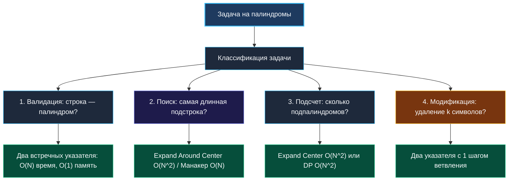
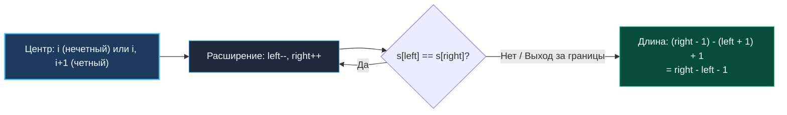

> *«В зеркальном отражении алгоритма самое важное — не пропустить центральную точку равновесия».*  
> — Брайан Керниган

## Палиндромы в алгоритмах: От базовой проверки до продвинутых паттернов

Палиндром — это последовательность символов, которая читается одинаково слева направо и справа налево. На первый взгляд задача кажется элементарной школьной разминкой. Однако на технических собеседованиях Senior-уровня именно палиндромные задачи служат лакмусовой бумажкой для проверки глубины инженерного мышления:
* Понимает ли кандидат физическое устройство срезов памяти и кэш-линий CPU при встречном движении указателей?
* Как учитывается мультибайтовое представление символов в UTF-8 и Unicode-нормализация (NFC vs NFD)?
* Способен ли разработчик сократить сложность по памяти с квадратичной матрицы DP до $O(1)$ при поиске подстрок?
* Знаком ли кандидат с границами применимости эвристик против линейных алгоритмов (Expand Around Center vs Алгоритм Манакера)?



---

## 1. Базовая проверка: Два встречных указателя (Two Pointers)

Наивный подход «развернуть строку через конкатенацию и сравнить `s == reverse(s)`» немедленно выдает новичка: он создает ненужные аллокации в куче, требует $O(N)$ памяти и делает лишний полный проход по данным.

Идиоматичный подход в Go — два встречных указателя (`left` и `right`), сходящихся к центру за один проход:

```go
package palindrome

// IsPalindromeASCII проверяет, является ли строка палиндромом.
// Предназначена строго для ASCII-текста.
// Временная сложность: O(N)
// Пространственная сложность: O(1)
func IsPalindromeASCII(s string) bool {
	left, right := 0, len(s)-1
	for left < right {
		if s[left] != s[right] {
			return false // Ранний выход при первом несовпадении
		}
		left++
		right--
	}
	return true
}
```

> [!NOTE]
> **Механическая симпатия (Hardware Prefetching):**  
> Почему алгоритм двух указателей работает с предельной скоростью процессора?  
> 1. **Нулевые аллокации:** Ни одного вызова рантайм-аллокатора памяти (`0 allocs/op, 0 B/op`).  
> 2. **Пространственная локальность:** Указатель `left` движется строго вперед (Forward Stream Prefetcher загружает кэш-линии L1d заранее). Указатель `right` движется назад (Backward Prefetcher также аппаратно поддерживается современными ядрами x86/ARM).  
> 3. **Ранний отказ (Early Exit):** На случайных непалиндромных строках несовпадение находится в первые 1–3 итерации.

---

## 2. Фильтрация и регистронезависимость (Valid Palindrome)

В классической задаче LeetCode 125 требуется проверить палиндромность, **игнорируя регистр букв и пропуская любые не-алфавитно-цифровые символы** (пробелы, знаки препинания, эмодзи).

### Zero-Allocation решение для ASCII

```go
// IsPalindromeFiltered решает задачу с фильтрацией на месте без аллокаций.
// Время: O(N), Память: O(1)
func IsPalindromeFiltered(s string) bool {
	left, right := 0, len(s)-1

	for left < right {
		// Пропускаем невалидные символы слева
		for left < right && !isAlphaNum(s[left]) {
			left++
		}
		// Пропускаем невалидные символы справа
		for left < right && !isAlphaNum(s[right]) {
			right--
		}

		// Сравниваем нормализованные байты
		if toLowerASCII(s[left]) != toLowerASCII(s[right]) {
			return false
		}

		left++
		right--
	}

	return true
}

func isAlphaNum(b byte) bool {
	return (b >= 'a' && b <= 'z') ||
		(b >= 'A' && b <= 'Z') ||
		(b >= '0' && b <= '9')
}

// toLowerASCII использует битовую маску: разница между 'A' (0x41) и 'a' (0x61) — 6-й бит (32).
func toLowerASCII(b byte) byte {
	if b >= 'A' && b <= 'Z' {
		return b | 0x20
	}
	return b
}
```

---

## 3. Проблема многобайтового Unicode (UTF-8)

Если строка содержит кириллицу (`"А роза упала на лапу Азора"`), греческие буквы или китайские иероглифы, побайтовая индексация `s[left]` разорвет двухбайтовую руну UTF-8, вернув искаженный байт заголовка.

### Корректная обработка Unicode через срез рун

```go
import "unicode"

// IsPalindromeUnicode корректно работает с любыми кодовыми точками Unicode.
// Временная сложность: O(N)
// Пространственная сложность: O(N) — выделение среза []rune
func IsPalindromeUnicode(s string) bool {
	runes := []rune(s)
	left, right := 0, len(runes)-1

	for left < right {
		for left < right && !unicode.IsLetter(runes[left]) && !unicode.IsDigit(runes[left]) {
			left++
		}
		for left < right && !unicode.IsLetter(runes[right]) && !unicode.IsDigit(runes[right]) {
			right--
		}

		// unicode.ToLower корректно приводит к нижнему регистру с учетом региональных правил
		if unicode.ToLower(runes[left]) != unicode.ToLower(runes[right]) {
			return false
		}

		left++
		right--
	}

	return true
}
```

> [!WARNING]
> **Ловушка Unicode-нормализации:**  
> Даже `unicode.ToLower` не спасает от проблемы форм нормализации. Символ `'é'` может быть записан как один символ (NFC: `\u00E9`) или как буква `'e'` + комбинируемый диакритический знак акута (NFD: `e\u0301`). Визуально они идентичны, но посимвольное сравнение рун вернет `false`! Для продакшен-систем высокой точности строки нормализуют пакетом `golang.org/x/text/unicode/norm` к форме `norm.NFC`.

---

## 4. Поиск самого длинного палиндрома: Expand Around Center

В задаче **Longest Palindromic Substring** (LeetCode 5) требуется найти максимальную палиндромную подстроку.

Наивный перебор всех подстрок дает кубическую сложность $O(N^3)$.  
Динамическое программирование требует $O(N^2)$ времени и $O(N^2)$ памяти.  
Паттерн **Expand Around Center** решает задачу за $O(N^2)$ времени, требуя строго **$O(1)$ памяти**!

### Механика расширения от центров

Палиндром симметричен относительно центра. Всего в строке длины $N$ существует ровно **$2N - 1$ потенциальных центров**:
* $N$ нечетных центров: центр совпадает с символом `s[i]` (например, `"aba"`).
* $N - 1$ четных центров: центр находится между символами `s[i]` и `s[i+1]` (например, `"abba"`).



```go
// LongestPalindrome находит наибольшую палиндромную подстроку.
// Время: O(N^2), Память: O(1)
func LongestPalindrome(s string) string {
	if len(s) < 2 {
		return s
	}

	start, maxLen := 0, 1

	for i := 0; i < len(s); i++ {
		// Нечетный центр: s[i]
		len1 := expand(s, i, i)
		// Четный центр: между s[i] и s[i+1]
		len2 := expand(s, i, i+1)

		currMax := max(len1, len2)
		if currMax > maxLen {
			maxLen = currMax
			// Вычисление стартового индекса по центру и длине
			start = i - (currMax-1)/2
		}
	}

	// Срез строки в Go не копирует байты — O(1) возврат
	return s[start : start+maxLen]
}

func expand(s string, left, right int) int {
	for left >= 0 && right < len(s) && s[left] == s[right] {
		left--
		right++
	}
	// Длина палиндрома между (left+1) и (right-1)
	return right - left - 1
}
```

---

## 5. Подсчет палиндромных подстрок (Palindromic Substrings)

Задача LeetCode 647 требует подсчитать суммарное количество всех палиндромных подстрок (например, для `"aaa"` ответ 6: `"a"`, `"a"`, `"a"`, `"aa"`, `"aa"`, `"aaa"`).

Вместо построения $O(N^2)$ таблицы DP, метод расширения от центра дает потрясающе элегантный и быстрый код с $O(1)$ памяти:

```go
// CountSubstrings подсчитывает число палиндромных подстрок.
// Время: O(N^2), Память: O(1)
func CountSubstrings(s string) int {
	total := 0
	for i := 0; i < len(s); i++ {
		total += countFromCenter(s, i, i)   // Нечетные центры
		total += countFromCenter(s, i, i+1) // Четные центры
	}
	return total
}

func countFromCenter(s string, left, right int) int {
	count := 0
	for left >= 0 && right < len(s) && s[left] == s[right] {
		count++
		left--
		right++
	}
	return count
}
```

---

## 6. Алгоритм Манакера (Manacher's Algorithm): Теоретический предел $O(N)$

Для задач олимпиадного уровня, где $N \ge 10^5$, квадратичный алгоритм не укладывается в Time Limit (1 секунда $\approx 10^8$ операций).  
Алгоритм Манакера решает задачу поиска длиннейшего палиндрома за **строго линейное время $O(N)$**.

### Ключевая интуиция Манакера

1. **Унификация центров:** Чтобы не разделять четные и нечетные палиндромы, между каждым символом вставляется служебный разделитель: `"aba"` $\to$ `"#a#b#a#"`. Длина всегда становится нечетной: $2N + 1$.
2. **Переиспользование симметрии:** Алгоритм поддерживает самый правый найденный палиндром с центром $C$ и правой границей $R$. Если текущий индекс $i < R$, то его радиус можно инициализировать радиусом зеркального элемента `mirror = 2*C - i`:
   $$P[i] = \min(R - i, P[\text{mirror}])$$
   Благодаря этому процессор почти никогда не сравнивает одни и те же символы дважды!

> [!NOTE]
> На реальных собеседованиях Senior-уровня писать алгоритм Манакера вручную обычно не требуют (из-за высокой вероятности опечаток в индексах), но кандидат обязан четко изложить его концепцию: «Симметрия радиусов относительно ранее найденного центра снижает сложность до $O(N)$».

---

## Вопросы для собеседования

> [!INTERVIEW]
> **Вопрос 1:** Задача Valid Palindrome II (LeetCode 680): можно ли удалить максимум один символ, чтобы строка стала палиндромом?  
> **Ответ:** Запускаем стандартные два указателя `left` и `right`. При первом же несовпадении (`s[left] != s[right]`) проверяем две подстроки: останется ли палиндромом срез без левого символа `s[left+1 : right+1]` ИЛИ срез без правого символа `s[left : right]`. Если хотя бы одна ветка палиндромна — возвращаем `true`. Временная сложность остается $O(N)$, память — $O(1)$.

> [!INTERVIEW]
> **Вопрос 2:** В чем преимущество возврата подстроки `s[start:start+maxLen]` в Go по сравнению с Java/C++?  
> **Ответ:** В Go срез строки создает лишь 16-байтовую структуру заголовка с указателем на существующую память. В C++ (`std::string`) или Java возврат подстроки часто приводит к новой аллокации в куче и копированию байтов (если не используется `std::string_view`).

> [!INTERVIEW]
> **Вопрос 3:** Как проверить, можно ли переставить буквы строки так, чтобы получился палиндром?  
> **Ответ:** Палиндром допускает наличие **максимум одного символа с нечетным количеством вхождений** (он встанет в центр). Для ASCII-строки заводим 32-битную маску `var mask uint32`. Для каждого символа переключаем бит: `mask ^= 1 << (s[i] - 'a')`. В конце проверяем, содержит ли маска не более одного бита: `mask & (mask - 1) == 0`. Сложность: $O(N)$ времени, $O(1)$ памяти, 0 аллокаций.

---

## Резюме

* **Два встречных указателя** — базовый паттерн валидации палиндромов за $O(N)$ времени и $O(1)$ памяти.
* Для ASCII фильтрация и приведение к нижнему регистру выполняется побитово (`b | 0x20`) без выделения памяти.
* Для Unicode требуется конвертация в `[]rune` или итерация декодера `utf8.DecodeRuneInString` с учетом нормализации.
* **Expand Around Center** — индустриальный золотой стандарт поиска палиндромов: $O(N^2)$ времени, $O(1)$ памяти и превосходная кэш-локальность.
* Алгоритм Манакера обеспечивает теоретический предел $O(N)$ за счет переиспользования симметрии радиусов.

В следующей лекции мы разберем частотный анализ строк и задачи на перестановки: [[3. Valid Anagram]], где научимся балансировать между массивами-бакетами и хэш-таблицами в рантайме Go.